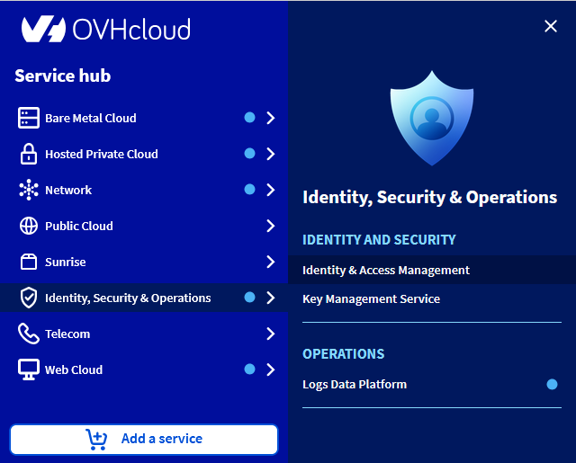
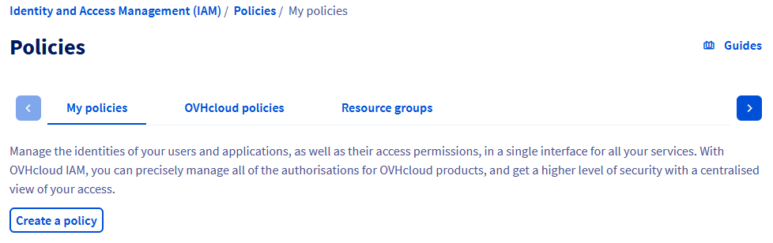
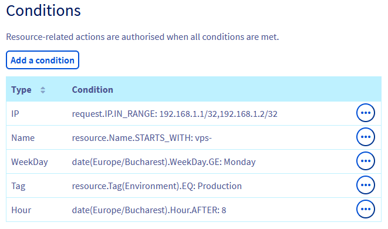
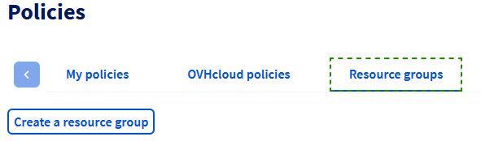

## Objectif

Ce guide vous explique comment fournir des droits d'accès spécifiques aux utilisateurs d'un compte OVHcloud.

La gestion des accès OVHcloud est basée sur un système de gestion des politiques. Il est possible d’écrire différentes politiques donnant accès aux utilisateurs à des fonctionnalités spécifiques sur les produits liés à un compte OVHcloud.

En détail, une politique contient :

- Une ou plusieurs **identités** visées par cette politique.
    - Il peut s'agir d'identifiants de comptes, d'utilisateurs ou de groupes d'utilisateurs (comme ceux utilisés dans [Federation](/pages/account_and_service_management/account_information/ovhcloud-account-connect-saml-adfs) - d'autres guides SSO sont disponibles).
- Une ou plusieurs **ressources** concernées par cette politique.
    - Une ressource est un produit OVHcloud qui sera concerné par cette politique (un nom de domaine, un serveur Nutanix, un Load Balancer, etc.).
- Une ou plusieurs **actions** autorisées ou exceptées par cette politique.
    - Les actions sont les droits spécifiques concernés par cette politique (redémarrage d'un serveur, création d'un compte e-mail, résiliation d'un abonnement, etc.)

Par exemple, nous pouvons créer une politique pour donner à un utilisateur nommé John, pour un VPS, l'accès à l'action « redémarrer ».

**Ce guide vous explique en détail comment déclarer ces politiques à l'aide de l'espace client OVHcloud et comment lister les identités, ressources et actions disponibles pour celles-ci.**

{.thumbnail}

<iframe class="video" width="560" height="315" src="https://www.youtube-nocookie.com/embed/ynPqXBZpUpY?si=XDh2pZjMZ7Hv31cY" title="YouTube video player" frameborder="0" allow="accelerometer; autoplay; clipboard-write; encrypted-media; gyroscope; picture-in-picture; web-share" referrerpolicy="strict-origin-when-cross-origin" allowfullscreen></iframe>

## Prérequis

- Disposer d'un [compte OVHcloud](/pages/account_and_service_management/account_information/ovhcloud-account-creation)
- Savoir [gérer les utilisateurs du compte](/pages/account_and_service_management/account_information/ovhcloud-users-management)
- Un ou plusieurs produits OVHcloud liés à ce compte OVHcloud (Load Balancer, nom de domaine, VPS, etc.)

## En pratique

### Accéder au menu IAM

Dans la barre latérale, cliquez sur `Identité, Sécurité & Opérations`{.action} puis sur `Politiques`{.action}.

{.thumbnail}

Si vous accédez à ce menu pour la première fois, la page suivante apparaît :

{.thumbnail}

Cliquez directement sur [Créer une politique](#create-policy) ou sur [Créer des utilisateurs](#create-users) en fonction de l'action que vous souhaitez réaliser.

> [!primary]
>
> Cliquer sur le bouton « Mode avancé » permet d'afficher la liste de toutes les politiques OVHcloud. Ces politiques sont automatiquement créées par OVHcloud pour convertir la délégation préexistante des `NIC Tech` (contact technique) et `NIC Admin` (contact administrateur) sur la nouvelle fonctionnalité IAM.
>
> Les clients ne sont pas autorisés à modifier ou supprimer ces politiques.

Si vous avez déjà créé des politiques ou des utilisateurs, vous les retrouverez dans le premier onglet `Mes politiques`{.action}. L'onglet `Politiques OVHcloud`{.action} regroupe les politiques non modifiables créées automatiquement par OVHcloud.

{.thumbnail}

Chaque politique est affichée avec son nom, le nombre d'identités qui lui sont liées et le nombre d'actions qu'elle contient.

### Gestion des politiques

#### Créer une politique

Cliquez sur le bouton `Créer une politique`{.action}.

Le formulaire suivant s'affiche :

{.thumbnail}

- **Nom de la politique** (obligatoire) : il s'agit du nom qui apparaîtra dans les interfaces. Le nom doit être unique et ne doit contenir aucun espace.
- **Identités** : sélectionnez les identités concernées par cette politique. Il est possible d'indiquer plusieurs types d'identités.
- **Types de produits** : sélectionnez les types de produits pour définir le champ d'application de la politique. Un ou plusieurs types de produit peuvent être inclus dans la même politique.
- **Ressources** : ajoutez des ressources ou des groupes de ressources à couvrir par la politique. Les ressources disponibles sont filtrées par type de produit préalablement sélectionné.
- **Actions**.

**Il existe 4 façons d'ajouter des actions :**

##### 1 - Activer l'option « Autoriser toutes les actions »

{.thumbnail}

Lors de l'activation de cette option, vous autorisez toutes les actions liées aux produits sélectionnés. Cela inclut toutes les actions existantes ainsi que les actions ajoutées à l'avenir pour ces catégories de produits.

##### 2 - Sélectionner un groupe de permissions managées

Nous mettons à disposition des groupes de permissions préconfigurées et managées par OVHcloud.
Vous pouuvez sélectionner un ou plusieurs groupes en les sélectionnant parmi la liste disponible.

{.thumbnail}

Le détail du contenu des groupes de permissions managées est disponible dans la [documentation associée](/pages/account_and_service_management/account_information/iam-permission-groups).

Il est possible d'utiliser les groupes d'actions managées en complément d'actions unitaires.

##### 3 - Ajouter manuellement des actions

Si vous connaissez le nom de l'action, vous pouvez l'ajouter manuellement.

{.thumbnail}

Vous pouvez utiliser une *wildcard* au début ou à la fin du nom de l'action avec `*`.

Par exemple, l'ajout de `vps:apiovh:ips/*` accordera les droits suivants :

- **vps:apiovh:ips/edit**
- **vps:apiovh:ips/delete**
- **vps:apiovh:ips/get**

##### 4 - Sélectionner des actions dans la liste

Des actions peuvent être sélectionnées dans la liste.

{.thumbnail}

Les actions disponibles dépendent du type de ressource et appartiennent à l'une des cinq catégories suivantes :

- **Read** : répertorie les produits et affiche les informations les concernant (*ex : lister une IP VPS*).
- **Create** : action permettant de créer quelque chose sur un produit (*ex : créer un ticket support*).
- **Delete** : action permettant de supprimer quelque chose sur un produit (*ex : supprimer une instance Public Cloud*).
- **Edit** : action pour modifier un élément existant sur un produit (*ex : modifier la route TCP d'un Load Balancer*).
- **Operate** : appliquer des modifications sur l'infrastructure liée au produit (*ex : redémarrer un serveur dédié*).

Un champ de recherche est disponible pour vous aider à identifier une action spécifique dans la liste.

> [!primary]
> Les actions liées à la commande et la facturation ne sont pas encore disponibles dans l'IAM OVHcloud.

#### Conditions sur les politiques

Il est possible d'ajouter des conditions sur les politiques IAM.

Une politique avec des conditions est valide lorsque toutes les conditions sont validées.

Il est possible d'appliquer des conditions sur :

- un tag de la ressource ;
- le nom de la ressource ;
- le type de produit ;
- l'adresse IP de la requête ;
- le jour de la semaine ;
- la date ;
- l'heure.

{.thumbnail}

Une fois ajoutées, les conditions sont affichées avec la syntaxe [utilisée dans l'API](/pages/account_and_service_management/account_information/iam-policies-api)

#### Modifier une politique

Pour modifier une politique existante, cliquez sur le bouton `...`{.action} à droite de la politique puis sur `Modifier la politique`{.action}.

{.thumbnail}

Vous pouvez ensuite modifier la portée de la politique.

#### Supprimer une politique

Pour supprimer une politique existante, cliquez sur le bouton `...`{.action} à droite de la politique puis sur `Supprimer la politique`{.action}.

Une fenêtre contextuelle vous demandera de confirmer la suppression.

#### Cas des politiques ciblant d'autres comptes clients OVHcloud

Les politiques d'accès peuvent cibler d'autres comptes clients.
Le compte destinataire de cette politique pourra gérer les droits ainsi reçus dans ses propres politiques d'accès, mais ne pourra jamais outrepasser les droits tels que défini dans la politique d'accès.

Par exemple un compte **xx1111-ovh** donnant des droits `vps:apiovh:ips/*` au compte **xx2222-ovh**.
Le compte **xx2222-ovh** pourra donner le droit `vps:apiovh:ips/delete` à ses propres utilisateurs, mais ne pourra jamais donner le droit `vps:apiovh:reboot`.

L'accès au support restera réservé au compte propriétaire de la ressource.

### Gestion des identités

Pour gérer les identités disponibles pour les politiques, accédez au menu `Identité, Sécurité & Opérations`{.action}, puis à la section `Identités`{.action}.

Retrouvez les détails de la gestion des utilisateurs dans la [documentation dédiée](/pages/account_and_service_management/account_information/ovhcloud-users-management).

### Gestion des groupes de ressources

Les politiques peuvent cibler des groupes de ressources (au lieu de cibler des ressources directement). Ces groupes de ressources peuvent assembler des ressources provenant de différents produits, par exemple pour configurer un environnement de test.

#### Créer un groupe de ressources

Pour créer un groupe de ressources, accédez à la section `Politiques`{.action} puis cliquez sur l'onglet `Groupe de ressources`{.action} :

{.thumbnail}

Cliquez sur `Créer le groupe de ressources`{.action}.

{.thumbnail}

- **Nom du groupe de ressources** : il s'agit du nom qui apparaîtra dans les interfaces. Le nom doit être unique et ne doit contenir aucun espace.
- **Types de produits** : liste des types de produits concernés par ce groupe de ressources.
- **Ressources** : liste des ressources que le groupe contiendra.

#### Modifier un groupe de ressources

Pour modifier un groupe de ressources, cliquez sur son nom dans la liste.

#### Supprimer un groupe de ressources

Pour supprimer un groupe de ressources existant, cliquez sur le bouton `...`{.action} à droite du groupe puis sur `Supprimer le groupe de ressources`{.action}.

Une fenêtre contextuelle vous demandera de confirmer la suppression.

## Aller plus loin

Échangez avec notre [communauté d'utilisateurs](/links/community).
