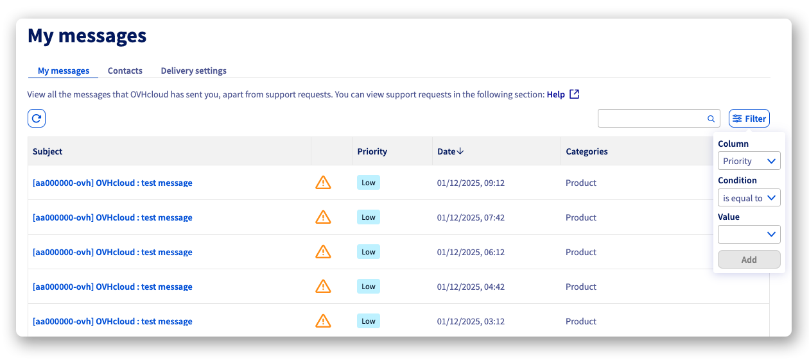
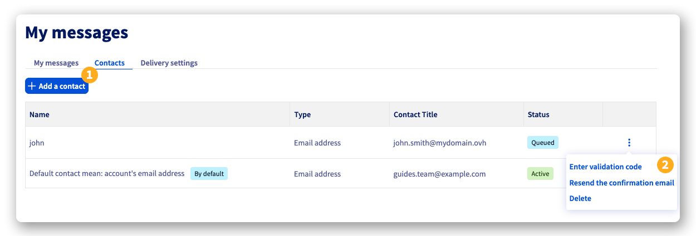
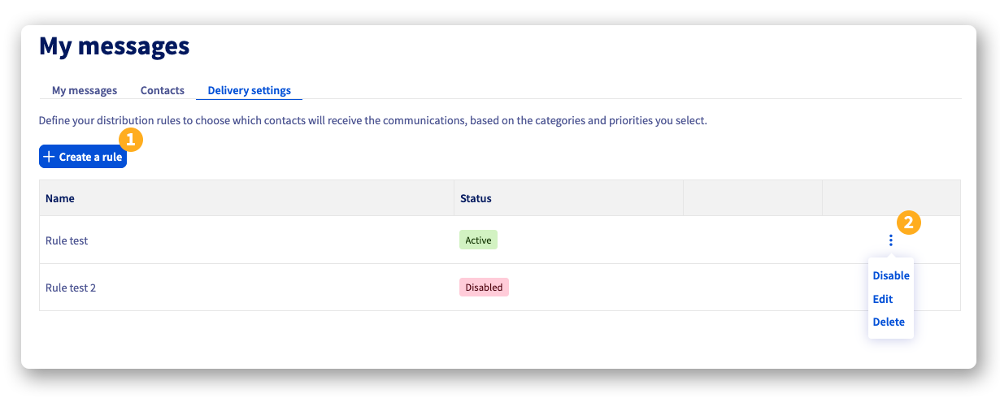
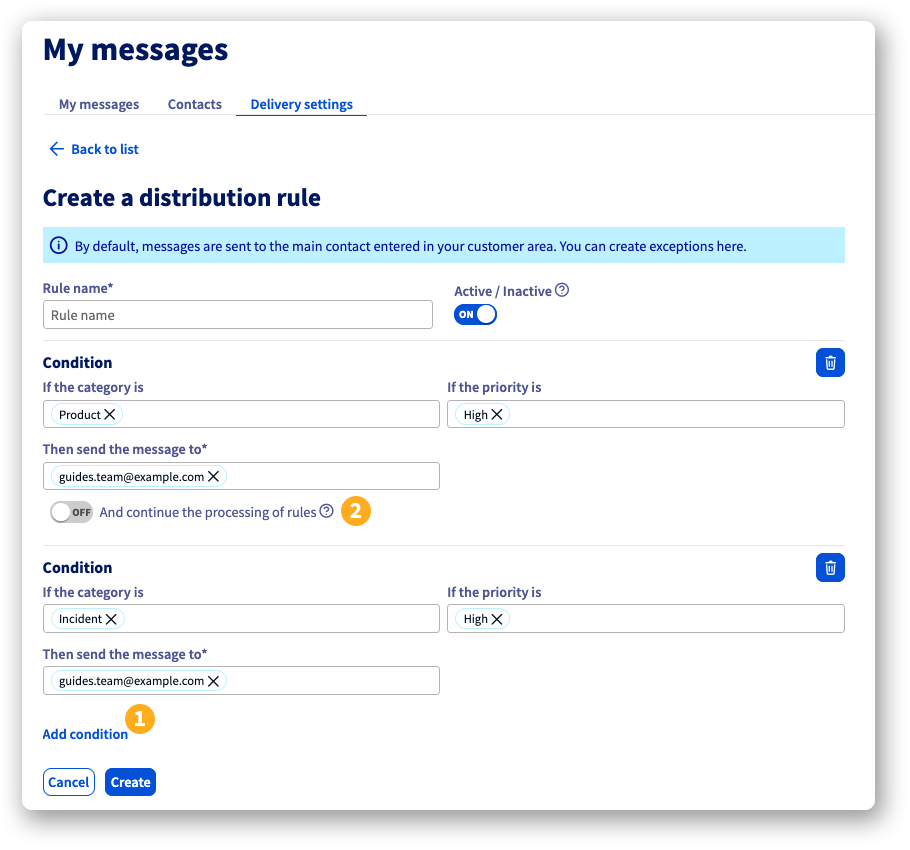

## Objetivo

Ao criar a sua conta OVHcloud, especificou um endereço de correio eletrónico de contacto. Se pretender partilhar ou delegar a gestão das suas comunicações associadas ao seu espaço cliente, pode adicionar novos endereços de correio eletrónico de contacto e configurar regras para gerir estas comunicações.

**Descubra como adicionar endereços de correio eletrónico de contacto adicionais à sua conta OVHcloud e configurar regras de distribuição de mensagens.**

## Requisitos

- Ter uma conta OVHcloud ativa.

## Instruções

Para aceder à gestão das comunicações no seu espaço cliente OVHcloud:

1. Inicie sessão no seu [espaço cliente OVHcloud](/links/manager).
1. Clique no seu nome no canto superior direito, depois em `As minhas comunicações`{.action}.

### As minhas comunicações

A partir do separador `As minhas comunicações`{.action}, encontre todos os mensagens que foram enviadas para o seu endereço de correio eletrónico de contacto. Na parte superior direita da tabela, pode ativar um filtro para classificar as suas mensagens por prioridade, data e categoria.

{.thumbnail .w-600}

### Contactos

A partir do separador `Contactos`{.action}, encontra o endereço de correio eletrónico de referência da conta OVHcloud, que não pode ser removido ou modificado a partir do espaço cliente.

> [!primary]
>
> Se já não tiver acesso ao seu endereço de correio eletrónico de contacto principal e não tiver um endereço de correio eletrónico de recuperação, terá de seguir [esta procedimento](/links/transversal/procedure-email-change) para solicitar a sua alteração às nossas equipas.

Além do seu contacto `por defeito`, pode adicionar novos endereços de correio eletrónico de contacto à sua conta OVHcloud:

- **(1)**: Clique no botão `Adicionar um contacto`{.action}, preencha o endereço de correio eletrónico e o nome do contacto e clique em `Adicionar`{.action}. Um código de validação será enviado para esse endereço de correio eletrónico.

- **(2)**: Clique no botão `⋮`{.action} à direita do novo contacto para visualizar as opções:
    - `Introduzir o código de validação`{.action}: Permite introduzir o código de validação enviado para o novo contacto por correio eletrónico.
    - `Reenviar o código de validação`{.action}: Permite reenviar um correio eletrónico contendo um código de validação para este contacto.
    - `Eliminar`{.action}: Permite eliminar este contacto.

{.thumbnail .w-600}

### Definições de difusão

A partir do separador `Definições de difusão`{.action}, pode criar regras para organizar a distribuição das mensagens para os seus endereços de correio eletrónico de contacto.

- **(1)**: Clique no botão `Criar uma regra`{.action} para definir quais os contactos que receberão as comunicações, consoante as categorias e os níveis de prioridade que selecionar.

- **(2)**: Clique no botão `⋮`{.action} à direita de uma regra para aceder às opções:
    - `Ativar / Desativar`{.action}: Permite ativar ou desativar a regra **sem a eliminar**.
    - `Alterar`{.action} a regra.
    - `Eliminar`{.action} a regra.

{.thumbnail .w-600}

As regras aplicam-se de acordo com dois critérios:

- **A categoria**: Conta, Faturação, Incidente, Manutenção, Produto e Segurança.
- **A prioridade**, definida em 3 níveis: Baixa, Média e Alta.

Pode criar as suas regras uma a uma, todas serão aplicadas quando uma mensagem for transmitida para a sua conta.

Também pode criar uma regra que inclua várias condições que serão aplicadas em cascata. Para isso, durante a configuração de uma regra, clique no botão `Adicionar uma condição`{.action} **(1)**. Pode adicionar tantas condições quanto necessário. 
Por defeito, se uma condição se aplicar, o processo pára. Se quiser que o processo continue a aplicar as condições seguintes, ative o botão `E continuar o tratamento de regras`{.action} **(2)** sob a regra que configurou.

{.thumbnail .w-600}

## Quer saber mais?

Fale com a nossa [comunidade de utilizadores](/links/community).