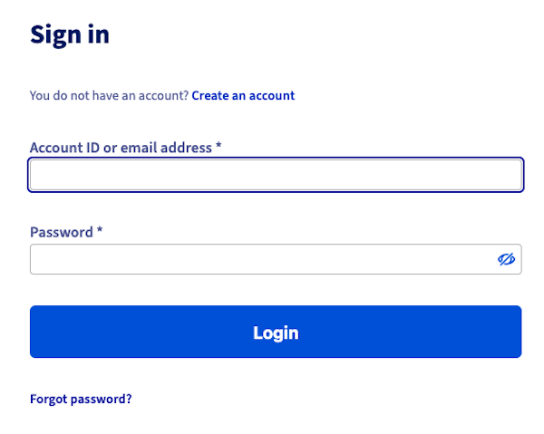
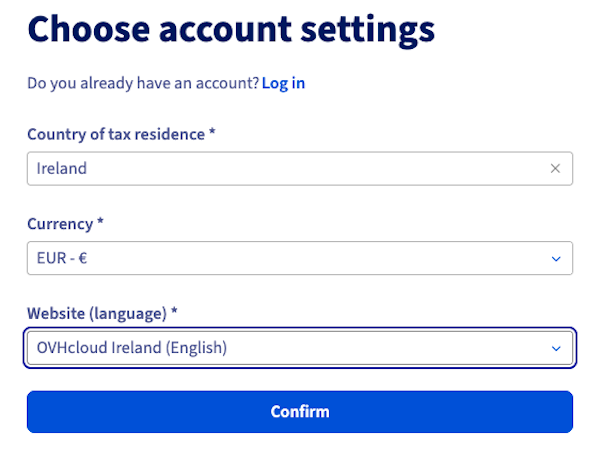
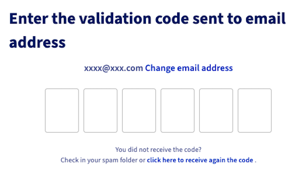

## Objective

To use OVHcloud services, you must first create your account.
You can create an account before or during the order process for your first OVHcloud service.

**Find out how to create an OVHcloud account.**

## Requirements

- A valid and accessible email address

## Instructions

### How do I create my OVHcloud account?

To create an OVHcloud account, go to [this page](/links/manager) and click `Create an account`{.action}.

{.thumbnail}

Enter your country of tax residence, your currency, and the language you would like to use to manage your services in the OVHcloud Control Panel. Then click `Confirm`{.action}.

{.thumbnail}

Then enter your email address and create a password for accessing your OVHcloud account.

|Information|Description|
|---|---|
|Email address|Enter a **valid email address that you currently have access to**.  Avoid using an email address linked to a domain name that you will manage from this OVHcloud account. If your domain is blocked, you will no longer receive our notifications.|
|Password|Your password must be unique (created and used only for your OVHcloud account) and sufficiently complex.  Please refer to [our guide on password management](/pages/account_and_service_management/account_information/manage-ovh-password) for tips on creating an effective password.|

Once you have completed this first form, a one-time code will be sent to the email address you have entered. This code will validate your email address. Enter it in the boxes provided.

{.thumbnail}

> [!primary]
> If you did not receive the email containing the code, check the spam folder of your email account.
>
> You can send a new code by clicking on the link at the bottom of this page.
>
> If the email address you have entered is not valid or available, click `Change email address`{.action}.
>

Once you have entered and validated the code, fill in the rest of the form. Please ensure that you have set the **account type** among the choices offered.

Once you have created your account, you will automatically be logged in to your account’s dashboard.

### What is my account ID? 

Each OVHcloud customer account is associated with a unique ID, sometimes also called a NIC handle.

For most accounts outside Europe, it is replaced by the primary email address entered into the OVHcloud account.

## Go further

Now that you have created your OVHcloud account, we recommend following our [recommendations on account security and managing your personal data](/pages/account_and_service_management/account_information/all_about_username).

See also our guides for:

[Logging in to the OVHcloud Control Panel](/pages/account_and_service_management/account_information/ovhcloud-account-login)

[Changing the password for your OVHcloud account](/pages/account_and_service_management/account_information/manage-ovh-password)

[Securing your OVHcloud account with two-factor authentication](/pages/account_and_service_management/account_information/secure-ovhcloud-account-with-2fa)

Join our [community of users](/links/community).