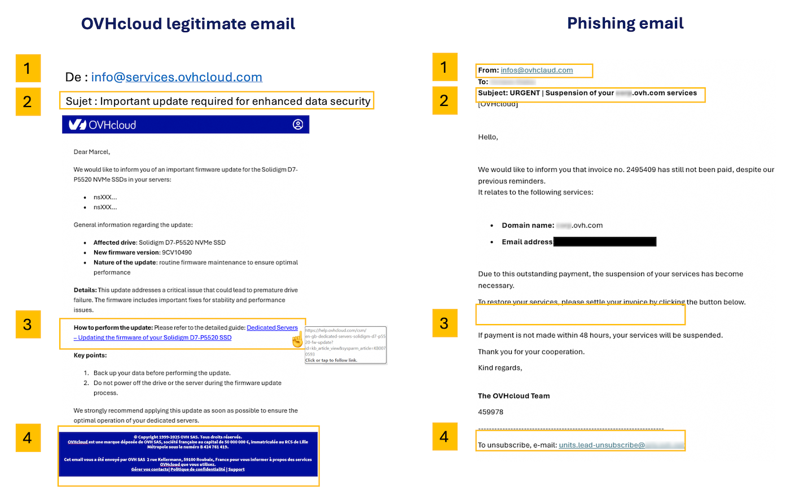

## Ziel

Beim Phishing werden betrügerische E-Mails versandt, in denen Sie dazu aufgefordert werden, auf einen Link zu klicken, der Sie zu einem Formular weiterleitet. Dieses Formular imitiert das bekannte Design einer Marke und Sie werden gebeten, Ihre Login-Daten einzugeben. 

**Hier erfahren Sie, wie Sie eine Phishing-Mail erkennen und was zu tun ist, wenn Sie auf einen betrügerischen Link geklickt haben.**

<iframe class="video" width="560" height="315" src="https://www.youtube-nocookie.com/embed/RED6EuCLFjk?si=9ppewOVm_bXymThM" title="YouTube video player" frameborder="0" allow="accelerometer; autoplay; clipboard-write; encrypted-media; gyroscope; picture-in-picture; web-share" referrerpolicy="strict-origin-when-cross-origin" allowfullscreen></iframe>

## In der praktischen Anwendung

### Ich habe eine E-Mail oder SMS in Namen von OVHcloud erhalten, wie erkenne ich, ob sie legitim ist?

#### Erkennen einer Phishing-E-Mail

Zunächst prüfen Sie, ob die von Ihnen empfangene E-Mail auch in Ihrem [OVHcloud Kundencenter](/links/manager) sichtbar ist. Melden Sie sich an, klicken Sie auf Ihren Namen in der oberen rechten Ecke und dann auf `E-Mails von OVHcloud`{.action} (oder `Meine Kommunikation`{.action}). Dort finden Sie Kopien aller offiziellen E-Mails, die von OVHcloud gesendet wurden.

Außerdem finden Sie hier einige Elemente, die Ihnen helfen, eine echte OVHcloud-E-Mail von einem Phishing-Versuch visuell zu unterscheiden.

Klicken Sie auf das Bild, um es zu vergrößern. Die Details und Erklärungen finden Sie in der Tabelle unten.

{.thumbnail}

> [!primary]
> 
> Die Zahlen in der Tabelle entsprechen denen im obigen Bild.

|Nummer - Beschreibung|Legitime OVHcloud-E-Mail|Betrügerische Phishing-E-Mail|
|---|---|---|
|1 - Absender|Stellen Sie sicher, dass die E-Mail von einer Adresse gesendet wird, die mit einem Domain-Namen (oder Subdomain, z. B. `events.ovhcloud.com`) endet, der zu OVHcloud gehört (siehe Liste unten)|Der E-Mail-Absender ist sehr wahrscheinlich eine Adresse, die nicht von OVHcloud stammt.|
|2 - Betreff|Stellen Sie sicher, dass Ihre OVHcloud-Kontonummer (NIC Handle) **(die normalerweise mit den Initialen der Person beginnt, die das OVHcloud-Konto erstellt hat)** und/oder Ihre Kontoe-Mail-Adresse im Betreff der Nachricht erscheinen.|Häufig ist die E-Mail als \[SPAM] markiert und **Ihr NIC Handle wird nicht angezeigt oder ist falsch**.|
|3 - Link|**Klicken Sie nicht darauf, sondern bewegen Sie den Mauszeiger über den Link oder die Schaltfläche**, und Sie sehen direkt, wohin er führt (unten oder am unteren Rand Ihres Browsers). In unserem Beispiel zeigt der Link korrekt auf eine Adresse unter https://www.ovh.com/.|In einer Phishing-E-Mail stammt der Link nicht von einer offiziellen OVHcloud-Seite. **Klicken Sie ihn nicht an.**|
|4 - E-Mail-Kopf- und Fußzeile|OVHcloud sendet E-Mails in beiden Formaten, TXT und HTML. Der Kopf enthält das OVHcloud-Logo, und die Fußzeile enthält rechtliche Informationen zu OVHcloud|Der Kopf oder die Fußzeile kann Links enthalten, die nichts mit OVHcloud zu tun haben. **Klicken Sie nicht auf diese Links.**|

/// details | **Liste der legitimen OVHcloud-Domänennamen** (klicken Sie, um anzuzeigen)

- ovhcloud.com
- ovh.com
- ovh.fr
- services.ovhcloud.com
- news.ovhcloud.com
- clientmanager.fr
- kimsufi.com
- soyoustart.com
- ovh.ca
- ovh.com.au
- ovh.co.uk
- ovh.ie
- ovh.de
- ovh.es
- ovh.it
- ovh.lt
- ovh-hosting.fi
- ovh.net
- ovh.nl
- ovh.pl
- ovh.pt
- ovh.sn
- ovh.us
- robot.ovh.net

E-Mails können auch von echten Unterdomänen gesendet werden, wie z. B.:

- events.ovhcloud.com
- news.soyoustart.com
- services.kimsufi.com

///

#### Erkennen einer Phishing-SMS

OVHcloud sendet **niemals** einen Link per SMS. Die SMS, die wir senden, sind in der Regel mit der [Zwei-Faktor-Authentifizierung in Ihrem OVHcloud Kundencenter](/pages/account_and_service_management/account_information/secure-ovhcloud-account-with-2fa) verbunden.

Unten finden Sie zwei Beispiele für SMS-Nachrichten. Die erste ist legitim und entspricht der Zwei-Faktor-Authentifizierung. Die zweite SMS ist betrügerisch.

{.thumbnail}

#### Wie melde ich eine Phishing-E-Mail?

Nachdem Sie die oben genannten Prüfungen durchgeführt haben, können Sie, wenn Sie sicher sind, dass Sie eine Phishing-E-Mail erhalten haben, die OVHcloud täuscht, uns so viel Informationen wie möglich (mindestens den Inhalt der E-Mail) an die folgende E-Mail-Adresse senden: **<fraude@ovh.com>**.

> [!primary]
> 
> Bitte beachten Sie, dass die von Ihnen bereitgestellten Informationen an Dritte weitergegeben werden können, um uns bei der Bekämpfung dieser Bedrohungen zu helfen.
> 

### Ich habe meine persönlichen Informationen eingegeben: Was soll ich tun?

Klicken Sie auf die Überschriften unten, um die Anweisungen anzuzeigen.

/// details | Sie haben Ihre Zahlungsinformationen auf einer betrügerischen Website angegeben

Kontaktieren Sie umgehend Ihren Zahlungsdienstleister, um Ihr jeweiliges Zahlungsmittel sperren zu lassen.  Geben Sie das Datum und wenn möglich den Zeitpunkt an, zu dem Sie Ihre Zahlungsinformationen eingegeben haben.

**Nur Ihr Zahlungsdienstleister kann betrügerische Transaktionen stornieren, die möglicherweise bereits ohne Ihr Wissen in Auftrag gegeben wurden.**

///

/// details |Sie haben Ihr OVHcloud Passwort auf einer betrügerischen Website angegeben

Loggen Sie sich in Ihr [OVHcloud Kundencenter](/links/manager) ein und ändern Sie sofort Ihr Passwort. Wir empfehlen Ihnen, auch die Zwei-Faktor-Authentifizierung zu aktivieren, um Ihren Account in Zukunft besser zu schützen.

> [!primary]
>
> Damit Ihre Daten optimal geschützt sind, sollte Ihr Passwort folgende Anforderungen erfüllen:
>
> - Das Passwort muss mindestens 8 Zeichen umfassen.
> - Es muss mindestens 3 verschiedene Zeichentypen enthalten.
> - Es darf kein Wort aus dem Wörterbuch sein.
> - Es darf keine personenbezogenen Daten (Vorname, Nachname oder Geburtsdatum) enthalten.
> - Es darf nicht für mehrere Benutzerzugänge verwendet werden.
> - Es sollte in einem Passwort-Manager gespeichert sein.
> - Es muss alle drei Monate geändert werden.
> - Es muss sich von den vorherigen Passwörtern unterscheiden.
>

///

## Weiterführende Informationen

Treten Sie unserer [User Community](/links/community) bei.