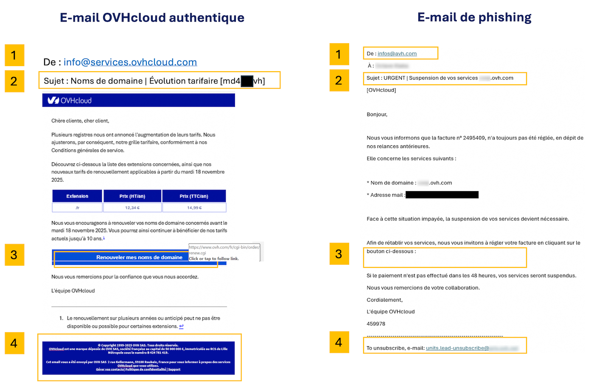

## Objectif

L'hameçonnage (ou *phishing* en anglais) est une technique frauduleuse destinée à leurrer l'internaute pour l'inciter à communiquer des données personnelles (comptes d'accès, mots de passe, etc...) et/ou bancaires en se faisant passer pour un tiers ou un site de confiance. 
Dans la pratique, il s'agit souvent de l’envoi d’un e-mail ou d'un SMS vous invitant à cliquer sur un lien. Ce lien vous redirige vers un formulaire qui reprend frauduleusement les couleurs d’une marque et vous invite à entrer vos identifiants personnels.

**Ce guide vous explique comment reconnaître un e-mail ou un SMS de phishing et quelles mesures prendre si vous avez cliqué sur un lien frauduleux.**

<iframe class="video" width="560" height="315" src="https://www.youtube-nocookie.com/embed/85GEi97-n20?si=xEJpLr9I7G1CgEaq" title="YouTube video player" frameborder="0" allow="accelerometer; autoplay; clipboard-write; encrypted-media; gyroscope; picture-in-picture; web-share" referrerpolicy="strict-origin-when-cross-origin" allowfullscreen></iframe>

## En pratique

### J'ai reçu un e-mail ou un SMS au nom d'OVHcloud, comment savoir s'il est légitime ?

#### Identifier un e-mail de phishing

En priorité, vérifiez si l'e-mail que vous avez reçu est aussi visible dans votre [espace client OVHcloud](/links/manager). Connectez-vous, cliquez sur votre nom en haut à droite puis sur `E-mails de service`{.action} (ou `Mes communications`{.action}). Vous y retrouverez les copies des e-mails officiels envoyés par OVHcloud.

Par ailleurs, voici quelques éléments pour vous aider à distinguer visuellement un authentique e-mail OVHcloud d'une tentative de phishing.

Cliquez sur l'image pour l'agrandir. Retrouvez les détails et explications dans le tableau ci-dessous.

{.thumbnail}

> [!primary]
> 
> Les numéros du tableau correspondent à ceux visibles dans l'image ci-dessus.

|Numéro - description|E-mail OVHcloud légitime|E-mail de phishing frauduleux|
|---|---|---|
|1 - Expéditeur|Vérifiez que l’adresse utilisée pour l’envoi de l’e-mail se termine par un nom de domaine (ou un sous-domaine, par exemple `events.ovhcloud.com` ) appartenant à OVHcloud (voir la liste ci-dessous) |L'expéditeur de l'e-mail sera très probablement une adresse qui ne vient pas d'OVHcloud.|
|2 - Objet|Vérifiez que votre identifiant **(qui commence généralement par les initiales de la personne ayant créé le compte OVHcloud)** et/ou l’adresse e-mail de votre compte figurent dans l’objet du message.|Très souvent, l'e-mail sera marqué comme \[SPAM] et **votre identifiant n'apparaîtra pas ou sera incorrect**.|
|3 - Lien|**Sans cliquer dessus, passez votre pointeur de souris sur le lien ou le bouton** et vous en verrez directement la cible (juste en dessous ou tout en bas de votre navigateur). Dans notre exemple, le lien renvoie bien vers une adresse https://www.ovh.com/. Lorsque vous cliquez sur un lien, vérifiez toujours l'adresse dans le navigateur. OVHcloud utilise un ensemble de noms de domaines reconnaissables, généralement ovhcloud.com ou ovh.com (voir la liste ci-dessous). |Dans un e-mail de phishing, le lien ne sera pas celui d'une page officielle OVHcloud. **Ne cliquez pas dessus.**|
|4 - En-tête et pied de page de l'e-mail|OVHcloud envoie des e-mails dans les formats TXT et HTML. L'en-tête contiendra le logo OVHcloud, le pied de l'e-mail contiendra des informations légales liées à OVHcloud|Il se peut que l'en-tête ou le pied de page contiennent des liens qui n'ont rien à voir avec OVHcloud. **Ne cliquez pas sur ces liens.**|

/// details | **Liste des noms de domaines OVHcloud légitimes** (cliquez pour l'afficher)

- ovhcloud.com
- ovh.com
- ovh.fr
- services.ovhcloud.com
- news.ovhcloud.com
- clientmanager.fr
- kimsufi.com
- soyoustart.com
- ovh.ca
- ovh.com.au
- ovh.co.uk
- ovh.ie
- ovh.de
- ovh.es
- ovh.it
- ovh.lt
- ovh-hosting.fi
- ovh.net
- ovh.nl
- ovh.pl
- ovh.pt
- ovh.sn
- ovh.us
- robot.ovh.net

Des e-mails peuvent également vous être envoyés de notre part depuis des sous-domaines authentiques tels que :

- events.ovhcloud.com
- news.soyoustart.com
- services.kimsufi.com

///

#### Identifier un SMS de phishing

OVHcloud ne vous transmettra **jamais** de lien par SMS. Les SMS que nous envoyons sont généralement liés à la [double authentification dans votre espace client](/pages/account_and_service_management/account_information/secure-ovhcloud-account-with-2fa).

Vous trouverez ci-dessous 2 exemples de SMS, le premier est légitime et correspond à la double authentification. Le second SMS est frauduleux.

{.thumbnail}

#### Comment signaler un e-mail de phishing ?

Après avoir effectué les vérifications expliquées au-dessus, si vous êtes certain que vous avez effectivement reçu un e-mail de phishing usurpant l'identité d'OVHcloud, vous pouvez nous faire parvenir un maximum d’informations (le contenu de l'e-mail au minimum) à l’adresse e-mail suivante : **<fraude@ovh.com>**.

> [!primary]
> 
> Veuillez noter que les informations que vous nous communiquerez pourront être partagées à des tiers afin de nous permettre de lutter contre ces menaces.
> 

### J'ai saisi mes informations personnelles : que faire ?

Cliquez sur les titres ci-dessous pour afficher les instructions.

/// details | **Si vous avez entré votre numéro de carte bancaire sur un site frauduleux**

Contactez rapidement votre banque afin de faire opposition sur votre moyen de paiement. Indiquez-leur la date et si possible l’heure à laquelle vous avez entré votre numéro de carte bancaire.

**Votre banque est la seule à pouvoir annuler les transactions frauduleuses qui pourraient avoir été effectuées à votre insu.**

///

/// details | **Si vous avez entré votre mot de passe OVHcloud sur un site frauduleux**

Connectez-vous sur votre [espace client OVHcloud](/links/manager) et modifiez immédiatement votre mot de passe. 

Vous trouverez, sur notre guide « [Modifier le mot de passe de votre compte](/pages/account_and_service_management/account_information/manage-ovh-password) », la méthode pour modifier votre mot de passe depuis votre espace client, ainsi que nos recommandations pour générer un mot de passe efficace et le sauvegarder dans un gestionnaire de mots de passe. 

Nous vous conseillons fortement d’activer également la [double authentification](/pages/account_and_service_management/account_information/secure-ovhcloud-account-with-2fa) pour sécuriser durablement votre compte.

> [!primary]
>
> Pour rappel, afin de sécuriser efficacement vos données, votre mot de passe doit :
>
> - comporter au minimum douze caractères ;
> - comporter au moins 1 lettre majuscule, 1 lettre minuscule et 1 chiffre ;
> - comporter des caractères spéciaux (par exemple : `%`, `#`, `:`, `$`, `*`) ;
> - ne pas être tiré du dictionnaire ;
> - ne pas comporter d’informations personnelles (votre prénom, nom ou date de naissance) ;
> - ne pas être utilisé pour plusieurs accès utilisateur ;
> - être stocké dans un coffre-fort de mots de passe ;
> - être changé tous les trois mois ;
> - être différent des mots de passe précédents.
>

///

## Aller plus loin

[Définir et gérer le mot de passe de votre compte](/pages/account_and_service_management/account_information/manage-ovh-password)

[Sécuriser son compte OVHcloud avec la double authentification](/pages/account_and_service_management/account_information/secure-ovhcloud-account-with-2fa)

[Sécuriser mon compte OVHcloud et gérer mes informations personnelles](/pages/account_and_service_management/account_information/all_about_username)

Échangez avec notre [communauté d'utilisateurs](/links/community).