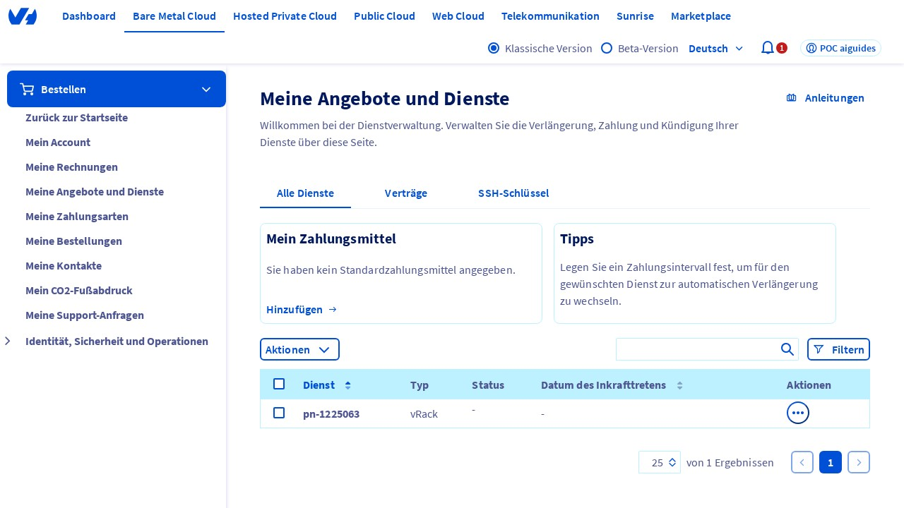
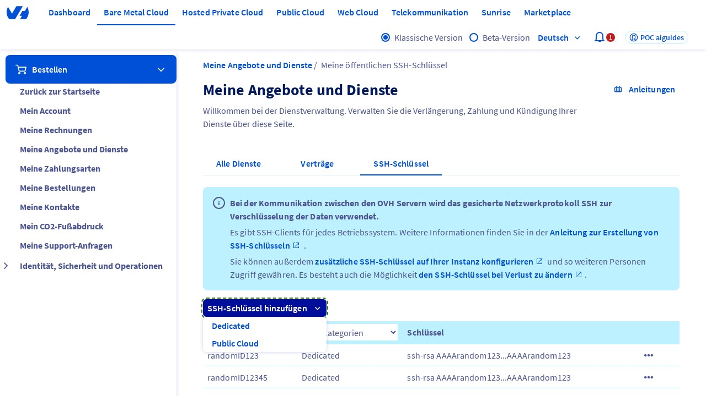
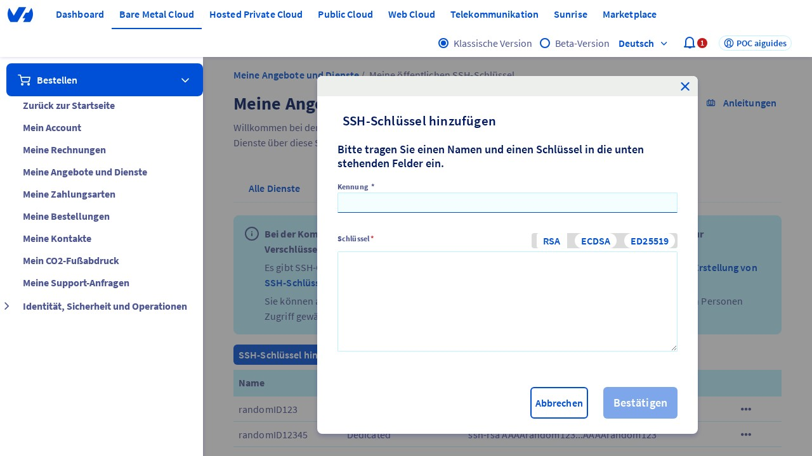
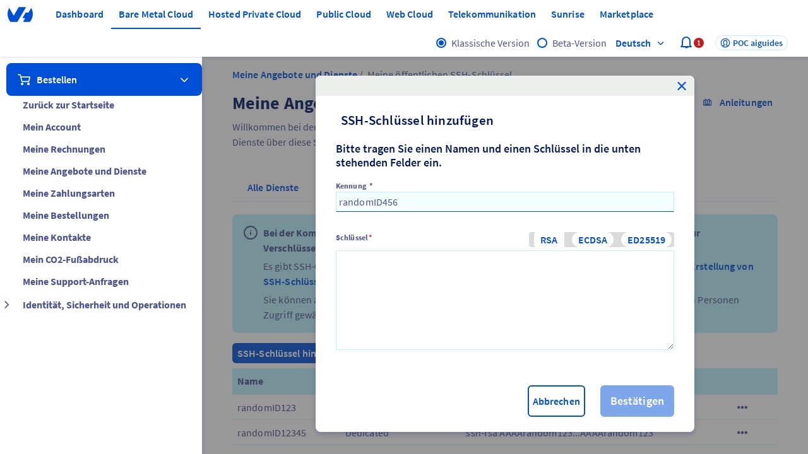
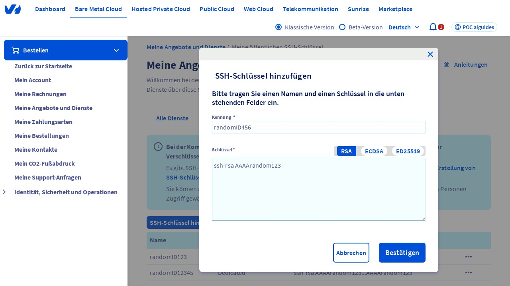

## Einleitung
Willkommen bei diesem Leitfaden, in dem wir Ihnen Schritt für Schritt erklären, wie Sie einen SSH-Schlüssel*¹ im OVHcloud Control Panel hinzufügen. Dieser Vorgang ist wichtig, um die Sicherheit und Verwaltung Ihrer Server zu verbessern. Stellen Sie sicher, dass Sie die Anweisungen sorgfältig befolgen, um den Prozess erfolgreich abzuschließen.

## Schritt 1: Zugriff auf die Seite "Meine Angebote und Dienstleistungen"
Gehen Sie zunächst auf die Seite "Meine Angebote und Dienstleistungen" im OVHcloud Control Panel, die Sie unter der URL [https://www.ovh.com/manager/#/billing/autorenew/](https://www.ovh.com/manager/#/billing/autorenew/) finden. Stellen Sie sicher, dass Sie angemeldet sind, um auf Ihre Dienstleistungen zuzugreifen. 

{.thumbnail}

## Schritt 2: Klicken auf den "SSH-Schlüssel" Tab
Nachdem Sie sich auf der richtigen Seite befinden, klicken Sie auf den Tab "SSH-Schlüssel". Dieser Tab ermöglicht es Ihnen, Ihre SSH-Schlüssel zu verwalten, die für die sichere Anmeldung an Ihren Servern verwendet werden.

{.thumbnail}

## Schritt 3: Hinzufügen eines neuen SSH-Schlüssels
Klicken Sie nun auf die Schaltfläche "Ein SSH-Schlüssel hinzufügen". Durch diesen Vorgang öffnet sich ein Dropdown-Menü, in dem Sie die Option "Dedicated" auswählen müssen. Diese Option ist für dedizierte Server bestimmt und ermöglicht eine sichere Verbindung.

{.thumbnail}

## Schritt 4: Überprüfung des Modalfensters
Nachdem Sie die Option "Dedicated" ausgewählt haben, sollte ein Modalfenster mit dem Titel "Ein SSH-Schlüssel hinzufügen" angezeigt werden. Dieses Fenster enthält die erforderlichen Felder, um Ihren neuen SSH-Schlüssel zu konfigurieren.

{.thumbnail}

## Schritt 5: Eingabe der ID
Geben Sie im Feld "ID" (oder "Identifier") einen eindeutigen Wert ein. Dieser Wert dient als Bezeichner für Ihren SSH-Schlüssel und sollte daher einfach zu identifizieren und zu merken sein. Für diesen Leitfaden können Sie einen zufälligen ID-Wert verwenden.

{.thumbnail}

## Schritt 6: Eingabe des SSH-Schlüssels
Im Feld "Schlüssel" geben Sie Ihren SSH-Schlüssel im Format "ssh-rsa AAAArandom123" ein. Stellen Sie sicher, dass der Schlüssel im richtigen Format vorliegt, um eine erfolgreiche Konfiguration zu gewährleisten.

{.thumbnail}

## Schritt 7: Bestätigung der Eingaben
Klicken Sie abschließend auf die Schaltfläche "Bestätigen", um den neuen SSH-Schlüssel hinzuzufügen. Durch diesen Vorgang wird der Schlüssel in Ihrem OVHcloud Control Panel gespeichert und kann für die Anmeldung an Ihren Servern verwendet werden.

{.thumbnail}

## Fußnoten
*¹ SSH-Schlüssel: Ein SSH-Schlüssel (Secure Shell) ist eine Methode, um eine sichere Verbindung zu einem Server herzustellen, ohne ein Passwort eingeben zu müssen. Er besteht aus einem privaten und einem öffentlichen Schlüssel, die zusammenarbeiten, um die Authentifizierung und Verschlüsselung der Verbindung zu gewährleisten.

## Schluss
Herzlichen Glückwunsch! Sie haben erfolgreich einen SSH-Schlüssel im OVHcloud Control Panel hinzugefügt. Dieser Leitfaden sollte Ihnen geholfen haben, den Prozess Schritt für Schritt zu verstehen und durchzuführen. Wenn Sie weitere Fragen haben oder Hilfe benötigen, zögern Sie nicht, sich an den OVHcloud Support zu wenden.