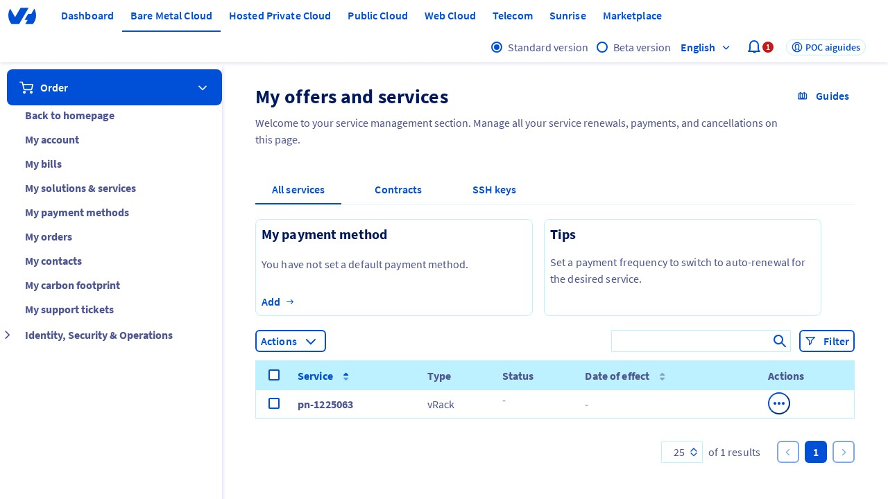
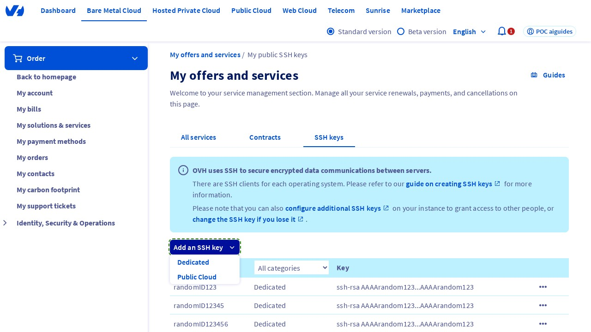
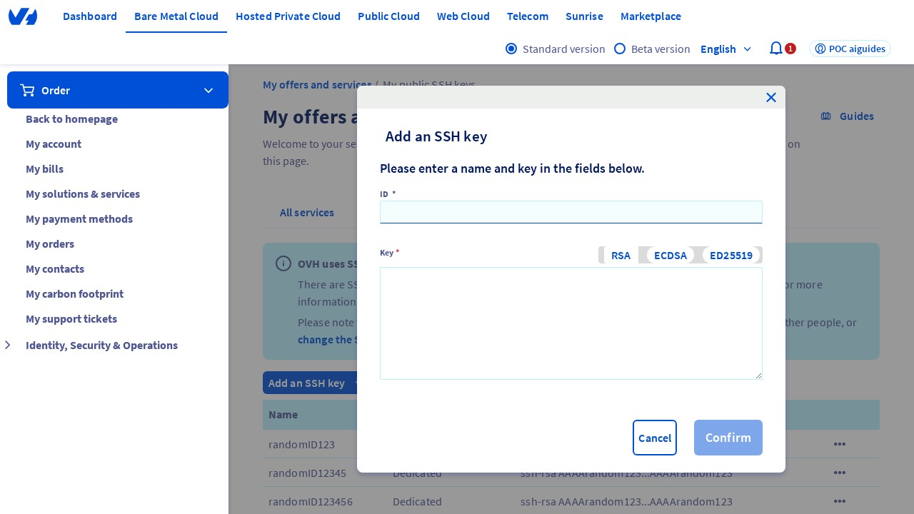
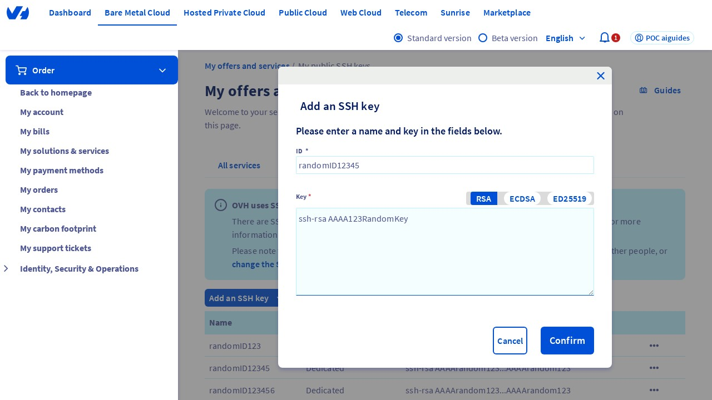
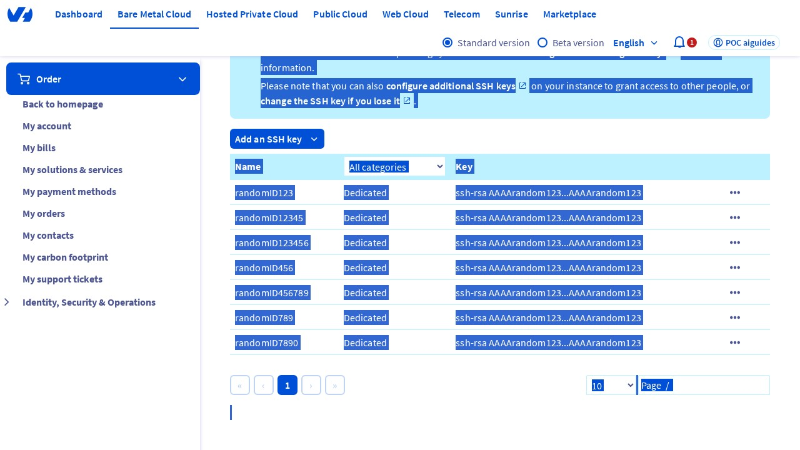

## Introduction
This guide will walk you through the process of adding an SSH key in the OVHcloud Control Panel. SSH keys*¹ are used to authenticate and connect to servers securely. To begin, ensure you have access to the OVHcloud Control Panel and navigate to the "My offers and services" page, which can be found at [https://www.ovh.com/manager/#/billing/autorenew/](https://www.ovh.com/manager/#/billing/autorenew/).

## Step 1: Access the "My offers and services" Page
Wait for the page to load, and verify that you are on the "My offers and services" page inside the OVHcloud Control Panel. This page displays an overview of your services and offers. 

{.thumbnail}

## Step 2: Click on the "SSH key" Tab
Click on the "SSH key" tab, usually located in the navigation menu. This tab is where you manage your SSH keys for secure server access.

{.thumbnail}

## Step 3: Add a New SSH Key
Click on the "Add an SSH key" button. This action will display a dropdown menu. Inside the dropdown, select the "Dedicated" option to proceed with adding a new SSH key.

{.thumbnail}

## Step 4: Verify the Modal Window
After selecting the "Dedicated" option, a modal window titled "Add an SSH key" should appear. This window contains fields necessary for adding a new SSH key.

{.thumbnail}

## Step 5: Enter the ID (Identifier)
Type a value in the "ID" (or "Identifier") field. For this guide, you can enter a random ID. This identifier helps in recognizing the SSH key.

{.thumbnail}

## Step 6: Enter the SSH Key
Type a value in the "Key" input field. The format should be similar to "ssh-rsa AAAArandom123" for example. Ensure the key is in the correct format to avoid errors.

{.thumbnail}

## Step 7: Confirm the Addition of the New Key
Click on the "Confirm" button to add the new SSH key. This action will save the SSH key, making it available for use in accessing your servers securely.

{.thumbnail}

## Conclusion
By following these steps, you have successfully added an SSH key in the OVHcloud Control Panel. SSH keys are a crucial component of server security, allowing for encrypted connections and protecting against unauthorized access.

*¹ SSH key: A Secure Shell (SSH) key is a cryptographic key used for secure access to servers and other network devices. It provides a secure way to log in to a server without using a password, enhancing security by using public-key cryptography*².

*² Public-key cryptography: A method of encrypting data using a pair of keys: a public key for encryption and a corresponding private key for decryption, ensuring that only the intended recipient can access the encrypted data.