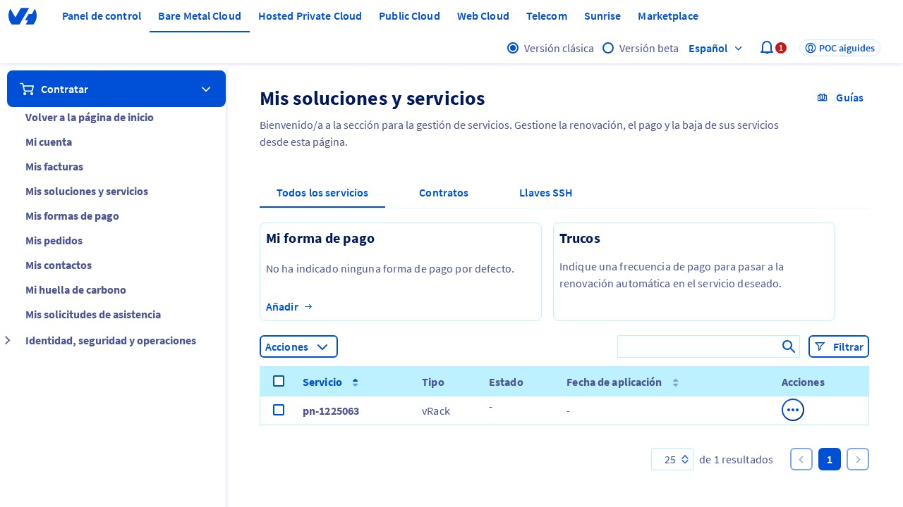
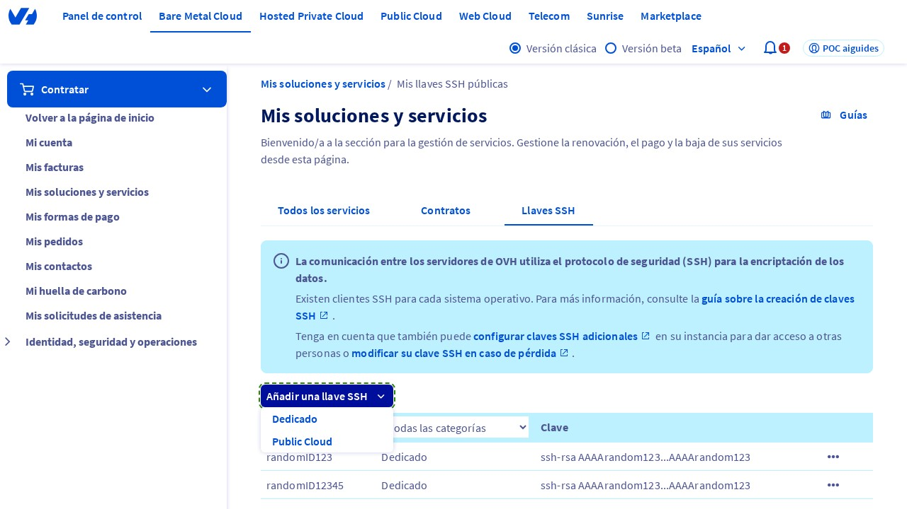
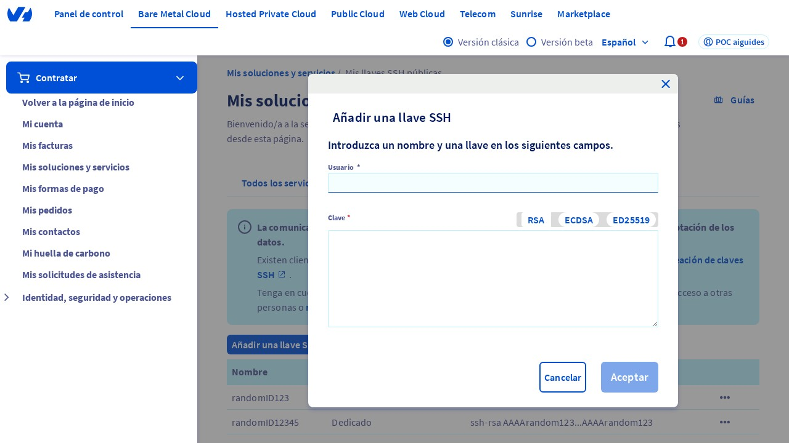
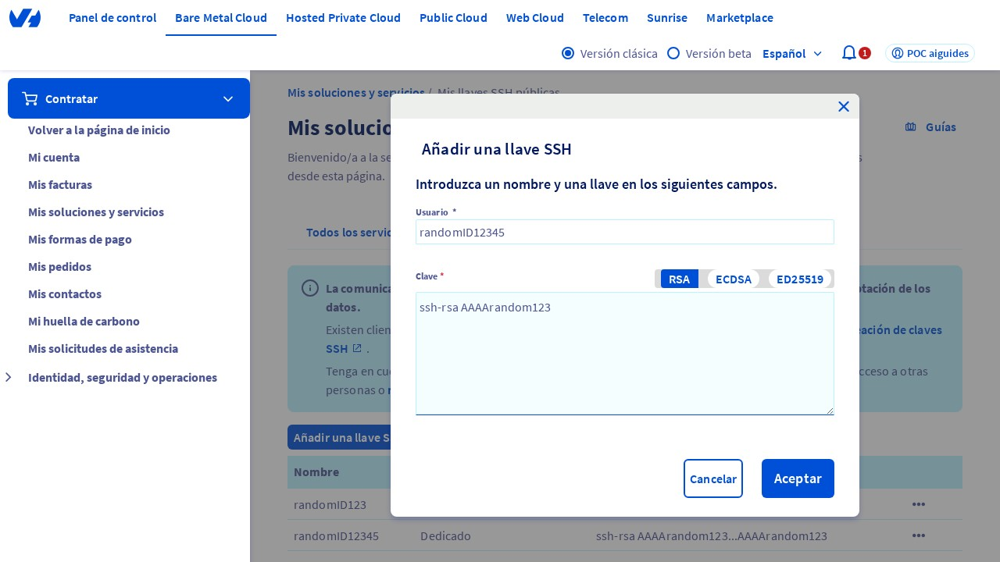

## Introducción
En este tutorial, aprenderás a agregar una clave SSH en el Panel de Control de OVHcloud. La autenticación por clave SSH*¹ es un método seguro para acceder a tus servicios en la nube sin necesidad de recordar contraseñas. Sigue estos pasos para agregar una clave SSH y mejorar la seguridad de tus servicios.

<iframe class="video" width="800" src="https://www.youtube.com/embed/bMBCvctJVps?si=XaIY0J89xUvJr1So" title="YouTube video player" frameborder="0" allow="accelerometer; autoplay; clipboard-write; encrypted-media; gyroscope; picture-in-picture; web-share" referrerpolicy="strict-origin-when-cross-origin" allowfullscreen></iframe>

## Paso 1: Acceder al Panel de Control de OVHcloud
Para empezar, debes acceder al Panel de Control de OVHcloud. Puedes hacerlo visitando la siguiente URL: [https://www.ovh.com/manager/#/billing/autorenew/](https://www.ovh.com/manager/#/billing/autorenew/). Una vez que hayas iniciado sesión, asegúrate de que estés en la página "Mis ofertas y servicios" dentro del Panel de Control de OVHcloud. Esta página es el punto de partida para gestionar tus servicios en la nube.

{.thumbnail}

## Paso 2: Seleccionar la pestaña "Clave SSH"
En la página "Mis ofertas y servicios", busca la pestaña "Clave SSH" y haz clic en ella. Esta pestaña te permite gestionar tus claves SSH y agregar nuevas.

{.thumbnail}

## Paso 3: Agregar una nueva clave SSH
Haz clic en el botón "Agregar una clave SSH". Se mostrará un menú desplegable con opciones. Selecciona la opción "Dedicada" para agregar una clave SSH para tus servicios dedicados.

{.thumbnail}

## Paso 4: Verificar la ventana modal "Agregar una clave SSH"
Después de seleccionar la opción "Dedicada", se mostrará una ventana modal con el título "Agregar una clave SSH". Esta ventana te permite ingresar los detalles de tu clave SSH.

{.thumbnail}

## Paso 5: Ingresar el ID de la clave SSH
En el campo "ID" (o "Identificador"), ingresa un valor único para identificar tu clave SSH. Puedes ingresar un ID aleatorio para este tutorial.

{.thumbnail}

## Paso 6: Ingresar la clave SSH
En el campo "Clave", ingresa tu clave SSH en el formato correcto, que es "ssh-rsa AAAArandom123" (por ejemplo, para este tutorial). Asegúrate de que la clave esté en el formato correcto para evitar errores.

{.thumbnail}

## Paso 7: Confirmar la agregación de la clave SSH
Haz clic en el botón "Confirmar" para agregar la nueva clave SSH. La clave se agregará a tu lista de claves SSH y estará lista para usarse.

{.thumbnail}

## Conclusión
Has agregado con éxito una clave SSH en el Panel de Control de OVHcloud. Ahora puedes usar esta clave para acceder a tus servicios en la nube de manera segura. Recuerda que la autenticación por clave SSH es un método seguro para proteger tus servicios en la nube.

*¹ La autenticación por clave SSH es un método de autenticación que utiliza claves criptográficas para verificar la identidad de un usuario o servicio. Esto proporciona una capa adicional de seguridad para proteger tus servicios en la nube.