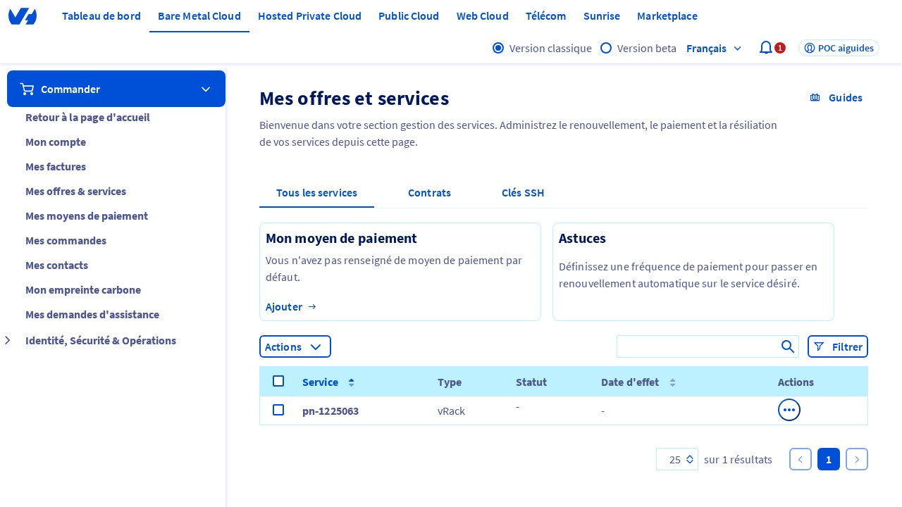
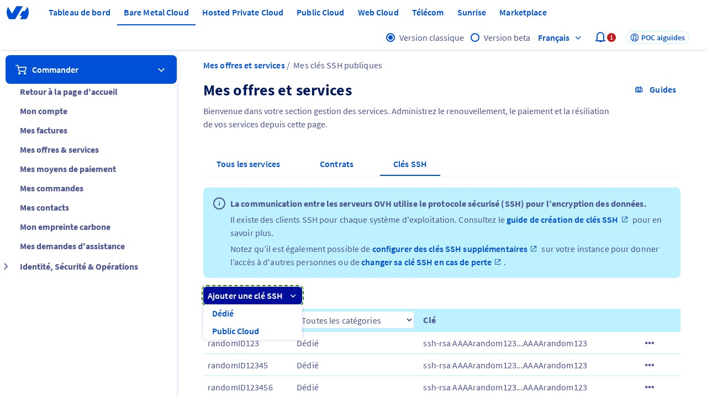
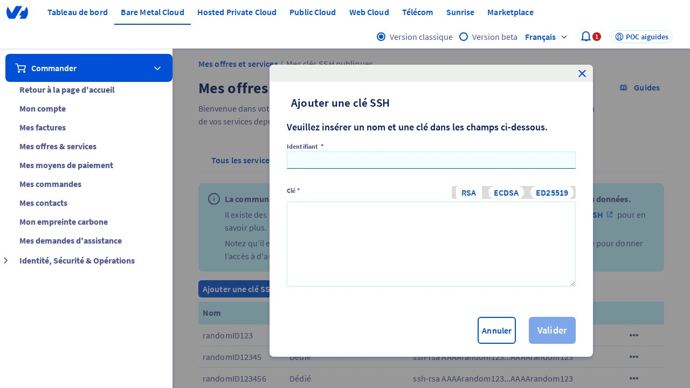
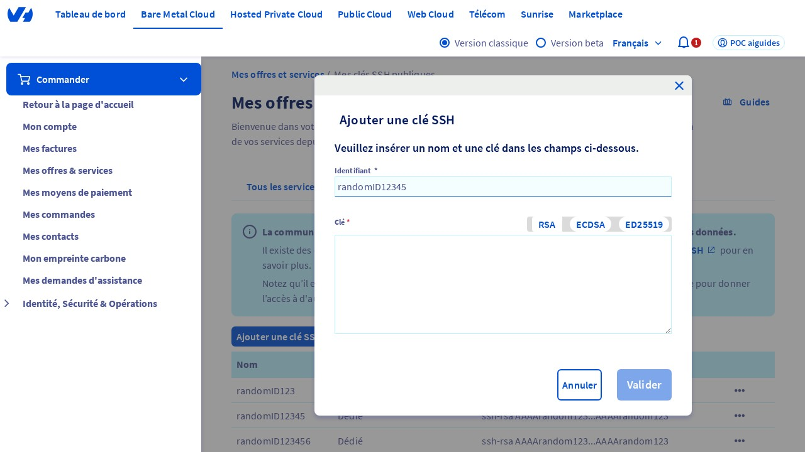
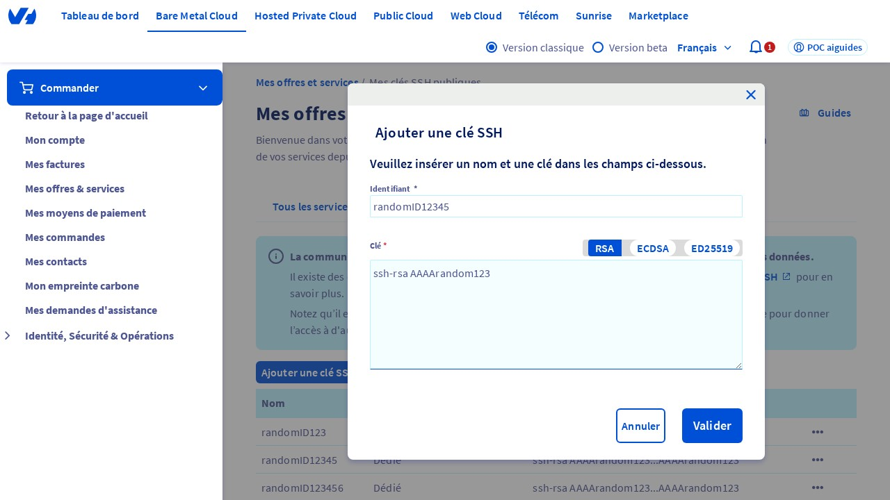

## Introduction
Ce guide vous aidera à ajouter une clé SSH dans le panneau de contrôle OVHcloud. Les clés SSH sont utilisées pour établir des connexions sécurisées entre votre ordinateur et vos serveurs dédiés. Il est essentiel de suivre ces étapes pour garantir la sécurité de vos serveurs.

<video controls="controls" width="100%">
    <source src="https://vod.api.video/vod/vi1ESnfEbtbkhZWex1HUcdBN/mp4/source.mp4" type="video/mp4"/>
</video>

## Étape 1 : Accéder à la page "Mes offres et services"
Pour commencer, vous devez accéder à la page "Mes offres et services" dans le panneau de contrôle OVHcloud. Vous pouvez y accéder en vous rendant sur l'URL suivante : [https://www.ovh.com/manager/#/billing/autorenew/](https://www.ovh.com/manager/#/billing/autorenew/). Assurez-vous d'être connecté à votre compte OVHcloud pour accéder à cette page.

{.thumbnail}

## Étape 2 : Cliquer sur l'onglet "Clé SSH"
Une fois que vous êtes sur la page "Mes offres et services", cliquez sur l'onglet "Clé SSH" pour accéder aux paramètres de clé SSH.

{.thumbnail}

## Étape 3 : Cliquer sur le bouton "Ajouter une clé SSH"
Cliquez sur le bouton "Ajouter une clé SSH" pour afficher le menu déroulant. Dans ce menu, cliquez sur l'option "Dédie" pour ajouter une nouvelle clé SSH pour vos serveurs dédiés.

{.thumbnail}

## Étape 4 : Vérification de la fenêtre modale "Ajouter une clé SSH"
Après avoir cliqué sur l'option "Dédie", une fenêtre modale "Ajouter une clé SSH" devrait s'afficher. Cette fenêtre vous permettra de saisir les informations nécessaires pour votre nouvelle clé SSH.

## Étape 5 : Saisir l'ID de la clé SSH
Dans la fenêtre modale "Ajouter une clé SSH", saisissez une valeur dans le champ "ID" (ou "Identifiant"). Pour cet exemple, vous pouvez saisir un ID aléatoire.

{.thumbnail}

## Étape 6 : Saisir la clé SSH
Saisissez une valeur dans le champ "Clé" au format "ssh-rsa AAAArandom123" (remplacez "AAArandom123" par votre clé SSH réelle).

{.thumbnail}

## Étape 7 : Confirmer l'ajout de la clé SSH
Cliquez sur le bouton "Confirmer" pour ajouter la nouvelle clé SSH. Votre clé SSH est maintenant ajoutée et prête à être utilisée pour établir des connexions sécurisées avec vos serveurs dédiés.

{.thumbnail}

*Note :* Une clé SSH (Secure Shell) ^[1] est une paire de clés utilisée pour établir des connexions sécurisées entre votre ordinateur et vos serveurs dédiés.

[^1]: Secure Shell (SSH) : un protocole de réseau sécurisé utilisé pour établir des connexions entre un client et un serveur. Il permet d'exécuter des commandes à distance de manière sécurisée.