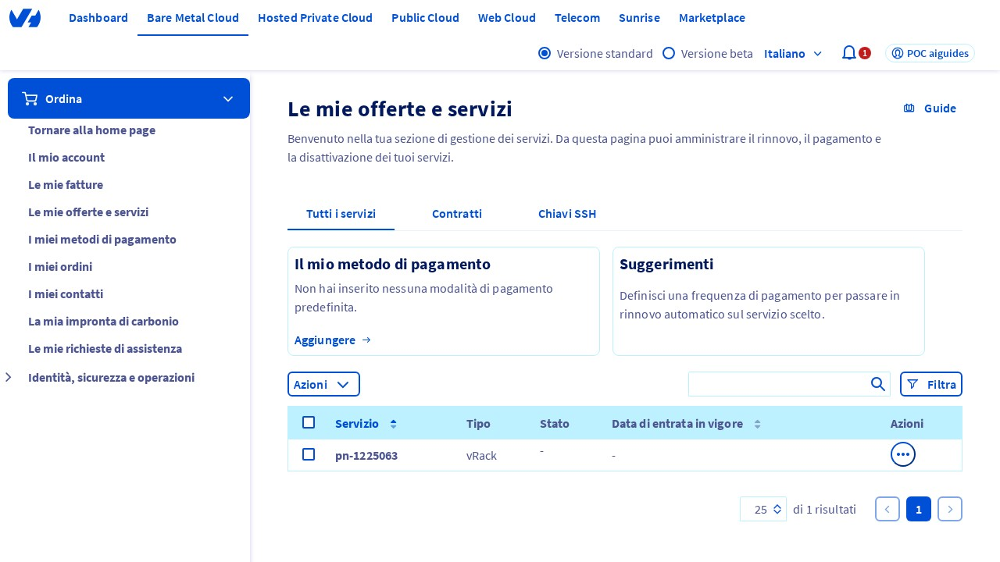
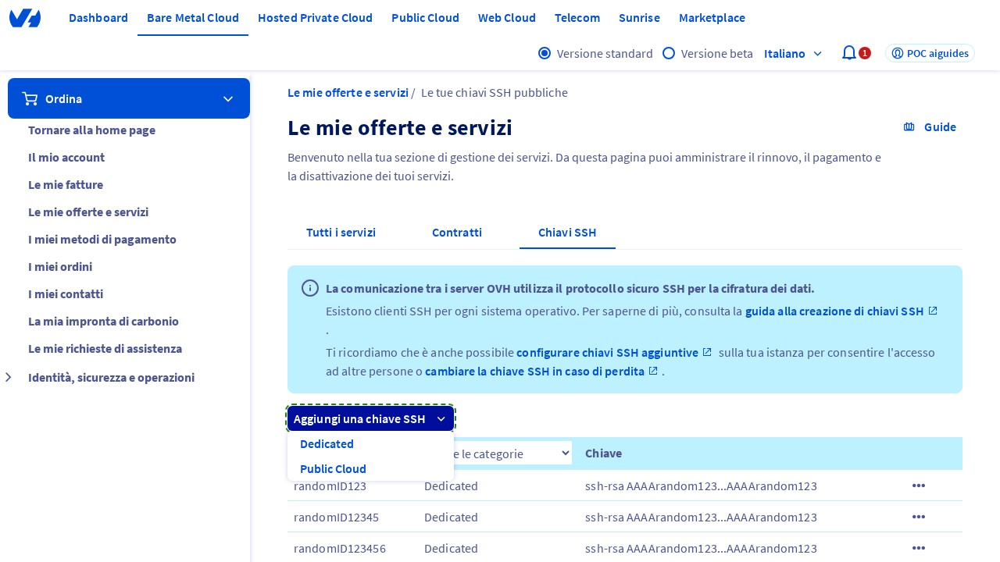
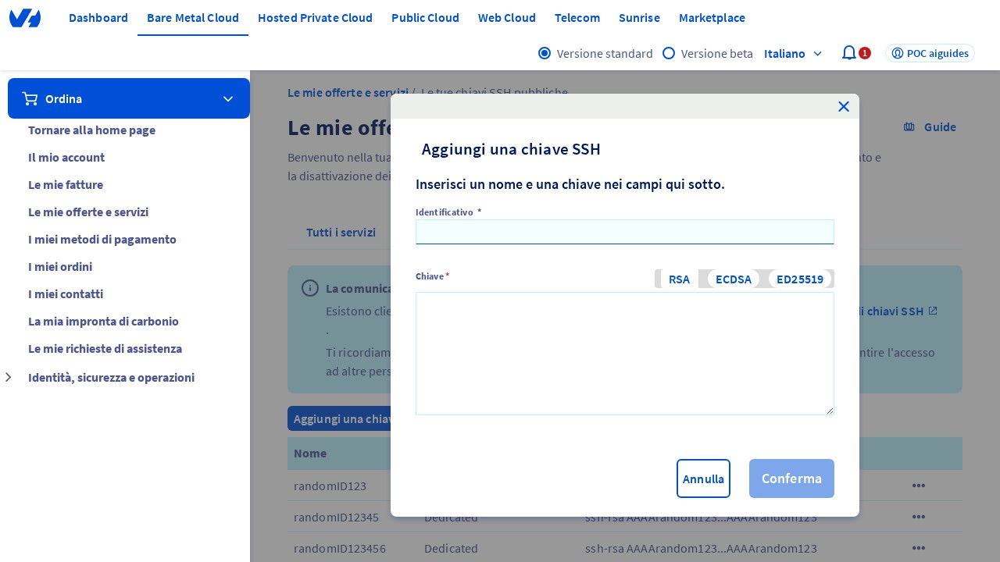
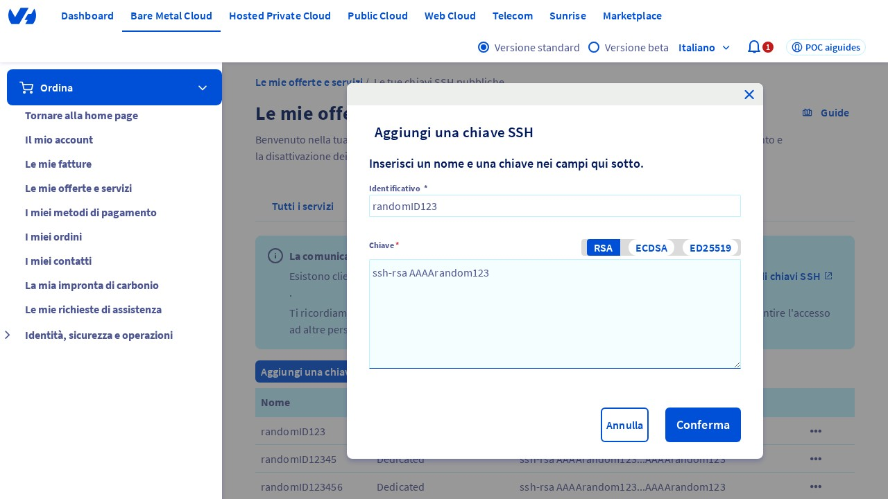

## Introduzione
Benvenuti in questa guida su come aggiungere una chiave SSH nel pannello di controllo OVHcloud. Questa guida è stata progettata per aiutarti a comprendere i passaggi necessari per aggiungere una chiave SSH in modo semplice e veloce. Prima di iniziare, assicurati di avere accesso al pannello di controllo OVHcloud.

## Passo 1: Accedere alla pagina "My offers and services"
Per iniziare, devi accedere alla pagina "My offers and services" all'interno del pannello di controllo OVHcloud. Puoi farlo accedendo all'URL [https://www.ovh.com/manager/#/billing/autorenew/](https://www.ovh.com/manager/#/billing/autorenew/). Una volta acceso, assicurati di essere sulla pagina corretta. 

{.thumbnail}

## Passo 2: Selezionare la scheda "SSH key"
Una volta nella pagina "My offers and services", clicca sulla scheda "SSH key" per accedere alle impostazioni relative alle chiavi SSH. 

{.thumbnail}

## Passo 3: Aggiungere una nuova chiave SSH
Clicca sul pulsante "Add an SSH key" per aggiungere una nuova chiave SSH. Questo pulsante aprirà un menu a discesa con diverse opzioni. Seleziona l'opzione "Dedicated" per procedere con l'aggiunta di una chiave SSH dedicata. 

{.thumbnail}

## Passo 4: Verificare la visualizzazione della finestra modale "Add an SSH key"
Dopo aver selezionato l'opzione "Dedicated", dovrebbe apparire una finestra modale intitolata "Add an SSH key". Questa finestra ti permetterà di inserire le informazioni necessarie per la nuova chiave SSH.

## Passo 5: Inserire l'ID della chiave SSH
Nella finestra modale "Add an SSH key", inserisci un valore nell campo "ID" (o "Identifier"). Per questo esempio, puoi inserire un ID casuale. Assicurati di ricordare questo ID, poiché potrebbe essere necessario in futuro. 

{.thumbnail}

## Passo 6: Inserire la chiave SSH
Nel campo "Key" input, inserisci la chiave SSH nel formato corretto, ad esempio "ssh-rsa AAAArandom123". Assicurati di inserire la chiave SSH corretta, poiché questa sarà utilizzata per l'autenticazione. 

{.thumbnail}

## Passo 7: Confermare l'aggiunta della chiave SSH
Clicca sul pulsante "Confirm" per aggiungere la nuova chiave SSH. Una volta confermata, la chiave SSH sarà aggiunta al tuo account OVHcloud. 

{.thumbnail}

## Conclusione
Congratulazioni! Hai aggiunto con successo una chiave SSH nel pannello di controllo OVHcloud. Se hai bisogno di ulteriore assistenza o hai domande, non esitare a contattare il supporto tecnico OVHcloud. Ricorda di gestire sempre le tue chiavi SSH in modo sicuro per proteggere l'accesso ai tuoi servizi. 

Nota: *SSH*[1](#ssh) sta per Secure Shell, un protocollo di rete crittografato per l'accesso remoto a sistemi informatici.

<a name="ssh">[1]</a> *SSH (Secure Shell)*: un protocollo di rete crittografato che consente l'accesso remoto a sistemi informatici in modo sicuro.