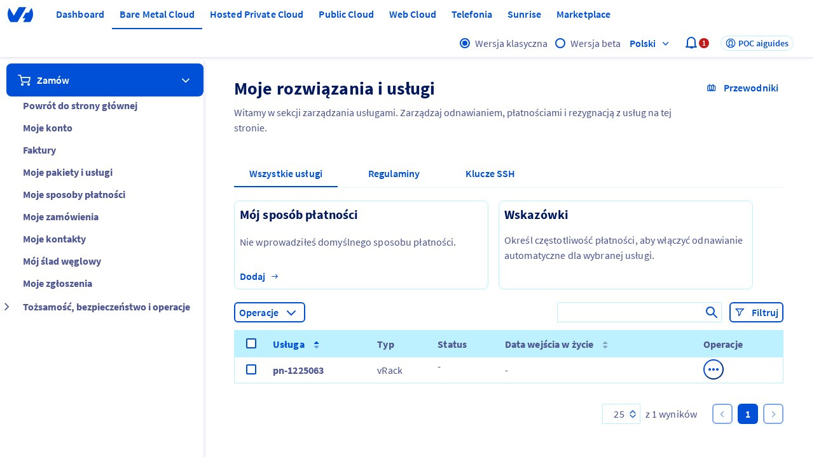
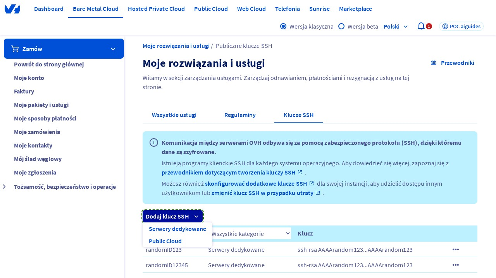
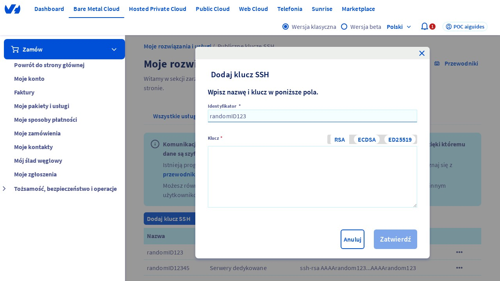
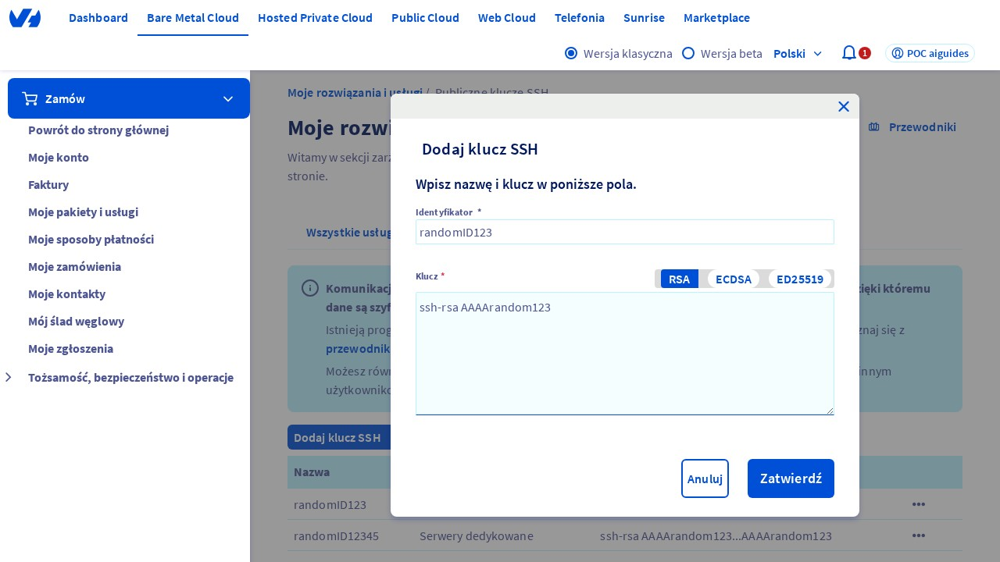

## Wprowadzenie
Ten przewodnik pomoże Ci dodać klucz SSH w panelu sterowania OVHcloud. Klucze SSH są używane do uwierzytelniania i szyfrowania połączeń z serwerami zdalnymi[1](#footnote-1). Przed rozpoczęciem upewnij się, że masz dostęp do panelu sterowania OVHcloud.

<iframe class="video" src="https://embed.api.video/vod/vi3cCGqKVQdvA6rgepyKIeyC" width="100%" height="100%" frameborder="0" scrolling="no" allowfullscreen="true"></iframe>

## Krok 1: Otwórz stronę "Moje oferty i usługi"
Aby dodać klucz SSH, musisz najpierw znaleźć się na stronie "Moje oferty i usługi" w panelu sterowania OVHcloud. Strona ta jest dostępna pod adresem [https://www.ovh.com/manager/#/billing/autorenew/](https://www.ovh.com/manager/#/billing/autorenew/). Upewnij się, że jesteś zalogowany na swoje konto OVHcloud.

{.thumbnail}

## Krok 2: Kliknij na zakładkę "Klucz SSH"
Po otwarciu strony "Moje oferty i usługi", kliknij na zakładkę "Klucz SSH". Ta zakładka umożliwia zarządzanie kluczami SSH dla Twoich serwerów.

{.thumbnail}

## Krok 3: Kliknij na przycisk "Dodaj klucz SSH"
W zakładce "Klucz SSH", kliknij na przycisk "Dodaj klucz SSH". Spowoduje to wyświetlenie rozwijanego menu, w którym musisz wybrać opcję "Dedicated".

{.thumbnail}

## Krok 4: Weryfikacja wyświetlenia okna modalnego
Po kliknięciu na przycisk "Dodaj klucz SSH" i wybraniu opcji "Dedicated", okno modalne "Dodaj klucz SSH" powinno zostać wyświetlone. To okno umożliwia wprowadzenie danych nowego klucza SSH.

## Krok 5: Wprowadź identyfikator klucza
W oknie modalnym "Dodaj klucz SSH", wprowadź wartość w polu "ID" (lub "Identifikator"). Dla tego przewodnika, możesz wprowadzić losowy identyfikator.

{.thumbnail}

## Krok 6: Wprowadź klucz SSH
W tym samym oknie, wprowadź wartość w polu "Klucz" w formacie "ssh-rsa AAAArandom123" (np. dla tego przewodnika).

{.thumbnail}

## Krok 7: Potwierdź dodanie klucza
Na koniec, kliknij na przycisk "Potwierdź", aby dodać nowy klucz SSH. Upewnij się, że wszystkie dane zostały wprowadzone poprawnie.

{.thumbnail}

## Podsumowanie
Pomyślne dodanie klucza SSH w panelu sterowania OVHcloud umożliwia bezpieczne połączenia z serwerami zdalnymi. Upewnij się, że przechowujesz klucze SSH w bezpiecznym miejscu, aby uniknąć nieautoryzowanego dostępu.

### Footnotes
[1](#footnote-1): *Serwer zdalny* to komputer lub urządzenie, do którego dostęp uzyskuje się przez sieć, często za pomocą protokołu SSH (Secure Shell)[2](#footnote-2).

[2](#footnote-2): *Protokół SSH* (Secure Shell) to zestaw reguł i procedur umożliwiających bezpieczne połączenia między komputerami przez sieć, zapewniając szyfrowanie danych i uwierzytelnianie użytkowników.