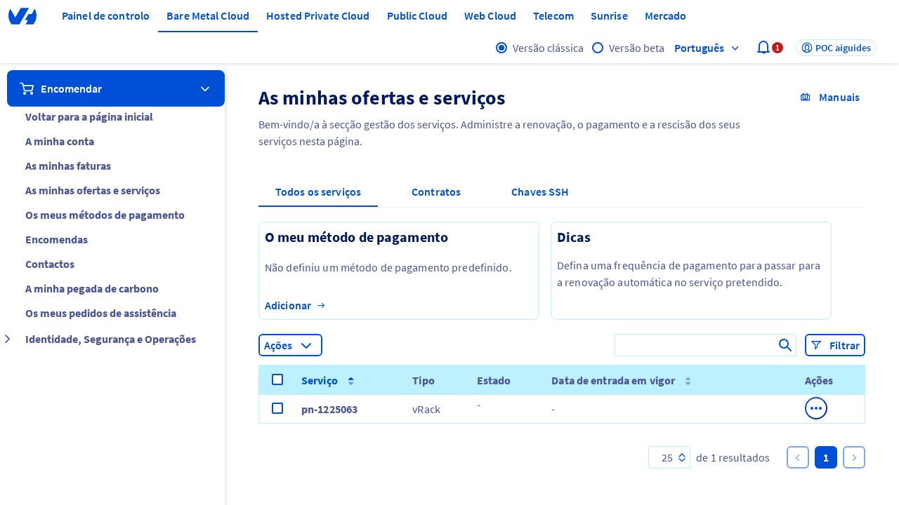
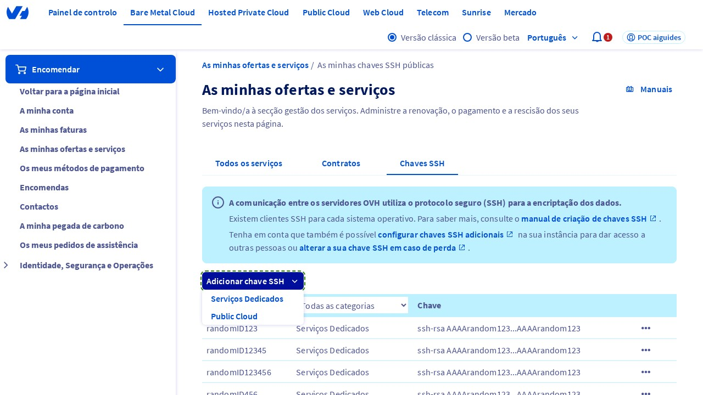
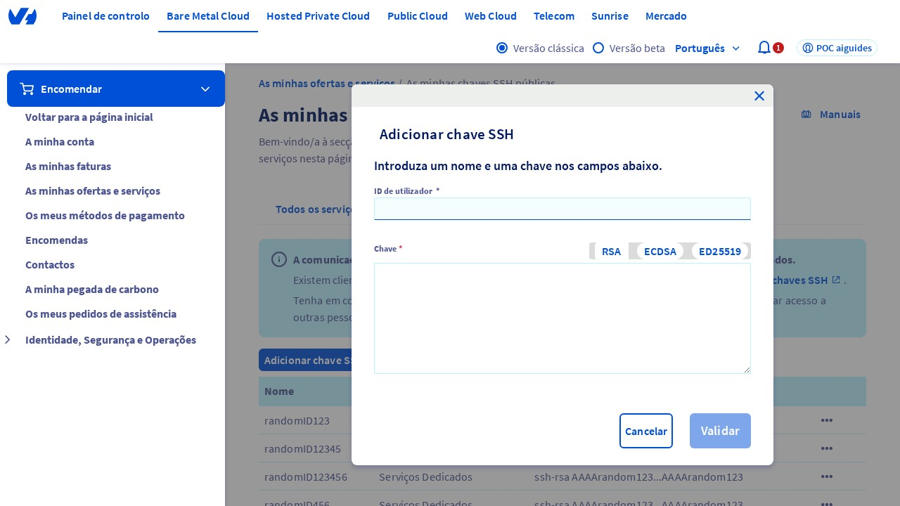
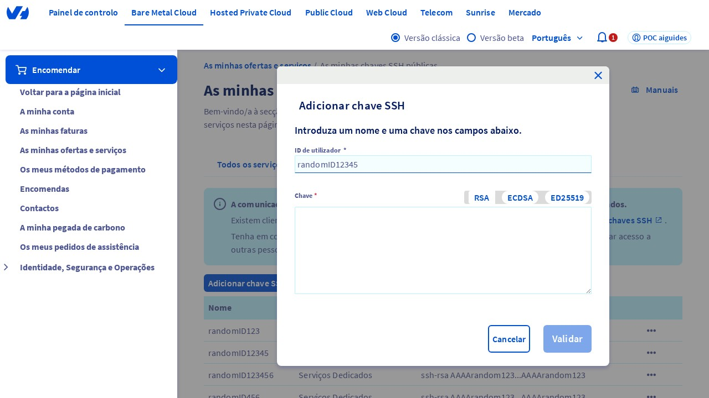
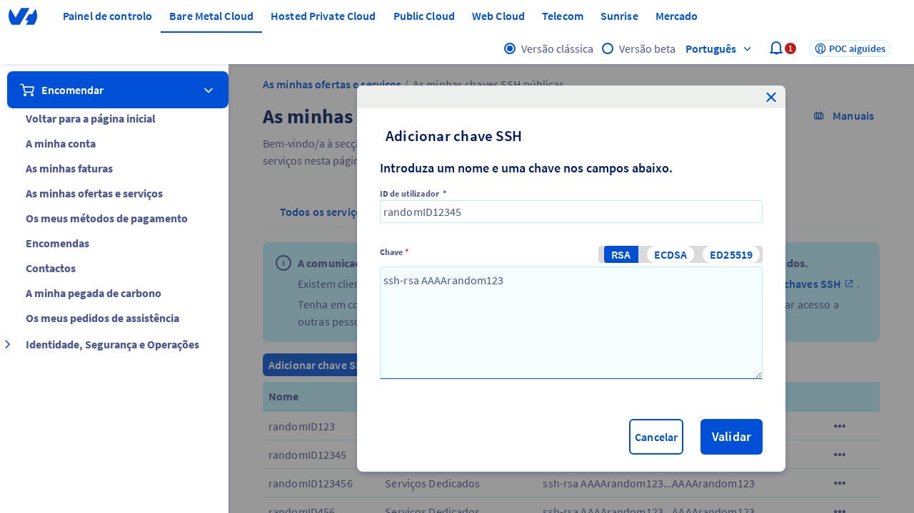

## Introdução
Bem-vindo ao guia de como adicionar uma chave SSH no Painel de Controle da OVHcloud. Este guia irá ajudá-lo a adicionar uma chave SSH, permitindo que você acesse seus servidores de forma segura. Antes de começar, certifique-se de que você tem acesso ao Painel de Controle da OVHcloud e que você está na página correta.

<video controls="controls" width="100%">
    <source src="https://vod.api.video/vod/vi2TXiNh22tnvE4roXKSTDdM/mp4/source.mp4" type="video/mp4"/>
</video>

## Passo 1: Acessar a página "Minhas ofertas e serviços"
Para começar, você precisa acessar a página "Minhas ofertas e serviços" dentro do Painel de Controle da OVHcloud. Você pode fazer isso acessando a URL [https://www.ovh.com/manager/#/billing/autorenew/](https://www.ovh.com/manager/#/billing/autorenew/). Certifique-se de que você está na página correta, pois isso é fundamental para os próximos passos.

{.thumbnail}

## Passo 2: Clicar na aba "SSH key"
Agora que você está na página "Minhas ofertas e serviços", clique na aba "SSH key" localizada na parte superior da página. Isso irá exibir as configurações de chave SSH.

{.thumbnail}

## Passo 3: Clicar no botão "Adicionar uma chave SSH"
Clique no botão "Adicionar uma chave SSH", que irá exibir um menu suspenso. Dentro do menu suspenso, clique na opção "Dedicada" *¹*. Isso irá permitir que você adicione uma nova chave SSH.

{.thumbnail}

## Passo 4: Verificar a janela modal "Adicionar uma chave SSH"
Agora, você deve ver a janela modal "Adicionar uma chave SSH" exibida na tela. Certifique-se de que a janela modal esteja visível e pronta para uso.

## Passo 5: Preencher o campo "ID" (ou "Identificador")
No campo "ID" (ou "Identificador"), digite um valor único para identificar a sua chave SSH. Por exemplo, você pode digitar um nome aleatório para a chave.

{.thumbnail}

## Passo 6: Preencher o campo "Key"
No campo "Key", digite a chave SSH no formato correto, que é "ssh-rsa AAAArandom123" *²*. Certifique-se de que a chave esteja no formato correto para evitar erros.

{.thumbnail}

## Passo 7: Clicar no botão "Confirmar"
Finalmente, clique no botão "Confirmar" para adicionar a nova chave SSH. Isso irá salvar a chave SSH e permitir que você acesse seus servidores de forma segura.

{.thumbnail}

*¹* Dedicada: refere-se a um servidor dedicado, que é um tipo de servidor que é exclusivo para um único cliente.
*²* ssh-rsa: é um tipo de algoritmo de criptografia utilizado para autenticar usuários em servidores SSH.

## Conclusão
Parabéns! Você adicionou com sucesso uma chave SSH no Painel de Controle da OVHcloud. Agora, você pode acessar seus servidores de forma segura utilizando a chave SSH. Se você tiver alguma dúvida ou precisar de ajuda adicional, não hesite em contatar o suporte da OVHcloud.