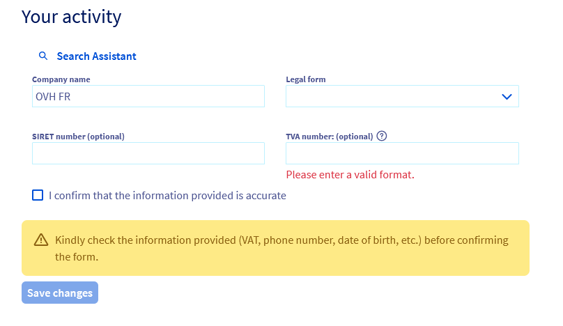
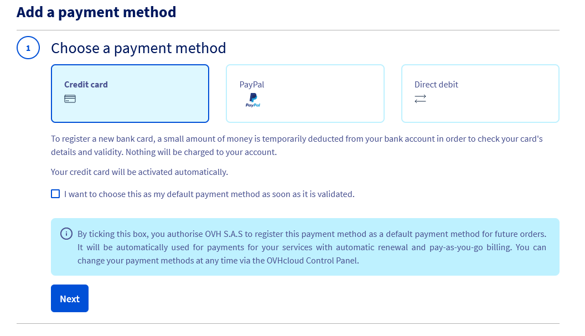

## Objective

OVHcloud's Startup Program offers numerous benefits to support startups in their growth. 

**To maximize your chances of acceptance, follow these steps to prepare and complete your application.**

## Requirements

- An [OVHcloud account](/pages/account_and_service_management/account_information/ovhcloud-account-creation)
- Access to the [OVHcloud Control Panel](/links/manager)

## Instructions

### Step 1 - Update your OVHcloud account

Ensure your OVHcloud account is correctly configured before submitting your application.

Select `Company` as legal form and complete the required information:
Provide the SIRET (only for accounts in France), VAT number, company address, and the personal information of the account holder. Use a professional email address associated with your company domain. Please also enter a backup email address (preferably a personal email address).

{.thumbnail}

Refer to this guide for more information: [Securing my OVHcloud account and managing my personal information](/pages/account_and_service_management/account_information/all_about_username).

### Step 2 - Add a valid payment method

A valid payment method is required to ensure the continuity of your services. It will be used for non-eligible products during your participation in the program and for all products after the program ends.

Refer to this guide for more information: [Managing payment methods](/pages/account_and_service_management/managing_billing_payments_and_services/manage-payment-methods).

{.thumbnail}

### Step 3 - Carefully complete the Startup Program application form

To allow us to effectively review your application, complete the form with accuracy and detail.

**Essential information to provide:**

- Company name
- Website
- Social media (Twitter, LinkedIn)
- Description of your project and business model
- Server infrastructure needs
- Stage of development of your project

**Precision and completeness:** Any missing or incorrect information could result in your application being rejected or delays if updates are required.

### Processing time

Applications are reviewed within 7 days. To expedite the process, ensure all required information is provided during the initial submission.

By following these steps, you will significantly increase your chances of being accepted into OVHcloud’s Startup Program.