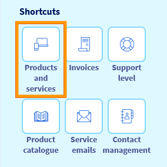
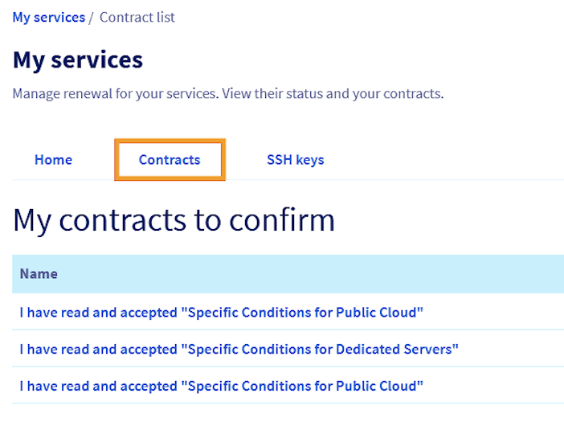
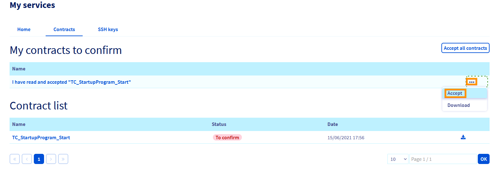

## Objectif

Pour participer au Startup Program d'OVHcloud, la signature du contrat est une étape indispensable. Une fois votre candidature acceptée, vous recevrez un email contenant un lien direct pour signer le contrat. Il est également possible de retrouver le contrat dans votre espace client OVHcloud. Ce guide vous explique comment accéder à ce contrat et le signer pour que vos crédits soient activés rapidement

## Prérequis

- Votre candidature au Startup Program doit avoir été validée. Retrouvez plus d'informations dans notre guide « [Comment optimiser votre candidature au Startup Program](pages/account_and_service_management/startup-program/01-optimise-application) »
- Être connecté à votre [espace client OVHcloud](/links/manager)

## En pratique

### Signer le contrat via l’e-mail

Vérifiez votre boîte de réception : après l'acceptation de votre candidature au Startup Program, un e-mail sera envoyé à l'adresse liée à votre compte OVHcloud. Cet e-mail contient un lien direct pour signer le contrat. Cliquez sur le lien et suivez les instructions pour finaliser la signature.

### Signer le contrat via l’espace client OVHcloud

Si vous ne trouvez pas l'e-mail, vous pouvez accéder au contrat directement dans votre [espace client](/links/maager) :

Assurez-vous de vous connecter avec le compte que vous avez utilisé pour l’inscription au Startup Program. Depuis la page d’accueil, cliquez sur votre nom en haut à droite puis cliquez sur `Mes offres & services`{.action}.

{.thumbnail}

Sélectionnez l’onglet `Contrats`{.action}.

{.thumbnail}

Recherchez votre contrat Startup Program dans la section `Mes contrats à signer`.

Cliquez sur e bouton `...`{.action} à droite du contrat pour le télécharger et en prendre connaissance. 
Cliquez à nouveau sur le bouton `...`{.action} et sélectionnez `Accepter` pour valider l'acceptation du contrat.

{.thumbnail}

Après la signature, vos crédits seront crédités sur votre compte sous 48 heures ouvrées et vous pourrez profiter pleinement des avantages du programme.

Votre contrat signé restera disponible dans l’onglet `Contrats`{.action} de votre espace client pour être consulté à tout moment.
