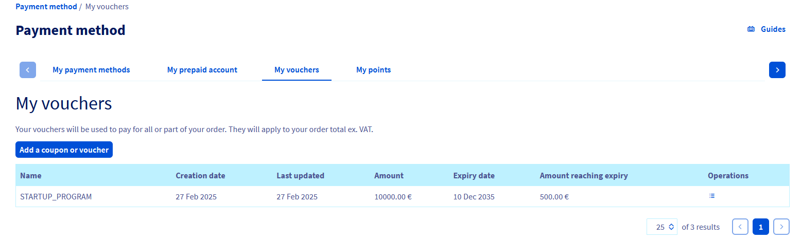

## Objective

As a member of the OVHcloud Startup Program, you receive free credits to support the growth of your infrastructure. These credits are automatically activated within 48 business hours after signing your contract. It is important to regularly check your credit balance and usage history to better manage your resources. 

**This guide explains how to verify the amount of credits allocated, the remaining balance, and how to access the consumption history in your OVHcloud Control Panel.**

## Requirements

- Your Startup Program application must have been validated, and your contract signed. Find more information in our guides:
    - [How to optimise your application to the Startup Program](pages/account_and_service_management/startup-program/01-optimise-application)
    - [How to sign your Startup Program contrac](/pages/account_and_service_management/startup-program/02-sign-agreement)
- Access to the [OVHcloud Control Panel](/links/manager).

## Key points

- **Credit activation**: Credits are automatically activated within 48 business hours after signing the Startup Program contract.
- **Validity period**: Credits are valid for 12 months from the contract’s signature date and are automatically removed at the end of this period.
- **Valid payment method**: A valid payment method must be linked to your account to ensure continuity of services after the credits expire or for services not eligible for the free credits.
- **Billing after expiration**: After the credits are removed, services will be charged via the default payment method linked to your account.

## Instructions

1. Log in to the [OVHcloud Control Panel](/links/manager).

2. From the homepage, click on your name in the top right corner and then click on `My offers and services`{.action}.

    {.thumbnail}

3. In the left-hand menu, click on `My Payment Methods`{.action}.

4. On the payment methods page, select the `My Vouchers`{.action} tab. Here, you will see the total amount of allocated credits, the expiration date, remaining credits, and the consumption history.

    {.thumbnail}

## Conclusion

Managing and monitoring your credit usage within the OVHcloud Startup Program is crucial to optimizing your resources. Through your OVHcloud Control Panel, you can easily check your balance and consumption history. Remember that your credits are valid for 12 months after signing the contract, and a valid payment method must be linked to your account to ensure service continuity after the credits expire. Follow these steps to maximize the benefits and ensure smooth management of your services after the program ends.