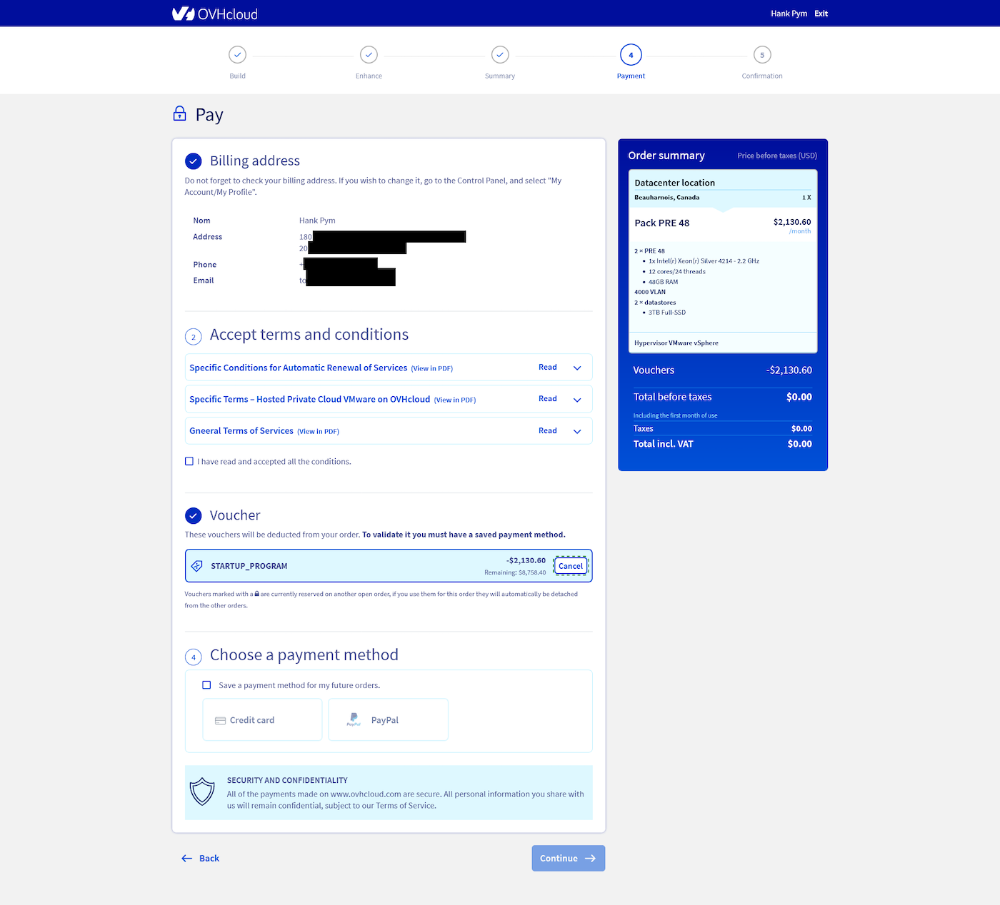

## Objective

As a member of the OVHcloud Startup Program, you have credits to support your projects and cover your infrastructure expenses. It is essential to understand how these credits can be used to pay your bills, whether for renewing existing services or placing new orders.

**This guide explains how to use your credits optimally during orders or renewals, depending on the type of service.**

## Requirements

- Your Startup Program application must have been validated, and your contract signed. Find more information in our guides:
    - [How to optimise your application to the Startup Program](pages/account_and_service_management/startup-program/01-optimise-application)
    - [How to sign your Startup Program contrac](/pages/account_and_service_management/startup-program/02-sign-agreement)
- Access to the [OVHcloud Control Panel](/links/manager)
- Knowledge of the [balance of your Startup Program credits](/pages/account_and_service_management/startup-program/04-view-credits)

## Key Points

- **Automatic renewal**: For eligible services, your credits are automatically used to renew your services, without requiring any action from you.
- **New orders**:
    - For eligible Public Cloud services, credits will be automatically applied during the next billing cycle.
    - For other eligible products, you must select "Digital Launchpad Credits" as the payment method during the ordering process.

## Instructions

### Service renewal

Startup Program credits are automatically applied during the renewal of eligible services. No action is required; the credits will be deducted automatically from your bill during renewal.

### Placing a new order

Depending on the type of service you want to order, here's how to use your credits:

#### For eligible Public Cloud services

1. Place your order normally: Select the Public Cloud services you need and proceed with the order.
2. Credits applied automatically: During the next billing cycle for these services, your Startup Program credits will automatically cover the costs.

#### For other eligible products

1. Place your order: Select the eligible services you want to purchase.
1. Select the payment method:
    1. At the end of the order, when prompted to choose a payment method, go to the `Voucher`{.action} section.
    1. Select the `STARTUP_PROGRAM` voucher by clicking `Apply`{.action}.
    1. Add or select a payment method to cover the cost of non-eligible products using the voucher.
1. Proceed to payment: Click `Pay`{.action} to finalize the order using your credits.

{.thumbnail width="800"}

> [!success]
> 💡 Need to know which products are eligible? Find the complete list [here](/pages/account_and_service_management/startup-program/06-available-products).

## Conclusion

Using your OVHcloud Startup Program credits to pay your bills is simple, whether for service renewals or new orders. Eligible services for renewal are automatically covered by your credits, while for new orders, you must select the credits at the payment stage. By following these steps, you can optimize your credit usage and reduce your infrastructure costs with minimal effort.