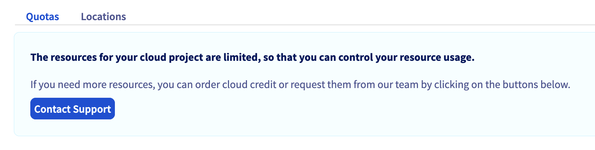
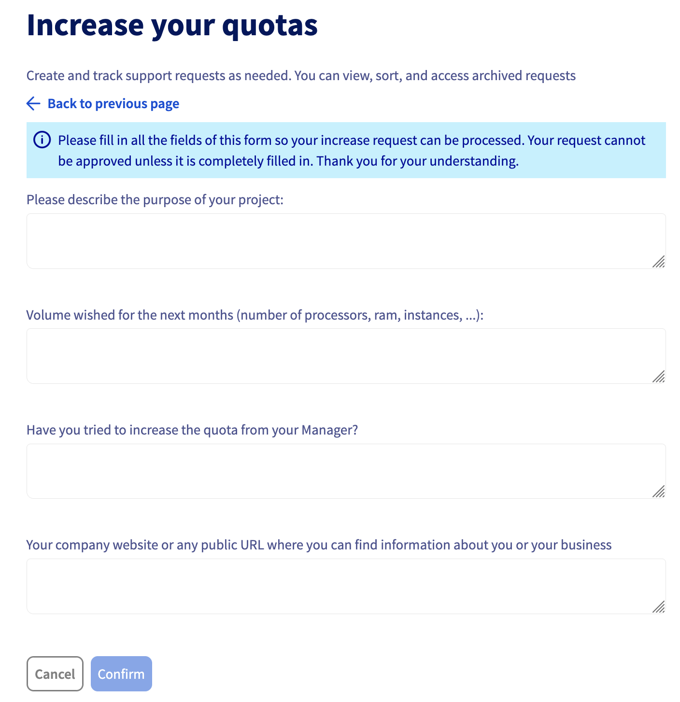

## Objective

This guide explains the steps to request a quota increase on your cloud account when using our services. If you are part of the Startup Program, it is important to consider certain limitations, especially regarding the use of credits provided by the program when increasing your quota.

## Key Points

- **Startup credits usage**: It is not possible to request a quota increase using credits provided by the Startup Program. If you still wish to increase the quota, you must follow the steps outlined below.
- **Personal Payment**: f you are a Startup Program member and choose to pay with your own funds to increase your quota, the amount paid can be credited (upon request) to your customer account as Cloud credit. This credit will be used first for future payments, before your Startup Program credits.
- **Preparation**: Before requesting a quota increase, you must add a valid payment method to your customer account and ensure that your account is registered as a company.

## Requirements

- You are a member of the [Startup Program](/links/transversal/startup-program)
- Your OVHcloud account has a valid payment method. Refer to [this guide](/pages/account_and_service_management/managing_billing_payments_and_services/manage-payment-methods) to add a valid payment method.
- Your account is registered under the `Company` status. Refer to [this guide](/pages/account_and_service_management/account_information/all_about_username) to update your information.
- Access to the [OVHcloud Control Panel](/links/manager)

## Instructions

This procedure allows you to manually request a quota increase and validate it via an initial payment (Public Cloud credit).

### Step 1 - Create a support ticket to request a quota increase

After fulfilling the prerequisites above, create a support ticket by following these steps:

Log in to your [OVHcloud Control Panel](/links/manager), navigate to the `Public Cloud`{.action} section, and select your Public Cloud project.

In the `Project Management` section, click on `Quota & Regions`{.action}. Click on `Contact Support`{.action}.

{.thumbnail}

Justify your quota increase request by specifying your participation in the OVHcloud Startup Program, stating your technical needs, and providing the name of your Startup Program Manager responsible for overseeing your participation (consult the list of Startup Program Managers [here](links/transversal/startup-program-faq-managers)).

{.thumbnail}

### Step 2 - Contact your Startup Program Manager

After submitting your quota increase request, it is recommended to contact your regional Startup Program Manager to ensure your ticket is tracked and to receive prompt assistance.

Consult the list of Startup Program Managers [here](links/transversal/startup-program-faq-managers).

## Conclusion

Requesting a quota increase may be necessary to adapt your cloud resources to your growing needs. However, it is important to understand the payment terms and credit priority to avoid unexpected charges from your own funds. If in doubt, don't hesitate to reach out to your Startup Program Manager for guidance through every step of the process.