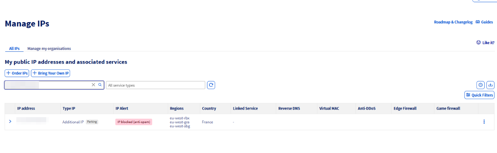
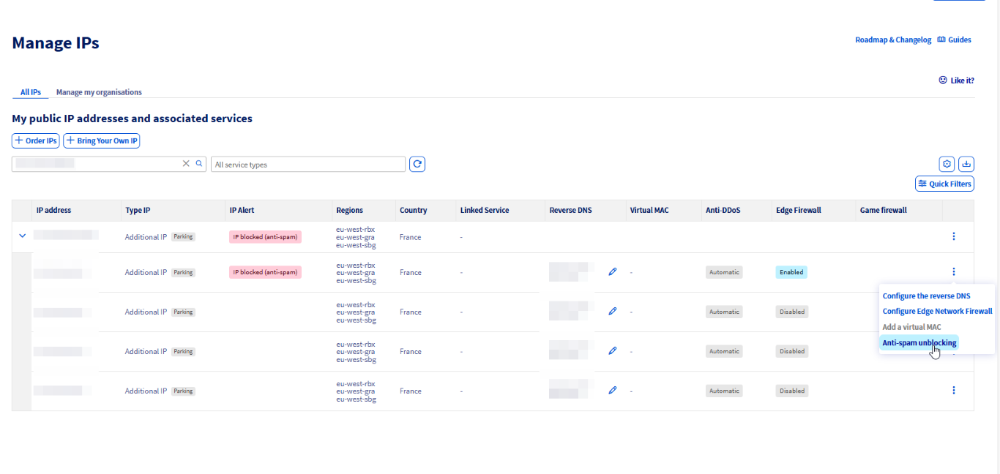
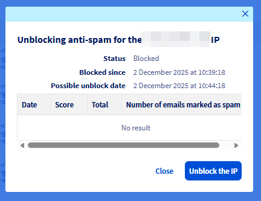

## Wprowadzenie

Dla każdej IP dostępnej z OVHcloud produkty i usługi, jako dostawca usług internetowych, zarejestrujemy i zarezerwujemy ją z organizacjami takimi jak [RIPE](https://www.ripe.net/) lub [ARIN](https://www.arin.net/). Oznacza to, że pojawiamy się jako kontakt do nadużyć IP w bazie danych WHOIS.

Jeśli IP zostanie zgłoszona do organizacji takich jak Spamhaus i SpamCop, które działają przeciw SPAMowi, złośliwym witrynom i phishingowi, to reputacja całej sieci OVHcloud jest zagrożona.

Dlatego ważne jest, aby OVHcloud dbał o reputację, jakość i bezpieczeństwo sieci, co stanowi również ważną część Twojej usługi.

### Jak działa system ochrony?

Nasz system opiera się na technologii antyspamowej Vade Secure.

Gdy IP zostanie "zablokowana z powodu SPAMU", zostanie wysłana wiadomość e-mail do Twojego konta zawierająca informacje jak poniżej:

> 
> Drogi Kliencie,
>
> Ochrona Anty-spamowa wykryła dużą wysyłkę spamu z jednego z adresów IP:
122.122.122.122
>
> Aby zapewnić bezpieczeństwo naszej sieci, ruch wychodzący z Twojego serwera na port 25 został zawieszony.
> Poniżej znajduje się próbka zablokowanych e-maili, aby móc przeprowadzić weryfikację:
>
> Destination IP: 188.95.235.33 - Wiadomość-ID: d24aa492-5f37-457f-9595-23ddc9e0f714@xxxxxxxxxxxxx.xx.local - Spam score 300 <br>
> Destination IP: 188.95.235.33 - Wiadomość-ID: fc090jdhf934iu09bf084bfo92@xxxxxxxxxxxxx.com - Spam score 300<br>
> Destination IP: 188.95.235.33 - Wiadomość-ID: P0hbfo93407684bfoqljrlqvpLatS3RRB9rZw7e8s@xxxxxxxxxxxx.online - Spam score 300<br>
> Destination IP: 188.95.235.33 - Wiadomość-ID: 6ZUnls843bnf0934StxFasYGmhtDJRo@xxxxxxxxxxxx.online - Spam score 300<br>
> Destination IP: 188.95.235.33 - Wiadomość-ID: zcb.3z54da3kdfkl45802n0c0q98rqcc57e3b8aadfac63b2c408e3f5f9a27.1d44jkgnddfef.166489320375@xxxxxx.xxxx.net - Spam score 300<br>
> Destination IP: 188.95.235.33 - Wiadomość-ID: zcb.3z54da33hn98v9bcq-nrf3r67cc57e3b8aadfac63b2c408e3f5f9a27.1d44jd9340252.1655508652095@xxxxxx.xxxx.net - Spam score 300
> <br>
> <br>

## Wymagania początkowe

**Co zrobić po otrzymaniu alertu e-mail?**

Proces ten obejmuje identyfikację problemu, jego rozwiązanie, a następnie odblokowanie adresu IP.

### Zidentyfikuj i rozwiąż problem

**Przed odblokowaniem adresu IP upewnij się, że podjął następujące kroki:**

- Zatrzymaj wysyłkę e-maili (na przykład: zatrzymać wszystkie programy poczty elektronicznej, takie jak qmail, Postfix, Sendmail itp.).
- Sprawdź kolejkę wiadomości e-mail (np. qmHandle dla qmail, postqueue -p dla Postfix) i wyczyść.
- Analizuj logi za pomocą **Message-ID** w alercie blokady.
- Jeśli wysyłasz SPAM lub nieprawidłowe wiadomości e-mail, rekomendujemy rozwiązanie problemu **przed** odblokowaniem adresu IP. Proszę zapoznać się z tym przewodnikiem, aby uzyskać [najlepsze praktyki (EN)](/pages/bare_metal_cloud/dedicated_servers/antispam_best_practices#bestpractices) w zakresie poczty elektronicznej

Po rozwiązaniu problemu możesz odblokować Destination IP wykonując następujące kroki.

> [!alert]
> 
> W żadnym przypadku nie odblokuj adresu IP, zanim nie zawiesisz wysyłki e-maili z Twojego serwera i nie odblokuj kolejki wiadomości. W przeciwnym razie po raz drugi zostanie zablokowany na dłuższy czas. 
>

### Odblokuj swoje IP

#### Odblokowanie IP z Panelu klienta OVHcloud

Zaloguj się do [Panelu klienta OVHcloud](/links/manager), kliknij `Sieć`{.action} w menu po lewej stronie ekranu, a następnie `Publiczne adresy IP`{.action}.

Możesz użyć menu rozwijanego pod **Moje publiczne adresy IP i usługi powiązane**, aby filtrować swoje usługi według kategorii, lub bezpośrednio wpisać żądany adres IP w pasku wyszukiwania.

Jeśli masz alert dotyczący któregoś z Twoich IP, pojawi się czerwony status w kolumnie **Alert IP**.

{.thumbnail}

Kliknij przycisk `⁝`{.action} obok odpowiedniego IP/usługi i wybierz `Odblokowanie (anti-spam)`{.action}.

{.thumbnail}

W oknie, które się pojawi, kliknij `Odblokuj IP`{.action} na dole i potwierdź.

{.thumbnail}

IP jest w trakcie odblokowania, operacja może zająć kilka minut.

Po zakończeniu, Twoje IP zostanie odblokowane.

#### Odblokowanie IP z API OVHcloud

Zaloguj się do [interfejsu API OVHcloud](/links/api) zgodnie z [odpowiednim przewodnikiem](/pages/manage_and_operate/api/first-steps) i wykonaj poniższe kroki.

Najpierw pobierz listę IP dla każdego z usług OVHcloud (Serwer Dedykowany/Hosted Private Cloud/VPS/Public Cloud):

> [!api]
>
> @api {v1} /ip GET /ip
>

**type**: Wprowadź typ IP (Dedicated, PCC, VPS, vRack, PCI, itp.)

Oto przykład tego, co powinieneś zobaczyć:

```bash
"2001:41d0:67:d200::/56",
"2001:41d0:68:a00::/56",
"2001:41d0:68:f000::/56",
"2001:41d0:117:db00::/56",
"122.122.122.121/28",
"145.56.222.96/28",
"188.81.49.30/28",
```

Następnie wyszukaj IP w konkretnym stanie za pomocą poniższego wywołania. Jeśli już wiesz, który IP jest zablokowany, możesz przejść do [następnego kroku](#unblockip):

> [!api]
>
> @api {v1} /ip GET /ip/{ip}/spam
>

**ip**: Wprowadź blok IP pobrany w poprzednim kroku z maską sieciową. Na przykład 122.122.122.121/28.<br>
**state**: Wprowadź stan, którego szukasz.

Oto przykład wyniku (w tym przypadku wybrano blok 122.122.122.121/28):

```bash
"122.122.122.122" 
```

Jeśli IP jest zablokowane, możesz uzyskać informacje o blokowaniu za pomocą poniższego wywołania. W przeciwnym razie przejdź do [następnego kroku](#unblockip).

> [!api]
>
> @api {v1} /ip GET /ip/{ip}/spam/{ipSpamming}
>

**ip**: Wprowadź blok IP pobrany w poprzednim kroku z maską sieciową.<br>
**ipSpamming**: Wprowadź wcześniej pobrany IP w stanie "blockedForSpam", na przykład.

Oto przykład wyniku (w tym przypadku wybrano blok 122.122.122.121/28 i IP 122.122.122.122):

```bash
time: 3600,
date: "2022-08-29T17:42:50+01:00",
ipSpamming: "122.122.122.122",
state: "blockedForSpam" 
```

Więc:

```bash
- IP jest zablokowane na 1 godzinę (lub 3600 sekund).
- Zostało zablokowane 29/08/2022 o 17:42.
- Jego obecny stan to zablokowany.
```

Jeśli chcesz uzyskać statystyki dotyczące tego, co zostało wykryte, użyj poniższego wywołania API, w przeciwnym razie przejdź do [następnego kroku](#unblockip).

> [!api]
>
> @api {v1} /ip GET /ip/{ip}/spam/{ipSpamming}/stats
>

**ip**: Wprowadź blok IP pobrany w poprzednim kroku z maską sieciową.<br>
**ipSpamming**: Wprowadź wcześniej pobrany IP w stanie "blockedForSpam", na przykład.<br>
**from i to**: Użyj formatu daty użytego w poprzedniej funkcji (YYYY-MM-DDTHH:MM+01:SS).

Oto przykład wyniku:

```bash
{
"messageId": "2PXQSX-3JRAUU-SF@obfuscated.com",
"destinationIp": "188.95.235.33",
"date": 1385640992,
"spamscore": 410
}
```

##### **Odblokowanie IP** <a name="unblockip"></a>

> [!alert]
> WAŻNE!
> Nie odblokowuj IP w żadnym wypadku bez zatrzymania wysyłania e-maili z Twojego serwera, w przeciwnym razie zostaniesz natychmiast zablokowany ponownie (i na dłuższy czas). 
>

Aby odblokować swoje IP, użyj poniższego wywołania:

> [!api]
>
> @api {v1} /ip POST /ip/{ip}/spam/{ipSpamming}/unblock
>

**ip**: Wprowadź blok IP pobrany w poprzednim kroku z maską sieciową.<br>
**ipSpamming** : Wprowadź wcześniej pobrany IP w stanie "blockedForSpam".

Oto przykład wyniku:

```bash
"message": "Ten adres IP jest nadal zablokowany przez 129 sekund"
```

Po więcej niż 129 sekundach:

```bash
time: 3600,
date: "2022-08-29T17:42:50+01:00",
ipSpamming: "122.122.122.122",
state: "unblocking" 
```

IP jest w trakcie odblokowania, operacja może zająć kilka minut.

### W przypadku fałszywych pozytywów

W niektórych przypadkach alert antyspamowy może być fałszywym pozytywem. Jeśli sprawdziłeś i stwierdziłeś, że **Message-ID** pochodzi z legalnej wiadomości e-mail, musisz upewnić się, że Twoje e-maile są zgodne z [RFC](#rfc) i [Najlepsze praktyki](#bestpractices) wskazane poniżej.

#### RFC <a name="rfc"></a>

RFC (Request For Comments) to dokumenty przeznaczone do opisania technicznych aspektów Internetu. Są tworzone i publikowane przez IETF (Internet Engineering Task Force), grupę, która w zasadzie tworzy i definiuje standardy.
Aby uzyskać więcej informacji, zobacz: [RFC](https://en.wikipedia.org/wiki/Request_for_Comments), [IETF](https://www.ietf.org/) i [Internet Draft](https://en.wikipedia.org/wiki/Internet_Draft).

#### Najlepsze praktyki <a name="bestpractices"></a>

Najlepsze praktyki to zalecane metody, które często opierają się na dokumentach RFC i mają na celu doradzenie, jak najlepiej postępować. W tym przypadku oznacza to podstawowe zasady, które należy przestrzegać, aby Twoje e-maile nie były oznaczone jako spam.

**Objętość wysyłania**

Jeśli Twoja objętość wysyłanych e-maili jest bardzo duża, zaleca się:

- zarezerwować blok IP przeznaczony wyłącznie do użycia e-mailowego.
- podać adres 'abuse' na tym bloku, aby otrzymywać skargi.
- skonfigurować [Reverses](/pages/bare_metal_cloud/dedicated_servers/mail_sending_optimization#configure-the-reverse-ip) na wszystkich IP poprawnie.

Ta operacja pozwoli Ci jednocześnie izolować reputację IP i domeny, jeśli wysyłasz e-maile z różnych domen, otrzymywać skargi i tym samym robić to, co konieczne, aby zostać odblokowanym przez różne organizacje. Pozwala to również szybciej zlokalizować problem na formularzu używającym domeny X lub Y, ponieważ e-maile nie są wysyłane z tego samego IP i nie mają tego samego odwrotnego.

**Zawartość e-maili**

- Unikaj używania słów typowych dla spammerów w swoich e-mailach, takich jak "kup" i "ostatnia szansa", unikaj wielkich liter, impersonalnych tematów, wykrzykników i % rabatów.
- Nie zapomnij dodać **linku do wyrejestrowania** dla osób, które nie zażądały otrzymywania Twojego e-maila lub uważają go za nielegalny.
- Zwróć szczególną uwagę, aby Twoje e-maile zawierały adres nadawcy (lub alias), temat i poprawny stosunek tekstu, obrazów i linków w treści wiadomości.
- Stosunek tekstu do obrazu i tekstu do linku powinien być wysoki. Nie przetężaj e-maila hiperłączami i unikaj JavaScriptu.

**FBL (*Feedback Loop*) - Pętla zwrotna**

Ten system umożliwia śledzenie opinii dostarczanych przez niektóre dostawców usług internetowych, bezpośrednio informując Cię, że ich użytkownicy oznaczyli Twoją wiadomość jako nielegalną, a więc została sklasyfikowana jako spam. To pozwoli Ci bezpośrednio komunikować się z tymi ISP w sprawie Twojej reputacji. Do niektórych FBL należą:

- [Yahoo i AOL Postmaster](https://senders.yahooinc.com/contact)
- [SpamCop](https://www.spamcop.net/)
- [Outlook i live.com](https://sendersupport.olc.protection.outlook.com/pm/)

**Uwierzytelnianie**

Niektóre usługi uwierzytelniania pozwalają chronić swoją reputację:

- **Sender-ID**: Technologia uwierzytelniania wiadomości e-mail opracowana przez Microsoft, która weryfikuje autentyczność Twojej nazwy domeny poprzez sprawdzenie adresu IP nadawcy. Ta technologia opiera się na standardzie IETF: [RFC4406](https://datatracker.ietf.org/doc/rfc4406/).
- **SPF**: Sender Policy Framework to standard weryfikacji domeny nadawcy. Bazuje on na [RFC4408](https://datatracker.ietf.org/doc/rfc4408/) i polega na dodaniu pola SPF lub TXT do DNS domeny, zawierającego listę autoryzowanych adresów IP wysyłających wiadomości e-mail z tej domeny.
- **Reverse DNS**: Reverse umożliwia przetłumaczenie Twojego adresu IP na Twoją domenę. Pozwala to znaleźć domenę przypisaną do adresu IP.
- **DKIM**: Ten standard opisano w [RFC4871](https://datatracker.ietf.org/doc/html/rfc4871). AOL i Google (Gmail) działają na tej podstawie. 

Aby uzyskać więcej informacji na temat powyższych usług, zapoznaj się z naszym przewodnikiem dotyczącym [optymalizacji wysyłania wiadomości e-mail](/pages/bare_metal_cloud/dedicated_servers/mail_sending_optimization).

#### Określone typy wysyłania wiadomości e-mail

- **Do serwera Microsoft (Outlook itp.)**

Microsoft stosuje zasadę listy białej. Oznacza to, że początkowo wszystko znajduje się na liście czarnej, a do weryfikacji Twojego serwera e-mail konieczna jest specyficzna procedura. Aby uzyskać więcej informacji, zapoznaj się z [tą sekcją](/pages/bare_metal_cloud/dedicated_servers/mail_sending_optimization#to-a-microsoft-server-outlook-etc) odpowiedniego przewodnika.

- **Do serwera Gmail**

Jeśli Twoi odbiorcy korzystają z Gmaila, dodanie określonych rekordów (np. rekordu DMARC) może zagwarantować, że wiadomości trafią do nich. Oto artykuł Google, który może Ci w tym pomóc: [Dodaj rekord DMARC](https://support.google.com/a/answer/2466563?hl=en).

Google ma również [artykuł poświęcony](https://support.google.com/mail/answer/81126?hl=en) zapobieganiu spamowi dla użytkowników Gmail.

### Zgłaszanie fałszywego pozytywu

Jeśli Twoje wiadomości są zgodne, możesz poinformować nas, wysyłając przykład swojej wiadomości (w tym nagłówek). Nasz zespół wsparcia technicznego pomoże Ci w kolejnych krokach. Utwórz po prostu zgłoszenie wsparcia z poziomu Panelu klienta OVHcloud i dołącz poniższe informacje:

- Adres IP usługi zablokowanej ze względu na SPAM.
- Oryginalna kopia wiadomości(e) oznaczonej jako SPAM (powinieneś być w stanie to zidentyfikować za pomocą **identyfikatora wiadomości** zawartego w wiadomości ANTISPAM). Jeśli nie podano **identyfikatora wiadomości**, po prostu prześlij nam kopię wiadomości wysłanych przed otrzymaniem alertu. Prosimy, dostarczaj tylko kopię wiadomości oznaczonej jako SPAM.
- Plik .EML wiadomości, który powinien zawierać **nagłówek** i **stopkę** wiadomości. Jeśli nie wiesz, jak wyodrębnić plik .EML, zapoznaj się z poniższym przewodnikiem: [Pobieranie nagłówków wiadomości e-mail](/pages/web_cloud/email_and_collaborative_solutions/troubleshooting/diagnostic_headers).

Po wysłaniu informacji nasz zespół wsparcia skontaktuje się z Vade Secure w celu dalszej analizy sprawy.

## Sprawdź również

Dołącz do [grona naszych użytkowników](/links/community).