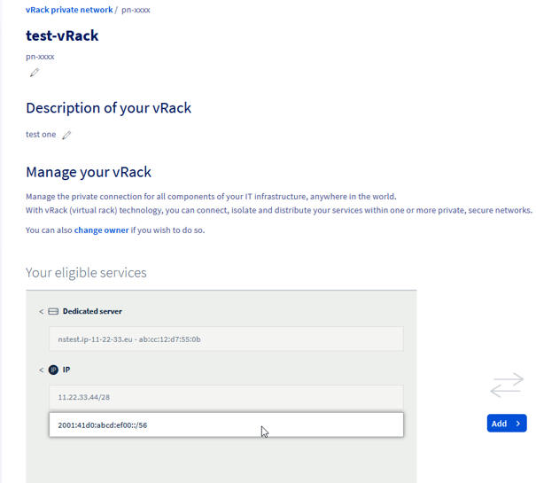

<style>
details>summary {
    color:rgb(33, 153, 232) !important;
    cursor: pointer;
}
details>summary::before {
    content:'\25B6';
    padding-right:1ch;
}
details[open]>summary::before {
    content:'\25BC';
}
</style>

## Objectif

Le réseau vRack est un réseau privé mondial qui relie différents produits OVHcloud et permet la création de solutions réseau sophistiquées. En plus de faciliter les connexions privées, il prend également en charge le routage des adresses IP publiques.

**Ce guide se concentre sur la configuration des blocs d’adresses Additional IPv6 au sein d’un réseau vRack.**


## Introduction

L’IPv6 révolutionne la mise en réseau au sein du vRack d’OVHcloud, en offrant une solution aux limites de l’IPv4, ainsi que des fonctionnalités adaptées à l’Internet moderne. Son déploiement est une réponse directe au besoin d'architectures Internet plus étendues, plus sécurisées et plus sophistiquées. Voici les principaux avantages de l’intégration d’IPv6 au vRack :

- **Flexibilité pour les réseaux avancés** : l’IPv6 augmente considérablement l’espace d’adressage, offrant la flexibilité nécessaire pour faire évoluer l’infrastructure, gérer les scénarios de basculement et prendre en charge des solutions plus importantes. Cela permet aux réseaux de se développer et de s’adapter sans les contraintes d'addressage de l’IPv4.

- **Routage hiérarchique et segmentation** : IPv6 permet un routage hiérarchique efficace et une segmentation de l’infrastructure logique. Cela améliore la gestion et la sécurité du réseau, idéal pour la revente de machines virtuelles avec des sous-réseaux dédiés, ou encore la segmentation de l'infrastructure réseau.

- **Faible latence** : La connectivité IPv6 native de bout en bout peut faciliter la mise en place de services sensibles à la latence, comme le streaming multimédia, car de nombreux réseaux de fournisseurs récents sont construits en IPv6 native. Dans de tels réseaux, l’utilisation de services IPv4 crée une latence (et des coûts) supplémentaires.

En tirant parti de l’IPv6 au sein du vRack, les utilisateurs d’OVHcloud peuvent profiter d’un environnement réseau plus sécurisé, efficace et évolutif, prêt à répondre aux exigences des utilisations modernes d’Internet.

## Prérequis

- Un service [vRack](https://www.ovhcloud.com/fr/network/vrack/){.external} actif sur votre compte
- Un [serveur compatible vRack](https://www.ovhcloud.com/fr/network/vrack/){.external} connecté à votre réseau vRack
- Un accès à [l'espace client OVHcloud](/links/manager)

> [!warning]
> Cette fonctionnalité peut être limitée ou indisponible sur les serveurs de [la gamme **Eco**](https://eco.ovhcloud.com/fr/about/).
>
> Merci de visiter notre [comparatif des serveurs Eco](https://eco.ovhcloud.com/fr/compare/) pour obtenir plus d'informations.

## Instructions

### Obtention d’un nouveau bloc Additional IPv6

Lors de la demande d'un nouveau bloc Additional IPv6, il est important de noter que l'allocation de celui-ci est régionale. Cela signifie que le bloc IPv6 que vous recevez sera lié à une région spécifique, définissant où le trafic public entre dans votre réseau vRack (à savoir, l'emplacement de la passerelle).

/// details | Demander un nouveau bloc Additional IPv6

Vous pouvez commander votre nouveau bloc IPv6 supplémentaire [ici](https://www.ovh.com/manager/#/dedicated/ip/agoraOrder/ipv6?catalogName=ip).

{.thumbnail}

Ensuite, suivez les instructions étape par étape.

Votre Additional IPv6 sera alors disponible sur la page de configuration de votre vRack.

///

### Configurer l’IPv6 dans un vRack (mode simple)

Dans cette section, nous présenterons la configuration IPv6 de base de vos hôtes connectés au vRack.

{.thumbnail}

L'exemple ci-dessus montre deux hôtes avec leurs interfaces côté vRack configurées avec des adresses publiques IPv6. Un hôte possède une configuration manuelle, tandis qu’un autre dispose d'une adresse IP attribuée automatiquement en SLAAC. Toutes les adresses IP appartiennent au premier sous-réseau /64 d'un bloc /56 Additional IPv6 public donné. Les deux utilisent l'interface vRack pour la connectivité IPv6 publique.

/// details | Via l'espace client OVHcloud

Allez dans `Network`{.action} et cliquez sur la section `vRack private network`{.action}. Sélectionnez ensuite le vRack que vous souhaitez gérer :

{.thumbnail}

Sur la gauche, les options possibles (services éligibles à configurer) sont listées.

Sur la droite, vous pouvez voir ce qui est déjà configuré avec votre vRack.

Sélectionnez votre nouvelle Additional IPv6 et ajoutez-la à votre vRack.

{.thumbnail}

Vous avez maintenant votre nouvelle Additional IPv6 ajoutée à votre vRack.

### Configuration IP statique

Une fois que le bloc Additional IPv6 /56 est attribué à un réseau vRack, le premier sous-réseau /64 reste ponté avec lui.

Cela signifie que vous pouvez facilement utiliser de telles IP sur vos hôtes avec une configuration IP statique sur les interfaces vRack (voir la section suivante pour un exemple de configuration côté hôte).

### Configuration IP automatique (SLAAC)

Pour simplifier l'adressage IP à l'intérieur de votre réseau, vous pouvez utiliser SLAAC. Il peut être activé uniquement par sous-réseau ponté, et peut aussi être activé pour le premier sous-réseau /64 de votre bloc (celui-ci est toujours ponté) à tout moment à l'aide de ce bouton curseur :

{.thumbnail}

N'oubliez pas de configurer SLAAC sur votre machine hôte.

///


/// details | Via l'APIv6 (méthode alternative)

Lorsque vous demandez une IPv6 supplémentaire, celle-ci est automatiquement assignée à votre vRack.

Si vous avez supprimé cette nouvelle Additional IPv6 de votre vRack, vous pouvez la réattribuer en utilisant cette méthode POST :

> [!api]
>
> @api {v1} /vrack POST /vrack/{serviceName}/ipv6
>

Comme dans l'exemple ci-dessous:

{.thumbnail}

Utilisez l'appel suivant pour vérifier que l'IPv6 a été attribuée :

> [!api]
>
> @api {v1} /vrack GET /vrack/{serviceName}/ipv6/{ipv6}
>

Comme dans l'exemple ci-dessous:

{.thumbnail}

Maintenant, nous voyons notre bloc configuré avec un vRack. L’étape suivante consiste à configurer le ou les hôtes virtuels.

### Static IP configuration

Once the Additional IPv6 /56 block is attributed to a vRack network, there is still the first /64 subnet that is bridged with it. This means you can easily use such IPs on your hosts.

Let's check exactly which subnet is bridged:

> [!api]
>
> @api {v1} /vrack GET /vrack/{serviceName}/ipv6/{ipv6}/bridgedSubrange
>

As in the example below:

{.thumbnail}

To get more details, use this call:

> [!api]
>
> @api {v1} /vrack GET /vrack/{serviceName}/ipv6/{ipv6}/bridgedSubrange/{bridgedSubrange}
>

As in the example below:

{.thumbnail}

Notice that IP autoconfiguration (SLAAC) is turned off by default.

### Automatic IP configuration (SLAAC)

To simplify IP addressing inside your network, you may want to use SLAAC. It can be enabled per-bridged-subnet only and can be enabled with this PUT method:

> [!api]
>
> @api {v1} /vrack PUT /vrack/{serviceName}/ipv6/{ipv6}/bridgedSubrange/{bridgedSubrange}
>

As in the example below:

{.thumbnail}

Don't forget to configure SLAAC on your host machine.

///

#### Host-side commands

/// details | Static IP configuration

In a basic configuration, you may want to setup an IP address and routing manually. This is also the suggested way when your machine acts as a router (see the [configuring routed subnet](#routedmode) section) and has ipv6.forwarding mode enabled.

First, let's add an IP address on the vrack interface (in our example "eth1"):

```bash
$ sudo ip address add 2001:41d0:abcd:ef00::2/64 dev eth1
```

(Please note that the first IP address in a block, 2001:41d0:abcd:ef00::1/64 is gateway IP address and must not be used for host addressing).

Optionally, if you want to use the vRack interface as the main one for IPv6 traffic, the default route can be configured the following way:

```bash
$ sudo ip -6 route add default via 2001:41d0:abcd:ef00::1/64 dev eth1
```

Finally, bring up the interface (and verify the configured IP on it):

```bash
$ sudo ip link set up dev eth1
$ ip -6 addr list dev eth1
4: eth1: <BROADCAST,MULTICAST,UP,LOWER_UP> mtu 1500 qdisc mq state UP group default qlen 1000
    inet6 2001:41d0:abcd:ef00::2/64 scope global static
```

///

/// details | Automatic IP configuration (SLAAC)

To use automatic configuration, please ensure you have configured your interface as follows:

First, let's allow our host to accept Router Advertisements (for autoconfiguration) on the vRack interface (in our example "eth1"):

``` bash
$ sudo sysctl -w net.ipv6.conf.eth1.accept_ra=1
```

Important to note is that this setting will not work if ipv6.forwarding is enabled in your system. In such case please refer to <a href="#host-side-configuration">[Automatic IP configuration for routed subnet](#host-side) for more details.

Then, simply bring up the interface:

``` bash
$ sudo ip link set up dev eth1
$ ip -6 addr list dev eth1
4: eth1: <BROADCAST,MULTICAST,UP,LOWER_UP> mtu 1500 qdisc mq state UP group default qlen 1000
    inet6 2001:41d0:abcd:ef00:fe34:97ff:feb0:c166/64 scope global dynamic mngtmpaddr
       valid_lft 2322122sec preferred_lft 334922sec
```

After a moment (the configuration must propagate), specific IPv6 address (with the flags <i>global</i> and <i>dynamic</i>) should be visible on the interface.

///

#### Setup verification

/// details | Local

The most basic test is to ping a local IP address on a host:

``` bash
debian@host:~$ ping 2001:41d0:900:2100:fe34:97ff:feb0:c166
PING 2001:41d0:900:2100:fe34:97ff:feb0:c166(2001:41d0:900:2100:fe34:97ff:feb0:c166) 56 data bytes
64 bytes from 2001:41d0:900:2100:fe34:97ff:feb0:c166: icmp_seq=1 ttl=64 time=0.043 ms
64 bytes from 2001:41d0:900:2100:fe34:97ff:feb0:c166: icmp_seq=2 ttl=64 time=0.034 ms
```

///

/// details | Remote

Next, let's verify the connectivity from remote:

``` bash
ubuntu@remote-test:~$ ping 2001:41d0:900:2100:fe34:97ff:feb0:c166
PING 2001:41d0:900:2100:fe34:97ff:feb0:c166(2001:41d0:900:2100:fe34:97ff:feb0:c166) 56 data bytes
64 bytes from 2001:41d0:900:2100:fe34:97ff:feb0:c166: icmp_seq=1 ttl=55 time=7.23 ms
64 bytes from 2001:41d0:900:2100:fe34:97ff:feb0:c166: icmp_seq=2 ttl=55 time=6.90 ms
64 bytes from 2001:41d0:900:2100:fe34:97ff:feb0:c166: icmp_seq=3 ttl=55 time=6.92 ms
```

///

### Configuring an IPv6 in a vRack for routed mode <a name="routedmode"></a>

In this section we will present a more advanced IPv6 setup, where your vRack connected hosts are acting as a routers for hosted Virtual Machines. Such VMs have delegated subnets from the main IPv6 block (presented with an orange color in the schema below).

{.thumbnail}

The traffic path is as follows: Inbound traffic to a given VM (with specified subnet) is routed through the customer's vRack, first to a specified host (with a next-hop address), then using a local link (or vSwitch - black link fd00::/64 on a diagram) to the particular VM.
Traffic coming back from such a VM should use the default route via the first part of the local link (black one, fd00::1), then (possibly default) route from a host to its gateway.

For routed subnet definition any prefix size can be used between /57 and /64.

#### Define routed subnet

/// details | OVHcloud Control Panel actions

After adding Additional IP to your vRack you can manage routed subnet by clicking `Add subnet`{.action} button.

{.thumbnail}

To create a routed subnet, we must first define:

- **subnet in CIDR notation** (size between /57 and /64)
- **next-hop address** (so the host's IPv6 address)

Please note that a given subnet can not overlap with any other subnet defined and next-hop address must belong to the first part (bridged /64 subnet) of your Additional IPv6 prefix.

{.thumbnail}

This created routed subnet `2001:41d0:abcd::ef10::/60` reachable via next hop `2001:41d0:abcd::ef00::2`. 

{.thumbnail}

///

/// details | APIv6 commands

To create a routed subnet, we must first define:

- **subnet in CIDR notation** (size between /57 and /64)
- **next-hop address** (so the host's IPv6 address)

Please note that a given subnet can not overlap with any other subnet defined and next-hop address must belong to the first part (bridged /64 subnet) of your Additional IPv6 prefix.

The example below shows how to define such a subnet:

{.thumbnail}

Here, we defined a routed subnet `2001:41d0:abcd:ef10::/60 `which will be delegated to the VM hosted on: `2001:41d0:abcd:ef00::2`.

///

#### Host-side configuration <a name="host-side"></a>

/// details | Static IP configuration for a host (recommended)

When hosting Virtual Machines, we strongly recommend to use static configuration on your host.

Set up an IPv6 address, bring up the interface and (optionally) add the default route over the vRack interface:

```bash
$ sudo ip addr add 2001:41d0:abcd:ef00::2/64 dev eth1
$ sudo ip link set dev eth1 up
$ sudo ip -6 route add default via 2001:41d0:abcd:ef00::1 dev eth1
```

///

/// details | Automatic IP configuration (SLAAC) for a host

In some cases, you may want to configure your interfaces with SLAAC and IP forwarding together. 

Please note that this brings additional risks (such as losing access not only to the host but also to all VMs) and is not recommended.

Ensuring IPv6 forwarding is enabled:

```bash
$ sudo sysctl -w net.ipv6.conf.all.forwarding=1
```

Configuring Router Advertisements to be accepted (on vRack eth1 interface in our example):

```bash
$ sudo sysctl -w net.ipv6.conf.eth1.accept_ra=2
```

///

/// details | Routed subnet configuration on a host and inside a VM

To ensure that our host knows what to do with packets addressed to the new routed subnet (that will be on a VM), we must add a specific route for it.

In our example this is the veth link with the address fd00::2/64 inside a VM we will use for routing.

Please note that this is very specific to the hypervisor installed (it can be vSwitch or veth interfaces). Please refer to the specific hypervisor networking guide for this setup.

```bash
$ sudo ip -6 route add 2001:41d0:abcd:ef10::/60 via fd00::2
```

///


/// details | Routed subnet configuration inside a VM

Again, please note that the link used between host and VMs is very specific to the hypervisor installed (it can be vSwitch or veth interfaces). Please refer to the specific hypervisor networking guide for this setup.

Add our routed IP block inside a VM to ensure it can accept packets:

```bash
debian@vm-1:~$ sudo ip address add 2001:41d0:abcd:ef10::1/60 dev lo
```

Add the default route on a VM to ensure traffic can get back out of it:

```bash
debian@vm-1:~$ sudo ip -6 route add default via fd00::1
```

///


#### Setup verification

/// details | Local, on a host

Ping from the host into the container (using local link):

```bash
debian@host:~$ ping fd00::2
PING fd00::2(fd00::2) 56 data bytes
64 bytes from fd00::2: icmp_seq=1 ttl=64 time=0.053 ms
64 bytes from fd00::2: icmp_seq=2 ttl=64 time=0.071 ms
```

Ping from the host into the container (using routed subnet):

```bash
debian@host:~$ ping 2001:41d0:abcd:ef10::1
PING 2001:41d0:abcd:ef10::1(2001:41d0:abcd:ef10::1) 56 data bytes
64 bytes from 2001:41d0:abcd:ef10::1: icmp_seq=1 ttl=64 time=0.054 ms
64 bytes from 2001:41d0:abcd:ef10::1: icmp_seq=2 ttl=64 time=0.073 ms
```

Check the route to our /60 subnet on a host:

``` bash
debian@host:~$ ip -6 route get 2001:41d0:abcd:ef10::1
2001:41d0:abcd:ef10::1 from :: via fd00::2 dev veth1a src fd00::1 metric 1024 pref medium
```

///

/// details | Local, on a VM

First, check the routing table:

```bash
debian@vm-1:~$ ip -6 route show
2001:41d0:abcd:ef10::/60 dev lo proto kernel metric 256 pref medium
fd00::/64 dev veth1b proto kernel metric 256 pref medium
default via fd00::1 dev veth1b src 2001:41d0:abcd:ef10::1 metric 1024 pref medium
```

Ping host link local interface:

```bash
debian@vm-1:~$ ping fd00::1
PING fd00::1(fd00::1) 56 data bytes
64 bytes from fd00::1: icmp_seq=1 ttl=64 time=0.051 ms
64 bytes from fd00::1: icmp_seq=2 ttl=64 time=0.070 ms
```

Ping host global interface:

```bash
debian@vm-1:~$ ping 2001:41d0:abcd:ef00::2
PING 2001:41d0:abcd:ef00::2(2001:41d0:abcd:ef00::2) 56 data bytes
64 bytes from 2001:41d0:abcd:ef00::2: icmp_seq=1 ttl=64 time=0.050 ms
64 bytes from 2001:41d0:abcd:ef00::2: icmp_seq=2 ttl=64 time=0.080 ms
```

Finally, let's ping an external IPv6 from a VM:

```bash
debian@vm-1:~$ ping 2001:41d0:242:d300::
PING 2001:41d0:242:d300::(2001:41d0:242:d300::) 56 data bytes
64 bytes from 2001:41d0:242:d300::: icmp_seq=1 ttl=57 time=0.388 ms
64 bytes from 2001:41d0:242:d300::: icmp_seq=2 ttl=57 time=0.417 ms
```

Or, using a domain name:

```bash
debian@vm-1:~$ ping -6 proof.ovh.net
PING proof.ovh.net(2001:41d0:242:d300:: (2001:41d0:242:d300::)) 56 data bytes
64 bytes from 2001:41d0:242:d300:: (2001:41d0:242:d300::): icmp_seq=1 ttl=57 time=0.411 ms
64 bytes from 2001:41d0:242:d300:: (2001:41d0:242:d300::): icmp_seq=2 ttl=57 time=0.415 ms
```

///

/// details | From remote host

Let's check connectivity to our VM from outside the OVHcloud network:

```bash
ubuntu@remote-test:~$ ping 2001:41d0:abcd:ef10::1
PING 2001:41d0:abcd:ef10::1(2001:41d0:abcd:ef10::1) 56 data bytes
64 bytes from 2001:41d0:abcd:ef10::1: icmp_seq=1 ttl=55 time=5.84 ms
64 bytes from 2001:41d0:abcd:ef10::1: icmp_seq=2 ttl=55 time=2.98 ms
```

And traceroute from a remote host (somewhere in the internet):

```bash
ubuntu@remote-test:~$ mtr -rc1 2001:41d0:abcd:ef10::1
Start: 2024-03-26T09:26:45+0000
HOST: remote-test                  				Loss%   Snt   Last   Avg  Best  Wrst StDev
...
...
  9.|-- 2001:41d0:abcd::2:5d        				0.0%     1    1.9   1.9   1.9   1.9   0.0
 10.|-- 2001:41d0:abcd:ef00::2      				0.0%     1    2.2   2.2   2.2   2.2   0.0
 11.|-- 2001:41d0:abcd:ef10::1      				0.0%     1    2.2   2.2   2.2   2.2   0.0
```

In this example: 

- hop 10 - our host's IP address
- hop 11 - our VM's IP address

///

## Multiple region locations vs. global vRack

OVHcloud's vRack technology enables organizations to connect servers across different locations as if they were located within the same data center. 
On the other hand, services like Additional IPv6 are regional, which means their functionality is linked to a particular location. 

Below, an architecture is presented for learning purposes with two different regions and different Additional IPv6 blocks announced from each. Also, there is a host presented with IP addresses from both networks as well as a suboptimal route example - a host in one region addressed with IPv6 address announced in another region:


Please note that in such setups (with Additional IPv6 from more than single region) SLAAC **must be turned off in the whole vRack** (as this may lead to unpredictable results and losing connectivity randomly).

### Benefits

- **Enhanced Connectivity:** By leveraging a vRack network together with public IP blocks routed in multiple locations, businesses can ensure seamless communication around the globe, regardless of backend server's physical locations.
- **Move to cloud:** vRack technology can be a great enabler of early steps toward a "move-to-cloud" organizational strategy, unblocking some legacy applications that still require local network communication.

### Risks and Considerations

- **No SLAAC support in multi-location setups:** When there is more than one location acting in routing public IP traffic (both IPv4 and IPv6) into the same vRack, Stateless Address Autoconfiguration (SLAAC) **should not be used**. As an example of such situation, let's consider existing hosts using IPv4 addresses. Such hosts are becoming reconfigured automatically by SLAAC with IPv6 gateway set up from other region. Together with IPv6 prioritization over IPv4 by some Operating Systems this situation can lead to suboptimal routing or even total loss of connectivity for such hosts.


## Known Limitations

Understanding the constraints of using **Additional IPv6** within the **vRack** environment is crucial for effective network planning. Here are the key limitations to consider:

- **Additional IPv6 goes only with vRack**: Please note that Additional IPv6 addresses can only be configured with vRack-connected backends.
- **SLAAC limitations in multi-location setups**: Stateless Address Autoconfiguration (SLAAC) is not supported when there is public IP traffic (both IPv6 and IPv4) routed into vRack in multiple region locations.
- **Up to 128 hosts inside bridged subnet**: You can use up to 128 IP addresses directly on the vRack.
- **Up to 128 next-hop routes**: You can use up to 128 routes for routed subnets inside a vRack.
- **Public bandwidth cap**: Outbound traffic from OVHcloud to the internet is capped at 5Gbps per region location.
- **IPv6 block allocation limits**: Single Additional IPv6 block per vRack in a region location. Maximum of 3 blocks (/56) per region location.
- **Mobility of Additional IPv6 blocks**: Due to the hierarchical design of the IPv6 address space, Additional IPv6 blocks are region-specific. This means blocks cannot be transferred between regions, although they can be reassigned within any vRack-connected backend.
- **No direct VLAN 802.1Q support in vRack by Additional IPv6**: Configuration can only be done with native vlan of your vRack network. For packet forwarding inside specific vlan (of a vRack) a dedicated host on customer side will be needed.
- **APAC, TOR and 3AZ regions are not supported for the moment.**

## Go further

Join our [community of users](/links/community).
