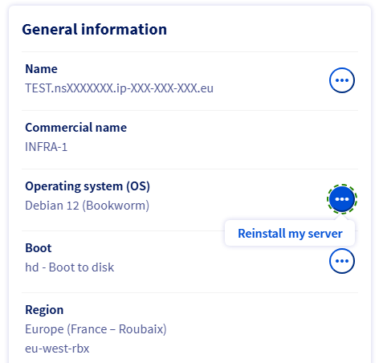
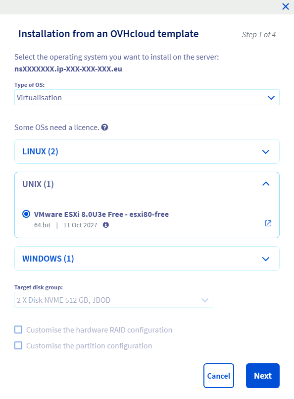
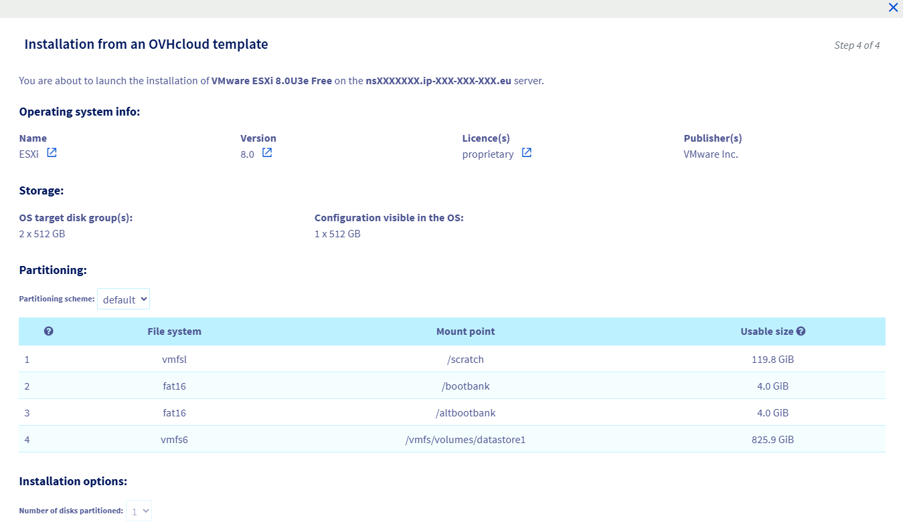

## Objectif

> [!primary]
>
> Depuis le 15 septembre 2025, OVHcloud propose un template d'installation ESXi 8 pour ses serveurs dédiés.
>

Ce guide a pour objectif de vous montrer comment installer ESXi 8 sur vos serveurs dédiés, et sélectionner un schéma de partitionnement dans l'[espace client OVHcloud](/links/manager) ou via l'[API OVHcloud](/links/api).

## Prérequis

- Un [serveur dédié](/links/bare-metal/bare-metal) **prêt à être installé/réinstallé** dans votre compte OVHcloud, compatible avec les [exigences matérielles d'ESXi 8](https://techdocs.broadcom.com/us/en/vmware-cis/vsphere/vsphere/8-0/esxi-upgrade-8-0/upgrading-esxi-hosts-upgrade/esxi-hardware-requirements-upgrade.html)
- Avoir accès à l'[espace client OVHcloud](/links/manager) et/ou à l'[API OVHcloud](/links/api)

> [!alert]
>
> La réinstallation d'un serveur dédié supprime toutes les données qui y sont actuellement stockées.
>

## En pratique

Avec les serveurs dédiés OVHcloud, vous pouvez [personnaliser le partitionnement](/pages/bare_metal_cloud/dedicated_servers/partitioning_ovh), ce qui offre une grande flexibilité lors de l’installation du système d’exploitation. En revanche, cela n’est pas possible avec ESXi, car il s’agit d’un système propriétaire basé sur UNIX et utilisant un installateur propriétaire.

Par conséquent, les installations ESXi d'OVHcloud sont conformes à la configuration définie par l'éditeur du logiciel.

ESXi 7.0 et les versions ultérieures ont introduit une [option d'amorçage permettant de configurer la taille des partitions système d'ESXi](https://kb.vmware.com/s/article/81166). Cette fonctionnalité a été introduite par l'éditeur car l'augmentation de la taille de la partition système pouvait poser problème, en particulier sur les machines avec de petits disques. OVHcloud a inclus cette fonctionnalité, qui est disponible aussi bien depuis l'[espace client OVHcloud](https://www.ovh.com/manager/#/dedicated/configuration) que via l'[API OVHcloud](/links/api).

Même si votre serveur dispose de plusieurs disques, l'installation d'ESXi utilise uniquement le premier disque du groupe de disques ciblé (voir « [API OVHcloud et installation d'un OS - Grappes de disques](/pages/bare_metal_cloud/dedicated_servers/partitioning_ovh#disk-group) »). Les autres disques peuvent être configurés par la suite pour être utilisés pour les machines virtuelles (voir « [Comment ajouter un datastore](/pages/bare_metal_cloud/dedicated_servers/hgrstor2_system_configuration#add-datastore) »).

Il existe 4 schémas de partitionnement prédéfinis :

|Valeur|Taille Système¹|Datastore³|
|---|---|---|
|`default`|130 Gio|Tout l'espace restant²|
|`min`|32 Gio|Tout l'espace restant²|
|`small`|64 Gio|Tout l'espace restant²|
|`max`|Tout l'espace disponible²|❌⁴|

¹ Sur le premier disque du groupe de disques ciblé pour l'installation de l'OS.<br />
² Espace sur le disque sur lequel l'OS sera installé.<br />
³ Un datastore est une partition de disque (parfois aussi appelée « conteneur ») qu'ESXi va utiliser pour stocker les machines virtuelles. [Plus de détails](https://docs.vmware.com/en/VMware-vSphere/7.0/com.vmware.vsphere.storage.doc/GUID-5EE84941-366D-4D37-8B7B-767D08928888.html).<br />
⁴ Les clients peuvent toujours [ajouter un datastore](/pages/bare_metal_cloud/dedicated_servers/hgrstor2_system_configuration#add-datastore) par la suite sur les autres disques.

Comme vous pouvez le constater, aucun datastore n'est créé sur le premier disque avec le schéma de partitionnement `max`.

> [!primary]
>
> Le saviez-vous ?
>
> Les solutions [VMware on OVHcloud](/links/hosted-private-cloud/vmware) sont basées sur des installations ESXi avec le schéma de partitionnement `small`.
>

### Comment sélectionner le schéma de partitionnement ?

Le schéma de partitionnement `default` sera utilisé sauf si un autre est sélectionné.

#### Via l'espace client OVHcloud

> [!primary]
>
> La procédure est très similaire [aux autres systèmes d'exploitation](/pages/bare_metal_cloud/dedicated_servers/getting-started-with-dedicated-server), à l'exception que vous ne pouvez pas cocher la case `Personnaliser la configuration des partitions`{.action} et qu'il y a une liste déroulante pour choisir le schéma de partitionnement à la quatrième et dernière étape.
>

Connectez-vous à l'[espace client OVHcloud](/links/manager). Depuis l'onglet `Informations générales`{.action}, cliquez sur le bouton `...`{.action} à côté du système d'exploitation, puis cliquez sur `Installer`{.action}.

{.thumbnail}

Ensuite, choisissez `Virtualisation`{.action}, `UNIX`{.action} et sélectionnez la version d'ESXi que vous souhaitez installer sur votre serveur dédié.

> [!primary]
>
> L'option `Personnaliser la configuration du hardware RAID`{.action} n'est disponible que si votre serveur dédié dispose d'un contrôleur RAID matériel.
>

> [!primary]
>
> L'option `Personnaliser la configuration des partitions`{.action} n'est pas disponible, pour les raisons expliquées ci-dessus.
>

Choisissez le groupe de disques sur lequel vous souhaitez qu'ESXi soit installé. Notez que seul le premier disque de ce groupe sera utilisé pour installer l'OS. Retrouvez plus d'informations dans [ce guide](/pages/bare_metal_cloud/dedicated_servers/partitioning_ovh#disk-group).

Cliquez sur `Suivant`{.action} pour continuer.

{.thumbnail}

Dans la liste déroulante `Schéma de partitionnement`{.action}, sélectionnez le schéma de partitionnement désiré. L'aperçu est mis à jour dès que vous sélectionnez un autre schéma de partitionnement, de telle sorte que vous puissiez avoir une idée de la configuration sur votre serveur dédié.

Remplissez les autres détails et cliquez sur `Confirmer`{.action} pour lancer l'installation d'ESXi sur votre serveur dédié.

> [!primary]
>
> Le champ `Nombre de disques partitionnés`{.action} est grisé et sa valeur est de 1, même si votre serveur dispose de plus d'un disque sur le groupe de disques ciblé pour l'installation de l'OS, comme expliqué ci-dessus.
>

{.thumbnail}

#### Via l'API OVHcloud

Lorsque vous lancez une installation d'OS, le client peut éventuellement fournir un `partitionSchemeName` afin de spécifier le schéma de partitionnement à utiliser :

> [!api]
>
> @api {v1} /dedicated/server POST /dedicated/server/{serviceName}/reinstall
>

Exemple de requête :

```json
{
    "operatingSystem": "esxi80_64",
    "storage": [
        {
            "partitioning": {
                "schemeName": "small"
            }
        }
    ]
}
```

Pour lister les différents schémas de partitionnement d'un template OS OVHcloud, vous pouvez utiliser l'appel API suivant :

> [!api]
>
> @api {v1} /dedicated/installationTemplate GET /dedicated/installationTemplate/{templateName}/partitionScheme
>

Exemple de retour pour `esxi80_64` :

```json
[
"default"
"max"
"small"
"min"
]
```

Afin d'obtenir les détails du schéma de partitionnement de manière dynamique, vous pouvez utiliser l'appel API suivant :

> [!api]
>
> @api {v1} /dedicated/installationTemplate GET /dedicated/installationTemplate/{templateName}/partitionScheme/{schemeName}/partition
>

Exemple de retour pour `default`:

```json
[
  "/scratch",
  "/bootbank",
  "/altbootbank",
  "/vmfs/volumes/datastore1"
]
```

Vous pouvez utiliser l'appel API suivant afin d'obtenir le détail de chaque partition :

> [!api]
>
> @api {v1} /dedicated/installationTemplate GET /dedicated/installationTemplate/{templateName}/partitionScheme/{schemeName}/partition/{mountpoint}
>

Exemple de retour pour `/bootbank`:

```json
{
  "order": 2,
  "filesystem": "fat16",
  "mountpoint": "/bootbank",
  "size": {
    "value": 4095,
    "unit": "MB"
  },
  "raid": "0",
  "type": "primary",
  "volumeName": ""
}
```

## Aller plus loin <a name="gofurther"></a>

[Option d'amorçage permettant de configurer la taille de la partition système ESXi [EN]](https://kb.vmware.com/s/article/81166)

[Premiers pas avec un serveur dédié](/pages/bare_metal_cloud/dedicated_servers/getting-started-with-dedicated-server)

[Premiers pas avec un serveur dédié Kimsufi, So You Start ou Rise](/pages/bare_metal_cloud/dedicated_servers/getting-started-with-dedicated-server-eco)

[API OVHcloud et installation d'un OS](/pages/bare_metal_cloud/dedicated_servers/api-os-installation)

[API OVHcloud et Stockage](/pages/bare_metal_cloud/dedicated_servers/partitioning_ovh)

[Gestion du RAID matériel](/pages/bare_metal_cloud/dedicated_servers/raid_hard)

[Remplacement à chaud - RAID Matériel](/pages/bare_metal_cloud/dedicated_servers/hotswap_raid_hard)

Échangez avec notre [communauté d'utilisateurs](/links/community).
