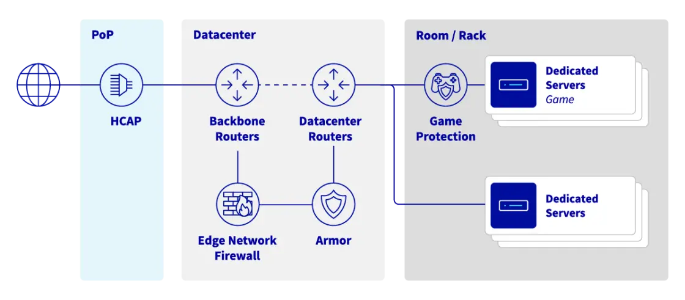
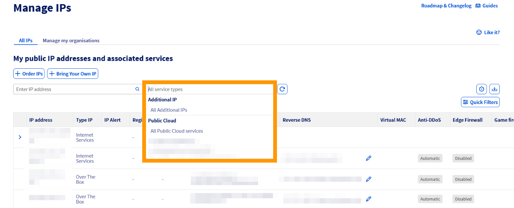
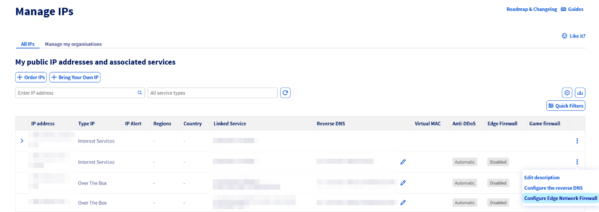
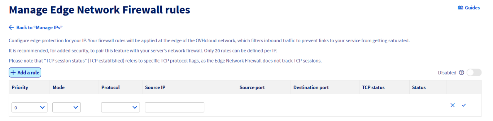
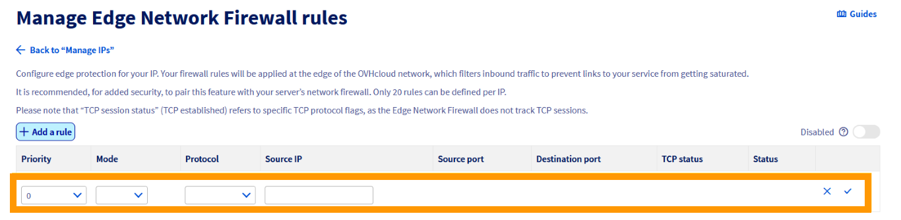
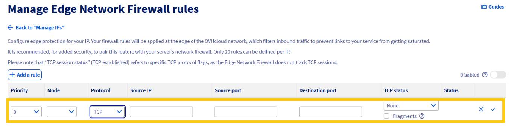
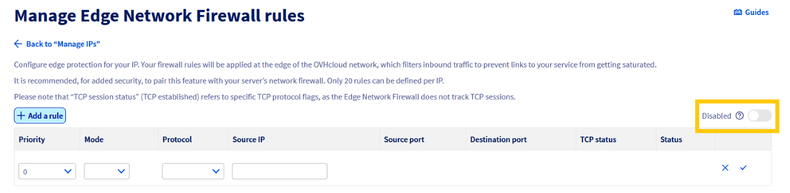
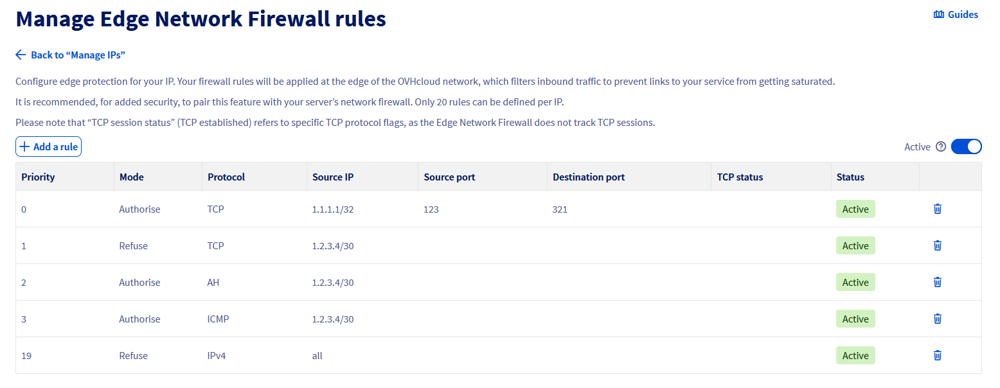

## Wprowadzenie

Aby chronić usługi dostępne dla klientów korzystających z publicznych adresów IP, OVHcloud udostępniło zaporę ogniową, skonfigurowaną i zintegrowaną z **infrastrukturą Anty-DDoS**: Edge Network Firewall Pozwala to ograniczyć ekspozycję usługi na ataki DDoS, usuwając określone przepływy sieciowe pochodzące spoza sieci OVHcloud.

**Ten przewodnik wyjaśnia, jak skonfigurować Edge Network Firewall dla Twoich usług.**

> [!primary]
>
> Więcej informacji na temat rozwiązania Anty-DDoS znajdziesz na [naszej stronie WWW](/links/security/antiddos).
> 

| Infrastruktura Anty-DDoS & usługi ochrony gier diagram w OVHcloud |
|:--:|
|  |

## Wymagania początkowe

- Usługa OVHcloud udostępniona na dedykowanym publicznym adresie IP ([Dedicated server](/links/bare-metal/bare-metal), [VPS](/links/bare-metal/vps), [Public Cloud instance](/links/public-cloud/public-cloud), [Hosted Private Cloud](/links/hosted-private-cloud/vmware), [Additional IP](/links/network/additional-ip) itd.)
- Dostęp do [OVHcloud Control Panel](/links/manager)

> [!warning]
> Ta funkcja może być niedostępna lub ograniczona na serwerach [**Eco** product line](/links/bare-metal/eco-about).
>
> Aby uzyskać więcej informacji, odwiedź stronę pod adresem [comparison page](/links/bare-metal/eco-compare).

> [!warning]
> Edge Network Firewall nie obsługuje protokołu QUIC.

## W praktyce

Edge Network Firewall zmniejsza ekspozycję na ataki DDoS, umożliwiając użytkownikom kopiowanie niektórych reguł firewall serwera na obrzeża sieci OVHcloud. Blokuje to przychodzące ataki jak najbliżej źródła, zmniejszając ryzyko przeciążenia zasobów serwerów lub połączeń z szafami w przypadku poważnych ataków.

### Aktywacja opcji Edge Network Firewall

> [!primary]
>
> Do tej pory funkcja ta jest dostępna tylko dla adresów IPv4.

> [!primary]
>
> Edge Network Firewall chroni określony adres IP powiązany z serwerem (lub usługą). Jeśli posiadasz serwer z wieloma adresami IP, skonfiguruj każdy z nich oddzielnie.
> 

Zaloguj się do [Panelu klienta OVHcloud](/links/manager), kliknij `Sieć`{.action} na pasku bocznym po lewej stronie, następnie kliknij `Publiczne adresy IP`{.action}. Możesz skorzystać z menu rozwijanego pod **"Moje publiczne adresy IP i usługi powiązane"**, aby filtrować usługi według kategorii, lub bezpośrednio wpisać żądany adres IP w pasku wyszukiwania.

{.thumbnail}

Następnie kliknij `...`{.action} Przycisk po prawej stronie odpowiedniego adresu IPv4 i najpierw wybierz `Skonfiguruj Edge Network Firewall`{.action} (lub kliknij ikonę statusu w kolumnie **Edge Firewall**).

{.thumbnail}

Następnie zostaniesz przeniesiony do strony konfiguracji firewall.

Dla każdego adresu IP można skonfigurować do **20 reguł**.

> [!warning]
>
> Edge Network Firewall jest automatycznie włączany w momencie wykrycia ataku DDoS i nie można go wyłączyć przed zakończeniem ataku. Wszystkie reguły skonfigurowane w firewallu są zatem stosowane podczas ataku. Taka logika pozwala naszym klientom na przeniesienie reguł firewalla serwera na brzeg sieci OVHcloud w czasie ataku.
>
> Pamiętaj, że nawet jeśli Edge Network Firewall został skonfigurowany, powinieneś skonfigurować własne lokalne zapory sieciowe, ponieważ jego główną rolą jest obsługa ruchu spoza sieci OVHcloud.
>
> Jeśli masz skonfigurowane reguły, zalecamy ich regularne sprawdzanie lub zmienianie sposobu działania usług. Jak wspomniano wyżej, Edge Network Firewall będzie automatycznie włączany w przypadku ataku DDoS, nawet gdy zostanie wyłączony w ustawieniach IP.
>

> [!primary]
>
> - Fragmentacja UDP jest domyślnie zablokowana (DROP). Jeśli używasz sieci VPN, to podczas aktywacji firewalla Edge Network, pamiętaj, aby poprawnie skonfigurować maksymalną jednostkę transmisji (MTU). Na przykład, korzystając z OpenVPN, możesz sprawdzić "MTU test".
> - Zintegrowany z centrami szybkiej kontroli (VAC) Edge Network Firewall (ENF) obsługuje wyłącznie ruch sieciowy spoza sieci OVHcloud.
>

### Konfigurowanie usługi Edge Network Firewall

> [!warning]
> Otwieranie portów na serwerze nie jest możliwe przy użyciu firewalla OVHcloud Edge Network Firewall. Aby otworzyć porty na serwerze, należy przejść przez zaporę systemu operacyjnego zainstalowanego na serwerze. 
>
> Więcej informacji znajdziesz w następujących przewodnikach: [Configuring the firewall on Windows](/pages/bare_metal_cloud/dedicated_servers/activate-port-firewall-soft-win) i [Configuring the firewall on Linux with iptables](/pages/bare_metal_cloud/dedicated_servers/firewall-Linux-iptable).
>

**Aby dodać regułę**, kliknij przycisk `+ Dodaj reguła`{.action} w lewym górnym rogu:

|  |
|:--:| 
| Kliknij opcję `+ Dodaj reguła`{.action}. |

Dla każdej reguły (poza TCP) wybierz:

|  |
|:-| 
| &bull; Priorytet (od 0 do 19, gdzie 0 jest pierwszą zastosowaną regułą)  &bull; Akcja (`Accept`{.action} lub `Deny`{.action})  &bull; Protokół  &bull; IP źródłowe (opcjonalnie) |

Dla każdej reguły **TCP** należy wybrać:

|  |
|:-| 
| &bull; Priorytet (od 0 do 19, gdzie 0 jest pierwszą zastosowaną regułą)  &bull; Akcja (`Accept`{.action} lub `Deny`{.action})  &bull; Protokół  &bull; IP źródłowe (opcjonalnie)  &bull; Port źródłowy (opcjonalnie)  &bull; Port docelowy (opcjonalnie)  &bull; Stan TCP (opcjonalnie)  &bull; Fragmenty (opcjonalnie)|

> [!primary]
> Zalecamy autoryzację protokołu TCP za pomocą opcji `established` (dla pakietów, które są częścią poprzednio otwartej/uruchomionej sesji), pakietów ICMP (dla ping i traceroute) oraz opcjonalnie odpowiedzi DNS UDP zewnętrznych serwerów (jeśli używasz zewnętrznych serwerów DNS).
>
> **Przykład konfiguracji:**
>
> - Priorytet 0: Zezwalaj na TCP `established`
> - Priorytet 1: Zezwalaj na UDP, port źródłowy 53
> - Priorytet 2: Zezwalaj na ICMP
> - Priorytet 19: Odrzuć IPv4

> [!warning]
> Konfiguracje firewalla zawierające tylko reguły trybu "Akceptuj" nie są w ogóle skuteczne. Instrukcja określająca, który ruch powinien zostać zrzucony przez zaporę. Jeśli nie zostanie utworzona taka reguła, wyświetli się ostrzeżenie.
> 

**Włączanie/wyłączanie firewall:**

|  |
|:--:|
| `Włącz`{.action}, aby włączyć |

Po potwierdzeniu zapora firewall włączona lub wyłączona.

Reguły są dezaktywowane do momentu wykrycia ataku, a następnie zostają aktywowane. Ta logika może być używana dla reguł, które są aktywne tylko wtedy, gdy nadchodzi znany powtarzalny atak.

### Przykład konfiguracji

Aby pozostawić otwarte tylko standardowe porty SSH (22), HTTP (80), HTTPS (443), UDP (53) podczas autoryzacji ICMP, należy przestrzegać następujących zasad:

{.thumbnail}

Reguły są uporządkowane od 0 (pierwsza odczytana reguła) do 19 (ostatnia odczytana reguła). Reguły zatrzymują się, gdy jedna z nich dotyczy odebranego pakietu.

Na przykład pakiet przeznaczony dla portu 80/TCP zostanie przechwycony przez regułę 2 i kolejne reguły nie zostaną zastosowane. Pakiet przeznaczony dla portu 25/TCP zostanie przechwycony tylko przez ostatnią regułę (19), która zablokuje go, ponieważ zapora nie zezwala na komunikację na porcie 25 w poprzednich regułach.

> [!warning]
> Powyższa konfiguracja jest jedynie przykładem i powinna być używana jedynie jako odniesienie, jeśli reguły nie mają zastosowania do usług hostowanych na Twoim serwerze. Konfiguracja reguł w firewallu jest niezbędna, abyś mógł dopasować reguły do usług hostowanych na Twoim serwerze. Nieprawidłowa konfiguracja reguł firewall może spowodować zablokowanie prawidłowego ruchu i niedostępność usług serwera.
> 

### Filtrowanie ataku — działanie centrum oczyszczania

Nasza infrastruktura Anty-DDoS (VAC) działa automatycznie. Proces mitygacji realizowany jest za pośrednictwem zautomatyzowanego centrum płukania. To tutaj nasza zaawansowana technologia przygląda się bliżej pakietom i próbuje usunąć ruch DDoS pozwalając jednocześnie na przechodzenie przez nie legalnego ruchu.

Wszystkie adresy IP OVHcloud są objęte automatyczną mitygacją. W przypadku wykrycia jakiegokolwiek złośliwego ruchu centrum płukania zostaje aktywowane. Stan ten jest określony statusem "Wymuszony" dla danego adresu IP. W tym momencie aktywny jest również Edge Firewall Network. Kiedy atak zostanie zmitygowany, sytuacja powraca do normy i nie obserwuje się już podejrzanych działań.

> [!success]
> **Porady**
>
> Możesz tworzyć reguły firewall tylko dla ataków, które będą stosowane po wykryciu ataku. W tym celu należy utworzyć reguły zapory sieci Edge, ale są one wyłączone.
>

> [!warning]
> Jeśli nasza infrastruktura Anty-DDoS mityguje atak, reguły Firewalla Edge Network zostaną zastosowane również po wyłączeniu firewalla. Jeśli wyłączyłeś firewall, pamiętaj, aby usunąć również reguły.
> 
> Pamiętaj, że nasza infrastruktura anty-DDoS nie może być wyłączona w usłudze. Wszystkie produkty OVHcloud są objęte ochroną i nie można tego zmienić.
>

## Network Security Dashboard

Aby uzyskać szczegółowe informacje na temat wykrytych ataków i wyników operacji wykonywanych przez centrum kontroli, zachęcamy do zapoznania się z naszym rozwiązaniem [Network Security Dashboard](/pages/bare_metal_cloud/dedicated_servers/network_security_dashboard).

## Zakończenie

Po przeczytaniu tego tutoriala będziesz potrafił skonfigurować Edge Network Firewall w celu zwiększenia bezpieczeństwa usług OVHcloud.

## Sprawdź również

- [Protecting a game server with the application firewall](/pages/bare_metal_cloud/dedicated_servers/firewall_game_ddos)

Dołącz do [grona naszych użytkowników](/links/community).