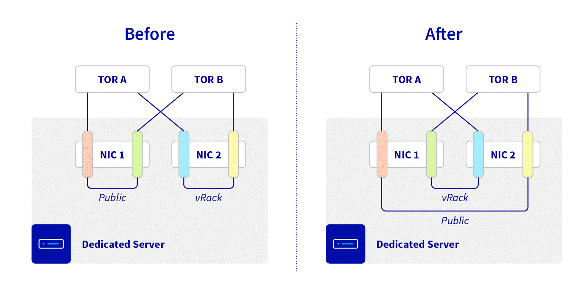

> [!primary]
> 
> This document is related to a deployment planned for **October 31st, 2025**, which will change the way link aggregation (LACP) functions within OVHcloud infrastructures.
> OVHcloud customers affected by these changes will also receive a communication by e-mail.

## Objective

This guide presents the new network aggregation architecture implemented on OVHcloud Bare metal servers. This evolution aims to strengthen fault tolerance and improve service continuity for your critical environments.

## Requirements

- A [dedicated server](/links/bare-metal/bare-metal).
- Have configured link aggregation (LACP) on your public or private interfaces (excluding OLA).

## Instructions

### What's Changing

Until now, the aggregation (LACP) of network interfaces was performed on ports belonging to the **same Network Interface Card (NIC)**. This configuration already ensured redundancy in case of a ToR switch failure but did not cover the risk of a NIC failure.

From now on:

- Logical aggregations will be spread across **two distinct network cards** (with no physical cabling modification).
- Existing aggregations are not modified.

{.thumbnail}

If you do not use LACP link aggregation on your server, **no action is required** and **no change will be visible for your services**.

### How to Apply the Change on Your Servers

When reconfiguring aggregations, the new rule will be applied automatically. To activate the new rule, you can also switch to **OLA** mode, then return to the default mode.
Once the new rule is activated, it will no longer be possible to revert to the old configuration. Servers delivered after the deployment date will directly benefit from this new rule.

> [!warning]
> For the changes to take effect, you must **reconfigure the declared MAC addresses** in your operating system.
>
> In case of incorrect configuration in the OS, resilience might not be effective

### Benefits

Subject to correct configuration on the OS side, this development provides:

- **Enhanced Availability**: better tolerance to hardware failures (network cards, switches, connectivity).
- **Uninterrupted Connectivity**: your services remain accessible even in the event of a network card failure.
- **Transparent Evolution**: no modification required for existing aggregations, apart from specific cases mentioned above.

## Go Further

Join our [user community](/links/community).
