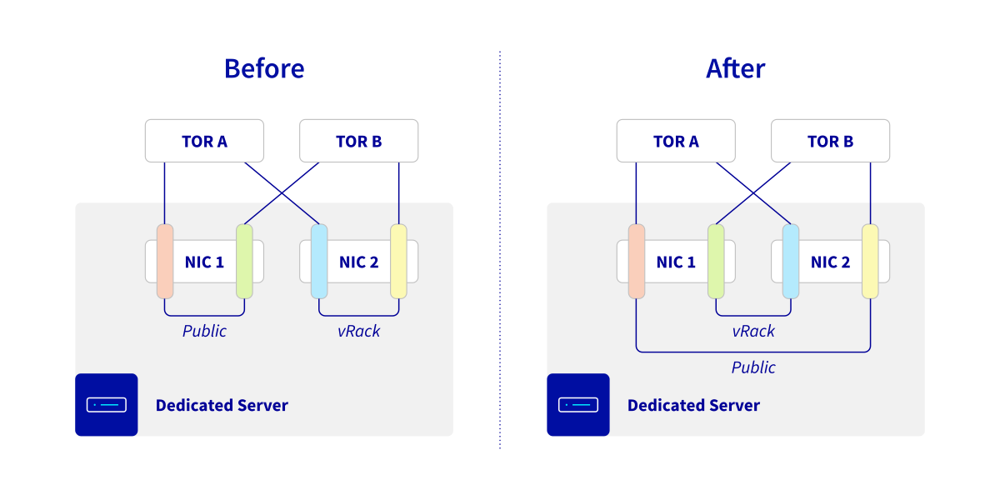

> [!primary]
> Ce document concerne un déploiement prévu le **25 novembre 2025**, qui changera la manière dont fonctionne l'aggrégation de liens (LACP) au sein des infrastructures OVHcloud.
> Les clients OVHcloud concernés par ces changements recevront également une communication par e-mail.

## Objectif

Ce guide présente la nouvelle architecture d’agrégation réseau mise en place sur les serveurs Bare Metal OVHcloud. Cette évolution a pour but de renforcer la tolérance aux pannes et d’améliorer la continuité de service pour vos environnements critiques.

## Prérequis

- Disposer d'un [serveur dédié](/links/bare-metal/bare-metal)
- Avoir configuré l’agrégation de liens (LACP) sur vos interfaces publiques ou privées (hors OLA)

## En pratique

### Ce qui change

Jusqu’à présent, l’agrégation (LACP) des interfaces réseau était réalisée sur des ports appartenant à la **même carte réseau (NIC)**. Cette configuration assurait déjà une redondance en cas de défaillance d’un switch ToR (Top-of-Rack), mais ne couvrait pas le risque de panne d’une carte réseau.

Désormais :

- Les agrégations logiques seront réparties sur **deux cartes réseau distinctes** (sans modification physique du câblage).
- Les agrégations existantes **ne sont pas modifiées**.

{.thumbnail}

Si vous n’utilisez pas l’agrégation de liens LACP sur votre serveur, **aucune action n’est requise** et **aucun changement ne sera visible pour vos services**.

### Comment effectuer le changement sur vos serveurs

Pour activer la nouvelle règle, vous devez [passer en mode **OLA**](/pages/bare_metal_cloud/dedicated_servers/ola-enable-manager), puis revenir au mode par défaut.

Une fois la nouvelle règle activée, il ne sera plus possible de revenir à l’ancienne configuration. Les serveurs livrés après la date de déploiement bénéficieront directement de cette nouvelle règle.

> [!warning]
> Afin que les modifications soient effectives, vous devez **reconfigurer les adresses MAC déclarées** dans votre système d’exploitation.
>
> En cas de configuration incorrecte dans l’OS, la résilience pourrait ne pas être effective.

### Bénéfices

Sous réserve d’une configuration correcte côté OS, cette évolution permet :

- **Une disponibilité renforcée** : meilleure tolérance aux pannes matérielles (cartes réseau, switches, connectique).
- **Une connectivité ininterrompue** : vos services restent accessibles même en cas de défaillance d’une carte réseau.
- **Une évolution transparente** : aucune modification requise pour les agrégations existantes, hors cas spécifiques mentionnés ci-dessus.

## Aller plus loin

Rejoignez notre [communauté d'utilisateurs](/links/community).
