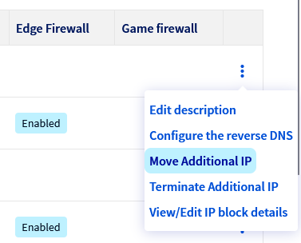
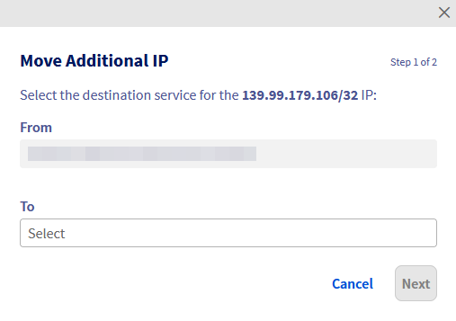

> [!primary]
> Ten artykuł dotyczy przenoszenia adresów Additional IPv4, które jest ograniczone zgodnie z [ograniczeniami regionalnymi](#limitations).
>
> Konfiguracja Additional IP w sieci vRack (sieć prywatna) pozwala obejść te ograniczenia regionalne, gdyż w przeciwnym razie utracisz zależność od jednego regionu, ułatwiając łączenie wielu usług OVHcloud.
>
> Dowiedz się, jak skonfigurować dodatkowe adresy IP w sieci vRack za pomocą przewodników dla [IPv4](/pages/bare_metal_cloud/dedicated_servers/configuring-an-ip-block-in-a-vrack) i [IPv6](/pages/bare_metal_cloud/dedicated_servers/configure-an-ipv6-in-a-vrack).
>

## Wprowadzenie

Additional IP mogą być przenoszone między Twoimi usługami. Chodzi o to, aby nie tracić reputacji i lepszego pozycjonowania Twoich aplikacji i systemów.

Technologia ta pozwala na wymianę adresów IP między poszczególnymi rozwiązaniami w czasie krótszym niż jedna minuta, praktycznie bez przerwy w dostępie do Twoich użytkowników. Mechanizm ten może być wykorzystywany w trakcie migracji usługi, podczas przenoszenia projektów ze środowiska programistycznego do środowiska produkcyjnego i przełączania usług na serwer backup w przypadku usterki.

> [!primary]
> Bloki adresów IP można przypisać do dowolnej kompatybilnej usługi w obrębie regionu.
Bloki adresów IP w regionie mogą być przenoszone między centrami danych w danym regionie, ale nie mogą być przenoszone poza ten region.
>
> Wyjątkiem są 3 regiony: eu-west-gra, eu-west-rbx i eu-west-sbg, w których bloki adresów IP mogą być przenoszone między tymi trzema regionami.
>
> Migracja dotyczy tylko całych bloków danych. Nie można przenieść pojedynczych adresów IP wewnątrz bloku.

**Dowiedz się, jak przenieść adres Additional IP z Panelu klienta OVHcloud lub poprzez API OVHcloud**

## Wymagania początkowe

- Posiadanie [serwera dedykowanego](/links/bare-metal/bare-metal) w Panelu klienta
- Posiadanie [adresu Additional IP](/links/network/additional-ip)
- Dostęp do [panelu klienta OVHcloud](/links/manager)

> [!warning]
> Funkcja ta może być niedostępna lub ograniczona na [serwerach dedykowanych **Eco**](/links/bare-metal/eco-about).
>
> Aby uzyskać więcej informacji, zapoznaj się z naszym [porównaniem](/links/bare-metal/eco-compare).

> [!warning]
> Jeśli adres Additional IP lub jeden z adresów IP bloku, ma przypisany wirtualny adres MAC, serwer docelowy musi obsługiwać funkcje wirtualnych adresów MAC.
> Zapoznaj się [z tym przewodnikiem](/pages/bare_metal_cloud/dedicated_servers/network_support_virtual_mac).
>
> W przeciwnym razie wirtualne adresy MAC muszą zostać usunięte z adresów Additional IP przed przeniesieniem.

## W praktyce

> [!primary]
> Przeniesienie bloku IP zawierającego unikalne wirtualne adresy MAC między dwoma serwerami powoduje tymczasowe zawieszenie tych adresów. Pojawią się one na nowym serwerze po zakończeniu przenoszenia.
>
> Z drugiej strony, bloki zawierające zduplikowane wirtualne adresy MAC nie mogą być przenoszone. Usuń zduplikowany wirtualny adres MAC z bloku, który chcesz przenieść.
>
> Jeśli blok IP zostanie przeniesiony/dodany do vRack, nie jest już związany z serwerem fizycznym. W tym przypadku każdy wirtualny adres MAC zostanie utracony podczas transferu.
>

### Bloki adresów IP geolokalizowane

Geolokalizacja adresu IP jest niezależna od regionu, z którym jest on powiązany.

Jeśli zamówisz dodatkowy blok adresów IP na serwerze, ale wybierzesz inną lokalizację (geolokalizację) dla tego bloku, nie będzie można przenieść go na inny serwer znajdujący się w tym samym kraju. Na przykład dodatkowy blok adresów IP geolokalizowany w Polsce (eu-central-war) i zamówiony na serwerze znajdującym się w francuskim centrum danych (eu-west-gra) nie może zostać przeniesiony na serwer znajdujący się w polskim centrum danych (eu-central-war). Blok adresów IP można przenieść wyłącznie na kwalifikujący się serwer znajdujący się we francuskim centrum danych.

### Przenieś IP w Panelu klienta OVHcloud

> [!warning]
> Tylko blok o jednym rozmiarze (/32) będzie można przenieść z serwera dedykowanego na VPS.
>

Zaloguj się do [Panelu klienta OVHcloud](/links/manager), kliknij `Sieć`{.action} w menu po lewej stronie ekranu, a następnie `Publiczne adresy IP`{.action}.

Następnie możesz użyć menu rozwijanego pod opcją **Moje publiczne adresy IP i usługi powiązane** i wybrać opcję **Wszystkie adresy Additional IP**, aby odpowiednio filtrować usługi, lub bezpośrednio wpisać żądany adres IP w pasku wyszukiwania.

{.thumbnail}

Następnie kliknij przycisk `⁝`{.action} po prawej stronie Addditional IP lub bloku adresów IP, który chcesz przenieść, i wybierz `Przenieś Additional IP`{.action}.

{.thumbnail}

W wyskakującym okienku wybierz z menu usługę, do której chcesz przenieść adres IP.

{.thumbnail}

Kliknij `Dalej`{.action}, a następnie `Zatwierdź`{.action}.

> [!warning]
> Należy pamiętać, że w przypadku niektórych produktów adresy IP (lub bloki) muszą zostać najpierw przeniesione do parkingu IP (tymczasowej lokalizacji przechowywania), zanim będą mogły zostać przeniesione do żądanego produktu.
>
> Aby przenieść bloki adresów IP do określonej sieci vRack, należy skorzystać z **interfejsu zarządzania vRack**, do którego można uzyskać dostęp, otwierając menu `Sieć`{.action} w lewym pasku bocznym, a następnie wybierając opcję `Prywatna sieć vRack`{.action}. 
>

### Przeniesienie IP przez API

Zaloguj się na stronie WWW [API OVHcloud](/links/api).

Najpierw należy sprawdzić, czy adres IP może zostać przeniesiony.
 Aby sprawdzić, czy IP może zostać przeniesione na jeden z Twoich serwerów dedykowanych, wywołaj następujące połączenie:

> [!api]
>
> @api {v1} /dedicated/server GET /dedicated/server/{serviceName}/ipCanBeMovedTo
>

- `serviceName`: numer serwera dedykowanego docelowego
- `ip`: adres Additional IP do przeniesienia

Aby przenieść adres IP, użyj następującego połączenia:

> [!api]
>
> @api {v1} /dedicated/server POST /dedicated/server/{serviceName}/ipMove
>

- `serviceName`: numer serwera dedykowanego docelowego
- `ip`: adres Additional IP do przeniesienia

### Ograniczenia 

Pamiętaj, że istnieją pewne ograniczenia podczas przenoszenia bloku adresów IP. Poniższa tabela pokazuje kompatybilność między regionami.

Więcej informacji znajdziesz na naszej liście [dostępnych regionów](/links/network/additional-ip).

| Nazwa regionu  | eu-west-par | eu-west-gra | eu-west-rbx | eu-west-sbg | eu-west-lim | eu-central-war | eu-west-eri | ca-east-bhs | ca-east-tor | ap-southeast-sgp | ap-southeast-syd |
|----------------|-------------|-------------|-------------|-------------|-------------|----------------|-------------|-------------|-------------|-------------|-------------|
| eu-west-par    |      ✅        |      ❌       |     ❌        |     ❌        |      ❌       |      ❌          |       ❌       |       ❌      |     ❌      | ❌      |     ❌      |
| eu-west-gra    |       ❌      |       ✅       |      ✅       |      ✅      |       ❌       |       ❌         |       ❌        |     ❌        |    ❌        | ❌      |     ❌      |
| eu-west-sbg    |       ❌        |      ✅       |      ✅       |      ✅       |      ❌       |      ❌           |      ❌       |      ❌        |    ❌        | ❌      |     ❌      |
| eu-west-rbx |       ❌        |      ✅       |      ✅       |      ✅       |      ❌       |      ❌           |      ❌       |      ❌        |    ❌        | ❌      |     ❌      |
| eu-west-lim    |        ❌       |      ❌       |      ❌       |     ❌        |     ✅       |      ❌         |      ❌        |     ❌        |     ❌       | ❌      |     ❌      |
| eu-central-war |      ❌       |      ❌       |     ❌       |      ❌       |      ❌        |       ✅         |       ❌       |       ❌       |       ❌        | ❌      |     ❌      |
| eu-west-eri    |         ❌      |       ❌      |        ❌     |       ❌     |      ❌       |       ❌         |     ✅        |      ❌         |      ❌       | ❌      |     ❌      |
| ca-east-bhs    |     ❌        |      ❌       |    ❌         |        ❌    |        ❌       |      ❌          |       ❌      |     ✅        |      ❌       | ❌      |     ❌      |
| ca-east-tor    |    ❌         |      ❌       |     ❌        |        ❌       |      ❌       |       ❌         |      ❌       |      ❌       |       ✅     | ❌      |     ❌      |
| ap-southeast-sgp|    ❌         |      ❌       |     ❌        |        ❌       |      ❌       |       ❌         |      ❌       |      ❌       |       ❌       | ✅       |     ❌      |
| ap-southeast-syd|    ❌         |      ❌       |     ❌        |        ❌       |      ❌       |       ❌         |      ❌       |      ❌       |       ❌       | ❌      |     ✅       |

## Sprawdź również

Dołącz do [grona naszych użytkowników](/links/community).