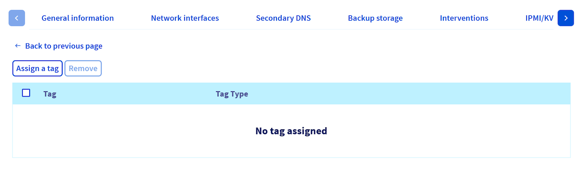

## Objetivo

Los tags son etiquetas que se pueden asignar a los recursos, lo que le permite organizarlos y administrarlos de forma más eficaz.

Cada tag está formada por dos partes:

- **Clave**: Representa un atributo o una categoría.
- **El valor**: Corresponde a la información asociada a esta clave.

Por ejemplo, puede clasificar los recursos por sitio, departamento o nivel de seguridad. El uso de los tags puede facilitar, entre otras cosas, la búsqueda, la organización de los recursos, la gestión de los costes asociados o la aplicación de las estrategias con la granularidad deseada.

Esta guía explica cómo crear, asignar y eliminar tags para cada servidor dedicado desde el área de cliente de OVHcloud.**

## Requisitos

- Tener un [servidor dedicado](/links/bare-metal/bare-metal).
- Estar conectado al [área de cliente de OVHcloud](/links/manager).

## Procedimiento

### Asignar un tag un servidor dedicado desde el área de cliente

Para asignar un tag a un servidor:

1. Conéctese a su [área de cliente de OVHcloud](/links/manager).
1. Acceda a la sección `Bare Metal Cloud`{.action}.
1. Haga clic en `Servidores dedicados`{.action} y seleccione su servidor en la lista.

Por defecto, se le redirigirá a la pestaña `Información general`{.action}.

{.thumbnail}

En el recuadro **Tags**, haga clic en `Añadir un tag`{.action}.

{.thumbnail}

Se abrirá automáticamente la pestaña `Tags`.

Haga clic en el botón `Asignar un tag`{.action}.

{.thumbnail}

En la ventana que aparece, haga clic en el campo `Clave`{.action} para abrir el menú desplegable y seleccione la clave deseada.

{.thumbnail}

A continuación, haga clic en el campo `Valor`{.action} y seleccione el valor adecuado en el menú desplegable.

{.thumbnail}

> [!warning]
>
> **Si desea utilizar una clave o un valor que no existe todavía**, puede crearlo introduciéndola y haciendo clic en `Añadir este-texto`{.action}, donde "este-texto" corresponde al texto que ha introducido.
>

Por último, haga clic en el botón `Añadir`{.action} para crear el tag y luego en el botón `Asignar`{.action} en la parte inferior derecha de la ventana.

{.thumbnail}

Aparecerá un mensaje de confirmación en verde sobre la lista de tags aplicadas al servidor elegido.

{.thumbnail}

### Eliminar un tag en un servidor dedicado

Para consultar la lista de tags asignados al servidor:

1. Conéctese a su [área de cliente de OVHcloud](/links/manager).
1. Acceda a la sección `Bare Metal Cloud`{.action}.
1. Haga clic en `Servidores dedicados`{.action} y seleccione su servidor en la lista.
1. Acceda a la pestaña `Tags`{.action}.

Haga clic en el botón `...`{.action} situado al final de la línea correspondiente al tag que quiera eliminar del servidor.
Haga clic en `Desasignar`{.action}.

{.thumbnail}

Se abrirá una ventana de confirmación. Haga clic en el botón `Confirmar`{.action} para cancelar la asignación de la tag.

{.thumbnail}

## Más información

Interactúe con nuestra [comunidad de usuarios](/links/community).