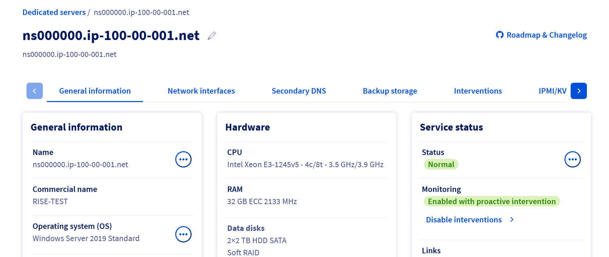
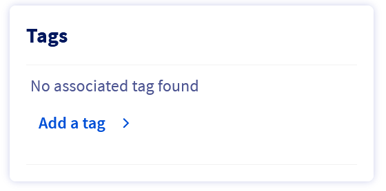
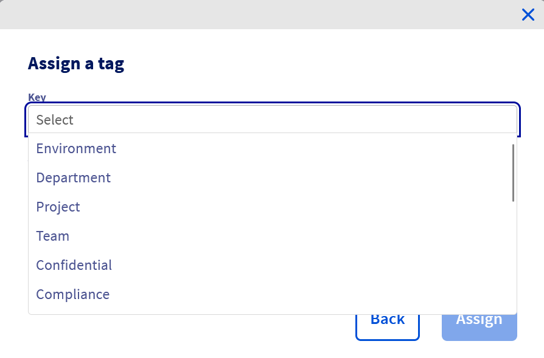
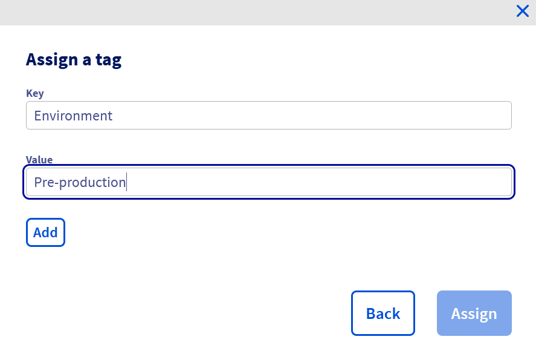
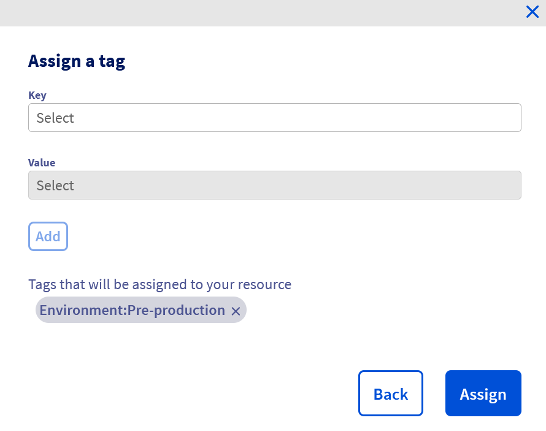
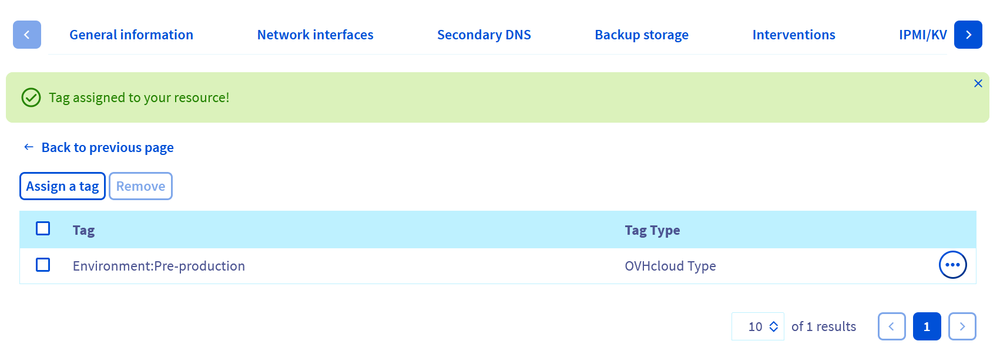
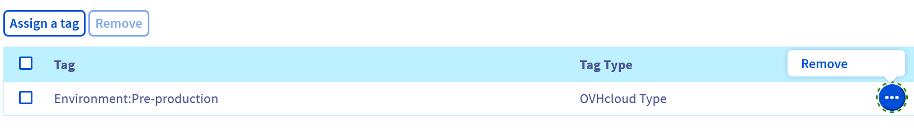
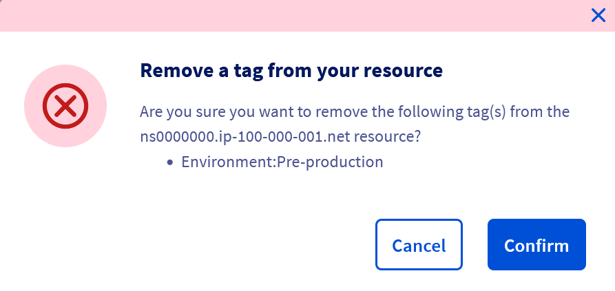

## Obiettivo

Le tag sono etichette attribuibili alle risorse, che consentono di organizzarle e gestirle in modo più efficace.

Ogni tag è composto da due parti:

- **La chiave**: Rappresenta un attributo o una categoria.
- **Il valore**: Corrisponde alle informazioni associate a questa chiave.

È possibile, ad esempio, suddividere le risorse in categorie in base alla sede, al servizio o al livello di sicurezza. L'utilizzo delle tag può facilitare la ricerca, l'organizzazione delle risorse, la gestione dei costi associati o ancora l'applicazione di strategie con la granularità desiderata.

**Questa guida ti mostra come creare, attribuire ed eliminare tag per ogni server dedicato dallo Spazio Cliente OVHcloud.**

## Prerequisiti

- Disporre di un [server dedicato](/links/bare-metal/bare-metal).
- Avere accesso allo [Spazio Cliente OVHcloud](/links/manager).

## Procedura

### Assegnare un tag a un server dedicato dallo Spazio Cliente

Per assegnare un tag a un server:

1. Accedi allo [Spazio Cliente OVHcloud](/links/manager).
1. Accedi alla sezione `Bare Metal Cloud`{.action}.
1. Clicca su `Server dedicati`{.action} e seleziona il tuo server dalla lista.

Di default, verrai reindirizzato alla scheda `Informazioni generali`{.action}.

{.thumbnail}

Nel riquadro **Tag**, clicca su `Aggiungere un tag`{.action}.

{.thumbnail}

Verrai automaticamente indirizzato alla scheda `Tags`.

Clicca sul pulsante `Assegnare un tag`{.action}.

{.thumbnail}

Nella nuova finestra, clicca sul campo `Chiave`{.action} per aprire il menu a tendina e seleziona la chiave desiderata.

{.thumbnail}

Clicca nel campo `Valore`{.action} e seleziona il valore appropriato nel menu a tendina.

{.thumbnail}

> [!warning]
>
> **Se vuoi utilizzare una chiave o un valore che non esiste ancora**, puoi crearlo digitandola e cliccando su `Aggiungi questo-testo`{.action}, dove "questo-testo" corrisponde al testo che hai inserito.
>

Infine clicca sul pulsante `Aggiungere`{.action} per creare il tag e poi sul pulsante `Assegnare`{.action} nella parte inferiore destra della finestra.

{.thumbnail}

Un messaggio di conferma viene visualizzato in verde, sopra l'elenco delle tag applicate al server scelto.

{.thumbnail}

### Eliminare un tag su un server dedicato

Per visualizzare la lista dei tag assegnati al tuo server:

1. Accedi allo [Spazio Cliente OVHcloud](/links/manager).
1. Accedi alla sezione `Bare Metal Cloud`{.action}.
1. Clicca su `Server dedicati`{.action} e seleziona il tuo server dalla lista.
1. Accedi alla scheda `Tags`{.action}.

Clicca sul pulsante `...`{.action}, a destra del tag che vuoi rimuovere dal tuo server.
Clicca su `Eliminare`{.action}.

{.thumbnail}

Viene visualizzata una finestra di conferma. Clicca sul pulsante `Confermare`{.action} per rimuovere il tag.

{.thumbnail}

## Per saperne di più

Contatta la nostra [Community di utenti](/links/community).