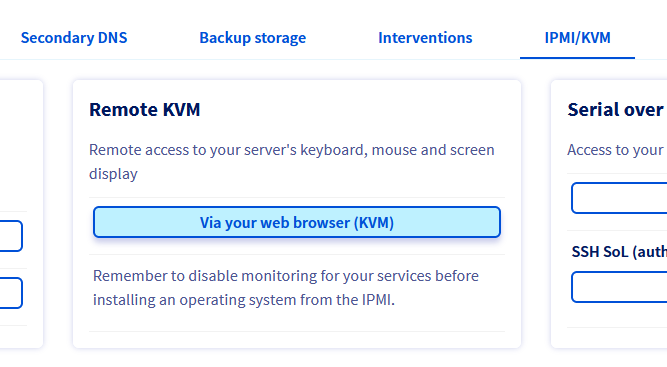
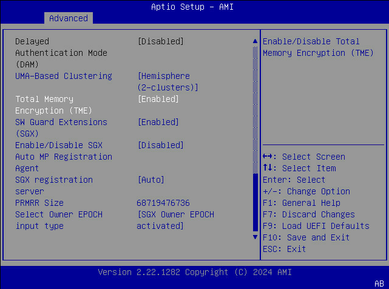

## Objetivo

Habilitar las Intel Software Guard Extensions (SGX) en su servidor le permite ejecutar aplicaciones listas para SGX. Intel SGX ofrece funciones avanzadas de cifrado de hardware y memoria, con el fin de aislar partes de código y datos específicas de cada aplicación.

**Esta guía explica cómo habilitar la función SGX, en el área de cliente de OVHcloud o a través de la API de OVHcloud.**

## Requisitos

- Un servidor dedicado compatible con la [opción SGX](/links/bare-metal/sgx) en su cuenta de OVHcloud
- Disponer de las claves de conexión recibidas por correo electrónico tras la instalación
- Tener acceso al [área de cliente de OVHcloud](/links/manager) o a la [API de OVHcloud](/links/api)
- Ubuntu 24.04 o equivalente instalado en el servidor

## Procedimiento

### Desde el área de cliente de OVHcloud

#### Paso 1: Iniciar sesión en el área de cliente de OVHcloud

Inicie sesión en el [área de cliente de OVHcloud](/links/manager), vaya a la sección `Bare Metal Cloud`{.action} y seleccione el servidor en el que desea habilitar SGX desde **Servidores dedicados** en la barra lateral izquierda.

#### Paso 2: Habilitar SGX

Desplácese hacia abajo hasta la caja "Características avanzadas" y haga clic en `...`{.action} junto a "Seguridad - Intel SGX (Software Guard Extensions)". Seleccione `Habilitar SGX`{.action} del menú desplegable.

{.thumbnail}

En la pantalla siguiente, haga clic en el botón `Habilitar`{.action}.

{.thumbnail}

Puede elegir habilitar SGX con una cantidad específica de memoria reservada o habilitarlo permitiendo que su software reserve automáticamente la memoria que necesita. Una vez que haya tomado su decisión, haga clic en `Confirmar`{.action}.

{.thumbnail}

Aparecerá una ventana emergente de confirmación. Confirme que ha entendido que la activación de la tecnología Intel SGX provocará que su servidor se reinicie.

{.thumbnail}

> [!warning]
>
> Esto provocará que su servidor se reinicie una o varias veces, dependiendo del modelo de su servidor.

Siga con el [paso 3](#sgx-softwares) de las instrucciones a continuación.

### Usando la API de OVHcloud

#### Paso 1: Iniciar sesión en la consola de la API

En la [página de la API de OVHcloud](/links/api) haga clic en `Login`{.action} en la esquina superior derecha. En la página siguiente, introduzca las credenciales de su cuenta de OVHcloud.

#### Paso 2: Habilitar SGX

Obtenga el nombre de su servidor de la lista devuelta por esta llamada:

> [!api]
>
> @api {v1} /dedicated/server GET /dedicated/server

Verifique que su servicio tiene la opción SGX, llamando a: 

> [!api]
>
> @api {v1} /dedicated/server GET /dedicated/server/{serviceName}/biosSettings/sgx

{.thumbnail}

Habilite SGX usando el nombre del servidor:

> [!warning]
>
> Esto provocará que su servidor se reinicie una o varias veces, dependiendo del modelo de su servidor.

> [!api]
>
> @api {v1} /dedicated/server POST /dedicated/server/{serviceName}/biosSettings/sgx/configure

{.thumbnail}

Compruebe el progreso de la tarea de configuración llamando a este punto final con el *taskId* devuelto por la llamada anterior:

> [!api]
>
> @api {v1} /dedicated/server GET /dedicated/server/{serviceName}/task/{taskId}

{.thumbnail}

Puede verificar que el estado se ha establecido como habilitado:

> [!api]
>
> @api {v1} /dedicated/server GET /dedicated/server/{serviceName}/biosSettings/sgx

{.thumbnail}

Siga con el [paso 3](#sgx-softwares) de las instrucciones a continuación.

### Configuración manual en el BIOS

#### Paso 1: Iniciar una sesión de KVM remoto

Inicie sesión en el [área de cliente de OVHcloud](/links/manager), vaya a la sección `Bare Metal Cloud`{.action} y seleccione el servidor en el que desea habilitar SGX desde **Servidores dedicados** en la barra lateral izquierda.

A continuación, inicie una sesión de KVM remoto:

{.thumbnail}

#### Paso 2: Habilitar SGX

A continuación, a través del KVM, inicie un reinicio del servidor y entre en el BIOS (normalmente pulsando la tecla `DEL`{.action} o `F2`{.action}).

En el BIOS, vaya a `Advanced` > `Processor Configuration`.

Habilite las opciones TME y SGX, y configure el tamaño de PRMRR deseado:

{.thumbnail}

Guarde los cambios pulsando la tecla `F10`{.action}. Aparecerá una ventana emergente de confirmación, confirme con la opción `Yes`.

Su servidor se reiniciará y arrancará en su sistema operativo.

Siga con el [paso 3](#sgx-softwares) de las instrucciones a continuación.

### Paso 3: Instalar la pila de software SGX <a name="sgx-softwares"></a>

Use los siguientes comandos para instalar el SDK de Intel para poder desarrollar y ejecutar aplicaciones SGX.  

Primero, instale algunas dependencias:

```bash
sudo apt update
sudo apt install autoconf automake build-essential cmake debhelper git libcurl4-openssl-dev libprotobuf-dev libssl-dev libtool lsb-release ocaml ocamlbuild protobuf-compiler python-is-python3 reprepro wget perl unzip pkgconf libboost-dev libboost-system-dev libboost-thread-dev lsb-release libsystemd0
```

A continuación, descargue el código fuente y prepare los submódulos y los binarios preconstruidos:

```bash
BASE_DIR=/opt/intel
[[ -d $BASE_DIR ]] || sudo mkdir -p $BASE_DIR && sudo chown `whoami` $BASE_DIR
cd $BASE_DIR
 
git clone https://github.com/intel/linux-sgx.git
 
cd linux-sgx
git checkout sgx_2.26
make preparation
```

Construya e instale el SDK de SGX:

```bash
make sdk_install_pkg
$ ./linux/installer/bin/sgx_linux_x64_sdk_2.26.100.0.bin --prefix=$BASE_DIR/
```

### Paso 4: Probar la aplicación de ejemplo en modo Simulador

Para construir y ejecutar el código de ejemplo LocalAttestation en modo Simulador:

```bash
BASE_DIR=/opt/intel
cd $BASE_DIR/sgxsdk/SampleCode/LocalAttestation/
source $BASE_DIR/sgxsdk/environment
 
make clean
SGX_MODE=SIM make
cd bin
./app
succeed to load enclaves.
succeed to establish secure channel.
Succeed to exchange secure message...
Succeed to close Session...
```

### Paso 5: Construir e instalar el PSW de Intel SGX

El software de plataforma de Intel SGX (PSW) proporciona bibliotecas de software para ejecutar aplicaciones SGX en modo Hardware. Para construir el repositorio local de paquetes Debian que aloja los paquetes, introduzca los siguientes comandos:

```bash
BASE_DIR=/opt/intel
cd $BASE_DIR/linux-sgx
make deb_local_repo
```

Cree el siguiente archivo para añadir el repositorio local de paquetes Debian al sistema de configuración del repositorio:

```bash
$ cat /etc/apt/sources.list.d/sgx.sources
Types: deb
URIs: file:/opt/intel/linux-sgx/linux/installer/deb/sgx_debian_local_repo
Suites: noble
Components: main
trusted: yes
```

A continuación, instale los siguientes paquetes:

```bash
sudo apt update
sudo apt-get install libsgx-epid libsgx-quote-ex libsgx-dcap-ql
```

### Paso 6: Probar la aplicación de ejemplo en modo Hardware (opcional)

Para construir y ejecutar el código de ejemplo LocalAttestation en modo Hardware:

```bash
BASE_DIR=/opt/intel
cd $BASE_DIR/sgxsdk/SampleCode/LocalAttestation/
source $BASE_DIR/sgxsdk/environment
 
make clean
SGX_MODE=HW make
cd bin
./app
succeed to load enclaves.
succeed to establish secure channel.
Succeed to exchange secure message...
Succeed to close Session...
```

## Más información

Para ir más lejos (desarrollar su propia aplicación, registrarse para la atestación remota, etc.), aquí hay algunos recursos útiles:

- [Intel SGX](https://software.intel.com/en-us/sgx)
- [Intel SGX Attestation services](https://software.intel.com/en-us/sgx/attestation-services)
- [Intel SGX linux-2.26 documentation](https://download.01.org/intel-sgx/sgx-linux/2.26/docs/)
- [github.com/intel/linux-sgx](https://github.com/intel/linux-sgx)
