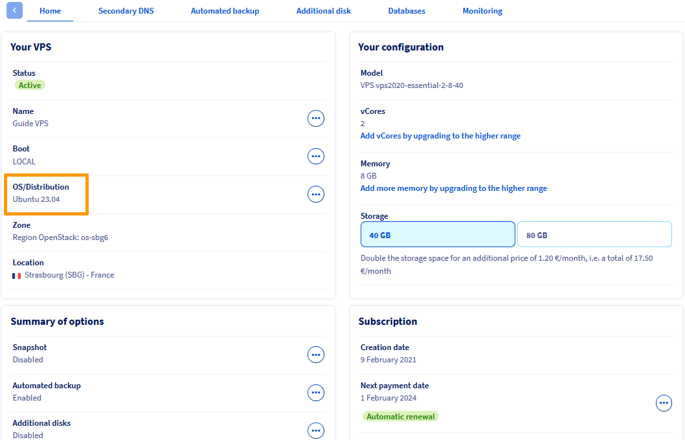

## Objective

This guide will explain how you can ensure continuity for your services by migrating your OVHcloud VPS to an operating system that is compatible with the latest versions of **Plesk** and **cPanel**, following the end of support announced for several OSs.

**Find the end-of-support dates for the operating systems on your OVHcloud VPS that affect Plesk and cPanel licenses.**

## Requirements

- A [VPS](/links/bare-metal/vps) solution with a [compatible distribution](/links/bare-metal/vps-os).

## Instructions

The **Plesk** and **cPanel** publishers announce the end of support for the following operating systems:

| Operating system | Product      | End of Support       |
| ---------------- | ------------ | -------------------- |
| Ubuntu 18.04     | Plesk        | **1st January 2027** |
| Debian 10        | Plesk        | **1st January 2027** |
| CentOS 7         | Plesk/cPanel | **1st January 2027** |
| CloudLinux 7     | Plesk/cPanel | **1st January 2027** |

For more details on support purposes, please refer to the official documentation:

- [Plesk](https://docs.plesk.com/release-notes/obsidian/system-requirements/).
- [cPanel](https://docs.cpanel.net/knowledge-base/cpanel-product/cpanel-deprecation-plan/).

### What can I do concretely?

> [!primary]
>
> From a **security** point of view, continuing to use an unsupported OS exposes you to attacks.
> We recommend reading:
>
> - [cPanel recommendations](https://docs.cpanel.net/knowledge-base/security/tips-to-make-your-server-more-secure/).
> - [Plesk recommendations](https://docs.plesk.com/en-US/obsidian/administrator-guide/plesk-administration/securing-plesk.59464/).

#### 1. Check your current system

Log in to your [OVHcloud Control Panel](/links/manager), go to the `Bare Metal Cloud`{.action} section, and select your server under the `Virtual private servers`{.action} section.

{.thumbnail}

In the `Home`{.action} tab, find the details of your operating system in the `OS/Distribution` section in the `Your VPS` box.

#### 2. Identify a compatible OS

If your operating system is part of the OS that will no longer be supported, migrate to a compatible system recommended by the publisher.

Consult the official documentation of supported OSs:

- [List of OSs supported by Plesk](https://docs.plesk.com/release-notes/obsidian/system-requirements/).
- [List of cPanel compatible OSs](https://docs.cpanel.net/installation-guide/system-requirements/).

#### 3. Migrate your service

**Option A — Manual reinstallation**

1. [Back up your data](/pages/bare_metal_cloud/virtual_private_servers/using-automated-backups-on-a-vps) (web content, database, emails, etc.).
2. Reinstall a compatible OS from the OVHcloud Control Panel by following the `Reinstalling your VPS` section of our guide [How to get started with a VPS](/pages/bare_metal_cloud/virtual_private_servers/starting_with_a_vps).
3. [Reinstall cPanel](/pages/bare_metal_cloud/virtual_private_servers/cpanel) or Plesk on the new system.
4. Restore your data from your backups.

**Option B — Migration via Plesk or cPanel**

This method is recommended if you can deploy a new VPS with an updated system alongside the old one.

Order a new VPS with a compatible OS if you have not already done so. [Install cPanel](/pages/bare_metal_cloud/virtual_private_servers/cpanel) or Plesk.

Use the migration tool of your choice. These tools allow you to automatically transfer your websites, databases, email accounts and configurations from one VPS to another:

- Plesk Migrator - [Official documentation](https://docs.plesk.com/en-US/obsidian/migration-guide/introduction.75496/).
- cPanel Transfer Tool - [Official documentation](https://docs.cpanel.net/whm/transfers/transfer-tool/).

**Option C — On-site update (advanced users)**

If you cannot deploy a new VPS, you can use certain tools to **upgrade your operating system directly**, while keeping Plesk or cPanel installed. This method is intended for advanced users, as it carries risks if executed incorrectly.

- For **Plesk** (switching from CentOS 7 to AlmaLinux 8), use the `centos2alma` script provided by the [official Plesk documentation](https://github.com/plesk/centos2alma). See also detailed instructions in [Plesk support](https://support.plesk.com/hc/en-us/articles/12377714344983).

- For **cPanel** (switching from CentOS 7 to AlmaLinux 8), use the **Elevate** tool provided by the [official cPanel documentation](https://cpanel.github.io/elevate/).

> [!primary]
>
> These tools are not 100% guaranteed and require full backups before proceeding. Also make sure that your VPS has sufficient resources (RAM, CPU, disk).

### Security Best Practices

Regardless of Plesk/cPanel, it is essential to **keep your VPS operating system up to date** to benefit from security patches, software compatibility, and vendor support. If your distribution is **end of life (EOL)**, plan an **upgrade** or **migration** to a still-supported version.

To find out the end-of-life and end-of-support dates for images and operating systems (VPS & Public Cloud), refer to our guide [Public Cloud & VPS - Lifecycle and End-of-Life/Support Announcements for Images and Distributions](/pages/bare_metal_cloud/virtual_private_servers/image-life-cycle).

## Go further 

For specialized services (SEO, development, etc.), contact the [OVHcloud partners](/links/partner).

Join our [community of users](/links/community).