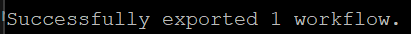
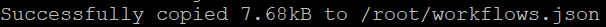
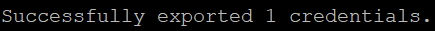
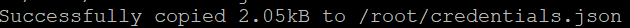

## Objective

This guide explains how to transfer an existing n8n configuration to an OVHcloud VPS, or from an OVHcloud VPS to another instance. You can choose either the export/import method via the **CLI commands of n8n**, or the backup/restore of the `.n8n` folder.

## Requirements

- Two functional [VPS](/links/bare-metal/vps) (OVHcloud or others)
- Administrative (sudo) access to your server via SSH

## Instructions

### Summary

- [Method 1: Export and import via n8n CLI](#method1)
- [Method 2: Backup and restore the `.n8n` folder](#method2)
- [Points to note](#importantNotes)
- [Conclusion](#conclusion)

### Method 1 - Export and import via n8n CLI <a name="method1"></a>

n8n provides commands for exporting and importing your **workflows** and **credentials**.

Depending on your installation, you have two options:

- **n8n installed in CLI mode** (npm or binary): directly type `n8n export:...` from your VPS.
- **n8n installed via Docker** (OVHcloud case with image `n8nio/n8n`): run the commands inside the container with `docker exec`.

#### Step 1 - Log in to the source VPS

Open a terminal and connect via SSH to your VPS, where n8n is installed:

```bash
ssh <user>@<IP_VPS_SOURCE>
```

#### Step 2 - Export workflows

> [!primary]
>
> The paths indicated (`/home/node/...`) correspond to the default Docker installation of n8n. If you have customized the volumes or paths in your Docker Compose configuration, adjust them accordingly.

> [!tabs]
> Case A - Native CLI Installation
>>
>> Run the following command to export all workflows to a file:
>>
>> ```bash
>> n8n export:workflow --all --output=workflows.json
>> ```
>>
> Case B - Installation via Docker
>>
>> Identify the name of your n8n container (default is `n8n`):
>>
>> ```bash
>> docker ps
>> ```
>>
>> Run the following command to generate the file inside the container:
>>
>> ```bash
>> docker exec -it n8n n8n export:workflow --all --output=/home/node/workflows.json
>> ```
>>
>> Sample output:
>>
>> {.thumbnail}
>>
>> Output the file from the container to place it in the file system of the source VPS:
>>
>> ```bash
>> docker cp n8n:/home/node/workflows.json /root/workflows.json
>> ```
>>
>> Sample output:
>>
>> {.thumbnail}
>>

#### Step 3 - Export credentials

> [!tabs]
> Case A - Native CLI Installation
>>
>> Run the following command to export all decrypted credentials to a JSON file:
>>
>> ```bash
>> n8n export:credentials --all --decrypted --output=credentials.json
>> ```
>>
> Case B - Installation via Docker
>>
>> Run this command in the n8n container to generate the decrypted credentials file:
>>
>> ```bash
>> docker exec -it n8n n8n export:credentials --all --decrypted --output=/home/node/credentials.json
>> ```
>>
>> Sample output:
>>
>> {.thumbnail}
>>
>> > [!warning]
>> >
>> > Use the `--decrypted` option if you are migrating to another instance to avoid encryption errors. Handle this file carefully as it contains sensitive data.
>>
>> Copy this file to the file system of the source VPS:
>>
>> ```bash
>> docker cp n8n:/home/node/credentials.json /root/credentials.json
>> ```
>>
>> Sample output:
>>
>> {.thumbnail}
>>

#### Step 4 - Transfer the exported files

Copy the generated files (`workflows.json` and `credentials.json`) to your target VPS:

```bash
scp workflows.json credentials.json <user>@<TARGET_VPS_IP>:/root/
```

> [!primary]
>
> In the example, we transfer the files to the directory `/root/` of the target VPS. You can choose another directory if required, depending on your access rights.

#### Step 5 - Import workflows

Connect via SSH to your target VPS:

```bash
ssh <user>@<TARGET_VPS_IP>
```

> [!tabs]
> Case A - Native CLI Installation
>>
>> ```bash
>> n8n import:workflow --input=workflows.json
>> ```
>>
> Case B - Installation via Docker
>>
>> ```bash
>> docker exec -it n8n n8n import:workflow --input=/home/node/workflows.json
>> ```

#### Step 6 - Import credentials

> [!tabs]
> Case A - Native CLI Installation
>>
>> ```bash
>> n8n import:credentials --input=credentials.json
>> ```
>>
> Case B - Installation via Docker
>>
>> ```bash
>> docker exec -it n8n n8n import:credentials --input=/home/node/credentials.json
>> ```
>>
>> > [!primary]
>> >
>> > When importing, if a workflow or credential ID already exists in the target instance, it will be overwritten. To avoid conflicts, change or delete the ID in the JSON files before importing.
>>
>> > [!warning]
>> >
>> > Delete the `credentials.json` file from your source and target VPS after import to avoid any leakage of sensitive data.
>>

### Method 2 - Backup and restore the `.n8n` folder <a name="method2"></a>

With this method, you can transfer the entire configuration (workflows, credentials and settings) between two instances.

#### Where is the folder `.n8n` located?

- CLI installation (npm or binary): The folder is usually in the home directory of the user running n8n, for example `/root/.n8n` or `/home/<user>/.n8n`.
- Docker installation: The folder is located in the container at the location `/home/node/.n8n`. In most Docker Compose configurations, it is mounted in a volume named `n8n_data` or in a folder on the VPS (e.g. `/root/n8n_data:/home/node/.n8n`).

Check its location with:

```bash
docker exec -it n8n ls -lah /home/node/.n8n
docker inspect n8n | grep -A 5 Mounts
```

#### Step 1 - Save the folder `.n8n`

> [!tabs]
> Case A - Native CLI Installation
>>
>> Create the archive directly from the host system:
>>
>> ```bash
>> tar czvf n8n-backup.tar.gz /root/.n8n
>> ```
>>
> Case B - Installation via Docker
>>
>> Create an archive of the `.n8n` folder:
>>
>> ```bash
>> docker exec n8n tar czvf - /home/node/.n8n > n8n-backup.tar.gz
>> ```
>>

#### Step 2 - Transfer the archive to the target VPS

Send the file to your target VPS:

```bash
scp n8n-backup.tar.gz <user>@<TARGET_VPS_IP>:/root/
```

Connect via SSH to your target VPS:

```bash
ssh <user>@<TARGET_VPS_IP>
```

#### Step 3 - Restore the archive on the target VPS

On your target VPS, restore the archive in the `.n8n` folder of the container:

```bash
docker exec -i n8n sh -c 'tar xzvf - -C /home/node/.n8n' < n8n-backup.tar.gz
```

#### Step 4 - Restart n8n

Restart n8n:

```bash
docker start n8n
```

> [!warning]
>
> This method requires that the **encryption key (`encryptionKey`)** be identical between the two instances. Check or copy this setting from your source instance’s configuration file.

### Points to note <a name="importantNotes"></a>

After migration, if the domain or subdomain changes (e.g. `n8n.mydomain.com` → `n8n.ovh.net`), update:

- The `N8N_HOST` variable in your `docker-compose.yml` file.
- Your DNS zone so that the subdomain points to the IP address of the new VPS.

To find out more, read our guide [Modifying an OVHcloud DNS zone](/pages/web_cloud/domains/dns_zone_edit)

### Conclusion <a name="conclusion"></a>

You now have two methods for migrating your n8n workflows and credentials to an OVHcloud VPS (or from OVHcloud to another environment):

- **Export/Import via CLI**: simple and selective.
- **Backup `.n8n`**: full, ideal for a full migration.

For more information, please refer to the [official n8n documentation](https://docs.n8n.io/hosting/cli-commands/).

## Go further

[How to install n8n on an OVHcloud VPS](/pages/bare_metal_cloud/virtual_private_servers/install_n8n_on_vps)

Join our [community of users](/links/community).