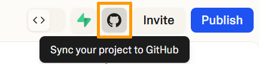

## Objectif

[Lovable](https://lovable.dev) est un outil qui permet de générer des sites web à partir de prompts. Ce guide vous explique comment importer et publier un site web généré via Lovable sur un **VPS OVHcloud**.

## Prérequis

- Disposer d'une offre [VPS OVHcloud](/links/bare-metal/vps)
- Disposer d'un accès administrateur (sudo) via SSH à votre serveur
- Posséder un compte sur [Lovable](https://lovable.dev)

## En pratique

### Sommaire

- [Étape 1 : Générer votre site web sur Lovable.dev](#step1)
- [Étape 2 : Exporter votre site web via GitHub et le récupérer](#step2)
- [Étape 3 : Envoyer l’archive sur le VPS](#step3)
- [Étape 4 : Installer Node.js et les outils nécessaires](#step4)
- [Étape 5 : Décompresser et construire votre site web](#step5)
- [Étape 6 : Déployer votre site web](#step6)
- [Étape 7 : Installer et configurer le serveur web](#step7)
- [Étape 8 : Accéder à votre site web](#step8)
- [Conclusion](#conclusion)
- [Aller plus loin](#go-further)

### Étape 1 : Générer votre site web sur Lovable.dev <a name="step1"></a>

1. Rendez-vous sur [https://lovable.dev](https://lovable.dev).
2. Créez un compte si ce n'est pas déjà fait.
3. Entrez votre prompt pour générer votre site web.

### Étape 2 : Exporter votre site web via GitHub et le récupérer <a name="step2"></a>

Une fois votre site web généré par Lovable, exportez-le via GitHub. Dans l'interface principale de Lovable, cliquez en haut à droite sur l'icône de Github (`Sync your project to GitHub`).

{.thumbnail}

Pour connecter votre compte Lovable à GitHub, suivez la documentation officielle de [Lovable](https://lovable.dev/integrations/github).

Une fois le processus terminé, un nouveau dépôt contenant le code de votre site web est présent dans votre compte GitHub.

Depuis ce dépôt GitHub, effectuez les actions suivantes :

1. Cliquez sur `Code`{.action} puis sur `Download ZIP`{.action}.
1. Cela télécharge un fichier `.zip` contenant votre projet.
1. Décompressez-le.

### Étape 3 : Envoyer l’archive sur le VPS <a name="step3"></a>

Dans votre terminal (à l’emplacement où se trouve le fichier .zip), utilisez cette commande :

```bash
scp mon_site.zip <utilisateur>@<IP_VPS>:~
```

Remplacez :

- `mon_site.zip` par le nom du fichier téléchargé depuis Lovable
- `<utilisateur>` par votre nom d'utilisateur root (ex: debian, root, etc.)
- `<IP_VPS>` par l'adresse IP publique ou le nom DNS de votre VPS

`~` fait référence au dossier personnel de l'utilisateur.

### Étape 4 : Installer Node.js et les outils nécessaires <a name="step4"></a>

Connectez-vous en SSH à votre VPS :

```bash
ssh <utilisateur>@<IP_VPS>
```

Pour construire un site web Lovable, vous devez compiler le projet React en version optimisée à l’aide de la commande `npm run build`. Pour cela, il vous faut les éléments suivants sur le VPS :

- `Node.js` : L’environnement JavaScript nécessaire à l’exécution de React.
- `npm` : Le gestionnaire de paquets JavaScript qui installe les dépendances du projet.
- `curl` : Permet de télécharger le script d’installation de Node.js.
- `unzip` : Sert à extraire l’archive `.zip` du site exporté depuis Lovable.

Exécutez ces commandes :

```bash
sudo apt update
sudo apt install curl unzip -y
curl -fsSL https://deb.nodesource.com/setup_18.x | sudo bash -
sudo apt install -y nodejs
```

Vérifiez l'installation :

```bash
node -v
npm -v
```

### Étape 5 : Décompresser et construire votre site web <a name="step5"></a>

Décompressez l'archive `.zip` dans un dossier de destination (ex: `lovable-src`):

```bash
unzip mon_site.zip -d lovable-src
```

Entrez dans le dossier de destination :

```bash
cd lovable-src/mon_site
```

Installez les dépendances nécessaires :

```bash
npm install
```

Cela va installer toutes les bibliothèques React/Lovable définies dans le fichier `package.json`.

Générez les fichiers optimisés (build de production) :

```bash
npm run build
```

Cela crée un dossier `dist/` contenant les fichiers HTML, CSS et JS minifiés.

### Étape 6 : Déployer votre site web <a name="step6"></a>

Créez le dossier public :

```bash
sudo mkdir -p /var/www/lovable
sudo cp -r dist/* /var/www/lovable/
```

### Étape 7 : Installer et configurer le serveur web <a name="step7"></a>

> [!primary]
>
> Pour ce guide, nous choisissons NGINX mais vous êtes libre d'installer le serveur web de votre choix.
>

Installez NGINX :

```bash
sudo apt install nginx -y
```

Créez un fichier de configuration pour votre site :

```bash
sudo nano /etc/nginx/sites-available/lovable
```

Collez le contenu suivant, en remplaçant `adresse_du_vps` par l'adresse IP de votre VPS ou votre nom de domaine :

```console
server {
    listen 80;
    server_name IP_VPS;

    root /var/www/lovable;
    index index.html;

    location / {
        try_files $uri /index.html;
    }
}
```

Remplacez `IP_VPS` par l'adresse IP de votre VPS ou votre nom de domaine.

Activez cette configuration :

```bash
sudo ln -s /etc/nginx/sites-available/lovable /etc/nginx/sites-enabled/
sudo nginx -t
```

Redémarrez NGINX pour appliquer la configuration :

```bash
sudo systemctl start nginx
```

Si le service est déjà actif, utilisez plutôt :

```bash
sudo systemctl reload nginx
```

### Étape 8 : Accéder à votre site web <a name="step8"></a>

Dans votre navigateur, entrez :

```console
http://IP_VPS
```

ou :

```console
http://NOM_DE_DOMAINE
```

Votre site web Lovable s'affiche alors.

### Conclusion <a name="conclusion"></a>

En quelques minutes, vous avez créé votre site web avec Lovable, puis l’avez mis en ligne sur votre VPS OVHcloud. Si vous souhaitez le sécuriser avec HTTPS, suivez notre guide « [Comment installer un certificat SSL sur un VPS](/pages/bare_metal_cloud/virtual_private_servers/install-ssl-certificate) ».

## Aller plus loin <a name="go-further"></a>

[Installer un environnement de développement web sur un VPS](/pages/bare_metal_cloud/virtual_private_servers/install_env_web_dev_on_vps)

[Sécuriser un VPS](/pages/bare_metal_cloud/virtual_private_servers/secure_your_vps)

Pour des prestations spécialisées (référencement, développement, etc), contactez les [partenaires OVHcloud](/links/partner)

Échangez avec notre [communauté d'utilisateurs](/links/community).