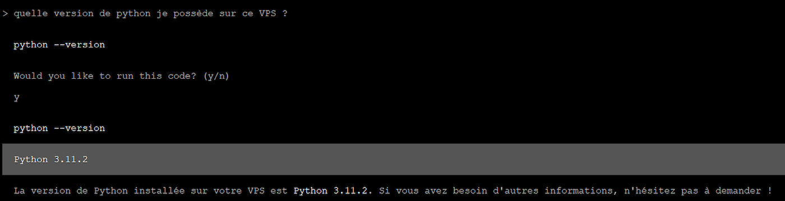
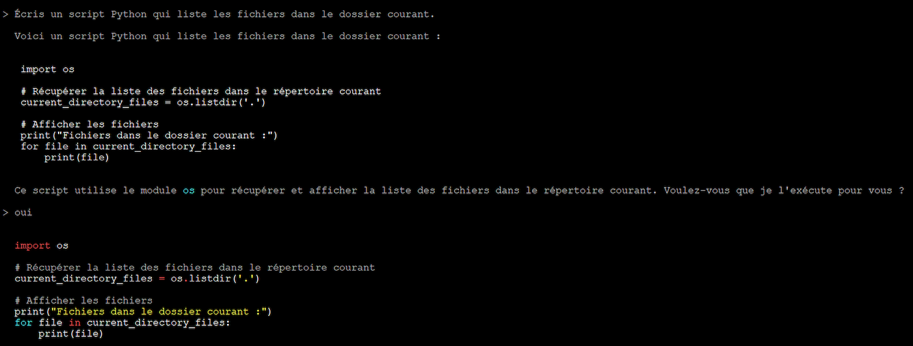

## Objective

This guide explains how to deploy an on-premises AI agent on an OVHcloud VPS, without depending on the cloud of external providers. You will use a ready-to-use Docker container containing an open-source AI agent, such as [Open Interpreter](https://github.com/openinterpreter/open-interpreter), [GPT4All](https://github.com/nomic-ai/gpt4all) or [Auto-GPT](https://github.com/Significant-Gravitas/AutoGPT).

**Find out how to deploy an AI agent such as Open Interpreter or GPT4All on an OVHcloud VPS.**

## Requirements

- An [OVHcloud VPS](/links/bare-metal/vps) (Debian 11 or higher is recommended)
- Administrative (sudo) SSH access to your server
- Python ≥ 3.10 installed on the VPS

## Instructions

### Update your VPS and install Python <a name="step1"></a>

Open a terminal and connect to your VPS with the following command (replacing `VPS_IP` with the real IP):

```bash
ssh <user>@VPS_IP
```

Update the packages:

```bash
sudo apt update && sudo apt upgrade -y
```

Verify that Python ≥ 3.10 is installed:

```bash
python3 --version
```

If necessary, install Python 3.10+ and pip:

```bash
sudo apt install -y python3 python3-pip python3-venv
```

### Create a virtual environment and install Open Interpreter <a name="step2"></a>

Recent environments limit the use of `pip` globally. It is recommended that you create and use a virtual environment:

```bash
python3 -m venv ~/venv-openinterpreter
source ~/venv-openinterpreter/bin/activate
```

Install Open Interpreter:

```bash
pip install --upgrade pip
pip install open-interpreter
```

### Configure an AI template for the agent (local or remote) <a name="step3"></a>

#### Option 1 - Use OpenAI (GPT-4o, GPT-3.5, etc.)

You must have an OpenAI API key. Add it when you launch it for the first time, or set it beforehand:

```bash
export OPENAI_API_KEY="API_KEY"
interpret
```

Then follow the instructions.

#### Option 2 - Use a local model (via Ollama)

If you do not want to use OpenAI, run a local model using Ollama:

```bash
interpreter --local
```

This will give you several options (Ollama, LM Studio, etc.). We recommend using Ollama, as it is easy to install and compatible with several modern models such as `llama3` or `mistral`.

Install Ollama:

```bash
sudo apt install curl -y
curl -fsSL https://ollama.com/install.sh | sh
exec $SHELL
```

Load the model:

```bash
ollama pull mistral
```

Then try again:

```bash
interpreter --local
```

#### Common errors

**Model requires more system memory (6 GiB) than is available (1 GiB)**

This error indicates that your VPS does not have enough RAM. Here are your options:

- Choose a new VPS with at least 8 GB RAM.
- Use the OpenAI API (see `Option 1` above).
- Use a lighter model, like mistral.

### Test your AI Agent <a name="step4"></a>

Test the following use cases:

```console
What is in the /tmp folder?
```

Sample response:

{.thumbnail}

```console
Write a Python script that lists the files in the current folder.
```

The agent interprets your request, generates code, and executes it locally.

Sample response:

{.thumbnail}

### Conclusion <a name="step5"></a>

With this guide, you have installed an AI agent on your OVHcloud VPS, capable of executing commands from simple natural language instructions. Whether you have opted for a remote model like GPT-4 via OpenAI or a local model like Mistral via Ollama, you now have an intelligent assistant directly in your terminal, without dependency on a web interface or a third-party service.

## Go further

For specialized services (SEO, development, etc.), contact [OVHcloud partners](/links/partner)

Join our [community of users](/links/community).