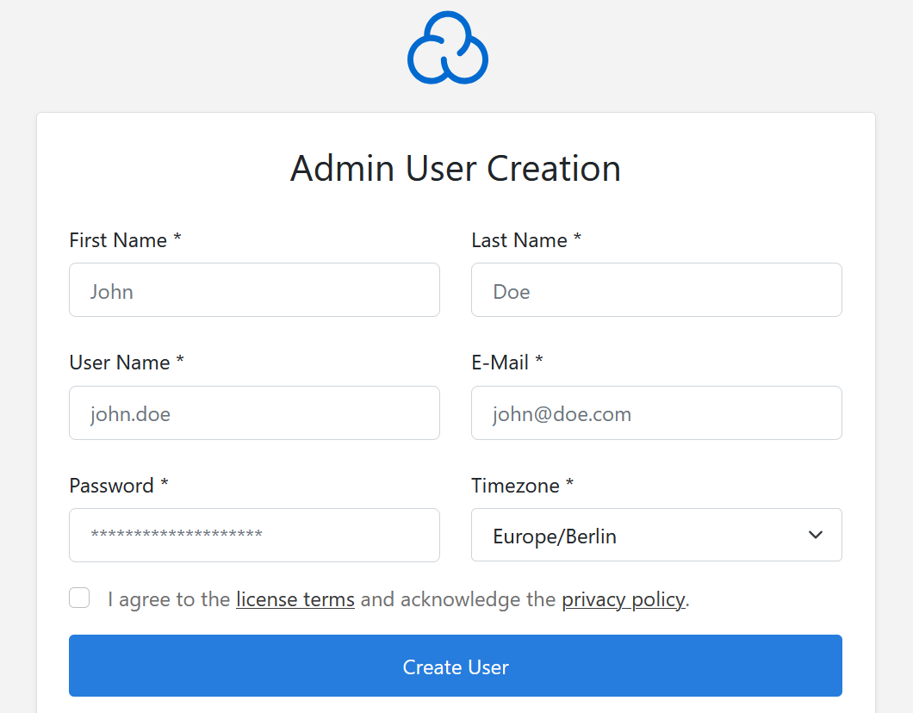

## Objectif

CloudPanel est un panneau de contrôle d’hébergement moderne, léger et performant, offrant une interface web pour déployer et gérer :

- des sites web utilisant PHP ou Node.js ;
- des bases de données ;
- des certificats SSL/TLS (Let’s Encrypt) ;
- des utilisateurs ;
- un pare-feu.

Ce guide explique comment installer CloudPanel sur un VPS ou un serveur dédié OVHcloud et comment vous y connecter pour réaliser la configuration initiale.

> [!warning]
>
> OVHcloud met à votre disposition des services dont la configuration, la gestion et la responsabilité vous incombent. Il vous revient de ce fait d’en assurer le bon fonctionnement.
>
> Nous mettons à votre disposition ce tutoriel afin de vous accompagner au mieux sur des tâches courantes. Néanmoins, nous vous recommandons de faire appel à un [prestataire spécialisé](/links/partner) et/ou de contacter l’éditeur du service si vous éprouvez des difficultés. En effet, nous ne serons pas en mesure de vous fournir une assistance. Plus d’informations dans la section « [Aller plus loin](#go-further) » de ce tutoriel.

## Prérequis

- Disposer d’un [VPS](/links/bare-metal/vps) ou d’un [serveur dédié](/links/bare-metal/bare-metal) avec une [configuration recommandée](https://www.cloudpanel.io/docs/v2/requirements/) dans votre [espace client OVHcloud](/links/manager).
- Disposer d’un accès administrateur (sudo) via SSH à votre serveur.

## En pratique

### Étape 1 — Connexion et mise à jour du système

#### Se connecter au serveur

Ouvrez un terminal et connectez-vous à votre VPS (ou à votre serveur dédié) avec la commande suivante :

```bash
ssh user@IP_VPS
```

Remplacez :

- `user` par votre nom d’utilisateur.
- `IP_VPS` par l’adresse IP de votre VPS.

#### Mettre à jour le système

Mettez votre système d’exploitation à jour. Cette opération peut prendre plusieurs minutes.

> [!tabs]
> Debian et Ubuntu
>>
>> ```bash
>> sudo apt update && sudo apt -y upgrade
>> ```
>>
> AlmaLinux 9 et Rocky Linux 8
>>
>> ```bash
>> sudo dnf -y update
>> ```

### Étape 2 — Ouvrir les ports nécessaires (pare-feu)

Pour autoriser les connexions entrantes et sortantes, référez-vous à la section **Port Firewall** de la [documentation officielle de CloudPanel](https://www.cloudpanel.io/docs/v2/guides/best-practices/security/) pour connaître les ports à ouvrir selon vos besoins.

#### Exemple d’ouverture de ports pour Debian et Ubuntu

1. Installez `UFW` :

    ```bash
    sudo apt -y install ufw
    ```

2. Ouvrez les ports nécessaires (exemples : SSH, panneau CloudPanel, HTTP/HTTPS) :

    ```bash
    sudo ufw allow 22/tcp
    sudo ufw allow 8443/tcp
    sudo ufw allow 80/tcp
    sudo ufw allow 443/tcp
    ```

3. Activez `UFW` et vérifiez son statut (la valeur « ALLOW » est attendue) :

    ```bash
    sudo ufw enable
    sudo ufw status
    ```

#### Exemple d’ouverture de ports pour AlmaLinux 9 et Rocky Linux 8

1. Installez `firewalld` :

    ```bash
    sudo dnf -y install firewalld
    ```

2. Activez et démarrez le service :

    ```bash
    sudo systemctl enable --now firewalld
    ```

3. Ouvrez les ports nécessaires (exemples : SSH, panneau CloudPanel, HTTP/HTTPS) :

    ```bash
    sudo firewall-cmd --add-service=ssh --permanent
    sudo firewall-cmd --add-service=http --permanent
    sudo firewall-cmd --add-service=https --permanent
    sudo firewall-cmd --add-port=8443/tcp --permanent
    ```

4. Appliquez la configuration :

    ```bash
    sudo firewall-cmd --reload
    sudo firewall-cmd --list-all
    ```

### Étape 3 — Installer CloudPanel

1. Installez `wget`

> [!tabs]
> Debian et Ubuntu
>>
>> ```bash
>> sudo apt -y install wget
>> ```
>>
> AlmaLinux 9 et Rocky Linux 8
>>
>> ```bash
>> sudo dnf -y install wget
>> ```

2. Téléchargez le script d’installation de CloudPanel :

    ```bash
    wget https://installer.cloudpanel.io/ce/v2/install.sh -O install.sh
    ```

3. Lancez l’installateur avec le moteur de base de données souhaité

Exécutez le script en indiquant la base de données que vous souhaitez installer (MySQL ou MariaDB) :

Exemple avec MySQL 8.4 :

```bash
sudo DB_ENGINE=MYSQL_8.4 bash install.sh
```

Exemple avec MariaDB 11.4 :

```bash
sudo DB_ENGINE=MARIADB_11.4 bash install.sh
```

L’installation peut durer plusieurs minutes, car le script installe automatiquement les dépendances nécessaires.

### Étape 4 — Première connexion

Une fois l’installation terminée, entrez l’URL `https://<IP_VPS>:8443` dans votre navigateur en remplaçant `<IP_VPS>` par l’adresse IP de votre VPS.

> [!primary]
>
> Lors du premier accès, un certificat autosigné est utilisé. Acceptez l’avertissement du navigateur pour continuer.

L’interface ci-dessous s’affiche :

{.thumbnail}

Au premier lancement, CloudPanel vous demande de créer le compte administrateur en renseignant un nom d'utilisateur, une adresse e-mail et un mot de passe. Après avoir effectué cette étape, entrez le nom d'utilisateur et le mot de passe que vous venez de définir pour vous connecter. Vous arrivez ensuite sur l’interface d’administration CloudPanel.

## Aller plus loin <a name="go-further"></a>

[Sécuriser un VPS](/pages/bare_metal_cloud/virtual_private_servers/secure_your_vps)

[Sécuriser un serveur dédié](/pages/bare_metal_cloud/dedicated_servers/securing-a-dedicated-server)

Pour des prestations spécialisées (référencement, développement, etc.), contactez les [partenaires OVHcloud](/links/partner)

Échangez avec notre [communauté d’utilisateurs](/links/community).