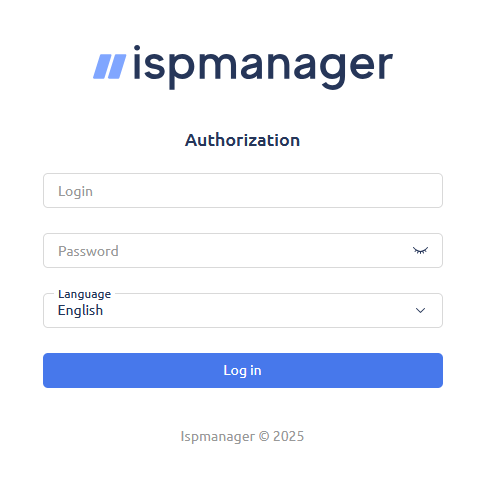

## Objectif
  
ISPmanager est un panneau d’hébergement web tout-en-un qui facilite la gestion des sites web, bases de données, comptes, certificats TLS/Let’s Encrypt et services associés via une interface web. Ce guide vous explique comment installer ISPmanager sur un VPS ou un serveur dédié vierge et accéder à l’interface pour la configuration initiale.

**Découvrez comment installer ISPmanager sur un VPS ou un serveur dédié OVHcloud.**

> [!warning]
>
> OVHcloud met à votre disposition des services dont la configuration, la gestion et la responsabilité vous incombent. Il vous revient de ce fait d’en assurer le bon fonctionnement.
>
> Nous mettons à votre disposition ce tutoriel afin de vous accompagner au mieux sur des tâches courantes. Néanmoins, nous vous recommandons de faire appel à un [prestataire spécialisé](/links/partner) et/ou de contacter l’éditeur du service si vous éprouvez des difficultés. En effet, nous ne serons pas en mesure de vous fournir une assistance. Plus d’informations dans la section [Aller plus loin](#go-further) de ce tutoriel.
>

## Prérequis

- Disposer d’une offre [VPS](/links/bare-metal/vps) ou d’un [serveur dédié](/links/bare-metal/bare-metal) dans votre [espace client OVHcloud](/links/manager) avec une [configuration recommandée](https://www.ispmanager.com/docs/ispmanager/system-requirements).
- Disposer d’un accès administrateur (sudo) via SSH à votre serveur.

## En pratique


### Étape 1 — Connexion et mise à jour du système

#### Se connecter au serveur

Ouvrez un terminal et connectez-vous à votre VPS (ou à votre serveur dédié) avec la commande suivante :

```bash
ssh user@IP_VPS
```

Remplacez :

- `user` par votre nom d’utilisateur.
- `IP_VPS` par l’adresse IP de votre VPS.

#### Mettre à jour le système

Mettez votre système d’exploitation à jour. Cette opération peut prendre plusieurs minutes.

> [!tabs]
> Debian et Ubuntu
>> ```bash
>> sudo apt update && sudo apt -y upgrade
>> ```
> AlmaLinux et Rocky Linux
>> ```bash
>> sudo dnf -y update
>> ```

### Étape 2 — Ouvrir les ports nécessaires (pare-feu)

Pour autoriser les connexions entrantes et sortantes, consultez la [documentation officielle d’ISPmanager](https://www.ispmanager.com/docs/ispmanager/system-requirements#firewall) pour connaître les ports à ouvrir selon vos besoins.

#### Exemple d’ouverture de ports pour Debian / Ubuntu

1. Installez `UFW` :

```bash
sudo apt -y install ufw
```

2. Ouvrez les ports nécessaires (exemples : SSH, panneau ISPmanager, HTTP/HTTPS) :

```bash
sudo ufw allow 22/tcp
sudo ufw allow 1500/tcp
sudo ufw allow 80/tcp
sudo ufw allow 443/tcp
```

3. Activez `UFW` et vérifiez son statut (la valeur « ALLOW » est attendue) :

```bash
sudo ufw enable
sudo ufw status
```

#### Exemple d’ouverture de ports pour AlmaLinux

1. Installez `firewalld` :

```bash
sudo dnf -y install firewalld
```

2. Activez et démarrez le service :

```bash
sudo systemctl enable --now firewalld
```

3. Ouvrez les ports nécessaires (exemples : SSH, panneau ISPmanager, HTTP/HTTPS) :

```bash
sudo firewall-cmd --add-service=ssh --permanent
sudo firewall-cmd --add-service=http --permanent
sudo firewall-cmd --add-service=https --permanent
sudo firewall-cmd --add-port=1500/tcp --permanent
```

4. Appliquez la configuration :

```bash
sudo firewall-cmd --reload
sudo firewall-cmd --list-all
```

### Étape 3 — Installer ISPmanager

1. Installez `wget`

> [!tabs]
> Debian et Ubuntu
>> ```bash
>> sudo apt -y install wget
>> ```
> AlmaLinux 9 et Rocky Linux 8
>> ```bash
>> sudo dnf -y install wget
>> ```

2. Téléchargez le script d’installation d'ISPmanager :

```bash
wget https://download.ispmanager.com/install.eu.sh -O install.eu.sh
```

3. Lancez l’installeur :

```bash
sudo sh install.eu.sh
```

Pendant l’installation :

- Choisissez la branche stable.  
- Sélectionnez l’édition (Lite/Pro/Host) avec les composants recommandés.
- Choisissez le serveur web et la base de données de votre choix.
- L’installeur installe les dépendances nécessaires (cela peut prendre plusieurs minutes).

#### Message « Incorrect hostname » pendant l’installation

Si le message suivant s’affiche pendant l’installation :

```console
You have incorrect hostname: vps-xxxx-vps-ovh-net  
Enter new hostname (or Ctrl+C to exit):
```

Cela signifie que le nom d’hôte (hostname) de votre serveur n’est pas un nom de domaine complet (FQDN). Pour continuer, entrez un nom de domaine valide qui pointe vers votre serveur, par exemple :

```console
ispmanager.mondomaine.ovh
```

Si vous ne disposez pas encore d’un nom de domaine lié à votre VPS, consultez notre guide « [Éditer une zone DNS OVHcloud](/pages/web_cloud/domains/dns_zone_edit) » pour faire pointer votre nom de domaine vers l’adresse IP de votre VPS.

### Étape 4 — Première connexion

Une fois l’installation terminée, entrez l’URL `https://<IP_VPS>:1500/ispmgr` dans votre navigateur en remplaçant `<IP_VPS>` par l’adresse IP de votre VPS.

> [!primary]
>
> Au premier accès, un certificat auto-signé est utilisé. Acceptez l’avertissement du navigateur pour continuer.

L’interface ci-dessous s’affiche :

{.thumbnail}

Par défaut, la première connexion à l’interface d’ISPmanager se fait avec le compte système `root` du serveur. Si vous vous connectez en SSH avec un utilisateur non-root (ex. `almalinux`, `debian`, `ubuntu`) et que `root` n’a pas de mot de passe, exécutez les lignes de commande suivantes :

Passez en root :

```bash
sudo -i
```

Définissez un mot de passe pour l’utilisateur root :

```bash
passwd root
```

Sur l’interface de connexion d’ISPmanager, entrez les valeurs suivantes :

- Identifiant : **root**.
- Mot de passe : le mot de passe du compte **root** que vous venez de définir.

Acceptez le contrat de licence qui s’affiche pour continuer. L’installation est terminée et l’interface d’administration d’ISPmanager est accessible à l’adresse `https://<IP_VPS>:1500/ispmgr`.

## Aller plus loin <a name="go-further"></a>

[Sécuriser un VPS](/pages/bare_metal_cloud/virtual_private_servers/secure_your_vps)

[Sécuriser un serveur dédié](/pages/bare_metal_cloud/dedicated_servers/securing-a-dedicated-server)

Pour des prestations spécialisées (référencement, développement, etc.), contactez les [partenaires OVHcloud](/links/partner)

Échangez avec notre [communauté d’utilisateurs](/links/community).