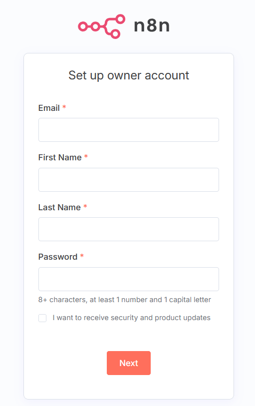
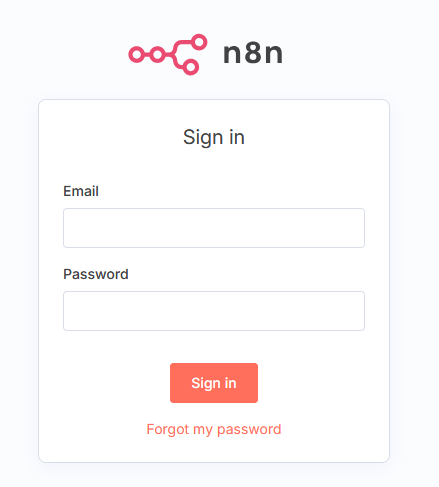

## Objective

This guide explains how to install and run [n8n](https://n8n.io), an open-source platform for workflow automation, on an OVHcloud VPS. The installation relies on [Docker](https://www.docker.com/), with the server [Traefik](https://doc.traefik.io/traefik/) to automatically manage SSL certificates.

This guide explains how to install and run [n8n](https://n8n.io), an open-source platform for workflow automation, on an OVHcloud VPS. [Manual installation](#step3) relies on [Docker](https://www.docker.com/), with the server [Traefik](https://doc.traefik.io/traefik/) to automatically manage SSL certificates. For a [turn-key setup](#step2), opt for an [OVHcloud preinstalled n8n VPS](https://www.ovhcloud.com/en-gb/vps/vps-n8n/).

## Requirements

- A [VPS](/links/bare-metal/vps) solution
- A domain name
- Administrative (sudo) access to your server via SSH

## Instructions

### Contents

- [Log in to your VPS](#step1)
- [You are using a pre-installed OVHcloud image](#step2)
- [You do not use a pre-installed OVHcloud image](#step3)
- [DNS configuration](#step4)
- [Access the n8n interface](#step5)
- [Conclusion](#step6)

### Log in to your VPS <a name="step1"></a>

Open a terminal and connect to your VPS with the following command (replacing `IP_VPS` with the real IP):

```bash
ssh <user>@IP_VPS
```

### You are using a pre-installed OVHcloud image <a name="step2"></a>

If you have chosen an OVHcloud **VPS with the n8n image pre-installed**, **you do not need to install Docker or Docker Compose** : these tools are already present and configured.

Find all the necessary files (including `docker-compose.yml` and `.env`) in the `/home/debian/n8n/` folder on your VPS.

Navigate to the `/home/debian/n8n/` folder and edit the `.env` file:

```bash
cd /home/debian/n8n/
nano .env
```

Enter the following information:

- `DOMAIN_NAME`: your domain name (e.g. `vps.ovh.net`).
- `SUBDOMAIN`: the subdomain used to access n8n (e.g. `vps-xxxxxxx`).
- `SSL_EMAIL`: the email address used to generate SSL certificates via Let’s Encrypt.

Once you have updated the file `.env`, run the following command from the directory `/home/debian/n8n/`:

```bash
docker compose up -d
```

### You are not using an OVHcloud pre-installed image <a name="step3"></a>

#### Install Docker and Docker Compose

To deploy n8n via Docker on an OVHcloud VPS, Docker and Docker Compose must be installed. This method is compatible with the majority of distributions offered by OVHcloud (Debian 11, Debian 12, Ubuntu 22.04...).

#### Step 1 - Update the system

```bash
sudo apt update && sudo apt upgrade -y
```

#### Step 2 - Add the official Docker GPG key

```bash
sudo apt install -y ca-certificates curl gnupg
sudo install -m 0755 -d /etc/apt/keyrings
curl -fsSL https://download.docker.com/linux/debian/gpg | sudo gpg --dearmor -o /etc/apt/keyrings/docker.gpg
```

#### Step 3 - Add the Docker repository

For Debian (versions 11 and 12):

```bash
echo "deb [arch=$(dpkg --print-architecture) signed-by=/etc/apt/keyrings/docker.gpg] https://download.docker.com/linux/debian $(lsb_release -cs) stable" | sudo tee /etc/apt/sources.list.d/docker.list > /dev/null
```

For Ubuntu (version equal to or higher than 22.04):

```bash
echo "deb [arch=$(dpkg --print-architecture) signed-by=/etc/apt/keyrings/docker.gpg] https://download.docker.com/linux/ubuntu $(lsb_release -cs) stable" | sudo tee /etc/apt/sources.list.d/docker.list > /dev/null
```

#### Step 4 - Install Docker Engine and Docker Compose Plugin

```bash
sudo apt update
sudo apt install -y docker-ce docker-ce-cli containerd.io docker-buildx-plugin docker-compose-plugin
```

#### Step 5 - Verify that Docker and Docker Compose are working

```bash
docker --version
docker compose version
```

#### Prepare the Traefik + n8n configuration

Create a project folder where the Docker stack will reside:

```bash
mkdir n8n-traefik && cd n8n-traefik
```

#### Create the configuration files

#### .env file

This file allows you to define the variables that are reused in the `docker-compose.yml` file.

Create the file:

```bash
nano .env
```

Paste the following content into it:

```ini
DOMAIN_NAME=example.com
SUBDOMAIN=n8n
SSL_EMAIL=admin@example.com
```

Replace `example.com` with your real domain name and `admin@example.com` with the email of your choice.

> [!warning]
>
> If you do not have a domain name yet, order one from our [website](/links/web/domains).

##### docker-compose.yml file

This file contains the definition of the n8n and Traefik services. In particular, it configures:

- Reverse proxy and SSL management with Traefik.
- Basic authentication to access n8n.

Create the file:

```bash
nano docker-compose.yml
```

Paste the following content:

```yaml
services:
  traefik:
    image: traefik:v2.11
    container_name: traefik
    restart: always
    command:
      - "--api.insecure=true"
      - "--providers.docker=true"
      - "--entrypoints.web.address=:80"
      - "--entrypoints.websecure.address=:443"
      - "--certificatesresolvers.myresolver.acme.httpchallenge=true"
      - "--certificatesresolvers.myresolver.acme.httpchallenge.entrypoint=web"
      - "--certificatesresolvers.myresolver.acme.email=${SSL_EMAIL}"
      - "--certificatesresolvers.myresolver.acme.storage=/letsencrypt/acme.json"
    ports:
      - "80:80"
      - "443:443"
    volumes:
      - "/var/run/docker.sock:/var/run/docker.sock:ro"
      - "./letsencrypt:/letsencrypt"
    labels:
      - "traefik.http.routers.http-catch.rule=Host(`${SUBDOMAIN}.${DOMAIN_NAME}`)"
      - "traefik.http.routers.http-catch.entrypoints=web"
      - "traefik.http.routers.http-catch.middlewares=redirect-to-https"
      - "traefik.http.middlewares.redirect-to-https.redirectscheme.scheme=https"

  n8n:
    image: n8nio/n8n
    container_name: n8n
    restart: always
    environment:
      - N8N_BASIC_AUTH_ACTIVE=true
      - N8N_BASIC_AUTH_USER=admin
      - N8N_BASIC_AUTH_PASSWORD=admin123
      - N8N_HOST=${SUBDOMAIN}.${DOMAIN_NAME}
      - WEBHOOK_URL=https://${SUBDOMAIN}.${DOMAIN_NAME}/
    labels:
      - "traefik.enable=true"
      - "traefik.http.routers.n8n.rule=Host(`${SUBDOMAIN}.${DOMAIN_NAME}`)"
      - "traefik.http.routers.n8n.entrypoints=websecure"
      - "traefik.http.routers.n8n.tls.certresolver=myresolver"
      - "traefik.http.services.n8n.loadbalancer.server.port=5678"
    volumes:
      - n8n_data:/home/node/.n8n

volumes:
  n8n_data:
```

> [!warning]
>
> By default, the user and password are set to admin / admin123. This method is not enabled in all versions of n8n. If you would like to use it anyway, remember to change these values in the docker-compose.yml file before launching the stack, and use a strong password.

#### Prepare the SSL certificate folder

Traefik stores the certificates generated by Let's Encrypt in a file named `acme.json`. This file must exist before launch and have strict permissions.

Create the folder:

```bash
mkdir letsencrypt
```

Create the empty file:

```bash
touch letsencrypt/acme.json
chmod 600 letsencrypt/acme.json
```

#### Start services

Launch the stack with Docker Compose:

```bash
docker compose up -d
```

### DNS configuration <a name="step4"></a>

Ensure that your subdomain (e.g. n8n.example.com) points to your VPS’s IP address in the DNS zone. For more details, please read our guide on [Editing an OVHcloud DNS zone](/pages/web_cloud/domains/dns_zone_edit) .

> [!warning]
>
> If you do not have a domain name yet, order one from our [website](/links/web/domains).

### Access the n8n interface <a name="step5"></a>

Access n8n in a browser via the URL `https://n8n.example.com/`. Replace `n8n.example.com` with the actual domain you have defined.

> [!warning]
>
> Since version 1.0 of n8n, you must create an administrator account when you first access your self-hosted instance, even if you already have an account on [n8n.cloud](https://n8n.cloud). The accounts are **specific to each instance**. An account created on your VPS cannot be used on another instance, even with the same email address.

> [!tabs]
> First access
>> A form for creating an account will appear. Complete it to configure the first admin user of your n8n instance.
>>
>>{.thumbnail}
>>
> Your n8n account is already created
>> You are redirected to the login screen. Use the credentials defined above.
>>
>> {.thumbnail}

### Conclusion <a name="step6"></a>

You now have a secure, operational n8n instance on your OVHcloud VPS, with automatic SSL certificate management using Traefik. To go further, please refer to the [official n8n documentation](https://docs.n8n.io/) to create your first workflows.

## Go further

[Edit an OVHcloud DNS zone](/pages/web_cloud/domains/dns_zone_edit)

For specialized services (SEO, development, etc.), contact the [OVHcloud partners](/links/partner)

Join our [community of users](/links/community).