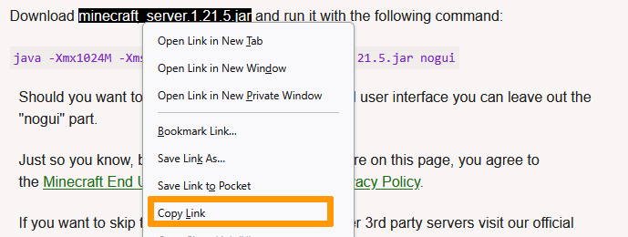

## Ziel

Minecraft ist ein populäres Sandbox-Spiel. Es muss auf einem Server gehostet werden, wenn Sie im Multiplayer-Modus spielen möchten.

Sie können einen vorkonfigurierten Minecraft-Server mieten oder einen solchen selbst auf einem [VPS](/links/bare-metal/vps) oder einem dedizierten [Server](/links/bare-metal/bare-metal) installieren. Dadurch werden die Kosten reduziert und Sie haben die volle Kontrolle über Ihre Spielinstanz.

**Diese Anleitung erklärt, wie Sie einen Minecraft-Server Java Edition auf einem OVHcloud VPS starten und die Verbindung testen.**

> [!warning]
> In diesem Tutorial erläutern wir die Verwendung einer oder mehrerer OVHcloud Lösungen mit externen Tools. Die durchgeführten Aktionen werden in einem bestimmten Kontext beschrieben. Denken Sie daran, diese an Ihre Situation anzupassen.
>
> Wir empfehlen Ihnen jedoch, sich bei Schwierigkeiten an einen [spezialisierten Dienstleister](/links/partner) zu wenden oder Ihre Fragen an die [OVHcloud Community](/links/community) zu richten. Leider können wir Ihnen für externe Dienstleistungen keine weitergehende Unterstützung anbieten.
>


## Voraussetzungen

- Sie haben einen [VPS](/links/bare-metal/vps) in Ihrem OVHcloud Kunden-Account.
- Sie haben eine GNU/Linux Distribution auf dem Server installiert.
- Administrator-Zugang (sudo) über SSH auf Ihren Server.
- Sie verfügen über ein grundlegendes Verständnis der GNU/Linux-Administration.

## In der praktischen Anwendung

> [!primary]
> Diese Anleitung basiert auf der Minecraft Java Edition Version "1.21" und der OpenJDK Version "24.0.1".
>

### Schritt 1: Server vorbereiten

Konfigurieren Sie zunächst Ihren VPS für eine Minecraft-Installation.
<br>Es wird empfohlen, einen neuen VPS zu bestellen oder einen bestehenden Server über Ihr [OVHcloud Kundencenter](/links/manager) zu [re-installieren](/pages/bare_metal_cloud/virtual_private_servers/starting_with_a_vps#reinstallvps) und dabei die neueste verfügbare Version von Ubuntu oder Debian zu verwenden.

Wenn das Betriebssystem installiert ist, verbinden Sie sich mit Ihrem VPS per SSH, wie in der Anleitung "[Erste Schritte mit einem VPS](/pages/bare_metal_cloud/virtual_private_servers/starting_with_a_vps)" erklärt.

Aktualisieren Sie zunächst die Pakete auf die neuesten Versionen:

```sh
$ sudo apt update
```

```sh
$ sudo apt full-upgrade
```

Verwenden Sie folgenden Befehl, um sicherzustellen, dass alle notwendigen Pakete installiert sind:

```sh
$ sudo apt install screen nano wget git
```

Installieren Sie das Java-Paket:

```sh
$ sudo apt install openjdk-24-jdk
```

Um Sicherheitslücken in Ihrem System zu vermeiden, erstellen Sie einen Benutzer namens "minecraft", der die Server-Aktionen ausführen wird:

```sh
$ sudo adduser minecraft --disabled-password
```

Bestätigen Sie einfach mit `Enter`{.action}, um das Ausfüllen der üblichen Kontoinformationen zu überspringen.

Der Benutzer wurde erstellt. Bitte beachten Sie, dass für diesen Benutzer kein Passwort festgelegt wurde. Das ist normal, da das Konto nur zugänglich ist, wenn Sie bereits mit Ihrem eigenen Benutzerkonto über SSH verbunden sind.

Wechseln Sie zum neuen Benutzer:

```sh
$ sudo su - minecraft
```

> [!primary]
>
> Alle nachfolgenden Befehle sind vom Benutzer "minecraft" auszuführen.
>

Erstellen Sie einen Ordner mit dem Namen `server`.

```sh
$ mkdir ~/server && cd ~/server
```

### Schritt 2: Ihren Minecraft-Server installieren

> [!primary]
>
> Ein "Vanilla"-Server ist eine Instanz ohne jegliche Add-ons oder Plugins. Sie werden das Spiel so erfahren, wie es von den Entwicklern veröffentlicht wurde.
>

Kopieren Sie zuerst den Download-Link für das Server-Programm.  
Klicken Sie dazu auf der offiziellen [Website von Minecraft](https://minecraft.net/download/server) mit der rechten Maustaste auf den Download-Link und wählen Sie `Linkadresse kopieren`{.action}.

{.thumbnail}

Überprüfen Sie in Ihrem Kommandozeilenterminal, dass Sie noch im Verzeichnis `server` sind und verwenden Sie `wget`, um die Datei herunterzuladen.
<br>Ersetzen Sie `download_link` mit der URL, die Sie zuvor kopiert haben.

```sh
~/server$ wget download_link
```

Bevor Sie den Server starten, müssen Sie die EULA (*End User License Agreement*) akzeptieren. Geben Sie hierzu folgenden Befehl ein:

```sh
~/server$ echo "eula=true" > eula.txt
```

Anschließend befindet sich eine Datei namens `eula.txt` im Wurzelverzeichnis Ihres Servers, die die Zeile `eula=true` enthält. Dies zeigt der Software an, dass Sie die Nutzungsbedingungen für Minecraft akzeptieren.  
Die allgemeinen Nutzungsbedingungen finden Sie auf der offiziellen [Website von Minecraft](https://www.minecraft.net/).

Ihr Server kann nun gestartet werden.

In Schritt 1 wurde das Paket `screen` installiert, mit dem mehrere Terminal-Sitzungen (Shell) geöffnet werden können. Wir starten Minecraft nun in einer neuen Session, die im Hintergrund ausgeführt werden kann. Die Verwendung von `screen` kann sehr praktisch sein, weil Sie so mehrere Minecraft-Server gleichzeitig starten können.

Erzeugen Sie zunächst eine neue Shell namens "minecraft1":

```sh
~/$ screen -S minecraft1
```

Das aktive Fenster Ihres Terminals ändert sich und Sie wechseln automatisch auf die neue Shell-Session. Wenn nötig können Sie weitere Shell-Instanzen erstellen und diese über folgenden Befehl auflisten:

```sh
~/server$ screen -ls
```

Um eine Shell zu verlassen (während diese weiter ausgeführt wird), drücken Sie auf `Ctrl`{.action}, dann auf `a`{.action} und dann auf `d`{.action} Ihrer Tastatur.

Um von einer Shell zur anderen zu wechseln verwenden Sie folgenden Befehl:

```sh
~/server$ screen -x name_der_shell
```

Sie können alternativ auch `Ctrl`{.action}, dann auf `a`{.action} und dann auf `n`{.action} Ihrer Tastatur drücken.

Starten Sie den Server in der zuvor erstellten Shell "minecraft1" mit folgendem Befehl. (Verwenden Sie `ls`, um den Namen der Datei zu überprüfen, falls dieser abweicht.)

```sh
~/server$ java -Xmx1024M -Xms1024M -jar server.jar nogui
```

- `Xmx1024M`: Damit wird der Server so konfiguriert, dass er mit 1024 MB oder 1 GB RAM startet. Dieses Limit kann erhöht werden, wenn Sie möchten, dass Ihr Server mit mehr RAM startet.
- `Xms1024M`: Dies lässt den Server maximal 1024M RAM verwenden. Sie können dieses Limit erhöhen, wenn Sie möchten, dass Ihr Server mit mehr RAM läuft, um mehr Spieler unterzubringen oder wenn Sie das Gefühl haben, dass Ihr Server langsam läuft.
- `jar`: Gibt die jar-Datei des Servers an, die ausgeführt werden soll.
- `nogui`: Damit wird dem Server mitgeteilt, dass er keine grafische Benutzeroberfläche starten soll.

Sie können auch den folgenden Befehl verwenden:

```sh
~/server$ java -jar server.jar
```

Sobald der Server läuft, erhalten Sie das folgende Ergebnis:

```console
[14:52:58] [Server thread/INFO]: Done (41.530s)! For help, type "help"
```

Um Ihren Server anzuhalten, geben Sie den Befehl `stop` ein.

### Schritt 3: Mit dem Server verbinden

Ihre Server-Instanz ist nun funktionsfähig. Um zu spielen, beziehen Sie den Minecraft-Client von der [offiziellen Website](https://www.minecraft.net/).

Installieren und starten Sie den Client für Ihr Betriebssystem und registrieren Sie sich.

{.thumbnail}

Geben Sie im folgenden Fenster den Servernamen im Feld `Server Name` ein und die IP-Adresse des Servers im Feld `Server Address`.

{.thumbnail}

Standardmäßig ist kein Port anzugeben.

### Zum Abschluss

Ihr Minecraft Vanilla Server ist nun auf Ihrem VPS installiert.

Beachten Sie, dass diese Installationsanleitung auch für einen [OVHcloud Dedicated Server](/links/bare-metal/bare-metal) oder eine [Public Cloud Instanz](/links/public-cloud/compute) anwendbar ist. Mit diesen Lösungen profitieren Sie auch von garantierten und stabilen physischen Ressourcen, da die Hardware dediziert ist.

## Weiterführende Informationen <a name="gofurther"></a>

Zu Add-ons, Mods und um die Konfiguration Ihres Minecraft-Servers zu individualisieren, finden Sie hier die offizielle Dokumentation: <https://help.mojang.com/>.

Treten Sie unserer [User Community](/links/community) bei.
