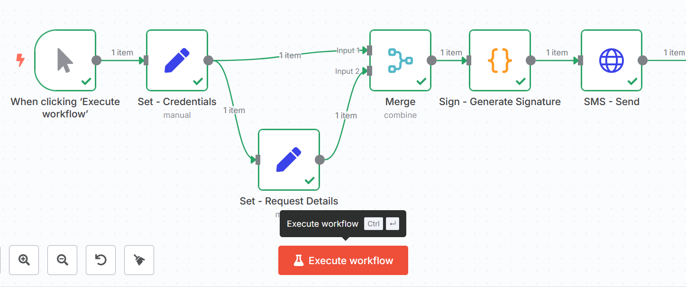

## Objective

This guide explains how to integrate the OVHcloud SMS API into **n8n**, in order to automatically send SMS from your workflows. You will learn how to configure a signed HTTP call via the OVHcloud API to trigger the sending of a message.

**Find out how to send SMS from n8n using the OVHcloud API.**

## Requirements

- Have an [OVHcloud SMS account](/links/telecom/sms) and a valid [SMS sender](/pages/web_cloud/messaging/sms/tout_savoir_sur_les_expediteurs_sms).
- Have an [OVHcloud VPS](/links/bare-metal/vps), a server, or a local machine with [n8n](https://n8n.io/) installed and accessible.

## Instructions

If you have not yet installed [n8n](https://n8n.io/) on your VPS, follow the instructions in our guide "[How to install n8n on an OVHcloud VPS](/pages/bare_metal_cloud/virtual_private_servers/install_n8n_on_vps)".

### Step 1 – Generate OVHcloud API credentials

Before you can send SMS via the OVHcloud API, you must have the following three identifiers:

- Application key
- Application secret
- Consumer key

To do this, consult the section **Advanced usage: pair OVHcloud APIs with an application** in our guide "[First Steps with the OVHcloud APIs](/pages/manage_and_operate/api/first-steps)", then copy and save the three identifiers `Application key`, `Application secret` and `Consumer key`.

### Step 2 – Create the workflow and nodes

Log in to your n8n interface and click the **Create Workflow** button.

Create the following nodes (empty for now):

- `Set - Credentials`: of type **Edit Fields (Set)**.
- `Set - Request Details`: of type **Edit Fields (Set)**.
- `Merge`: of type **Merge**.
- `Sign - Generate Signature`: of type **Code**.
- `SMS - Send`: of type **HTTP Request**.

For more details on creating nodes, see the [official n8n documentation](https://docs.n8n.io/integrations/creating-nodes/overview/).

Connect the nodes in this order:

{.thumbnail}

The `Merge` node receives the outputs from the two `Set - Credentials` and `Set - Request Details` nodes, then feeds into `Sign - Generate Signature`, which feeds into `SMS - Send`.

### Step 3 – Configure the `Set – Credentials` node

Add the following parameters to your `Set - Credentials` node:

- Mode: `Manual Mapping`.

| Name               | Value                                                      |
| ----------------- | ----------------------------------------------------------- |
| applicationKey    | "YOUR_APPLICATION_KEY"                                     |
| consumerKey       | "YOUR_CONSUMER_KEY"                                        |
| serviceName       | "YOUR_OVHCLOUD_SMS_ACCOUNT" (e.g. "sms-ab12345-1")         |
| applicationSecret | "YOUR_APPLICATION_SECRET"                                  |
| timestamp         | {{ Math.floor(Date.now() / 1000) }}                         |

### Step 4 – Configure the `Set – Request Details` node

Configure the `Set - Request Details` node:

- Mode: `Manual Mapping`.
- Add a field named `body` of type `Object` with the content below (minimal example).

```json
{
  "charset": "UTF-8",
  "coding": "7bit",
  "message": "Test message",
  "noStopClause": true,
  "priority": "high",
  "receivers": ["+33612345678"],
  "sender": "Your_sender"
}
```

> [!primary]
>
> - The recipient's number (`receivers`) must be in international format and for example start with "+336" or "+337" for a French mobile number.
> - [The sender must be defined in your OVHcloud account](/pages/web_cloud/messaging/sms/tout_savoir_sur_les_expediteurs_sms). To perform a test without declaring a sender and using a short number, replace `"sender": "Your_sender"` with `"senderForResponse": true`.

### Step 5 – Configure the `Merge` node

Configure the `Merge` node:

- Mode: `Combine`.
- Combine by: `Position`.
- Number of Inputs: `2`.

Connect `Set - Credentials` to **Input 1** and `Set - Request Details` to **Input 2**.<br>
At the output (output), you should have at the same level: `applicationKey`, `applicationSecret`, `consumerKey`, `serviceName`, `timestamp` and `body`.

### Step 6 – Configure the `Sign – Generate Signature` node

Configure the `Sign - Generate Signature` node:

- Mode: `Run once for each item`.
- Language: `JavaScript`.

Paste the code below:

```js
// --- SHA1 pure (not HMAC) ---
function sha1(input) {
  function rotl(n, s) { return (n << s) | (n >>> (32 - s)); }
  function hex(v){ let s=''; for(let i=7;i>=0;i--) s+=((v >>> (i*4)) & 0xf).toString(16); return s; }
  function utf8(str){
    str=str.replace(/\r\n/g,'\n');
    let out=''; for (let i=0;i<str.length;i++){
      const c=str.charCodeAt(i);
      if (c<128) out+=String.fromCharCode(c);
      else if (c<2048) out+=String.fromCharCode((c>>6)|192, (c&63)|128);
      else out+=String.fromCharCode((c>>12)|224, ((c>>6)&63)|128, (c&63)|128);
    } return out;
  }
  let i,j,A,B,C,D,E,temp,H0=0x67452301,H1=0xEFCDAB89,H2=0x98BADCFE,H3=0x10325476,H4=0xC3D2E1F0;
  const W=new Array(80), m=utf8(input), ml=m.length, wa=[];
  for(i=0;i<ml-3;i+=4){ j=(m.charCodeAt(i)<<24)|(m.charCodeAt(i+1)<<16)|(m.charCodeAt(i+2)<<8)|m.charCodeAt(i+3); wa.push(j); }
  let last; switch(ml%4){case 0:last=0x080000000;break;case 1:last=(m.charCodeAt(ml-1)<<24)|0x0800000;break;case 2:last=(m.charCodeAt(ml-2)<<24)|(m.charCodeAt(ml-1)<<16)|0x08000;break;case 3:last=(m.charCodeAt(ml-3)<<24)|(m.charCodeAt(ml-2)<<16)|(m.charCodeAt(ml-1)<<8)|0x80;break;}
  wa.push(last); while ((wa.length%16)!==14) wa.push(0); wa.push(ml>>>29); wa.push((ml<<3)&0x0ffffffff);
  for(let bs=0; bs<wa.length; bs+=16){
    for(i=0;i<16;i++) W[i]=wa[bs+i]; for(i=16;i<=79;i++) W[i]=rotl(W[i-3]^W[i-8]^W[i-14]^W[i-16],1);
    A=H0; B=H1; C=H2; D=H3; E=H4;
    for(i=0;i<=19;i++){ temp=(rotl(A,5)+((B&C)|(~B&D))+E+W[i]+0x5A827999)&0x0ffffffff; E=D; D=C; C=rotl(B,30); B=A; A=temp; }
    for(i=20;i<=39;i++){ temp=(rotl(A,5)+(B^C^D)+E+W[i]+0x6ED9EBA1)&0x0ffffffff; E=D; D=C; C=rotl(B,30); B=A; A=temp; }
    for(i=40;i<=59;i++){ temp=(rotl(A,5)+((B&C)|(B&D)|(C&D))+E+W[i]+0x8F1BBCDC)&0x0ffffffff; E=D; D=C; C=rotl(B,30); B=A; A=temp; }
    for(i=60;i<=79;i++){ temp=(rotl(A,5)+(B^C^D)+E+W[i]+0xCA62C1D6)&0x0ffffffff; E=D; D=C; C=rotl(B,30); B=A; A=temp; }
    H0=(H0+A)&0x0ffffffff; H1=(H1+B)&0x0ffffffff; H2=(H2+C)&0x0ffffffff; H3=(H3+D)&0x0ffffffff; H4=(H4+E)&0x0ffffffff;
  }
  return (hex(H0)+hex(H1)+hex(H2)+hex(H3)+hex(H4)).toLowerCase();
}

// -- OVHcloud SIGNATURE --
const j = $json;
const method = 'POST';
// Use the recommended standard EU endpoint:
const url = `https://eu.api.ovh.com/1.0/sms/${j.serviceName}/jobs`;
const bodyString = JSON.stringify(j.body);
const timestamp = Math.floor(Date.now()/1000).toString();

// AppSecret + ConsumerKey + Method + URL + Body + Timestamp
const toSign = [ j.applicationSecret, j.consumerKey, method, url, bodyString, timestamp ].join('+');
const signature = `$1$${sha1(toSign)}`;

return { json: { ...j, url, bodyString, timestamp, signature } };
```

> [!warning]
>
> Do not use **HMAC** here (OVHcloud expects `"$1$" + SHA1(AppSecret + … + Timestamp)`). The `bodyString` parameter is **exactly** the JSON that will be sent next (no other `stringify`). The signed URL must be **strictly identical** to the sending URL (same host, no extra `/` at the end).

### Step 7 – Configure the `SMS - Send` node

Configure the `SMS - Send` node:

- Method: `POST`.
- URL: `{{$json.url}}`.
- Authentication: `None`.
- Send Headers: `ON`.
- Specify Headers: `Using fields below`.

Add the following header parameters:

| Name                | Value                     |
| ------------------ | -------------------------- |
| Content-Type       | application/json           |
| X-Ovh-Application  | {{$json.applicationKey}}   |
| X-Ovh-Consumer     | {{$json.consumerKey}}      |
| X-Ovh-Timestamp    | {{$json.timestamp}}        |
| X-Ovh-Signature    | {{$json.signature}}        |

Enable `Send Body` and add the following body parameters:

| Name               | Value               |
| ----------------- | -------------------- |
| Body Content Type | Raw                  |
| Content Type      | application/json     |
| Body              | {{$json.bodyString}} |

### Test your workflow

Run your workflow. The following steps are executed:

1. Set - Credentials: provides applicationKey, consumerKey, serviceName (and optionally applicationSecret if you have not externalized it).
2. Set - Request Details: prepares the body object containing the SMS body.
3. Merge (Combine/Position): merges the outputs of the previous two nodes.
4. Sign - Generate Signature (Code): calculates bodyString, timestamp, signature (simple SHA-1) and the call URL.
5. SMS - Send (HTTP Request): sends the POST to the URL with the body {{$json.bodyString}} and the X-Ovh-* headers.

The message is then transmitted via the OVHcloud API to your recipient.

### Common errors

#### **Invalid_signature (400)**

- The signed URL is different from the sent URL (different host, extra `/` at the end).
- The signed body is different from the sent body (re-`stringify`, spaces, order, etc.).
- The local clock is too far off. Rather use the OVHcloud server time (see the section [Industrialization and security](#industrialisation)).

#### **SMS sender ... does not exist (403)**

The `sender` (sender) is not declared/validated in your OVHcloud Control Panel. Test with `"senderForResponse": true` or validate your sender.

#### **Bad Request**

- Check in each node the name and value of your parameters.
- Make sure that the headers and body are complete.
- Check that the URL of the `SMS - Send` node follows the following format: `https://eu.api.ovh.com/1.0/sms/sms-ab12345-1/jobs`

#### **Code node errors**

- Do not use `require('crypto')` in n8n but rather the **pure JavaScript SHA-1** above.
- Use the *per item* mode and avoid calling `$input.all()` in your code.

### Industrialization and security <a name="industrialisation"></a>

If you want to industrialize your workflow and make it more secure, apply the following tips.

#### OVHcloud server time

Add a **HTTP Request** node before the signature:

- `GET https://eu.api.ovh.com/1.0/auth/time`
- Retrieve the value and replace `timestamp` with this **exact** value.

#### Do not pass the `applicationSecret`

- Store it as an **environment variable** (e.g. `OVH_APP_SECRET`) and read it in the Code node (Sign - Generate Signature) via `$env.OVH_APP_SECRET`, or via the **Secrets/Credentials** feature of n8n.
- Failing that, **never return** the secret at the output of the node.

#### Character management

If your message contains emojis/accents not in GSM, use `"coding": "ucs2"`.

## Go further

Join our [community of users](/links/community).