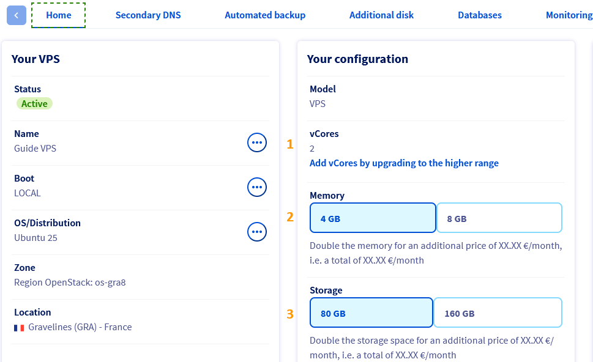
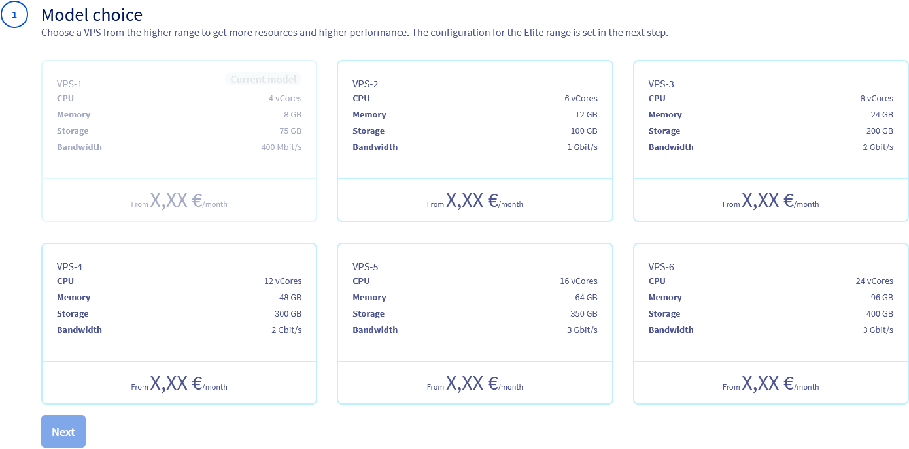
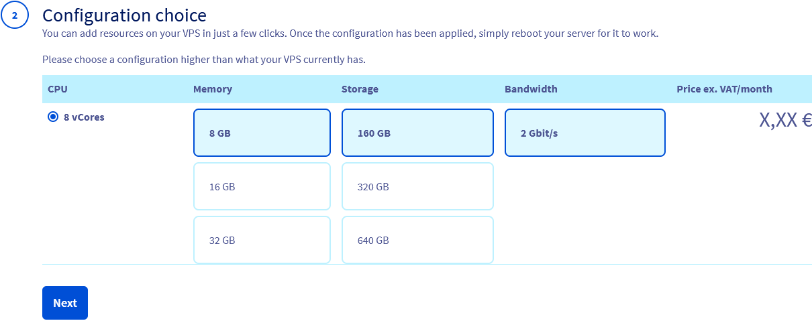
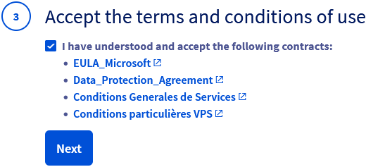
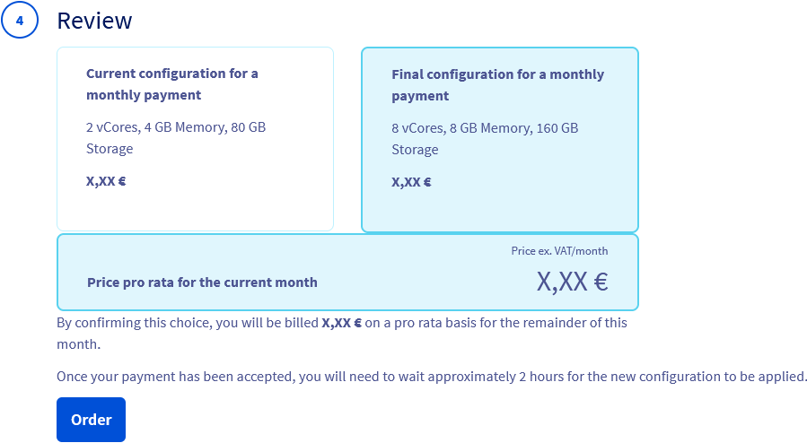
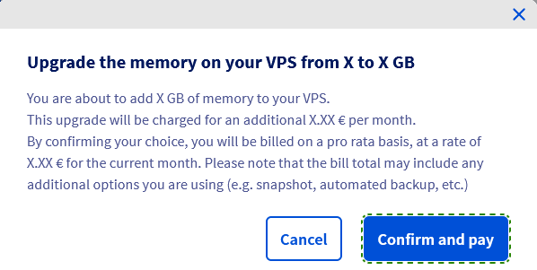
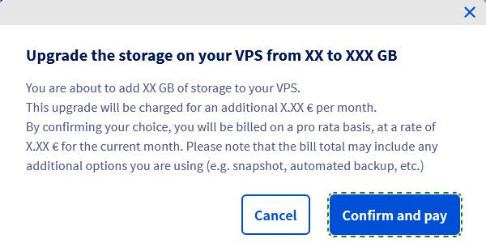

**Découvrez comment ajouter des vCores, de la mémoire et du stockage à votre service VPS.**

## Prérequis

- Un [VPS](/links/bare-metal/vps) dans votre compte OVHcloud
- Être connecté à votre [espace client OVHcloud](/links/manager)

## En pratique

Nos services VPS offrent flexibilité, fiabilité et performance pour une variété de besoins d'hébergement. Vous pouvez procéder à la mise à niveau de votre RAM, vCPU ou stockage dans le [espace client OVHcloud](/links/manager).

Connectez-vous à votre [espace client OVHcloud](/links/manager), rendez-vous dans la section `Bare Metal Cloud`{.action} et sélectionnez votre serveur sous la partie `Serveur privés virtuels`{.action}.

> [!primary]
>
> Les options de mise à niveau disponibles dans votre espace client dépendent de la gamme et du modèle du VPS sélectionné. Les captures d'écran ci-dessous sont fournies à titre d'illustration et ne font pas référence à un scénario concret de mise à niveau du VPS.

À partir de là, vous pouvez mettre à niveau vos vCores (`1`), votre mémoire (`2`) ou votre stockage (`3`).

{.thumbnail}

### 1. Pour ajouter des **vCores**

Sous l'onglet **Accueil** dans le panneau **Votre configuration**, cliquez sur `Ajouter des vCores en passant à la gamme supérieure`.

Choisissez un nouveau modèle et cliquez sur `Suivant`{.action}.

{.thumbnail}

Choisissez vos options de mémoire et de stockage et cliquez sur `Suivant`{.action}.

{.thumbnail}

Acceptez (`☑`{.action}) les **termes des contrats** et cliquez sur `Suivant`{.action}.

{.thumbnail}

Révisez vos modifications et cliquez sur `Commander`{.action}.

{.thumbnail}

### 2. Pour mettre à niveau la **Mémoire**

Sous l'onglet **Accueil** dans le panneau **Votre configuration**, cliquez sur la quantité de mémoire que vous souhaitez. Les options disponibles dépendent de la gamme de VPS que vous avez actuellement.

Dans la fenêtre contextuelle, cliquez sur `Valider et payer`{.action} pour finaliser votre commande.

{.thumbnail}

### 3. Pour mettre à niveau le **Stockage**

Sous l'onglet **Accueil** dans le panneau **Votre configuration**, cliquez sur la quantité de stockage que vous souhaitez. Les options disponibles dépendent de la gamme de VPS que vous avez actuellement.

Dans la fenêtre contextuelle, cliquez sur `Valider et payer`{.action} pour finaliser votre commande.

{.thumbnail}

Consultez notre guide dédié pour les étapes suivantes : [Comment repartitionner un VPS après une mise à niveau de stockage](/pages/bare_metal_cloud/virtual_private_servers/upsize_vps_partition)

## FAQ

/// details | Conserverai-je la même adresse IP ?

Oui, vous conserverez la même adresse IP après la mise à niveau de votre VPS.

///

/// details | Conserverai-je mes données sur le serveur ?

Oui, après une mise à niveau, vous conserverez vos données. Lorsque vous mettez à niveau votre disque, vous devrez peut-être étendre les partitions.

///

/// details | Que se passe-t-il pour la sauvegarde/snapshot ? Puis-je l'utiliser sur le nouveau VPS ?

Oui. Après les mises à niveau, vous aurez toujours accès à vos sauvegardes et snapshots.

///

/// details | Que se passe-t-il pour la licence logicielle sur l'ancien VPS ? Puis-je la déplacer automatiquement vers le nouveau VPS ?

Si vous avez une licence active, elle restera attachée au VPS. Le prix peut changer en fonction de l'accord de licence ou des exigences du fournisseur.  
Si des modifications sont apportées à la licence, elles seront expliquées avant la mise à niveau du VPS.

///

/// details | Le débit change-t-il ?

Dans certains cas, le débit peut changer, notamment lors du passage d'un VPS de niveau inférieur au niveau supérieur.

///

/// details | Cette mise à niveau serait-elle immédiate, ou aurais-je le temps d'utiliser les deux en même temps (configurer, transférer des données, etc.) ?

La mise à niveau sera effective immédiatement, en conservant toutes vos données. La mise à niveau allouera plus de ressources à votre VPS existant.

///

## Aller plus loin

[FAQ VPS](/pages/bare_metal_cloud/virtual_private_servers/vps-faq)

Échangez avec notre [communauté d'utilisateurs](/links/community).