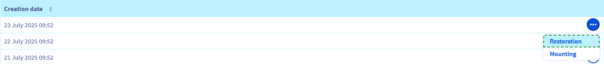
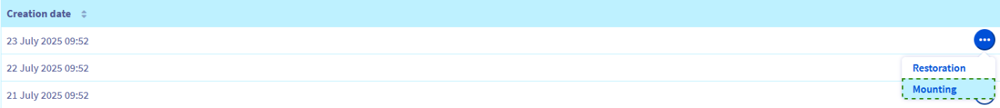
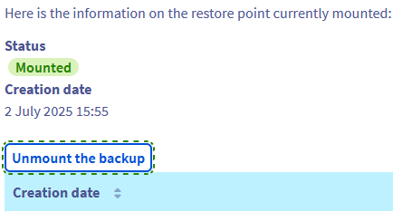

<style>
.grid-gallery {
  display: grid;
  grid-template-columns: repeat(2, 1fr);
  gap: 1rem;
}
.grid-gallery img {
  width: 100%;
  height: auto;
  object-fit: cover;
}
</style>

## Ziel

Die Option für automatische Backups bietet eine komfortable Möglichkeit, vollständige Systemsicherungen über Ihr OVHcloud Kundencenter verfügbar zu machen, ohne eine Verbindung zum Server herstellen zu müssen, um sie manuell anzulegen und wiederherzustellen. Ein weiterer Vorteil ist, dass Sie auch wahlweise ein Backup erzeugen und dann über Remote-Verbindung darauf zugreifen können.

**Diese Anleitung erläutert die Verwendung von automatischen Backups für Ihren OVHcloud VPS.**

> [!primary]
>
Bevor Sie Backup-Optionen anwenden, empfehlen wir, die [Produktseiten und FAQ](/links/bare-metal/vps-options) zu Preisvergleichen und weiteren Details zu konsultieren.
>

## Voraussetzungen

- Sie haben Zugriff auf Ihr [OVHcloud Kundencenter](/links/manager).
- Sie haben einen [VPS](/links/bare-metal/vps) in Ihrem Kunden-Account.
- Administratorzugang (sudo) über SSH auf Ihren VPS (optional)

> [!warning]
> Diese Funktion ist derzeit nicht verfügbar für VPS in [Local Zones](/links/bare-metal/vps-lz).
>

## In der praktischen Anwendung

### Inhaltsübersicht

- [Upgrade auf Automatic Backup Premium](#premium)
- [Backup-Zeit konfigurieren](#time)
- [Eine Sicherung über das OVHcloud Kundencenter wiederherstellen](#restore)
- [Ein Backup mounten und darauf zugreifen](#mount)
    - [Über Secure Shell](#shell)
    - [Mit Windows](#windows)
- [Optimale Vorgehensweise zur Backup-Erstellung](#bestpractice)
    - [Konfiguration des QEMU-Agents auf einem VPS](#qemu)
        - [Debian Distributionen](#deb)
        - [Redhat Distributionen](#red)
        - [Windows](#win)


Bei der Bestellung eines VPS ist ein tägliches automatisches Backup als kostenlose Service-Option inklusive. Mit dieser Standard-Option können Sie:

- Das tägliche Backup Mounten und Wiederherstellen.
- Den Tageszeitpunkt festlegen, zu dem dieses Backup erstellt wird.

Für mehr Flexibilität bei Ihren Backups können Sie die Option "Automatisches Backup Premium" aktivieren.

<a name="premium"></a>

### Automatisches Backup Premium abonnieren

Die Option Automatisches Backup Premium erzeugt alle 24 Stunden zum ausgewählten Zeitpunkt ein Backup Ihres VPS.  
Sie haben Zugriff auf alle täglichen Backups der letzten 7 Tage. Sobald 7 Backups erstellt wurden, ersetzt jedes neue Backup das älteste.

Loggen Sie sich in Ihr [OVHcloud Kundencenter](/links/manager) ein, gehen Sie in den Bereich `Bare Metal Cloud`{.action}, wählen Sie `Virtual Private Server`{.action} aus und klicken Sie auf Ihren VPS-Namen.

Nach der Auswahl Ihres VPS klicken Sie im horizontalen Menü auf den Tab `Automatisches Backup`{.action}.

Klicken Sie auf den Link `Premium Backup bestellen`{.action} (für Dienste, die seit dem 07.08.25 bestellt wurden) oder den Button `Automatisches Backup aktivieren`{.action}.

<div class="grid-gallery">
  
  
</div>

Beachten Sie im nächsten Schritt die Preisinformationen und klicken Sie dann auf `Bestellen`{.action}. Sie werden durch den Bestellprozesses geführt und erhalten eine E-Mail zur Bestätigung.

<a name="time"></a>

### Backup-Zeit konfigurieren

Sie können den Zeitpunkt ändern, zu dem das Backup durchgeführt wird.

Nach der Auswahl Ihres VPS klicken Sie im horizontalen Menü auf den Tab `Automatisches Backup`{.action}.

Klicken Sie auf `...`{.action} über der Tabelle und dann auf `Bearbeiten`{.action}.

{.thumbnail}

Tragen Sie im neu angezeigten Fenster die Tageszeit ein (Zeitstandard UTC 24 Stunden). Klicken Sie auf `Bestätigen`{.action}.

{.thumbnail}

> [!primary]
>
> Sobald die Änderung im Kundencenter bestätigt wurde, wird sie innerhalb von 24 bis 48 Stunden wirksam.
>

<a name="restore"></a>

### Eine Sicherung über das OVHcloud Kundencenter wiederherstellen

Nach der Auswahl Ihres VPS klicken Sie auf den Tab `Automatisches Backup`{.action} im horizontalen Menü.  
Klicken Sie auf `...`{.action} neben dem Backup, das Sie wiederherstellen möchten, und wählen Sie `Wiederherstellung`{.action}.

{.thumbnail}

Wenn Sie kürzlich Ihr Root-Passwort geändert haben, aktivieren Sie im Popup-Fenster die Option "Root-Passwort im Zuge der Wiederherstellung ändern", damit Ihr aktuelles Passwort beibehalten wird, und klicken Sie auf `Bestätigen`{.action}. Sie erhalten eine E-Mail, sobald der Task abgeschlossen ist. Die Wiederherstellung kann je nach verwendetem Speicherplatz eine Weile dauern.

> [!alert]
>
Bitte beachten Sie, dass die automatisierten Backups nicht Ihre zusätzlichen Disks umfassen.
>

<a name="mount"></a>

### Ein Backup mounten und darauf zugreifen

Es ist nicht erforderlich, Ihren laufenden Dienst mit einer Wiederherstellung vollständig zu überschreiben. Mit der Option "Mounten" können Sie auf direkt auf das Backup zugreifen, um Ihre Dateien abzurufen.

> [!warning]
>
> OVHcloud stellt Ihnen Dienstleistungen zur Verfügung, für deren Konfiguration und Verwaltung Sie die alleinige Verantwortung tragen. Es liegt somit bei Ihnen, sicherzustellen, dass diese ordnungsgemäß funktionieren.
> 
> Bei Schwierigkeiten kontaktieren Sie bitte einen [spezialisierten Dienstleister](/links/partner) oder stellen Ihre Fragen in der [OVHcloud Community](https://community.ovh.com/en/). Leider können wir Ihnen für administrative Aufgaben keine weitergehende technische Unterstützung anbieten.
>

Klicken Sie auf `...`{.action} neben dem Backup, auf das Sie zugreifen möchten, und wählen Sie `Mounten`{.action}.

{.thumbnail}

Wenn Sie diese Option verwenden, wird eine Lese-/Schreibkopie des Backups erstellt und gemountet. Das ursprüngliche Backup bleibt für zukünftige Wiederherstellungen unverändert verfügbar.

Nach Abschluss des Vorgangs erhalten Sie eine E-Mail. Sie können jetzt eine Verbindung zu Ihrem VPS herstellen und die Partition hinzufügen, auf der sich Ihr Backup befindet.

<a name="shell"></a>

#### Über Secure Shell

Stellen Sie zunächst über SSH eine Verbindung zu Ihrem VPS her.

Mit dem folgenden Befehl können Sie den Namen des neu angehängten Volumes überprüfen:

```bash
lsblk
```

Hier sehen Sie eine Beispielausgabe dieses Befehls:

```console
NAME    MAJ:MIN RM  SIZE RO TYPE MOUNTPOINT
sda       8:0    0   25G  0 disk 
├─sda1    8:1    0 24.9G  0 part /
├─sda14   8:14   0    4M  0 part 
└─sda15   8:15   0  106M  0 part 
sdb       8:16   0   25G  0 disk 
├─sdb1    8:17   0 24.9G  0 part 
├─sdb14   8:30   0    4M  0 part 
└─sdb15   8:31   0  106M  0 part /boot/efi
```
In diesem Beispiel heißt die Partition, in der Ihr Backup-Dateisystem enthalten ist, “sdb1”.
Erstellen Sie als Nächstes ein Verzeichnis für diese Partition und definieren Sie es als Mountpunkt:

```bash
sudo mkdir -p /mnt/restore
sudo mount /dev/sdb1 /mnt/restore
```

Sie können jetzt zu diesem Ordner wechseln und auf Ihre Backup-Daten zugreifen.

Denken Sie daran, das automatische Backup zu unmounten, sobald Sie damit fertig sind. Klicken Sie im Tab `Automatisches Backup`{.action} auf den Button `Backup unmounten`{.action} und bestätigen Sie den Vorgang im Popup-Fenster.

{.thumbnail}

<a name="windows"></a>

#### Mit Windows

Stellen Sie eine RDP-Verbindung (Remote Desktop) mit Ihrem VPS her.

Wenn Sie eingeloggt sind, klicken Sie mit der rechten Maustaste auf den Button `Start`{.action} und öffnen Sie die `Datenträgerverwaltung`{.action}.

{.thumbnail}

Ihr Backup erscheint als "Basic" Datenträger mit demselben Speicherplatz wie Ihre Haupt-Disk.

{.thumbnail}

Die Disk wird als `Offline` angezeigt. Klicken Sie mit der rechten Maustaste auf die Disk und wählen Sie `Online`{.action} aus.

{.thumbnail}

Anschließend können Sie auf Ihr gemountetes Backup als Laufwerk über den `Datei-Explorer` zugreifen.

{.thumbnail}

Denken Sie daran, das automatische Backup auszuhängen, sobald Sie damit fertig sind. Klicken Sie im Tab `Automatisches Backup`{.action} auf den Button `Backup unmounten`{.action} und bestätigen Sie den Vorgang im Popup-Fenster.

{.thumbnail}

> [!warning]
> 
>
Beachten Sie, dass beim Aushängen des Backups ein Neustart des Servers erfolgt.
>

<a name="bestpractice"></a>

### Optimale Vorgehensweise zur Backup-Erstellung

Die Funktion "Automatisches Backup" basiert auf VPS Snapshots. Es wird empfohlen, die folgenden Schritte zu befolgen, um Probleme zu vermeiden, bevor Sie diese Option verwenden.

<a name="qemu"></a>

#### Konfiguration des QEMU-Agents auf einem VPS

Snapshots sind Momentaufnahmen Ihres Systems bei der Ausführung (*live snapshot*). Um die Verfügbarkeit Ihres Systems während der Erstellung des Snapshots zu gewährleisten, wird der QEMU-Agent verwendet, um das Dateisystem für diesen Vorgang vorzubereiten.

Der hierzu benötigte *qemu-guest-agent* ist bei den meisten Distributionen nicht standardmäßig installiert. Auch können lizenzbedingte Einschränkungen OVHcloud daran hindern, diese Bedingung in die Images der verfügbaren Betriebssysteme einzubeziehen. Es wird daher geraten, dies zu überprüfen, und den Agent zu installieren, falls er nicht auf Ihrem VPS aktiviert ist. Verbinden Sie sich per SSH mit Ihrem VPS und folgen Sie je nach Betriebssystem den unten stehenden Anleitungen. 

<a name="deb"></a>

##### **Debian Distributionen (Debian, Ubuntu)**

Überprüfen Sie mit folgendem Befehl, ob das System richtig für Snapshots konfiguriert ist.

```bash
file /dev/virtio-ports/org.qemu.guest_agent.0
/dev/virtio-ports/org.qemu.guest_agent.0: symbolic link to ../vport2p1
```

Erscheint ein anderes Ergebnis (*No such file or directory*), dann installieren Sie das aktuelle Paket:

```bash
sudo apt-get update
sudo apt-get install qemu-guest-agent
```

Starten Sie den VPS neu:

```bash
sudo reboot
```

Überprüfen Sie, ob der Dienst ausgeführt wird:

```bash
sudo service qemu-guest-agent status
```

<a name="red"></a>

##### **Redhat Distributionen (CentOS, Fedora)**

Überprüfen Sie mit folgendem Befehl, ob das System richtig für Snapshots konfiguriert ist.

```bash
file /dev/virtio-ports/org.qemu.guest_agent.0
/dev/virtio-ports/org.qemu.guest_agent.0: symbolic link to ../vport2p1
```

Erscheint ein anderes Ergebnis (*No such file or directory*), dann installieren und aktivieren Sie den Agent:

```bash
sudo yum install qemu-guest-agent
sudo chkconfig qemu-guest-agent on
```

Starten Sie den VPS neu:

```bash
sudo reboot
```

Überprüfen Sie, ob der Dienst ausgeführt wird:

```bash
sudo service qemu-guest-agent status
```

<a name="win"></a>

##### **Windows**

Sie können den QEMU Guest Agent über eine MSI-Datei installieren. Diese ist auf der Webseite des *Fedora project* verfügbar: <https://fedorapeople.org/groups/virt/virtio-win/direct-downloads/latest-qemu-ga/>.

Überprüfen Sie, ob der Dienst ausgeführt wird. Verwenden Sie dazu folgenden Powershell-Befehl:

```console
PS C:\Users\Administrator> Get-Service QEMU-GA

Status   Name               DisplayName
------   ----               -----------
Running  QEMU-GA            QEMU Guest Agent
```

## Weiterführende Informationen

[Snapshots auf einem VPS verwenden](/pages/bare_metal_cloud/virtual_private_servers/using-snapshots-on-a-vps)

Für den Austausch mit unserer User Community gehen Sie auf <https://community.ovh.com/en/>.
