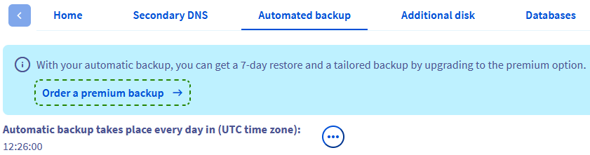

## Objectif

L'option Backup Automatisé pour les VPS offre un moyen pratique de disposer de sauvegardes complètes du système depuis votre espace client OVHcloud sans avoir à vous connecter au serveur pour créer et restaurer manuellement vos sauvegardes. Un autre avantage est que vous pouvez également choisir de monter une sauvegarde et accéder ensuite à ses fichiers à distance.

**Ce guide vous présente en détail l'option Backup automatisé pour votre VPS OVHcloud.**

<iframe class="video" width="560" height="315" src="https://www.youtube-nocookie.com/embed/Pazh9ozbkEk" title="YouTube video player" frameborder="0" allow="accelerometer; autoplay; clipboard-write; encrypted-media; gyroscope; picture-in-picture" allowfullscreen></iframe>

> [!primary]
> Avant d'appliquer une option de sauvegarde, nous vous recommandons de consulter les [options VPS disponibles](/links/bare-metal/vps-options) afin de comparer les détails et tarifs de chaque option.
>

## Prérequis

- Être connecté à [l'espace client OVHcloud](/links/manager).
- Posséder un [VPS OVHcloud](/links/bare-metal/vps) déjà configuré.
- Disposer d'un accès administrateur (sudo) en SSH à votre VPS (facultatif).

## En pratique

### Présentation du contenu

- [Comment passer au Backup automatisé Premium](#premium)
- [Configurer l’heure du backup](#time)
- [Comment restaurer une sauvegarde depuis l’espace client OVHcloud](#restore)
- [Monter et accéder à une image de sauvegarde](#mount)
    - [Sous Linux](#shell)
    - [Sous Windows](#windows)
- [Bonnes pratiques pour l'utilisation du Backup automatisé](#bestpractice)
    - [Configuration de l'agent QEMU sur un VPS](#qemu)
        - [Distributions Redhat](#deb)
        - [Distributions Debian](#red)
        - [Windows](#win)

Connectez-vous à votre [espace client OVHcloud](/links/manager), rendez-vous dans la section `Bare Metal Cloud`{.action} et sélectionnez votre serveur sous la partie `Serveurs privés virtuels`{.action}.

Lorsque vous commandez un VPS, une seule sauvegarde automatique quotidienne est incluse en option de service gratuite. Cette option de sauvegarde standard vous permet de :

- Monter et restaurer la sauvegarde quotidienne.
- Définir l'heure de création de cette sauvegarde.

Pour plus de flexibilité avec vos sauvegardes, vous pouvez activer l'option Backup automatisé Premium.

<a name="premium"></a>

### Comment passer au Backup automatisé Premium

La mise à niveau vers le Backup automatisé Premium améliore votre option de sauvegarde automatique vers une sauvegarde quotidienne sur 7 jours glissants. Cela vous permet de revenir à des versions de sauvegardes plus anciennes par rapport à la rotation sur 24 heures de l'option standard.

Après avoir sélectionné votre VPS, cliquez sur l'onglet `Backup automatisé`{.action} dans le menu horizontal.

Cliquez sur le lien `Commander un backup premium`{.action}.

{.thumbnail}

Lors de l'étape suivante, veuillez prendre note des informations de tarification, puis cliquez sur `Commander`{.action}. Vous serez guidé tout au long du processus de commande et recevrez un e-mail de confirmation.

<a name="time"></a>

### Configurer l’heure du backup

Vous pouvez modifier l'heure à laquelle la sauvegarde aura lieu.

Après avoir sélectionné votre VPS, cliquez sur l'onglet `Backup automatisé`{.action} dans le menu horizontal.

Cliquez sur `...`{.action} au-dessus du tableau puis sur `Éditer`{.action}.

{.thumbnail}

Dans la fenêtre qui s'affiche, modifiez l'heure de la journée (norme de temps UTC 24 heures). Cliquez sur `Confirmer`{.action}.

{.thumbnail}

> [!primary]
>
> Une fois la validation effectuée dans l’espace client, le changement sera effectif dans un délai de 24 à 48 heures.
>

<a name="restore"></a>

### Comment restaurer une sauvegarde depuis l’espace client OVHcloud

Sélectionnez votre VPS puis cliquez sur l'onglet `Backup automatisé`{.action} dans le menu horizontal.  
Cliquez sur `...`{.action} à droite de la sauvegarde à restaurer et sélectionnez `Restauration`{.action}.

{.thumbnail}

Si vous avez récemment modifié votre mot de passe root, assurez-vous de cocher l'option « Modifier le mot de passe root lors de la restauration » dans la fenêtre contextuelle pour conserver votre mot de passe root actuel et cliquez sur `Confirmer`{.action}. Vous recevrez un e-mail dès que la restauration sera terminée. Celle-ci peut prendre un certain temps, selon l'espace disque utilisé.

> [!alert]
>
> Notez que les Backups automatisés n'incluent pas vos éventuels disques additionnels.
>

<a name="mount"></a>

### Monter et accéder à une image de sauvegarde

Cette option permet d'accéder aux données de sauvegarde au cas où vous ne souhaitez pas remplacer complètement votre service existant par la restauration.

> [!warning]
>
> OVHcloud met à votre disposition des services dont la configuration, la gestion et la responsabilité vous incombent. Il vous revient de ce fait d'en assurer le bon fonctionnement.
>
> Nous mettons à votre disposition ce guide afin de vous accompagner au mieux sur des tâches courantes. Néanmoins, nous vous recommandons de faire appel à un [prestataire spécialisé](/links/partner) et/ou de contacter l'éditeur du service si vous éprouvez des difficultés. En effet, nous ne serons pas en mesure de vous fournir une assistance. Plus d'informations dans la section [Aller plus loin](#go-further) de ce guide.
>

Sélectionnez votre VPS puis cliquez sur l'onglet `Backup automatisé`{.action} dans le menu horizontal.  
Cliquez sur `...`{.action} à droite de la sauvegarde souhaitée et sélectionnez `Montage`{.action}.

{.thumbnail}

Lorsque vous utilisez cette option, une copie de la sauvegarde accessible en lecture et écriture est créée et montée. La sauvegarde d'origine reste disponible telle quelle pour les restaurations futures.

Une fois le processus terminé, vous recevrez un e-mail. Vous pourrez alors vous connecter à votre VPS et ajouter la partition où se trouve votre sauvegarde.

<a name="shell"></a>

#### Sous Linux

Connectez-vous à votre VPS en SSH.

Vous pouvez utiliser la commande suivante pour vérifier le nom du nouveau périphérique connecté :

```bash
lsblk
```

Voici un exemple de résultat de cette commande :

```console
NAME    MAJ:MIN RM  SIZE RO TYPE MOUNTPOINT
sda       8:0    0   25G  0 disk 
├─sda1    8:1    0 24.9G  0 part /
├─sda14   8:14   0    4M  0 part 
└─sda15   8:15   0  106M  0 part 
sdb       8:16   0   25G  0 disk 
├─sdb1    8:17   0 24.9G  0 part 
├─sdb14   8:30   0    4M  0 part 
└─sdb15   8:31   0  106M  0 part /boot/efi
```

Dans cet exemple, la partition contenant votre sauvegarde de système de fichiers est nommée « sdb1 ».
Créez à présent un répertoire pour cette partition et définissez-le comme point de montage :

```bash
sudo mkdir -p /mnt/restore
sudo mount /dev/sdb1 /mnt/restore
```

Vous pouvez maintenant basculer vers ce dossier et accéder à votre sauvegarde de données.

Pensez à bien démonter le Backup automatisé une fois son utilisation terminée. Cliquez sur le bouton `Démonter le backup`{.action} dans l'onglet `Backup automatisé`{.action}, puis validez dans la fenêtre qui s'affiche.

{.thumbnail}

<a name="windows"></a>

#### Sous Windows

Établissez une connexion RDP (Remote Desktop) avec votre VPS.

Une fois connecté, faites un clic droit sur le bouton `Démarrer`{.action} et ouvrez la `Gestion des disques`{.action}.

{.thumbnail}

Votre sauvegarde montée apparaîtra comme un disque de base avec le même espace de stockage que votre disque principal.

{.thumbnail}

Le disque apparaîtra dans l'état `hors ligne`, faites un clic droit sur le disque et sélectionnez `En ligne`{.action}.

{.thumbnail}

Par la suite, votre sauvegarde montée sera accessible dans l'`Explorateur de fichiers`.

{.thumbnail}

Pensez à bien démonter le Backup automatisé une fois son utilisation terminée. Cliquez sur le bouton `Démonter le backup`{.action} dans l'onglet `Backup automatisé`{.action}, puis validez dans la fenêtre qui s'affiche.

{.thumbnail}

> [!warning]
>
> Un redémarrage du serveur se produira lors du démontage de la sauvegarde.
>

<a name="bestpractice"></a>

### Bonnes pratiques pour l'utilisation du Backup automatisé

La fonctionnalité de Backup automatisé est basée sur les snapshots VPS. Nous vous recommandons de suivre les étapes ci-dessous pour éviter toute anomalie avant d'utiliser cette option.

<a name="qemu"></a>

#### Configuration de l'agent QEMU sur un VPS

Les snapshots sont des images instantanées de votre système en cours d'exécution (« live snapshots »). Pour garantir la disponibilité de votre système lors de la création du snapshot, l'agent QEMU est utilisé pour préparer le système de fichiers au processus.

L'agent « **qemu-guest-agent** » n'est pas installé par défaut sur la plupart des distributions. En outre, les restrictions de licence peuvent empêcher OVHcloud de l'inclure dans les images d'OS disponibles. Par conséquent, il est recommandé de vérifier et d'installer cet agent au cas où il ne serait pas activé sur votre VPS. Connectez-vous à votre VPS en SSH et suivez les instructions ci-dessous, selon votre système d'exploitation.

<a name="deb"></a>

##### **Distributions Debian (Debian, Ubuntu)**

Utilisez la commande suivante pour vérifier si le système est correctement configuré pour les snapshots :

```bash
file /dev/virtio-ports/org.qemu.guest_agent.0
```

Le résultat attendu est le suivant :

```console
/dev/virtio-ports/org.qemu.guest_agent.0: symbolic link to ../vport2p1
```

Si le résultat est différent, comme par exemple « No such file or directory », installez la dernière version du paquet :

```bash
sudo apt-get update
sudo apt-get install qemu-guest-agent
```

Redémarrez le VPS :

```bash
sudo reboot
```

Démarrez le service pour vous assurer qu'il est en cours d'exécution :

```bash
sudo service qemu-guest-agent start
```

<a name="red"></a>

##### **Distributions Redhat (CentOS, Fedora)**

Utilisez la commande suivante pour vérifier si le système est correctement configuré pour les snapshots :

```bash
file /dev/virtio-ports/org.qemu.guest_agent.0
```

Le résultat attendu est le suivant :

```console
/dev/virtio-ports/org.qemu.guest_agent.0: symbolic link to ../vport2p1
```

Si le résultat est différent, comme par exemple « No such file or directory », installez et activez l'agent :

```bash
sudo yum install qemu-guest-agent
sudo chkconfig qemu-guest-agent on
```

Redémarrez le VPS:

```bash
sudo reboot
```

Démarrez l'agent et vérifiez qu'il est en cours d'exécution :

```bash
sudo service qemu-guest-agent start
sudo service qemu-guest-agent status
```

<a name="win"></a>

##### **Windows**

Vous pouvez installer l'agent via un fichier MSI, disponible sur le site du projet Fedora : <https://fedorapeople.org/groups/virt/virtio-win/direct-downloads/latest-qemu-ga/>.

Vérifiez que le service est en cours d'exécution à l'aide de la commande powershell suivante :

```console
PS C:\Users\Administrator> Get-Service QEMU-GA
Status   Name               DisplayName
------   ----               -----------
Running  QEMU-GA            QEMU Guest Agent
```

<a name="go-further"></a>

## Aller plus loin

[Utiliser les snapshots sur un VPS](/pages/bare_metal_cloud/virtual_private_servers/using-snapshots-on-a-vps)

Échangez avec notre [communauté d'utilisateurs](/links/community).