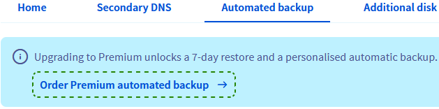
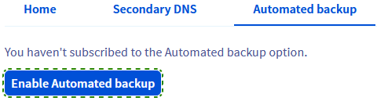

<style>
.grid-gallery {
  display: grid;
  grid-template-columns: repeat(2, 1fr);
  gap: 1rem;
}
.grid-gallery img {
  width: 100%;
  height: auto;
  object-fit: cover;
}
</style>

## Obiettivo

L’opzione di Backup automatico per VPS offre un modo pratico per avere backup di sistema completi disponibili dallo Spazio Cliente OVHcloud senza doversi connettere al server per crearli e ripristinarli manualmente. Un altro vantaggio consiste nella possibilità di scegliere di montare un backup e quindi di accedere ai file in remoto.

**Questa guida ti mostra l’opzione di Backup automatico del tuo VPS OVHcloud.**

> [!primary]
>
Prima di applicare le opzioni di backup, consigliamo di fare riferimento alle pagine prodotto [e alle domande frequenti](/links/bare-metal/vps-options) per confrontare i prezzi e per visualizzare ulteriori dettagli.
>

## Prerequisiti

- Avere accesso allo [Spazio Cliente OVHcloud](/links/manager).
- Disporre di un [VPS OVHcloud](/links/bare-metal/vps) già configurato.
- Avere accesso in SSH al tuo VPS (facoltativo) in SSH.

> [!warning]
> Questa funzionalità non è attualmente disponibile per i server privati virtuali nelle [Local Zones](/links/bare-metal/vps-lz).
>

## Procedura

### Panoramica del contenuto

- [Come passare a Backup automatico Premium](#premium)
- [Configura l'ora del backup](#time)
- [Come ripristinare un backup dallo Spazio Cliente OVHcloud](#restore)
- [Come montare un backup e accedervi](#mount)
    - [Con Secure Shell](#shell)
    - [Con Windows](#windows)
- [Best practice per l'utilizzo del Backup automatico](#bestpractice)
    - [Configurazione dell'agente QEMU su un VPS](#qemu)
        - [Distribuzioni Debian](#deb)
        - [Distribuzioni Debian Redhat](#red)
        - [Windows](#win)


Quando ordini un VPS, come opzione di servizio gratuito è incluso un backup automatico giornaliero. Questa opzione di backup standard consente di:

- Montare e ripristinare il backup giornaliero.
- Definisci l’orario di creazione del backup.

Per una maggiore flessibilità con i backup, è possibile attivare l'opzione Backup automatico Premium.

<a name="premium"></a>

### Come sottoscrivere Backup automatico Premium

L'opzione di Backup automatico Premium crea un backup del tuo VPS ogni 24 ore all'ora specificata.  
Avrai accesso a tutti i backup giornalieri degli ultimi 7 giorni. Una volta creati 7 backup, ogni nuovo backup sostituirà il più vecchio.

Accedi al tuo [Spazio Cliente OVHcloud](/links/manager), apri la sezione `Bare Metal Cloud`{.action}, seleziona `Server Privati Virtual`{.action} e clicca quindi sul nome del tuo VPS.

Clicca sulla scheda `Backup automatico`{.action} nel menu orizzontale.

Clicca sul link `Ordina un backup Premium`{.action} (per i servizi ordinati a partire dal 7 AGO, 2025) o sul pulsante `Attiva il Backup automatico`{.action}.

<div class="grid-gallery">
  
  
</div>

Nello step successivo, esamina le informazioni sul prezzo, quindi clicca su `Ordina`{.action}. Sarai guidato attraverso la procedura d’ordine e riceverai una email di conferma.

<a name="time"></a>

### Configura l'ora del backup

Puoi modificare l'orario in cui avrà luogo il backup.

Dopo aver selezionato il VPS, clicca sulla scheda `Backup automatico`{.action} nel menu orizzontale.

Clicca sui tre puntini `...`{.action} in alto a sinistra e seleziona `Modifica`{.action}.

{.thumbnail}

Nella nuova finestra, modifica l'orario della giornata (orario UTC 24 ore). Clicca su `Conferma`{.action}.

{.thumbnail}

> [!primary]
>
> Una volta convalidato dallo Spazio Cliente, la modifica diventerà effettiva entro 24-48 ore.
>

<a name="restore"></a>

### Ripristinare un backup dallo Spazio Cliente OVHcloud

Dopo aver selezionato il tuo VPS, clicca sulla scheda `Backup automatico`{.action} nel menu orizzontale.  
Clicca su `...`{.action} accanto al backup che desideri ripristinare e seleziona `Ripristino`{.action}.

{.thumbnail}

Se hai modificato la tua password root di recente, spunta l’opzione "Modifica la password root quando ripristini" nella finestra di popup, per mantenere la tua attuale password root, e clicca su `Conferma`{.action}. Riceverai una email una volta terminata l’azione. Per il rispristino potrebbe essere necessario un po’ di tempo, a seconda dello spazio utilizzato su disco.

> [!alert]
>
> Ricorda che i backup automatizzati non includono i tuoi dischi aggiuntivi.
>

<a name="mount"></a>

### Come montare un backup e accedervi

Non è necessario sovrascrivere completamente il tuo servizio esistente con un rispristino. L’opzione "Montaggio" ti consente di accedere ai dati di backup per ripristinare i tuoi file. 

> [!warning]
>
> OVHcloud fornisce servizi la cui gestione e configurazione sono sotto la tua completa supervisione. Pertanto spetta a te garantire che tali servizi funzionino correttamente.
>
> Questa guida ti aiuta a eseguire le operazioni necessarie alla configurazione del tuo account. Tuttavia, in caso di difficoltà o dubbi, ti consigliamo di contattare un [provider specializzato](/links/partner) o il fornitore del servizio. OVH non sarà infatti in grado di fornirti assistenza. Per maggiori informazioni consulta la sezione [Per saperne di più](#go-further) di questa guida.
>

Seleziona il tuo VPS e clicca sulla scheda `Backup automatico`{.action} nel menu orizzontale.
Clicca su `...`{.action} accanto al backup a cui desideri accedere e seleziona `Montaggio`{.action}.

{.thumbnail}

Quando si utilizza questa opzione, viene creata e montata una copia di backup di lettura e scrittura. Il backup originale resta disponibile per i ripristini futuri.

A completamento del processo riceverai una email. A questo punto puoi connetterti al tuo VPS e aggiungere la partizione in cui è localizzato il tuo backup.

<a name="shell"></a>

#### Con Secure Shell

Innanzitutto, connettiti al tuo VPS via SSH.

Puoi utilizzare il comando seguente per verificare il nome dell’ultimo dispositivo collegato:

```bash
lsblk
```

Ecco un campione di output di questo comando:

```console
NAME MAJ:MIN RM SIZE RO TYPE MOUNTPOINT
sda       8:0    0   25G  0 disk 
├─sda1    8:1    0 24.9G  0 part /
├─sda14   8:14   0    4M  0 part 
└─sda15   8:15   0  106M  0 part 
sdb       8:16   0   25G  0 disk 
├─sdb1    8:17   0 24.9G  0 part 
├─sdb14   8:30   0    4M  0 part 
└─sdb15   8:31   0  106M  0 part /boot/efi
```

In questi esempio, la partizione che contiene il tuo filesystem di backup è nominata “sdb1”.
Quindi, crea una directory per questa partizione e stabilisci che è il punto di montaggio:

```bash
sudo mkdir -p /mnt/restore
sudo mount /dev/sdb1 /mnt/restore
```

Ora puoi passare a questa cartella e accedere ai tuoi dati di backup.

Ricordati di smontare il backup automatico una volta che è stato completato. Clicca sul pulsante `Rimuovi il mount del backup`{.action} nella scheda `Backup automatico`{.action} e conferma nella finestra che appare.

{.thumbnail}

<a name="windows"></a>

#### Con Windows

Installa una connessione RDP (Remote Desktop) con il tuo VPS.

Clicca con il tasto destro su `Start`{.action} e apri `Gestione disco`{.action}.

{.thumbnail}

Il tuo backup in salita apparirà come un disco di base con lo stesso spazio di storage del tuo disco principale.

{.thumbnail}

Il disco apparirà come `Offline`, clicca con il tasto destro sul disco e seleziona `Online`{.action}.

{.thumbnail}

In seguito, il backup sarà disponibile su `Explora file`.

{.thumbnail}

Ricordati di smontare il backup automatico una volta che è stato completato. Clicca sul pulsante `Rimuovi il mount del backup`{.action} nella scheda `Backup automatico`{.action} e conferma nella finestra che appare.

{.thumbnail}

> [!warning]
>
> Ti ricordiamo che il server si riavvierà durante lo smontaggio del backup.
>

<a name="bestpractice"></a>

### Best practice per l'utilizzo del backup automatico

La funzionalità di backup automatico è basata sugli Snapshot VPS. Prima di utilizzare questa opzione, ti consigliamo di seguire gli step qui sotto per evitare anomalie.

<a name="qemu"></a>

#### Configurazione dell'agente QEMU su un VPS

Gli Snapshot sono istantanee del proprio sistema in esecuzione (“live snapshot”). Per garantire la disponibilità del sistema durante la creazione dello Snapshot è necessario utilizzare il software QEMU, che  prepara il filesystem al processo.

L'agente "**qemu-guest-agent**" non è installato di default sulla maggior parte delle distribuzioni. e le eventuali restrizioni delle licenze possono impedire a OVHcloud di includerlo nelle immagini degli OS disponibili. Consigliamo pertanto di verificare la presenza del software sul VPS e, in caso contrario, di installarlo. Per eseguire queste operazioni, accedi in SSH al VPS e segui le istruzioni indicate, in base al sistema operativo utilizzato.

<a name="deb"></a>

##### **Distribuzioni Debian (Debian, Ubuntu)**

Utilizza il comando seguente per verificare che il sistema sia correttamente configurato per effettuare Snapshot:

```bash
file /dev/virtio-ports/org.qemu.guest_agent.0
```

Il risultato atteso è il seguente:

```console
/dev/virtio-ports/org.qemu.guest_agent.0: symbolic link to ../vport2p1
```

Se il risultato è diverso, ad esempio "No such file or directory", installare l'ultima versione del pacchetto:

```bash
sudo apt-get update
sudo apt-get install qemu-guest-agent
```

Riavvia il VPS:

```bash
sudo reboot
```

Avvia il servizio per assicurarti che sia in esecuzione:

```bash
sudo service qemu-guest-agent start
```

<a name="red"></a>

##### **Distribuzioni Redhat (CentOS, Fedora)**

Utilizza il comando seguente per verificare che il sistema sia correttamente configurato per effettuare Snapshot:

```bash
file /dev/virtio-ports/org.qemu.guest_agent.0
```

Il risultato atteso è il seguente:

```console
/dev/virtio-ports/org.qemu.guest_agent.0: symbolic link to ../vport2p1
```

Se il risultato è diverso, ad esempio "No such file or directory", installa e attiva il software:

```bash
sudo yum install qemu-guest-agent
sudo chkconfig qemu-guest-agent on
```

Riavvia il VPS:

```bash
sudo reboot
```

Avvia il servizio per assicurarti che sia in esecuzione:

```bash
sudo service qemu-guest-agent start
sudo service qemu-guest-agent status
```

<a name="win"></a>

##### **Windows**

Puoi installare l'agente tramite un file MSI, disponibile sul sito del progetto Fedora: <https://fedorapeople.org/groups/virt/virtio-win/direct-downloads/latest-qemu-ga/>

Per verificare che il servizio sia in esecuzione, esegui questo comando powershell:

```console
PS C:\Users\Administrator> Get-Service QEMU-GA
Status   Name               DisplayName
------   ----               -----------
Running  QEMU-GA            QEMU Guest Agent
```

<a name="go-further"></a>

## Per saperne di più

[Usare snapshot su un VPS](/pages/bare_metal_cloud/virtual_private_servers/using-snapshots-on-a-vps)

Contatta la nostra [Community di utenti](/links/community).