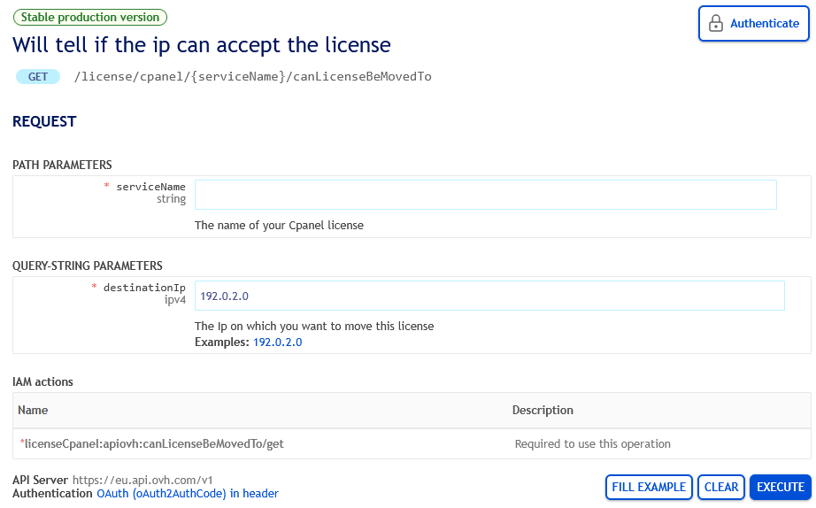
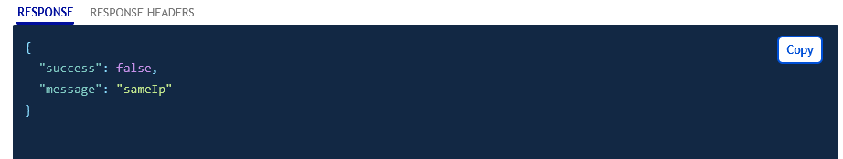

## Allgemeine Fragen zu VPS-Angeboten

/// details | Was ist ein VPS und wofür wird er verwendet?

Ein Virtual Private Server (VPS) wird zur Bereitstellung von Webseiten (E-Commerce, Inhalte, visuelle Medien) und Softwareanwendungen (Portale, Extranets, kooperative Lösungen, Wikis, CRM) verwendet. Im Gegensatz zu Shared Hosting bietet ein VPS eine isolierte Umgebung, die dem Kunden zugeordnet ist. Unsere VPS-Lösungen schließen die Lücke zwischen Webhosting und dedizierten Servern, indem sie Leistung und Zuverlässigkeit ohne die Notwendigkeit der Hardwareverwaltung kombinieren. Sie können Ihre Konfiguration außerdem leicht aufrüsten, ohne Server zu wechseln.

///

/// details | Welche Vorteile bietet ein OVHcloud VPS?

OVHcloud VPS-Angebote bieten hervorragenden Leistungspreis, mit unbegrenztem Datenverkehr und mehreren globalen Standorten für geringe Latenz und verbesserte Zugänglichkeit, abhängig von Ihren Anforderungen.

///

/// details | Ist eine VPS-Lösung die richtige Wahl für mich?

Die Nutzung eines VPS erfordert grundlegende Kenntnisse der Server-Administration. Dies zu berücksichtigen ist entscheidend, um Ihr Betriebssystem (Linux oder Windows) effektiv zu verwalten und Ihre Anwendungen einzurichten, z. B. PrestaShop oder WordPress.

Wenn Sie einen VPS benötigen, aber nicht über die technischen Kenntnisse verfügen, um ihn zu verwalten, wenden Sie sich an einen unserer [Partner](/links/partner) für Unterstützung.

Wenn Sie Ressourcen benötigen, aber nicht mit der Server-Administration umgehen möchten, empfehlen wir Ihnen, unsere Performance-Webhosting-Pläne in Betracht zu ziehen.

///

/// details | Kann ich meinen VPS einfach in eine höhere Leistungsklasse aufrüsten oder in eine geringere Konfiguration herunterskalieren?

Ja, Sie können Ihre Konfiguration über das OVHcloud Kundencenter aufrüsten, ohne Ihre Daten zu migrieren. Die verfügbaren Ugrade-Optionen hängen von der Reihe und dem Modell des VPS ab.

Um Ihre Konfiguration herunterstufen zu können, müssen Sie jedoch einen neuen Dienst abonnieren, Ihre Daten übertragen und anschließend Ihren alten Dienst stornieren. Unser Support-Team steht Ihnen bei Bedarf zur Verfügung.

///

/// details | Welche Region oder welches Land sollte ich für meinen VPS wählen?

Ihr Rechenzentrum näher an Ihren Nutzern zu verorten führt zu geringerer Latenz und damit besserer Benutzererfahrung und einem erhöhten Vertrauen in Ihre Dienste.

///

/// details | Welchen Vorteil bietet ein in Europa gelegener VPS?

Die Einrichtung Ihres VPS bei OVHcloud in Frankreich oder allgemein innerhalb der EU bietet Vorteile wie wettbewerbsfähige Preise und verstärkten Datenschutz. Ihr Service unterliegt nicht dem US CLOUD Act und ist somit vor nicht-europäischer Einflussnahme geschützt.

///

/// details | Sind Backups mit meinem VPS inkludiert?

Ja, bei der Bestellung eines VPS ist eine tägliche Backup-Option kostenlos enthalten.

Für eine noch bessere Sicherheit können Sie auch unsere Backup-Option Premium aktivieren. Diese bietet:

- Die Möglichkeit, auf ein Backup zurückzugreifen, das bis zu eine Woche alt ist.
- Die Möglichkeit, Backups zu planen, um die Datenerfassung zu optimieren und den Einfluss auf Geschäftsprozesse zu minimieren.

Zusätzlich bieten wir:

- Snapshots: Sie können manuelle, schnelle Snapshots erstellen, die den genauen Zustand Ihres VPS vor einem Update oder einer kritischen Änderung erfassen.
- Externes Backup: Speichern Sie Ihre Daten auf einem separaten, sicheren Datenträger, um bei einem größeren Ausfall eine einfache Wiederherstellung zu ermöglichen.

Durch die Nutzung dieser Lösungen können Sie Ihre Backup-Verwaltung an Ihre Sicherheits- und Kontinuitätsanforderungen anpassen.

Besuchen Sie unsere [VPS-Webseite](/links/bare-metal/vps), um mehr über die verfügbaren Optionen zu erfahren.

///

/// details | Kann ich mehrere Webseiten auf einem VPS hosten?

Ja, ein VPS kann so konfiguriert werden, dass mehrere Webseiten oder Projekte darauf gehostet werden. Sie können Ihren Speicherplatz entsprechend Ihren Anforderungen aufteilen und spezialisierte Oberflächen wie Plesk oder cPanel nutzen, um die Verwaltung Ihrer Webseiten zu vereinfachen.

///

/// details | Erhalte ich mit meinem VPS einen Domainnamen und E-Mail-Dienst?

Nein, unsere VPS-Lösungen enthalten keinen Domainnamen oder E-Mail-Dienst. Diese Dienste können separat im OVHcloud Kundencenter bestellt werden.

///

/// details | Wie wähle ich zwischen einem VPS und einem Hosting-Paket?

**Hosting-Paket**

- Ideal für grundlegende Hosting-Anforderungen mit einer vorab konfigurierten Einrichtung.

**VPS**

- Mehr Flexibilität und Kontrolle, perfekt für skalierbare Projekte mit komplexen Konfigurationsanforderungen.

Die Einrichtung von Webdiensten auf einem VPS ermöglicht es Ihnen, Ihre bevorzugte Software zu installieren, Servereinstellungen zu anpassen und mehrere Webseiten mit dedizierten Ressourcen zu hosten. Beachten Sie, dass ein VPS so konfiguriert werden muss, dass er Ihren Anforderungen entspricht und sich an Ihr Wachstum anpasst.

///

/// details | Was ist der Unterschied zwischen einem VPS und Public Cloud Lösungen?

**VPS**

- Eine optimierte und dedizierte virtuelle Maschine, geeignet sowohl für Präproduktion als auch für Produktion, die mehrere Webprojekte hosten kann.

**OVHcloud Public Cloud**

- Bietet eine Multi-Server-Infrastruktur mit hoher Verfügbarkeit und einem privaten Netzwerk (vRack) und ist für komplexe, skalierbare Architekturen konzipiert.

///

/// details | Welche Vorteile bietet ein VPS im Vergleich zu einem dedizierten Server?

**VPS**

- Bietet vereinfachte Administration ohne Hardware-Verwaltung, ideal für Projekte, die strikte Kontrolle benötigen.  

**Dedicated Server**

- Wird für komplexe Infrastrukturen empfohlen, die eine vollständige Hardware-Kontrolle und garantierte Leistung erfordern.

Ein VPS beseitigt die Notwendigkeit, physische Hardware wie Speicher, RAM und CPU zu verwalten, wodurch er sich gut für die meisten Webanwendungen eignet. Wenn Ihr Unternehmen wächst, können Sie Ihren VPS upgraden oder auf einen dedizierten Server oder eine Public Cloud Lösung migrieren, um eine flexiblere und leistungsfähigere Infrastruktur zu erhalten.

///

/// details | Welche Bandbreite ist meinem VPS zugeordnet? Ist sie garantiert?

Die Bandbreite, die auf unserer [VPS-Webseite](/links/bare-metal/vps) aufgelistet ist, ist garantiert. Es handelt sich um den minimalen Wert, der Ihrem Dienst zugeordnet wird.

///

/// details | Welche SLA gilt für meinen VPS?

Ein OVHcloud VPS beinhaltet eine SLA von 99,9 %.

///

/// details | Welche einzigartigen Merkmale hat ein Local Zone VPS?

Mit einem Local Zone VPS können Sie die Zugriffszeiten auf Ihre Webseiten und Anwendungen erheblich reduzieren, da Ihre Daten näher an Ihren Benutzern gehostet werden. Dies verbessert die Benutzererfahrung, indem die Latenz reduziert wird, sobald Anwendungen eine minimierte Antwortzeit erfordern. Wählen Sie einfach einen unserer weltweiten Standorte im Bestellvorgang.

Beachten Sie, dass ein Local Zone VPS im Gegensatz zu einem regulären VPS keine Sicherheitsfunktionen wie Anti-DDoS oder erweiterte Optionen wie Additional IP und Load Balancer enthält.

Ein Local Zone VPS erfüllt auch die Anforderungen von Projekten mit Datenresidenz- und Souveränitätsbedürfnissen. Durch das Hosten Ihrer Dienste in einer bestimmten Region können Sie lokale Vorschriften zum Datenverarbeitungs- und -speicherung leicht erfüllen, wie z. B. die europäische DSGVO.

///

/// details | Kann ich meinen VPS von einer Local Zone in ein Rechenzentrum und umgekehrt migrieren?

Nein, Sie können Dienste nicht direkt migrieren. Sie müssen Ihren gewünschten VPS bestellen, Ihre Daten übertragen und anschließend Ihren alten Dienst stornieren. Unser Support-Team kann Sie bei Bedarf durch diese Schritte führen.

///

/// details | Welche Risiken bestehen bei der Nutzung eines VPS ohne DDoS-Schutz?

VPS ohne Anti-DDoS-Schutz sind automatischen Angriffen durch Distributed Denial-of-Service (DDoS) ausgesetzt, was zu Dienstunterbrechungen und schwerwiegenden Sicherheitsverletzungen führen kann.

- Direkte Exposition: Wenn Ihr Server Ziel eines DDoS-Angriffs wird, kann der Ansturm an schädlichen Anfragen ihn überlasten, wodurch Ihre Webseiten und Anwendungen nicht mehr zugänglich sind.
- Keine automatische Abwehr: Um Ihren Server zu schützen, müssen Sie Angriffe mithilfe von Drittanbieter-Sicherheitssoftware oder spezifischen Konfigurationen abwehren.
- Zusätzliche Verwaltungsaufwand: Das Fehlen robuster, eingebauter Sicherheitsfunktionen stellt ein großes Risiko dar und unterstreicht die Notwendigkeit einer sorgfältigen Überwachung und proaktiver Strategien, insbesondere für Projekte mit hohem Datenverkehr.

Wenn die Resilienz gegenüber DDoS-Angriffen für Ihr Projekt von entscheidender Bedeutung ist, empfehlen wir Ihnen, einen OVHcloud VPS in einem unserer Rechenzentren zu wählen, der mit eingebauter Schutzfunktion ausgestattet ist.

///

## Fragen zur VPS-Administration

/// details | Wie verbinde ich mich mit meinem VPS?

Sie können sich mithilfe der per E-Mail bereitgestellten Anmeldeinformationen nach der Dienstauslieferung *remote* mit Ihrem VPS verbinden.  
Die Verbindungsart hängt davon ab, welche Betriebssysteme verwendet werden.

Alle Details finden Sie in unserer Anleitung zu [den ersten Schritten mit einem VPS](/pages/bare_metal_cloud/virtual_private_servers/starting_with_a_vps).

///

/// details | Bietet OVHcloud Unterstützung bei der Softwarekonfiguration für meinen VPS?

Wir können zwar keine Unterstützung bei der Softwarekonfiguration oder -verwaltung anbieten, doch stellen wir einige Tools und Ressourcen bereit, um Ihnen den Einstieg zu erleichtern.

Zum Beispiel bieten wir eine Vielzahl vorab konfigurierter Vorlagen und Images für beliebte Betriebssysteme und Anwendungen an, um Ihnen die schnelle Einrichtung Ihres VPS zu ermöglichen. Wir stellen außerdem das OVHcloud Kundencenter bereit, in dem Sie Ihren VPS verwalten können, z. B. Neustart, Reinstallation und Ressourcenüberwachung.

Außerdem bietet unsere Dokumentation und Wissensdatenbank eine Fülle von Informationen zur Konfiguration und Verwaltung Ihres VPS.

Für spezifische Unterstützung bei der Softwarekonfiguration empfehlen wir Ihnen, sich an unsere [Community](/links/community) zu wenden oder die Hilfe eines qualifizierten Systemadministrators oder Entwicklers über unser [Partnerportal](/links/partner) in Anspruch zu nehmen.

///

/// details | Kann ich auf meinem VPS mehrere Betriebssysteme installieren?

OVHcloud Templates erlauben die Installation eines einzigen Betriebssystems.  
Individuelle Anpassungen können vom Kunden vorgenommen werden und liegen in der Verantwortung des Server-Administrators. OVHcloud Dienste umfassen keine Verwaltungsaufgaben, wie z. B. Softwarekonfiguration oder externe Tools.

Falls Sie bei der Konfiguration und Verwaltung Probleme haben, empfehlen wir Ihnen, sich an unsere [Community](/links/community) zu wenden oder die Hilfe eines qualifizierten Systemadministrators oder Entwicklers über unser [Partnerportal](/links/partner) in Anspruch zu nehmen.

///

/// details | Kann ich auf einem VPS mithilfe von Virtualisierungssoftware (z. B. Proxmox) virtuelle Maschinen installieren?

OVHcloud Templates für VPS enthalten weder das Proxmox-Betriebssystem noch ein ähnliches Betriebssystem für Virtualisierung. 

Anpassungen können vom Kunden vorgenommen werden und liegen in der Verantwortung des Server-Administrators. OVHcloud Dienste umfassen keine Verwaltungsaufgaben, wie z. B. Softwarekonfiguration oder die Nutzung externer Tools.

Falls Sie bei der Konfiguration und Verwaltung Schwierigkeiten haben, empfehlen wir Ihnen, sich an unsere [Community](/links/community) zu wenden oder die Hilfe eines qualifizierten Systemadministrators oder Entwicklers über unser [Partnerportal](/links/partner) in Anspruch zu nehmen.

///

/// details | Ist es möglich, die Hardware meines VPS (GPU, CPU etc.) auszuwählen oder zu aktualisieren?

Ein VPS kann nicht auf der Hardware-Ebene angepasst oder geändert werden.  
Wählen Sie im Bestellprozess ein [VPS-Modell](/links/bare-metal/vps) aus, das Ihre Mindestanforderungen erfüllt, und stufen Sie es bei Bedarf hoch.

///

/// details | Mein VPS ist zu langsam, kann ich meinen VPS auf einen anderen Host verschieben?

Um Leistungsprobleme auf Ihrem VPS zu beheben, müssen Sie unserem Support-Team spezifische Testergebnisse vorlegen.

Beachten Sie, dass Ihr VPS in den [Rescue-Modus](/pages/bare_metal_cloud/virtual_private_servers/rescue) gebootet werden muss, um mögliche Softwareprobleme auszuschließen.

Wenden Sie sich an unser Support-Team, indem Sie [eine Anfrage im OVHcloud Help Center erstellen](https://help.ovhcloud.com/csm?id=csm_get_help), damit wir Ihnen die vollständige Liste der erforderlichen Tests für eine ordnungsgemäße Begutachtung bereitstellen können.

///

/// details | Ich habe einen neuen VPS bestellt, kann ich die verbleibende Vertragszeit meines alten VPS übertragen oder eine Rückerstattung erhalten?

Dies ist in der Regel möglich, doch der Prozess erfordert eine [Anfrage an unser Support-Team über das OVHcloud Help Center](https://help.ovhcloud.com/csm?id=csm_get_help).

Bevor Sie fortfahren, stellen Sie sicher, dass Sie [alle noch benötigten Daten migriert haben](/pages/bare_metal_cloud/dedicated_servers/migrate_a_server_to_another) oder erstellen Sie Backups Ihrer Daten.

///

/// details | Kann ich meinen VPS in einen anderen OVHcloud Rechenzentrum in einem anderen Land verschieben?

Eine Migration eines VPS in ein anderes Rechenzentrum ist nicht möglich. Um dies zu erreichen, können Sie eine [manuelle Migration](/pages/bare_metal_cloud/dedicated_servers/migrate_a_server_to_another) durchführen:

- Laden Sie Ihre Daten vom aktuellen VPS herunter.
- Bestellen Sie einen neuen VPS.
- Laden Sie Ihre Daten auf den neuen VPS hoch.
- [Stornieren Sie den alten VPS](/pages/account_and_service_management/managing_billing_payments_and_services/how_to_cancel_services).

///

/// details | Wie viele zusätzliche IPs kann ich auf einem VPS konfigurieren?

Ein VPS ist auf [16 zusätzliche IP-Adressen](/links/network/additional-ip) beschränkt.

Weitere Informationen zur IP-Konfiguration finden Sie in unserer Anleitung zur [Konfiguration von IP-Alias](/pages/bare_metal_cloud/virtual_private_servers/configuring-ip-aliasing).

///

/// details | Kann ich IP-Blöcke zu meinem VPS hinzufügen?

Es ist nicht möglich, IP-Blöcke zu einem VPS hinzuzufügen.  
Auf einem VPS können bis zu [16 zusätzliche IP-Adressen](/links/network/additional-ip) konfiguriert werden.

///

/// details | Kann ich den VPS, der mit meiner Lizenz verknüpft ist, wechseln (Plesk, cPanel)?

Lizenzen können zwischen Servern übertragen werden, es gibt jedoch Einschränkungen.

Die beste Option besteht darin, sich mit Ihren Login-Daten in unserer [API-Konsole](/links/api) einzuloggen und zu prüfen, ob Ihre Lizenz auf einen anderen VPS übertragen werden kann. Weitere Informationen finden Sie in unserer Anleitung zu [den ersten Schritten mit der OVHcloud API](/pages/manage_and_operate/api/first-steps).

Sobald Sie verbunden sind, verwenden Sie die folgenden Aufrufe, abhängig von der verwendeten Software:

**Plesk**

> [!api]
>
> @api {v1} /license/plesk GET /license/plesk/{serviceName}/canLicenseBeMovedTo
>

**cPanel**

> [!api]
>
> @api {v1} /license/cpanel GET /license/cpanel/{serviceName}/canLicenseBeMovedTo
>

{.thumbnail}

Geben Sie die Parameter wie folgt ein:

- `serviceName`: Geben Sie den internen Namen Ihrer Lizenz ein (siehe Abschnitt `Lizenzen` in Ihrem [OVHcloud Kundencenter](/links/manager)).
- `destinationIp`: Geben Sie die IPv4-Adresse des Ziel-Dienstes ein.

Klicken Sie auf die Schaltfläche `EXECUTE`{.action}.

Wenn das Ergebnis negativ ist (`false`), wird der Grund im Feld `RESPONSE` angezeigt.

{.thumbnail}

Wenn die Ziel-IP mit Ihrer Lizenz kompatibel ist (`true`), können Sie den entsprechenden Aufruf verwenden, um sie zu übertragen:

**Plesk**

> [!api]
>
> @api {v1} /license/plesk POST /license/plesk/{serviceName}/changeIp
>

**cPanel**

> [!api]
>
> @api {v1} /license/cpanel POST /license/cpanel/{serviceName}/changeIp
>

///

## Fragen zu Sicherheit und Backup

/// details | Wie sichere ich meinen VPS?

Standardmäßig wird der VPS nur mit dem ausgewählten Betriebssystem ausgeliefert. Der VPS-Administrator ist für die Anwendung einer geeigneten Sicherheitskonfiguration nach der Auslieferung des VPS verantwortlich.  
Beachten Sie auch unserere Anleitung zur [Absicherung eines VPS](/pages/bare_metal_cloud/virtual_private_servers/secure_your_vps).

///

/// details | Wie kann ich meine Dateien oder ein Backup des VPS herunterladen?

Es gibt mehrere Optionen, z. B.:

- Download über SFTP: Verbinden Sie sich mit Ihrem VPS mit einem Software-Client, der SFTP unterstützt (z. B. [FileZilla](/pages/bare_metal_cloud/dedicated_servers/comment-deposer-ou-recuperer-des-donnees-sur-un-serveur-dedie-via-sftp)), und übertragen Sie alle Dateien im Root-Verzeichnis des Systems.

- Download über `rsync` (Kommandozeilentool): Verwenden Sie den Befehl `rsync -avz -e ssh username@vps_ip_address:/ /local_directory/`, um alle Dateien und Ordner Ihres VPS herunterzuladen.

- Download über die Option **Automatisches Backup**: Folgen Sie unserer Anleitung zur [Verwendung von automatischen Backups auf einem VPS](/pages/bare_metal_cloud/virtual_private_servers/using-automated-backups-on-a-vps), um Dateien aus einem Backup herunterzuladen.

- Download über die Option **Snapshot**: Folgen Sie unserer Anleitung zur [Verwendung von Snapshots auf einem VPS](/pages/bare_metal_cloud/virtual_private_servers/using-snapshots-on-a-vps), um einen VPS-Snapshot herunterzuladen.

///

/// details | Wie kann ich meinen VPS als VM-Datei herunterladen?

Es ist nicht möglich, eine VM-Datei eines OVHcloud VPS herunterzuladen. Sie können jedoch die VPS-Option **Snapshot** in Ihrem OVHcloud Kundencenter verwenden, um eine Bilddatei abzurufen.

Folgen Sie unserer Anleitung zur [Verwendung von Snapshots auf einem VPS](/pages/bare_metal_cloud/virtual_private_servers/using-snapshots-on-a-vps), um einen VPS-Snapshot zu erstellen und herunterzuladen.

Sie können die heruntergeladene Snapshot-Datei anschließend lokal in ein Format umwandeln, das Ihren Anforderungen entspricht.

Für weitergehende Unterstützung können Sie sich an einen unserer [Partner](/links/partner) wenden.

///

/// details | Wie kann ich auf meinen Backup-Speicher von einer IP-Adresse außerhalb meines Dienstes zugreifen?

Der Zugriff auf den Backup-Speicherplatz Ihres VPS (FTP-Speicherplatz) kann auf IP-Adressen beschränkt sein, die mit einem Dienst in Ihrem OVHcloud Kundencenter verknüpft sind.

Um weitere IP-Adressen hinzuzufügen, von denen aus Sie zugreifen können, können Sie die OVHcloud API verwenden.  
Dies ermöglicht es Ihnen, Ihre Backup-Daten über verschiedene Protokolle (FTP, NFS, CIFS) von einem anderen aus Dienst abzurufen.

> [!warning]
> Nur OVHcloud IP-Adressen können autorisiert werden.
>

Loggen Sie sich in die [OVHcloud API-Konsole](/links/api) mit Ihren Login-Daten ein und verwenden Sie den folgenden Aufruf:

> [!api]
>
> @api {v1} /vps POST /vps/{serviceName}/backupftp/access
>

Bearbeiten Sie die Parameter wie folgt:

- `serviceName`: Geben Sie den internen Namen Ihres VPS ein (`vps-x11x11xyy.vps.ovh.net`).
- `cifs`: Setzen Sie dies auf `true`, wenn zutreffend.
- `ftp`: Setzen Sie dies auf `true`, wenn zutreffend.
- `ipBlock`: Geben Sie die IP-Adresse ein, die Zugriff haben soll, im Format `203.0.113.100/32`.
- `nfs`: Setzen Sie dies auf `true`, wenn zutreffend.

Klicken Sie auf die Schaltfläche `EXECUTE`{.action}.

Um zu überprüfen, ob Ihre IP-Adresse autorisiert ist, verwenden Sie den folgenden Aufruf:

> [!api]
>
> @api {v1} /vps GET /vps/{serviceName}/backupftp/access
>

///

/// details | Ist mein VPS vor externen Angriffen geschützt?

Obwohl OVHcloud Sicherheitsmaßnahmen anwendet, um die gesamte Infrastruktur zu schützen, ist der Administrator eines VPS für die Sicherheit der darauf gehosteten Anwendungen und Daten verantwortlich.

- Folgen Sie unserer Anleitung zur [Konfiguration der OVHcloud Edge Network Firewall](/pages/bare_metal_cloud/dedicated_servers/firewall_network), die in unserer Anti-DDoS-Infrastruktur integriert ist und die Exposition Ihrer Dienste gegenüber DDoS-Angriffen begrenzt.

- Darüber hinaus können Sie unsere Anleitungen zur [Firewall-Konfiguration](/pages/bare_metal_cloud/virtual_private_servers/firewall-Linux-iptable) mit `iptables` auf Linux-basierten Distributionen und zur [Windows-Firewall](/pages/bare_metal_cloud/virtual_private_servers/activate-port-firewall-soft-win) verwenden.

- Für Linux-basierte Distributionen auf einem VPS können Sie die Anweisungen in unserer Anleitung zur [Absicherung eines VPS](/pages/bare_metal_cloud/virtual_private_servers/secure_your_vps) befolgen, um zusätzliche Sicherheitsmaßnahmen anzuwenden.

///

/// details | Wie sichere ich meinen VPS vor DDoS-Angriffen?

OVHcloud bietet mehrere Sicherheitsfunktionen, um Ihren VPS vor schädlichem Traffic zu schützen:

- Anti-DDoS-Schutz: Unsere VPS-Dienste sind standardmäßig durch unsere [Anti-DDoS-Infrastruktur](/links/security/antiddos) geschützt, die DDoS-Angriffe in Echtzeit erkennt und abmildert.
- IP-Blockierung: Sie können [spezifische IP-Adressen oder IP-Bereiche](/pages/bare_metal_cloud/virtual_private_servers/secure_your_vps) blockieren, die auf Ihren VPS zugreifen.
- Firewall-Regeln: Sie können [benutzerdefinierte Firewall-Regeln konfigurieren](/pages/bare_metal_cloud/dedicated_servers/firewall_network), um den eingehenden und ausgehenden Traffic direkt auf Ihrem VPS zu steuern.
- VAC (VPS Anti-DDoS): Unser VAC-System bietet einen zusätzlichen Schutz vor DDoS-Angriffen, einschließlich Traffic-Filterung und Rate-Limiting.

///

/// details | Ich möchte einen VPS als Game Server verwenden, profitiert er vom gleichen Firewall-Schutz wie die Game Dedicated Server?

Der OVHcloud Game DDoS-Schutz ist nur für unsere Game Dedicated Server verfügbar. Wenn Sie einen VPS für Game-Hosting nutzen möchten, müssen Sie die Firewall direkt auf Ihrem System konfigurieren, angepasst an das gewünschte Spiel. Weitere Informationen finden Sie in unserer Anleitung zur [Firewall-Konfiguration](/pages/bare_metal_cloud/virtual_private_servers/firewall-Linux-iptable).

Der Vorteil eines VPS gegenüber einem Dedicated Server ist die Möglichkeit, dessen Ressourcen entsprechend Ihrer tatsächlichen Nutzung zu skalieren. Sie können Ihren VPS mit nur wenigen Klicks upgraden, um von einem leistungsfähigeren System zu profitieren.

///

## Weiterführende Informationen

Wenn Sie Hilfe bei der Nutzung und Konfiguration Ihrer OVHcloud Lösungen benötigen, beachten Sie unsere [Support-Angebote](/links/support).

Treten Sie unserer [User Community](/links/community) bei.
