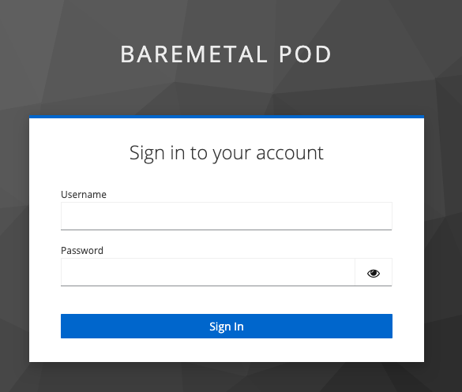
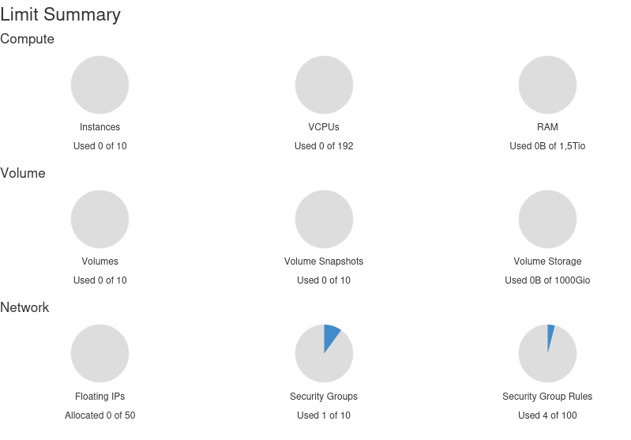
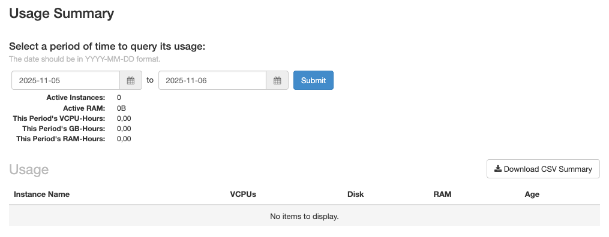
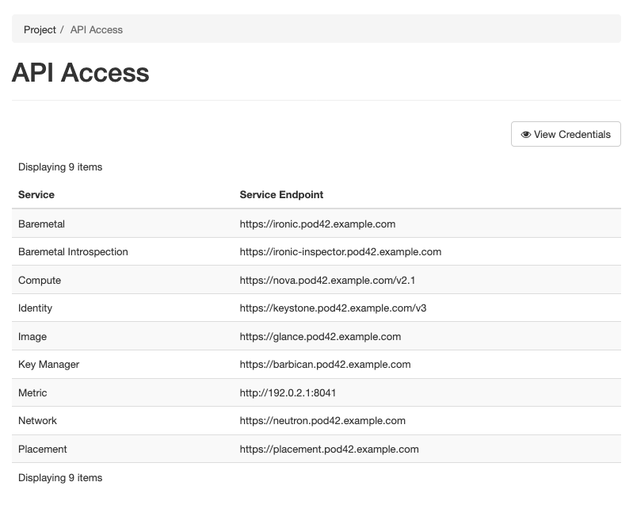
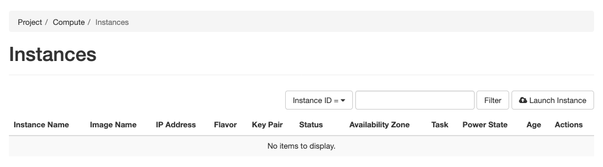
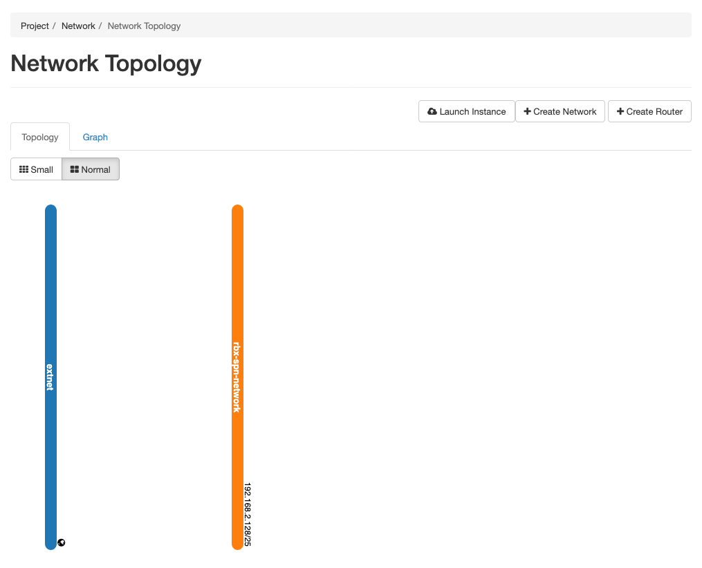

## Objective

This guide has been designed to introduce you to how to connect to the graphical interfaces of **Bare Metal Pod** as an administrator of this service.

## Requirements

To follow this guide, you will need the following information:

- The **url** address of the management interface provided when the service was delivered.
- The credentials (login and password) provided when the service was delivered.

## Instructions

### Composition of the user interface

The provided **url** address allows you to access the **Bare Metal Pod** user interface.

{.thumbnail}

Once you have entered your credentials to register, you will have access to the product dashboard.

{.thumbnail}

Your interface allows you to access:

- User configuration within *Keycloak* via the menu under your identifier.
- The OpenStack management interface, *Horizon*. This is a web-based graphical interface for managing the entire OpenStack infrastructure. It allows users to use the machine resources made available by administrators. This includes creating, launching and stopping instances, configuring networks, and managing instance accessibility.

The administration interface of **Bare Metal Pod** also includes access to various APIs such as: Keystone (authentication and identity management), Glance (image management), Nova (compute service), Neutron (network management), Ironic (Bare Metal hardware management), which can be used within your automations.

### Overview of the OpenStack Horizon Interface

The OpenStack Horizon graphical interface offers the possibility to perform different actions depending on their permissions and the project to which they belong. Among the main features available to an end user, we can mention: instance management, network management, and resource monitoring.

#### Access to the OpenStack Horizon administration interface

From the **Bare Metal Pod** Control Panel, the OpenStack Horizon interface is accessible via the link on the dashboard.

{.thumbnail}

After logging in, the Horizon OpenStack interface appears as follows:

{.thumbnail}

The side menu located on the left side of the interface provides access to the different elements of the interface. There are two parent entries in this menu:

{.thumbnail}

- **Project** which includes four elements: Overview, API Access, Compute and Network. These elements group all the dedicated server management features, their networks, within the defined quotas.
- **Identity** which includes the elements Projects, Users and Application Credentials that contain the user management features.

#### Project view

The main element *Project* is composed of various sub-elements that allow access to all the resource management features. The first sub-element, called *Overview*, provides a global view of the resource quotas assigned to the project, as well as a visual tracking of the overall resource consumption. 

##### Overview section

{.thumbnail}

The *Overview* section is composed of two main parts:

- **Limit Summary**: The quota limits assigned to the project for each type of resource. This also allows you to visualize the level of resource consumption in relation to the available capacity.

    The quotas are grouped into two categories, as shown in the image below:

    {.thumbnail}

    - **Compute** which includes the instance limits, vCPUs and RAM.
    - **Network** which monitors the network resource quotas: Floating IP addresses, security groups, security group rules, networks and ports.

- **Usage Summary** (Usage summary): historical resource usage over a period that allows you to observe the evolution of resource usage over time.

{.thumbnail}

##### API Access section

The **API-Access** tab groups the 10 services available via API such as Bare-Metal, Compute, identity, image and network, as well as their endpoints URLs.

{.thumbnail}

Thanks to these Endpoints, it is possible to communicate directly with the OpenStack components using API requests. This information is necessary if you are required to implement your own HTTP requests with the OpenStack APIs.

If you use existing OpenStack integrations, these will retrieve this information during the first connection to the OpenStack Keystone component. This one is responsible for providing this information programmatically.

#### Compute view

The **Compute** view groups the features allowing you to configure the dedicated servers of your product. This view is divided into different sections:

##### Instances section

Interface allowing you to list and manage already configured dedicated servers. An *Instance* corresponds to a dedicated server.

{.thumbnail}

##### Images section

You have the possibility to manage the OS images available to create instances. It is also possible to download new images or select from already available images to set up instances. You can thus generate your own images to manage additional operating systems.

> [!warning]
>
> The images must take into account the drivers of the hardware delivered in your product. Many images available for Glance are only available for virtual environments based on qemu or kvm drivers.
>

{.thumbnail}

##### Key Pairs section

In order to authenticate via SSH on your machines after installation, you need to use asymmetric encryption keys. This interface allows you to import public keys that will be deployed during the installation of the dedicated servers to ensure an SSH connection.

{.thumbnail}

#### Network view

The Network view allows you to visualize and manage the networks of your **Bare Metal Pod** service. This interface allows you to create shared or distinct networks between your dedicated servers.

> [!primary]
>
> All of your network configuration is managed by this graphical interface or via the **OpenStack** APIs with the network component named **Neutron**. The switches in your infrastructure will be automatically configured from the OpenStack information.
>

##### Network Topology section

This section shows you all the networks created on this Pod via a vertical line of color. The squares correspond to services or dedicated servers connected to one or more of these networks.

{.thumbnail}

##### Networks section

This section contains the list of available networks for the dedicated servers on your **Bare Metal Pod**.

{.thumbnail}

For more information on how networks work with OpenStack, we recommend you consult the [OpenStack Networking](https://docs.openstack.org/neutron/2024.1/admin/intro-os-networking.html) documentation.

## Go further

If you need training or technical assistance for the implementation of our solutions, contact your sales representative or click on [this link](/links/professional-services) to get a quote and request a custom analysis of your project from our Professional Services team experts.

Join our [community of users](/links/community).