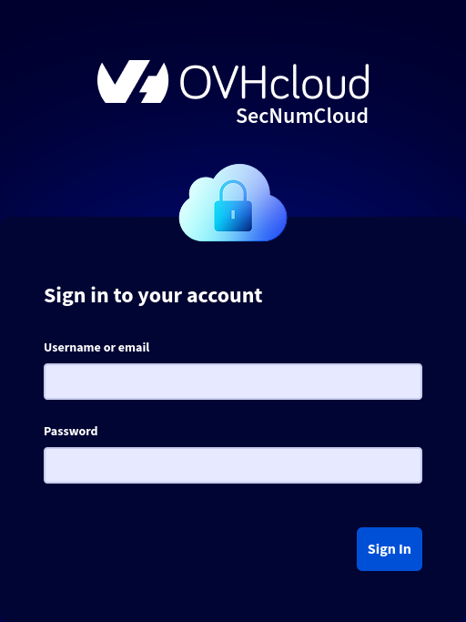
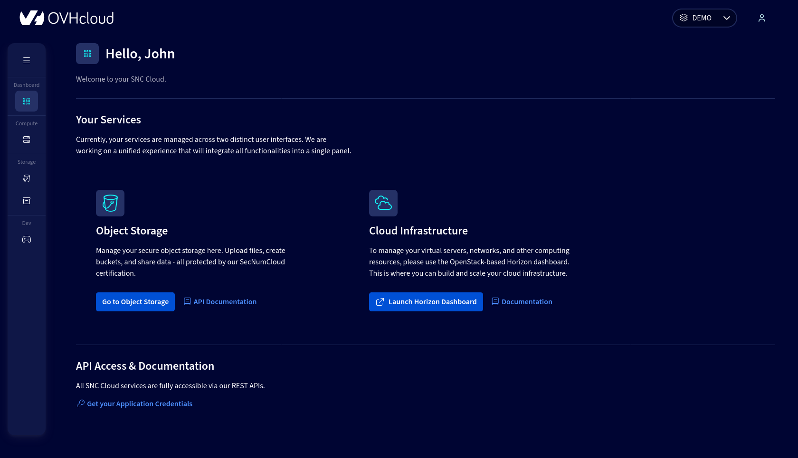
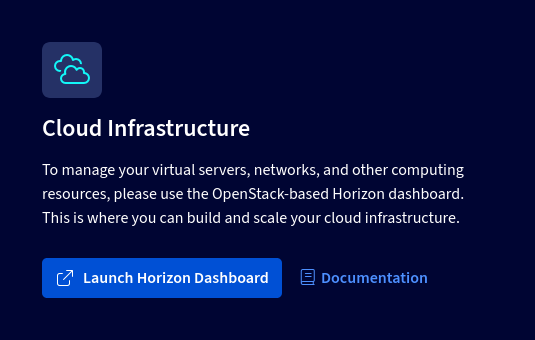
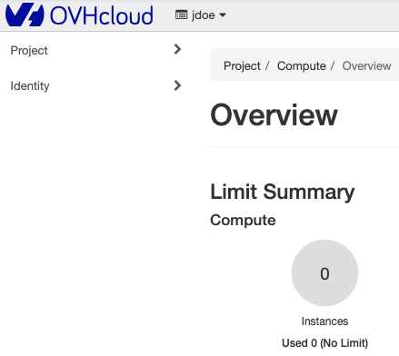
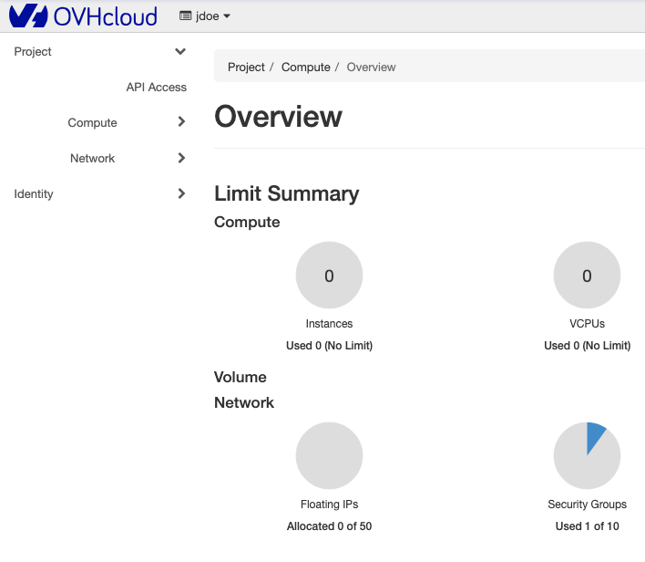
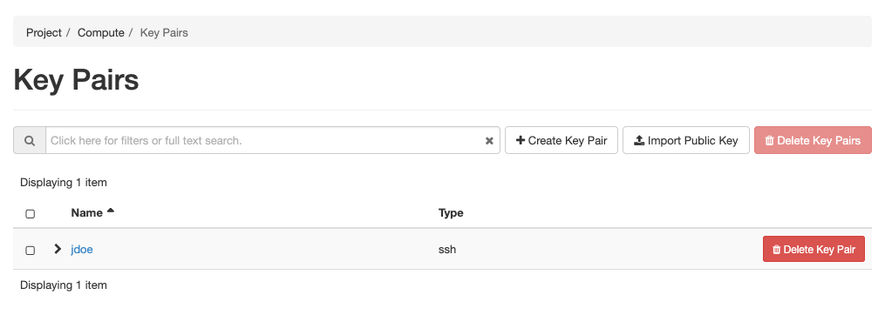
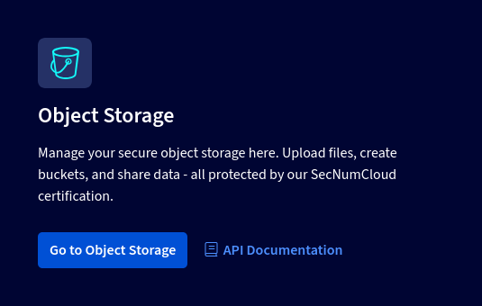
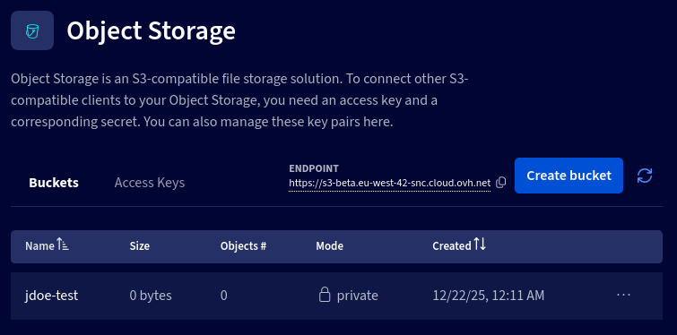
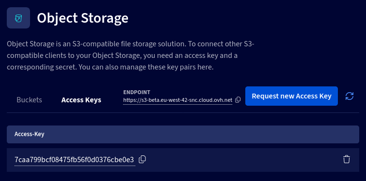

## Objectif

Ce guide a été conçu pour vous présenter comment se connecter aux interfaces graphiques de la **SNC Cloud Plateform** en tant que qu'administrateur de ce service.

## Pré-requis

Afin de suivre ce guide, vous aurez besoin des informations suivantes

* L'adresse **url** de l'interface de gestion fournie lors de la livraison du service.
* Les identifiants (organisation id, login et mot de passe) fournies lors de la livraison du service.

## Composition de l'interface utilisateur

L'adresse **url** fournie vous permet d'accéder à l'interface du régional manager de la **SNC Cloud Plateform**.

{.thumbnail}

Une fois vos identifiants utilisés pour vous enregistrer, vous aurez accès au dashboard du produit.

{.thumbnail}

Votre interface vous permet d'accéder à 
* À l'interface de gestion d'Openstack, *Horizon*. C’est une interface web graphique pour gérer l'ensemble de l'infrastructure Openstack. Elle permet à l’utilisateur de d’exploiter les ressources machines mises à disposition par les administrateurs. Ceci passe par la création, le lancement et l’arrêt des instances, la configuration des réseaux, la gestion de l’accessibilité des instances.
* À l'interface de gestion du stockage objet.

## Présentation de l'Interface Openstack Horizon

L'interface graphique d'Openstack Horizon offre la possibilité de réaliser différentes actions en fonction de leurs autorisations et du projet auquel ils appartiennent. Parmi les principales fonctionnalités disponibles pour un utilisateur final, on peut citer : la gestion des instances, la gestion des réseaux, le suivi des ressources.

### Accès à l'interface d'administration Openstack Horizon

Depuis l'interface du régional manager de la **SNC Cloud Plateform**, l’interface Openstack Horizon est accessible via le lien dans le dashboard. 

{.thumbnail}

Après s’être connecté, l'interface Horizon Openstack se présente de la manière suivante :

{.thumbnail}

Le menu latéral situé à gauche de l'interface offre un accès aux divers éléments de l'interface. Il y a deux entrées parentes dans ce menu :

{.thumbnail}

* **Projet** qui comprend quatre éléments : Aperçu (Overview), Compute, Volumes et Réseau (Network). Ces éléments rassemblent l'ensemble des fonctionnalités de gestion des instances, de leurs réseaux, dans les limites de quotas définis.
* **Identité (Identity)** qui inclut les éléments Projets, Utilisateurs et identifiants d'application qui contiennent les fonctionnalités de gestion des utilisateurs.

### Vue projet

L'élément principal *Projet* est composé de divers sous-éléments qui permettent d'accéder à toutes les fonctionnalités de gestion des ressources.  Le premier sous-élément, appelé *Aperçu* (Overview), offre une vision globale des quotas de ressources, attribuées du projet, ainsi qu’un suivi visuel de la consommation globale des ressources. 

#### Section Overview

{.thumbnail}

La section *Overview* (Aperçu) est composée de deux parties principales :
* **Limit Summary** : Les limites de quotas attribuées au projet pour chaque type de ressource. Ceci permet également de visualiser le niveau de consommation des ressources par rapport aux capacités disponibles.
Les quotas sont regroupés en deux catégories, telles que représentées dans l'image ci-dessous :

  {.thumbnail}
  * **Compute** qui comprend les limites des instances, les vCPUs et la Ram.
  * **Network** qui surveille les quotas des ressources réseau : les IP flottantes, les groupes de sécurité, les règles de sécurité des groupes, les réseaux et les ports.

* **Usage Summary** (Résumé de l'utilisation) : historique d’utilisation des ressources sur une période qui permet d'observer l'évolution de l'usage des ressources dans le temps
  {.thumbnail}

### Vue Compute

La section **Compute** regroupe les fonctionnalités permettant de configurer les instances de votre projet. Cette section est divisée en différentes interfaces : 

#### Section Instances

Interface permettant de lister et de gérer les instances déjà configurés.

{.thumbnail}
  
#### Section Images

Vous avez la possibilité de gérer les images des OS disponibles pour créer des instances. Il est aussi possible de télécharger de nouvelles images ou de sélectionner parmi les images déjà disponibles afin de mettre en place des instances. Vous pouvez ainsi générer vos propres images pour gérer des systèmes d'exploitation supplémentaires.

{.thumbnail}

#### Section Key Pairs

Afin de vous authentifier en SSH sur vos machines après l'installation, il faut utiliser des clés de chiffrement asymétriques. Cette interface permet d'importer les clés publiques qui seront déployées durant l'installation des serveurs dédiés afin de vous assurer une connexion SSH.

{.thumbnail}

### Vue Network

La Vue Network (réseau) vous permet de visualiser et gérer les réseaux de votre projet. Cette interface permet de créer des réseaux mutualisés ou distincts entre vos instances.

> [!info]
>
> L'ensemble de votre configuration réseau est pilotée par cette interface graphique ou via les API de **Openstack** avec le composant réseau nommé **Neutron**. Les switchs de votre infrastructure seront automatiquement configuré à partir des informations de Openstack.
>

#### Section Network Topology 

Cette section vous représente l'ensemble des réseaux créés sur ce projet via une ligne verticale de couleur. Les carrés correspondent à des services ou des instances connectées à un ou plusieurs de ces réseaux

{.thumbnail}

#### Section Networks

Cette section contient la liste des réseaux disponibles pour les instances sur votre projet.

{.thumbnail}

Pour en savoir plus sur le fonctionnement des réseaux avec Openstack, nous vous conseillons de consulter la documentation [OpenStack Networking](https://docs.openstack.org/neutron/2024.1/admin/intro-os-networking.html).

## Présentation de l'Interface du stockage objet

Depuis l'interface du régional manager de la **SNC Cloud Plateform**, l’interface du Stockage objet est accessible via le lien dans le dashboard. 

{.thumbnail}

#### Onglet Buckets

Dans cet onglet on trouve la liste des buckets du stockage objets créés sur votre projet.

{.thumbnail}

Il est aussi possible d'en créer de nouveau via le bouton **Create bucket**

#### Onglet Access Keys

Dans cet onglet on trouve la liste des Access Keys du stockage objet créés sur votre projet. Cela permet l'usage des outils externe pour envoyer ou récupérer des objets sur le stockage objet.

{.thumbnail}

Il est aussi possible d'en créer de nouveau via le bouton **Request new Access Key**

## Aller plus loin

Si vous avez besoin d'une formation ou d'une assistance technique pour la mise en oeuvre de nos solutions, contactez votre commercial ou cliquez sur [ce lien](/links/professional-services) pour obtenir un devis et demander une analyse personnalisée de votre projet à nos experts de l’équipe Professional Services.

Échangez avec notre [communauté d'utilisateurs](/links/community).
