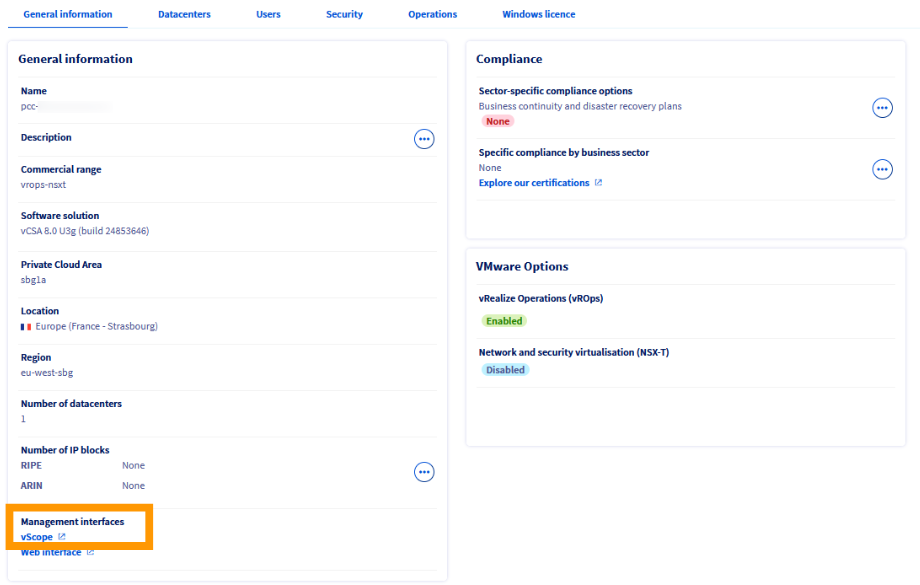
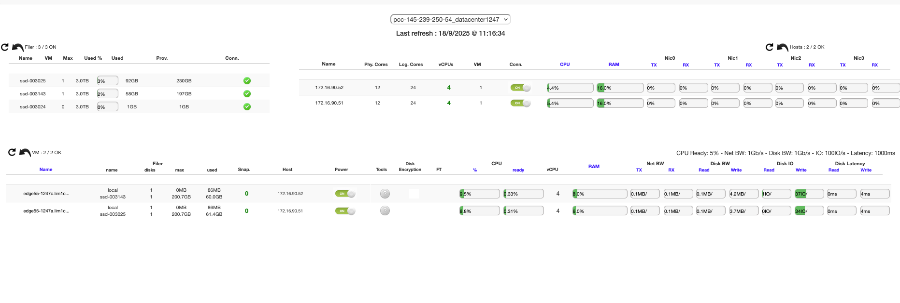
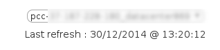
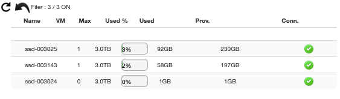
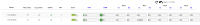

## Objective

OVHcloud provides you with a **supervision** and **monitoring** tool for your virtual machines and infrastructure: **vScope**.

This web interface gathers all the essential information about your resources.

**This guide explains how to read and use the vScope interface.**

## Requirements

- Be an administrator contact of the [Hosted Private Cloud](https://www.ovhcloud.com/en/enterprise/products/hosted-private-cloud/) infrastructure, in order to receive login credentials.
- Have an active user ID (created in the [OVHcloud Control Panel](/links/manager)).

## Practice

### Accessing vScope

1. Log in to your [OVHcloud Control Panel](/links/manager).

2. Click `Hosted Private Cloud`{.action}.

3. Select your service and then click the `vScope`{.action} icon.

{.thumbnail}

A link to vScope is also available directly on your Hosted Private Cloud service page.

{.thumbnail}

The interface opens in a new tab in your browser.

{.thumbnail}

Log in with your **user** and **password**, the same credentials you use to connect to the vSphere client.

{.thumbnail}

You are now connected to **vScope**. This page centralises the key information about your resources.

For example, for each host, you can immediately view:
- the number of cores and VMs
- CPU and RAM usage
- network traffic

{.thumbnail}

### Browsing vScope

#### Selecting the datacenter

If your Hosted Private Cloud contains several datacenters, select the one you want to display from the drop-down menu.

The **Last refresh** field corresponds to the last refresh of the web page (not of vScope). vScope data is automatically updated every 2 to 5 minutes.

{.thumbnail}

#### Filer menu

The **Filer** menu shows the usage of your datastores: number of virtual machines and consumed storage space.

Use this view to anticipate extension needs or monitor load balancing.

{.thumbnail}

### Hosts menu

The **Hosts** menu details the characteristics of each host in your datacenter:

- number of cores, vCPUs and VMs
- CPU and RAM usage percentages
- network connectivity
- number of physical network cards (VMNic)

{.thumbnail}

### Virtual machines menu

This section provides a detailed view of each virtual machine:

- Status of VMware Tools
- Network traffic
- VM size
- FT (Fault Tolerance) activation
- CPU Ready Time
- Disk IO
- Disk latency

{.thumbnail}

## Go further

If you need training or technical assistance to implement our solutions, contact your sales representative or click on [this link](/links/professional-services) to get a quote and ask our Professional Services experts for a custom analysis of your project.

Join our [community of users](/links/community).