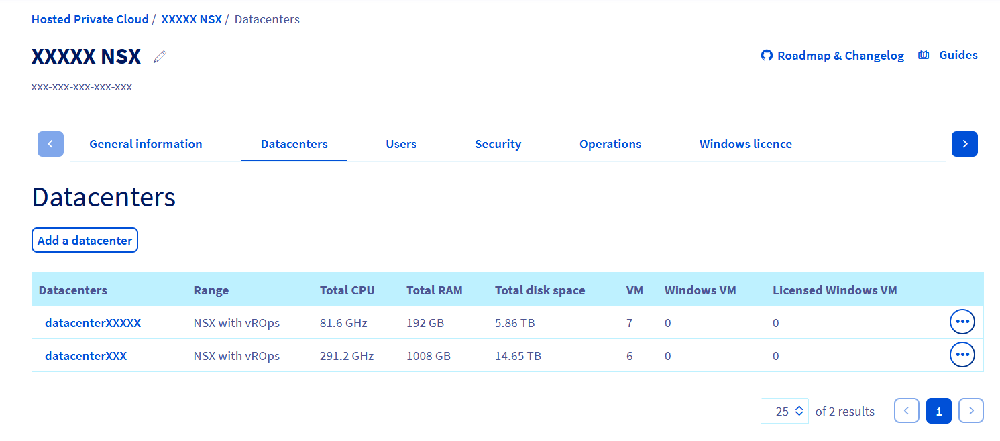
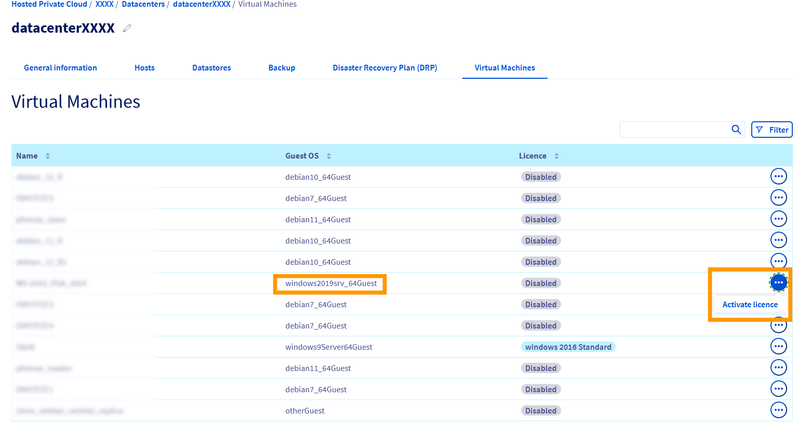
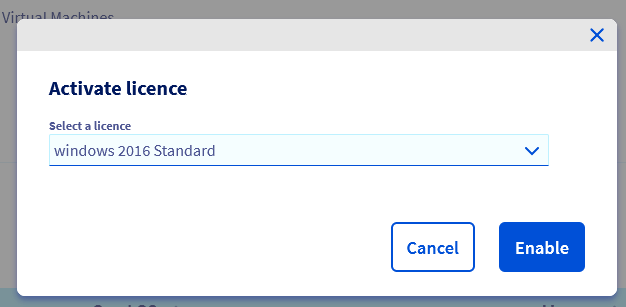

## Objective

This guide explains how to manage Windows licences for your virtual machines hosted on your Hosted Private Cloud infrastructure.

It now includes a new feature available in the [OVHcloud Control Panel](/links/manager), which allows you to:
- View the number of Windows virtual machines requiring a licence
- Instantly activate a licence on eligible VMs from the interface

This gives you better visibility, reduces the need for API calls, and helps ensure compliance with Microsoft licensing requirements.

> [!warning]
>
> OVHcloud simplifies the management and billing of your Windows licences by allowing you to tell us which virtual machines require the use of a licence.
> 
> However, you remain responsible for the accuracy of the data you provide to us, and OVHcloud cannot be held liable for any unauthorized use of a Windows system on your part.

## Requirements

- A Hosted Private Cloud service powered by VMware
- At least one virtual machine running a Windows operating system
- [Windows licences activated](/pages/hosted_private_cloud/hosted_private_cloud_powered_by_vmware/manager_ovh_private_cloud#licence-windows) in your [OVHcloud Control Panel](/links/manager)

## Instructions

### Monitor and activate Windows licences directly from the OVHcloud Control Panel

> [!primary]
>
> This feature only applies if you want OVHcloud to license your Windows VMs via SPLA.
> If you bring your own licence (BYOL), you do not need to activate anything in the [OVHcloud Control Panel](/links/manager).

#### Check your Windows licence usage in the Control Panel

1. Go to the `Hosted Private Cloud`{.action} section of your [OVHcloud Control Panel](/links/manager).

2. Select your service, then open the `Datacenter`{.action} tab.

Here, you will find:

- The **total number of VMs** running in your datacenter
- The **number of Windows VMs** (requiring a licence)
- The **number of declared Windows VMs** (licensed by OVHcloud)

.{thumbnail}

> [!primary]
> 
> Activating the licence in the [OVHcloud Control Panel](/links/manager) is only required if you want OVHcloud to provide a Windows SPLA licence for the VM.

#### Understand the two Windows licence management modes

There are two scenarios:

- **Case 1: You bring your own Microsoft licence (BYOL)**
    → No action required in the interface.

- **Case 2: You want OVHcloud to licence the VM**
    → The VM licence must be activated in the [OVHcloud Control Panel](/links/manager) for it to be billed properly.

#### Activate a Windows licence from the OVHcloud Control Panel

1. In your private cloud, go to the `Virtual Machines`{.action} tab.
2. Locate the VM that needs to be licensed.
3. Click `Activate licence`{.action}.

    {.thumbnail}

4. Choose the appropriate licence from the dropdown menu.
5. Click `Activate`{.action} to confirm the action.

    {.thumbnail}

> [!success]
> 
> The VM is now declared and licensed by OVHcloud. It will appear in your billing and compliance tracking.

### Manage licences using the OVHcloud API

If you prefer to automate or integrate Windows licence management into your workflows, you can use the [API OVHcloud](https://api.ovh.com/){.external}. to list, assign, update or remove licences on your virtual machines.

#### List virtual machines with a licence

You can quickly check which virtual machines in your infrastructure are licensed via the OVHcloud API:

> [!api]
>
> @api {v1} /dedicatedCloud GET /dedicatedCloud/{serviceName}/datacenter/{datacenterId}/vmLicensed
>

*Return example:*

```json
[
    {
        "vmId": 1074,
        "name": "my-win2019-vm",
        "guestOsFamily": "windows2019srv_64Guest",
        "license": "windows 2019 Standard Core"
    }
]
```

#### Verify the licence of a virtual machine

You can check the licence currently associated with one of your virtual machines via the OVHcloud API:

> [!api]
>
> @api {v1} /dedicatedCloud GET /dedicatedCloud/{serviceName}/datacenter/{datacenterId}/vm/{vmId}
>

If no licence is attached to it, the `license` field value will be `null`.

*Return example:*

```json
{
    // ...
    "guestOsFamily": "windows2019srv_64Guest",
    "license": "windows 2019 Standard"
}
```

#### Update the licence of a virtual machine

You can update the licence associated with one of your virtual machines via the OVHcloud API:

> [!api]
>
> @api {v1} /dedicatedCloud POST /dedicatedCloud/{serviceName}/datacenter/{datacenterId}/vm/{vmId}/setLicense
>

> [!primary]
>
> Virtual machines deployed from [VMware content libraries](/pages/hosted_private_cloud/hosted_private_cloud_powered_by_vmware/how_to_use_content_library) are automatically attached to a corresponding Windows licence.

> [!warning]
>
> In order to avoid the incorrect allocation of a Windows licence on a virtual machine, the API call above will return an error in the case where the virtual machine has been configured for a different operating system from your vSphere interface. 
>
> You can resolve this by changing the VM settings or you can choose to ignore this error by passing the option `bypassGuestOsFamilyCheck`.

#### Unlicense a virtual machine

You can delete the licence associated with one of your virtual machines via the OVHcloud API:

> [!api]
>
> @api {v1} /dedicatedCloud POST /dedicatedCloud/{serviceName}/datacenter/{datacenterId}/vm/{vmId}/removeLicense
>

## Go further

If you need training or technical assistance to implement our solutions, please contact your Technical Account Manager or click on [this link](/links/professional-services) to get a quote and ask our Professional Services experts for a custom analysis of your project.

Ask questions, give your feedback and interact directly with the team building our Hosted Private Cloud services on the dedicated [Discord](https://discord.gg/ovhcloud) channel.

Join our [community of users](/links/community).