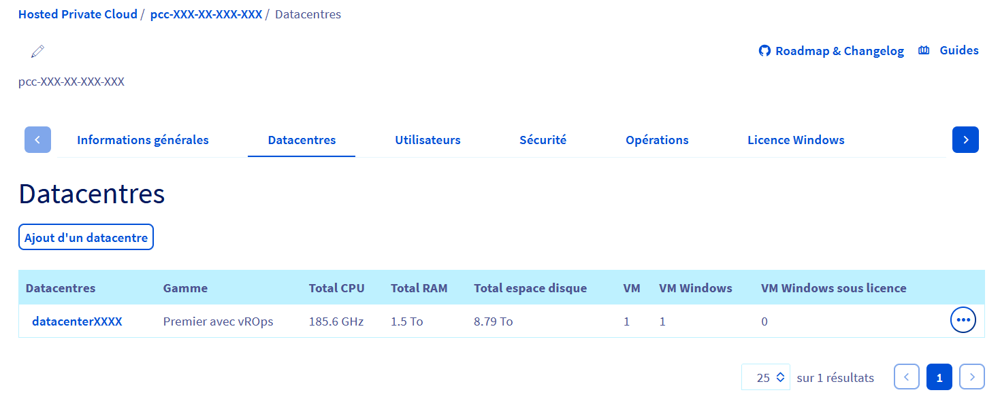
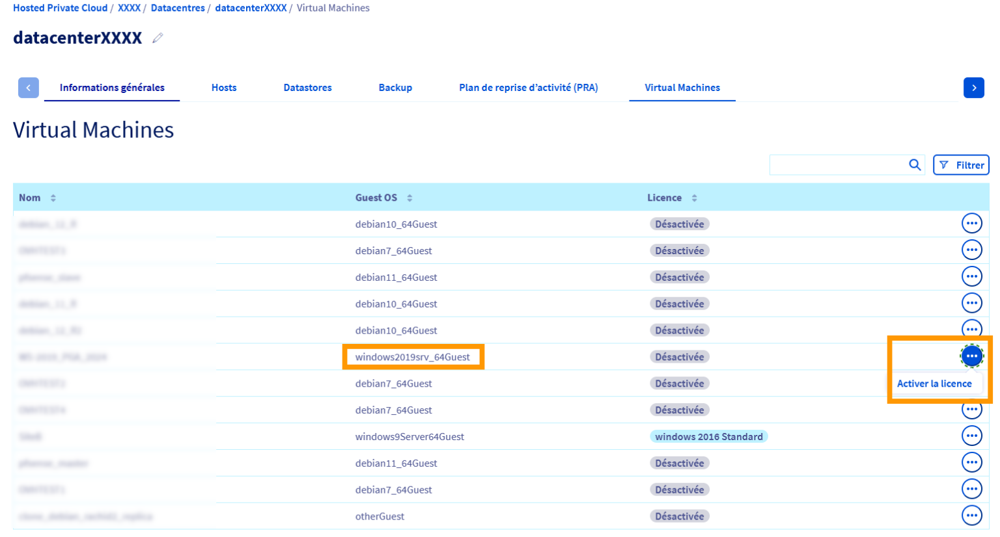
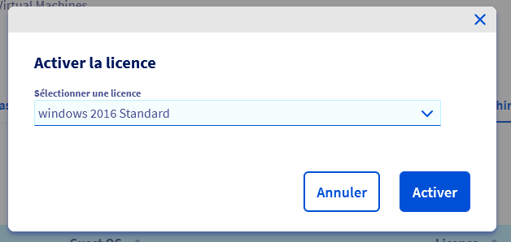

## Objectif

Ce guide vous explique comment gérer les licences Windows de vos machines virtuelles hébergées sur votre infrastructure Hosted Private Cloud.

L’[espace client OVHcloud](/links/manager) intègre désormais une nouvelle fonctionnalité, qui vous permet :

- De visualiser le nombre de machines virtuelles Windows nécessitant une licence.
- D'activer instantanément une licence sur les VM éligibles, directement depuis l’interface.

Cela vous offre une meilleure visibilité, réduit le recours aux appels API et vous aide à rester conforme aux exigences des licences Microsoft.

> [!warning]
>
> OVHcloud vous permet de faciliter la gestion et la facturation de vos licences Windows en vous offrant la possibilité de nous indiquer quelles machines virtuelles nécessitent l'usage d'une licence.
> 
> Vous conservez néanmoins la responsabilité de l'exactitude des données que vous nous fournissez, et OVHcloud ne pourra être tenu responsable en cas d'utilisation non autorisée d'un système Windows de votre part.

## Prérequis

- Posséder un service Hosted Private Cloud basé sur VMware.
- Détenir au moins une machine virtuelle exécutant un système d’exploitation Windows.
- Avoir activé les **licences Windows** dans votre [espace client OVHcloud](/links/manager). Consultez la partie « licence windows » de notre guide « [Présentation de l'espace client Hosted Private Cloud OVHcloud](/pages/hosted_private_cloud/hosted_private_cloud_powered_by_vmware/manager_ovh_private_cloud/) » pour plus d'informations.

## En pratique

### Activer et gérer les licences Windows directement depuis votre espace client OVHcloud

> [!primary]
>
> Cette fonctionnalité s’applique uniquement si vous souhaitez qu’OVHcloud fournisse la licence Windows via SPLA.
> Si vous utilisez votre propre licence (BYOL), aucune activation n’est nécessaire dans l'[espace client OVHcloud](/links/manager).

#### Consulter l’usage des licences Windows dans l'espace client OVHcloud

1. Rendez-vous dans la section `Hosted Private Cloud`{.action} de votre [espace client OVHcloud](/links/manager) et cliquez sur `Managed VMware vSphere`{.action}.

2. Sélectionnez votre service, puis ouvrez l'onglet `Datacentres`{.action}.

Vous y trouverez :

- Le **nombre total de VM** en cours d'exécution dans votre datacentre.
- Le **nombre de VM Windows**, nécessitant une licence.
- Le **nombre de VM Windows déclarées**, licenciées via OVHcloud.

    .{thumbnail}

> [!primary]
>
> L’activation de la licence dans l'[espace client OVHcloud](/links/manager) n’est requise que si vous souhaitez qu’OVHcloud fournisse une licence SPLA pour cette machine virtuelle.

#### Comprendre les deux modes de gestion des licences Windows

Deux cas de figure sont possibles :

- **Cas n° 1 : vous utilisez votre propre licence Microsoft (BYOL) :**
    → Aucune action n'est requise dans l'interface.

- **Cas n° 2 : vous souhaitez qu’OVHcloud fournisse une licence pour la VM :**
    → La licence de la VM doit être activée depuis l’[espace client OVHcloud](/links/manager) pour être correctement facturée.
    
#### Activer une licence Windows depuis l'espace client

1. Dans votre `Datacentre`, accédez à l'onglet `Virtual Machines`{.action}.
2. Localisez la VM concernée dans la colonne `licence`.
3. Cliquez sur `...`{.action} à droite, puis sur `Activer la licence`{.action}.

    {.thumbnail}

4. Choisissez la licence souhaitée dans le menu déroulant.
5. Cliquez sur `Activer`{.action} pour confirmer l'action.

    {.thumbnail}

> [!success]
>
> La VM est désormais déclarée et licenciée par OVHcloud. Elle sera prise en compte dans votre facturation et dans le suivi de conformité.

### Gérer les licences via l’API OVHcloud

Si vous souhaitez automatiser la gestion des licences Windows ou l’intégrer à vos processus, vous pouvez utiliser l’[API OVHcloud](/links/api) pour lister, attribuer, mettre à jour ou supprimer les licences de vos machines virtuelles.

#### Lister les machines virtuelles avec une licence

Vous pouvez vérifier rapidement quelles machines virtuelles de votre infrastructure possèdent une licence depuis l'API OVHcloud.

> [!api]
>
> @api {v1} /dedicatedCloud GET /dedicatedCloud/{serviceName}/datacenter/{datacenterId}/vmLicensed
>

*Exemple de retour :*

```json
[
    {
        "vmId": 1074,
        "name": "my-win2019-vm",
        "guestOsFamily": "windows2019srv_64Guest",
        "license": "windows 2019 Standard Core"
    }
]
```

#### Vérifier la licence d'une machine virtuelle

Vous pouvez vérifier la licence actuellement associé à une de vos machines virtuelles depuis l'API OVHcloud.
Si aucune licence n'est attachée à celle-ci, le champ `license` aura la valeur `null`.

> [!api]
>
> @api {v1} /dedicatedCloud GET /dedicatedCloud/{serviceName}/datacenter/{datacenterId}/vm/{vmId}
>

*Example de retour :*

```json
{
    // ...
    "guestOsFamily": "windows2019srv_64Guest",
    "license": "windows 2019 Standard"
}
```

#### Mettre à jour la licence d'une machine virtuelle

Vous pouvez mettre à jour la licence associée à une de vos machines virtuelles depuis l'API OVHcloud :

> [!api]
>
> @api {v1} /dedicatedCloud POST /dedicatedCloud/{serviceName}/datacenter/{datacenterId}/vm/{vmId}/setLicense
>

> [!primary]
>
> Les machines virtuelles déployées depuis les [bibliothèques de contenu OVHcloud (VMware content libraries)](/pages/hosted_private_cloud/hosted_private_cloud_powered_by_vmware/how_to_use_content_library) sont automatiquement attachées à une licence Windows correspondante.

> [!warning]
>
> Afin d'éviter l'attribution erronée d'une licence Windows sur une machine virtuelle, l'appel API ci-dessus retournera une erreur dans le cas où la machine virtuelle a été configurée pour un système d'exploitation différent depuis votre interface vSphere. 
>
> Vous pouvez résoudre ce problème en modifiant les réglages de la machine virtuelle ou vous pouvez choisir d'ignorer cette erreur en passant l'option `bypassGuestOsFamilyCheck`.

#### Supprimer la licence d'une machine virtuelle

Vous pouvez supprimer la licence associée à une de vos machines virtuelles depuis l'API OVHcloud :

> [!api]
>
> @api {v1} /dedicatedCloud POST /dedicatedCloud/{serviceName}/datacenter/{datacenterId}/vm/{vmId}/removeLicense
>

## Aller plus loin <a name="go-further"></a>
 
Pour des prestations spécialisées (référencement, développement, etc.), contactez les [partenaires OVHcloud](/links/partner).
 
Si vous souhaitez bénéficier d'une assistance à l'usage et à la configuration de vos solutions OVHcloud, nous vous proposons de consulter nos différentes [offres de support](/links/support).
 
Échangez avec notre [communauté d'utilisateurs](/links/community).
