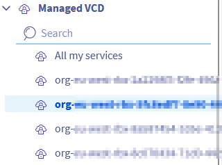
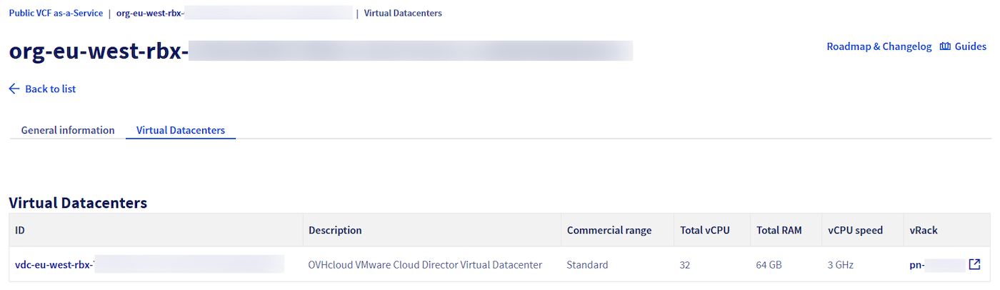
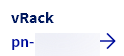
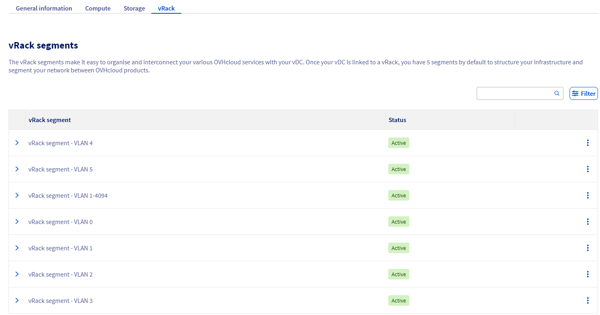
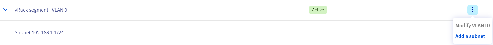
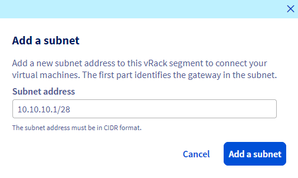
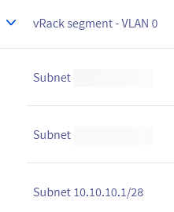
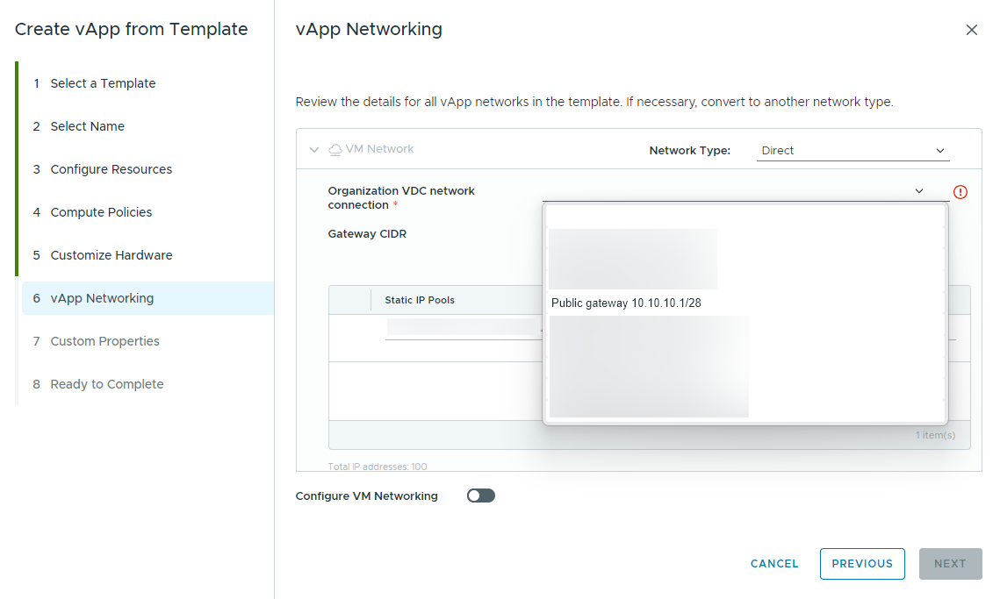

## Objectif

Lorsque vous commandez une nouvelle organisation Public VCF as-a-Service, un vRack et un bloc d’adresses IP publiques sont fournis. Pour attribuer ces IP publiques à des workloads, vous devez déclarer la passerelle du bloc dans le Virtual Datacenter VCD ciblé.

Ce guide explique comment récupérer la passerelle correcte et l’ajouter à votre VDC.

## Prérequis

- Une organisation [Public VCF as-a-Service](/links/hosted-private-cloud/vmware-vcd) avec un bloc d’adresses IP publiques.
- Les droits d’administrateur technique sur [VMware vSphere on OVHcloud](/links/hosted-private-cloud/vmware).
- Être connecté à l’[espace client OVHcloud](/links/manager).

## En pratique

1. Connectez-vous à votre [espace client OVHcloud](/links/manager). Cliquez sur `Hosted Private Cloud`{.action}, puis `Public VCF as-a-Service`{.action} et sélectionnez votre organisation.

    {.thumbnail}

2. Ouvrez l’onglet `Virtual Datacenters`{.action} et sélectionnez le VDC dans lequel vous souhaitez utiliser les IP publiques.

    {.thumbnail}

Dans `General information`{.action}, vérifiez que le vRack affiché est bien celui lié à votre bloc d’adresses IP publiques.

    {.thumbnail}

3. Sélectionnez l’onglet `vRack`{.action}.

    {.thumbnail}

Repérez le segment nommé `vRack segment - VLAN0` ou `vRack segment - PUBLIC`.

Cliquez sur le menu à trois points `⋮`{.action} puis sur `Add a subnet`{.action}.

    {.thumbnail}

4. Dans la fenêtre modale, saisissez la **passerelle au format CIDR** pour votre bloc d’adresses IP publiques, puis validez. La passerelle correspond au **dernier hôte utilisable** du bloc.

**Exemple** : pour `203.0.113.0/29`, le dernier hôte utilisable est `203.0.113.6`, saisissez donc `203.0.113.6/29`. Vous pouvez utiliser n’importe quel calculateur IP standard pour vérifier.

    {.thumbnail}

5. Patientez quelques secondes puis actualisez la page. La passerelle du sous-réseau doit maintenant apparaître sur le segment.

    {.thumbnail}

### Utiliser la passerelle lors de la création de workloads

- Lors de la création d’une vApp ou d’une VM dans VCD, sélectionnez le **réseau VDC d’organisation** correspondant et choisissez un type de réseau **Direct** pour afficher les passerelles publiques disponibles.

    {.thumbnail}

> [!primary]
> **Limitation connue :**
>
> Dans la version actuelle de VCF, le champ **Gateway CIDR** peut afficher la première passerelle déclarée sur votre segment `VLAN0`, même si vous en avez sélectionné une autre. Il s’agit d’un problème purement visuel qui n’affecte pas l’attribution des IP. Utilisez n’importe quelle adresse du bloc public sélectionné sur votre VM, en cohérence avec la passerelle choisie dans **Organization VDC network**.

## Dépannage

- Si la passerelle est rejetée, vérifiez que vous avez bien saisi **le dernier hôte utilisable** avec le **masque CIDR** correct pour le bloc.
- Assurez-vous que le VDC est rattaché au **même vRack** que celui que vous avez lié au bloc d’adresses IP publiques dans le guide précédent [Public VCF as-a-Service - Liaison d'un bloc IP public avec vRack](/pages/hosted_private_cloud/hosted_private_cloud_powered_by_vmware/vcd_link_ip_to_vrack).

## Aller plus loin

Guide de première étape : [Public VCF as-a-Service - Liaison d'un bloc IP public avec vRack](/pages/hosted_private_cloud/hosted_private_cloud_powered_by_vmware/vcd_link_ip_to_vrack).

Si vous avez besoin d'une formation ou d'une assistance technique pour la mise en œuvre de nos solutions, contactez votre Technical Account Manager ou demandez une analyse personnalisée de votre projet à nos experts de l’équipe [Professional Services](/links/professional-services).

Posez des questions, donnez votre avis et interagissez directement avec l’équipe qui construit nos services Hosted Private Cloud sur le canal [Discord](https://discord.gg/ovhcloud) dédié.

Échangez avec notre [communauté d'utilisateurs](/links/community).
