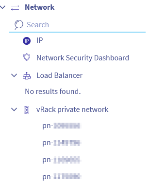

## Objectif

Lors de la commande d'une nouvelle organisation VCD, un vRack vous est livré ainsi qu'un bloc d'adresse IP publique.

Ce bloc IP n'est pas lié directement à votre vRACK, vous devez faire cette liaison manuellement.

**Découvrez comment lier le bloc d'adresse IP publique livré avec votre organisation VCD et son vRack.**

## Prérequis

- Une offre [Public VCF as-a-Service](/links/hosted-private-cloud/vmware-vcd).
- Être administrateur technique de votre solution [VMware vSphere on OVHcloud](/links/hosted-private-cloud/vmware).
- Être connecté à [l'espace client OVHcloud](/links/manager)

## En pratique

1. Connectez-vous à votre [espace client OVHcloud](/links/manager)
2. Affichez les informations de l'organisation VCD depuis le menu `Managed VCD`{.action} dans la colonne de gauche, puis sélectionnez votre organisation.

{.thumbnail .w-640}

3. Depuis l'onglet `Information générale`{.action}, le vRack attaché à votre organisation apparaitra avec un ID sous la forme `pn-xxxxxxx`.

{.thumbnail .w-640}

4. Dans la colonne de gauche, dans le menu `Network`{.action}, sélectionnez votre vRack `pn-xxxxxxx`.

{.thumbnail .w-640}

5. Sélectionnez le bloc IP à lier à votre vRack/Organisation et cliquez sur `Ajouter`{.action}.

{.thumbnail .w-640}

## Aller plus loin

Si vous avez besoin d'une formation ou d'une assistance technique pour la mise en œuvre de nos solutions, contactez votre Technical Account Manager ou demandez une analyse personnalisée de votre projet à nos experts de l’équipe [Professional Services](/links/professional-services).

Posez des questions, donnez votre avis et interagissez directement avec l’équipe qui construit nos services Hosted Private Cloud sur le canal [Discord](https://discord.gg/ovhcloud) dédié.

Échangez avec notre [communauté d'utilisateurs](/links/community).