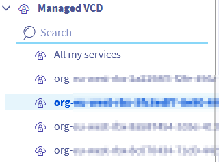
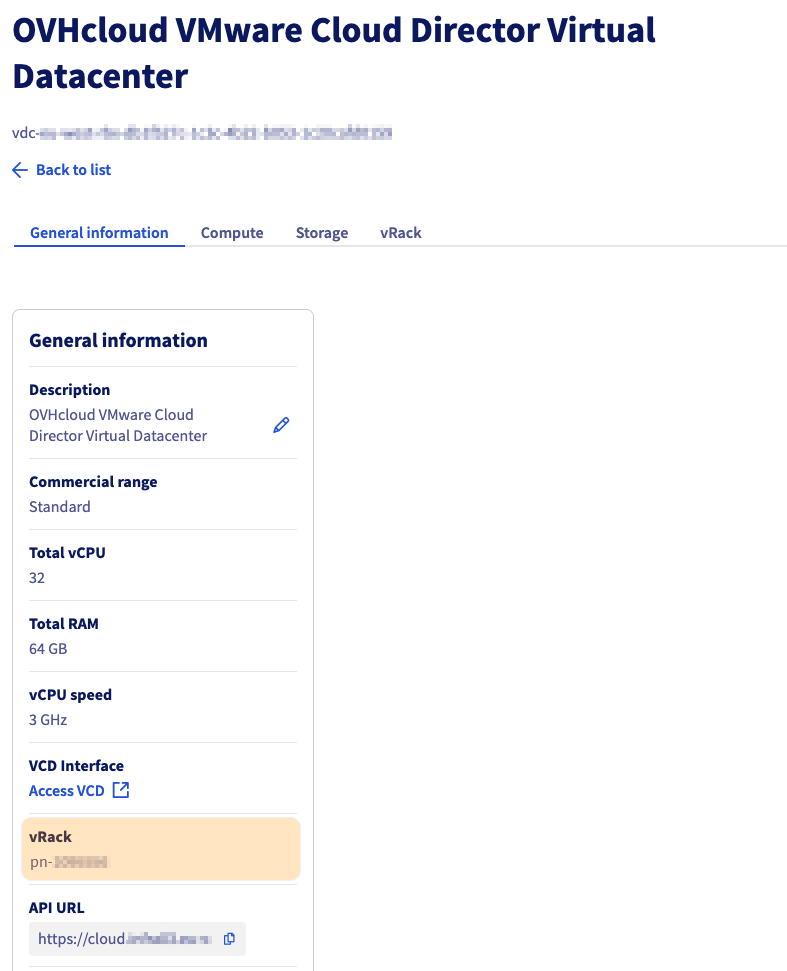
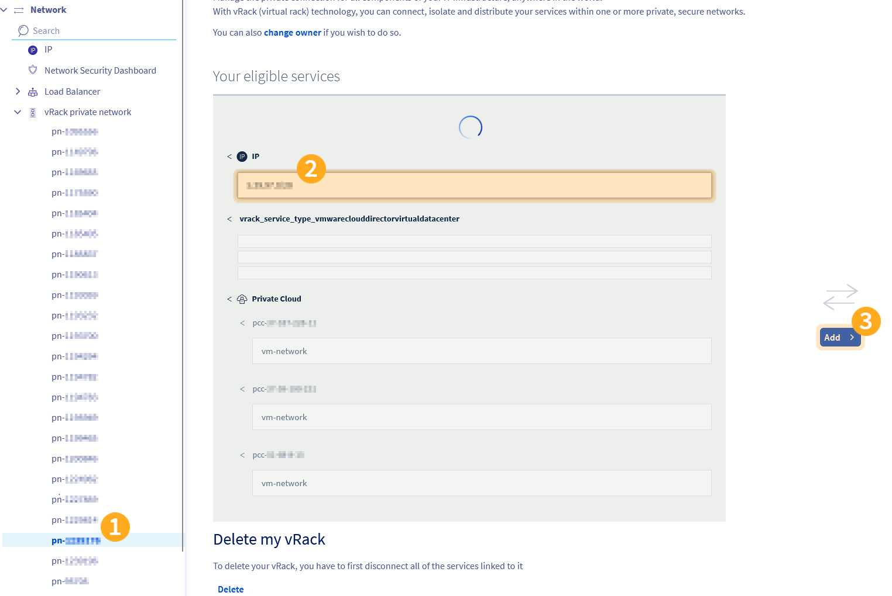

## Objectif

Lors de la commande d'une nouvelle organisation Public VCF as-a-Service, un vRack ainsi qu'un bloc d'adresses IP publiques vous sont livrés.

Ce bloc IP n'est pas directement lié à votre vRack, vous devez effectuer cette liaison manuellement.

**Découvrez comment lier le bloc d'adresses IP publiques livré avec votre organisation Public VCF as-a-Service et son vRack.**

## Prérequis

- Posséder une offre [Public VCF as-a-Service](/links/hosted-private-cloud/vmware-vcd).
- Être administrateur technique de votre solution [VMware vSphere on OVHcloud](/links/hosted-private-cloud/vmware).
- Être connecté à [l'espace client OVHcloud](/links/manager).

## En pratique

1. Connectez-vous à votre [espace client OVHcloud](/links/manager).
2. Cliquez sur `Hosted Private Cloud`{.action} puis sur `Public VCF as-a-Service`{.action} et sélectionnez votre organisation.

    {.thumbnail .w-640}

3. Depuis l'onglet `Information générale`{.action}, le vRack attaché à votre organisation apparaîtra avec un ID sous la forme `pn-xxxxxxx`.

    {.thumbnail .w-640}

4. Dépliez le menu `Network`{.action} dans la colonne de gauche et sélectionnez votre vRack `pn-xxxxxxx`.

    {.thumbnail .w-640}

5. Sélectionnez le bloc IP à lier à votre vRack/organisation et cliquez sur `Ajouter`{.action}.

    {.thumbnail .w-640}

6. Le bloc d’adresses IP publiques est désormais lié à votre vRack.

Pour rendre ces adresses utilisables dans votre environnement Public VCF as-a-Service, vous devez également déclarer la passerelle IP publique dans VMware Cloud Director (VCD).

Suivez le guide [Public VCF as-a-Service - Déclarer la passerelle IP publique dans VCD](https://help.ovhcloud.com/csm/fr-vmware-vcd-declare-public-gateway?id=kb_article_view&sysparm_article=KB0072017) pour finaliser cette étape.

## Aller plus loin

Si vous avez besoin d'une formation ou d'une assistance technique pour la mise en œuvre de nos solutions, contactez votre Technical Account Manager ou demandez une analyse personnalisée de votre projet à nos experts de l’équipe [Professional Services](/links/professional-services).

Posez des questions, donnez votre avis et interagissez directement avec l’équipe qui construit nos services Hosted Private Cloud sur le canal [Discord](https://discord.gg/ovhcloud) dédié.

Échangez avec notre [communauté d'utilisateurs](/links/community).