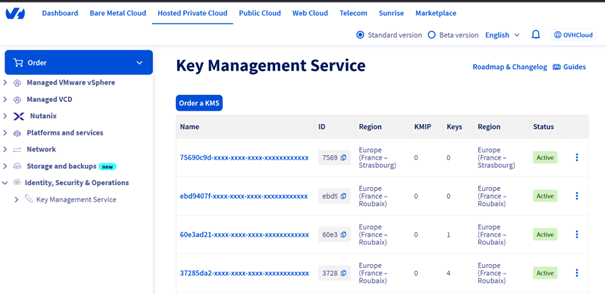

## Objective

This guide explains how to configure encrypted backup jobs using the Veeam backup solution and the OVHcloud KMS (OKMS) service.

## Requirements

- Access to the [OVHcloud Control Panel](/links/manager).
- A [Hosted Private Cloud VMware vSphere on OVHcloud](/links/hosted-private-cloud/vmware) offer.
- You must have read the following guides:
    - [KMS integration for VMware on OVHcloud](/pages/hosted_private_cloud/hosted_private_cloud_powered_by_vmware/vmware_overall_vm-encrypt).
    - [Getting started with OKMS](/pages/manage_and_operate/kms/quick-start).

## Instructions

### Step 1: Create the Certificate in OKMS Service

You can create the certificate from the dedicated entry from the [OVHcloud Control Panel](/links/manager): 

1.\ Click `Hosted Private Cloud`{.action} then `Identity, Security & Operations`{.action} and `Key Management Service`{.action}.Select your KMS.

{.thumbnail}

2.\ Select your KMS.

{.thumbnail}

3.\ Then, click on `Generate an access certificate`{.action} button and generate the private key using the following API (without CSR):

> [!api]
>
> @api {v1} /okms POST / /okms/resource/{okmsId}/credential

{.thumbnail}

4.\ Retrieve the certificate by making a GET request:

> [!api]
>
> @api {v1} /okms GET /okms/resource/{okmsId}/credential

Fill in the required fields in the Generate an access certificate window and select the option `I don’t have a private key`{.action}.

{.thumbnail}

5.\ Download the private key.

6.\ Download the certificate.

{.thumbnail}

### Step 2: Convert PEM to PFX

To import the certificate into Veeam, you must convert it to `.pfx` format using the following command:

```bash
openssl pkcs12 -export -out cert.pfx -inkey privatekey.pem -in certificate.pem
```

### Step 3: Import the Certificate to Veeam Windows Certificate Store

1. Open the Windows Certificate Store on your Veeam server.
1. Import the `.pfx` certificate into the Veeam Windows Certificate Store.
1. Mark the certificate as exportable during import.

{.thumbnail}

### Step 4: Register the KMS Inside Veeam

1.\ Open Veeam Backup & Replication and go to `Credentials & Passwords`{.action} then click on `Key Management Servers`{.action}.

{.thumbnail}

2.\ Click on `Add`{.action} to a new KMS server.

{.thumbnail}

3.\ Enter the server address. 

For example, for a KMS created in the **eu-west-rbx** region: <https://eu-west-rbx.okms.ovh.net>.

Then, import your certificate from the Windows Key Store (the .`.pfx` file you imported previously).

{.thumbnail}

### Step 5: Retrieve the Server Certificate

To retrieve the certificate from the OKMS server, use this command:

```bash
openssl s_client -connect eu-west-rbx.okms.ovh.net:443 2>/dev/null </dev/null |  sed -ne '/-BEGIN CERTIFICATE-/,/-END CERTIFICATE-/p'
```

### Step 6: Configure Backup Job Encryption

1.\ Register the KMS server in your Veeam Backup & Replication console.
2.\ Select the desired backup job and configure encryption using the registered KMS.

{.thumbnail}

3.\ Once the backup is complete, you will see a lock icon next to the backup name indicating it is encrypted.

{.thumbnail}

4.\ If you encounter the error **Unsupported attribute: OPERATION_POLICY_NAME**, follow the instructions provided in the documentation to resolve the issue.

{.thumbnail}

## Go further

If you need training or technical assistance to implement our solutions, please contact your Technical Account Manager or click on [this link](/links/professional-services) to get a quote and ask our Professional Services experts for a custom analysis of your project.

Ask questions, give your feedback and interact directly with the team building our Hosted Private Cloud services on the dedicated [Discord](https://discord.gg/ovhcloud) channel.

Join our [community of users](/links/community).